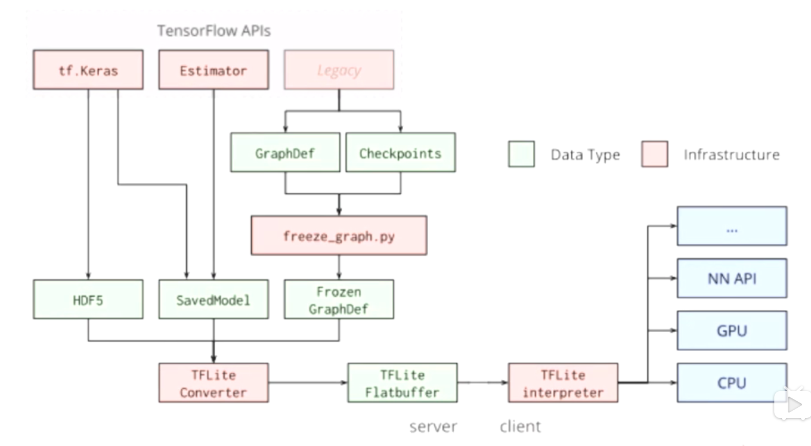

#  TensorFlow2.x

<<<<<<< HEAD
## 教程

### 01、分类

#### Import
=======
## 01、分类

### Import
>>>>>>> b6b15513843bdc29bd1809ac3eb9babe5db83710

```python
import matplotlib.pyplot as plt
import numpy as np
import tensorflow as tf
import pandas as pd
import os
import sys
import time
from tensorflow import keras
print(tf.__version__)
```

<<<<<<< HEAD
#### 加载数据
=======
### 加载数据
>>>>>>> b6b15513843bdc29bd1809ac3eb9babe5db83710

```python
fashion_mnist = keras.datasets.fashion_mnist
(x_train_all,y_train_all),(x_test,y_test) = fashion_mnist.load_data()
x_valid,x_train = x_train_all[:5000],x_train_all[5000:]
y_valid,y_train = y_train_all[:5000],y_train_all[5000:]

print(x_valid.shape,x_train.shape,x_test.shape)
```

<<<<<<< HEAD
#### 归一化
=======
### 归一化
>>>>>>> b6b15513843bdc29bd1809ac3eb9babe5db83710

```python
from sklearn.preprocessing import StandardScaler

scalar = StandardScaler()
x_train_scaled = scalar.fit_transform(x_train.astype(np.float32).reshape(-1,1)).reshape(-1,28,28) #-1表示默认值，自动计算
x_valid_scaled = scalar.transform(x_valid.astype(np.float32).reshape(-1,1)).reshape(-1,28,28)
x_test_scaled = scalar.transform(x_test.astype(np.float32).reshape(-1,1)).reshape(-1,28,28)
```

<<<<<<< HEAD
#### 构建模型
=======
### 构建模型
>>>>>>> b6b15513843bdc29bd1809ac3eb9babe5db83710

```python
model = keras.models.Sequential()
model.add(keras.layers.Flatten(input_shape=[28, 28]))
for _ in range(20):
    model.add(keras.layers.Dense(100, activation="selu"))
model.add(keras.layers.AlphaDropout(rate=0.5))
# AlphaDropout: 1. 均值和方差不变 2. 归一化性质也不变
# model.add(keras.layers.Dropout(rate=0.5))
model.add(keras.layers.Dense(10, activation="softmax"))

model.compile(loss="sparse_categorical_crossentropy",
              optimizer = "sgd",
              metrics = ["accuracy"])
```

<<<<<<< HEAD
#### 训练
=======
### 训练
>>>>>>> b6b15513843bdc29bd1809ac3eb9babe5db83710

```python
# callbacks
logdir = os.path.join('cnn-callbacks')
print(logdir)
if not os.path.exists(logdir):
    os.mkdir(logdir)
output_model_file = os.path.join(logdir,"fashion_mnist_model.h5")
callbacks = [
    keras.callbacks.TensorBoard(logdir),
    keras.callbacks.ModelCheckpoint(output_model_file,save_best_only=True),
    keras.callbacks.EarlyStopping(patience=5,min_delta=1e-3)
]
history = model.fit(x_train_scaled,y_train,epochs=10,
                    validation_data=(x_valid_scaled,y_valid),
                    callbacks=callbacks)
```

<<<<<<< HEAD
#### 绘图
=======
### 绘图
>>>>>>> b6b15513843bdc29bd1809ac3eb9babe5db83710

```python
def plot_learning_curves(history):
    pd.DataFrame(history.history).plot(figsize=(8,5))
    plt.grid(True)
    plt.gca().set_ylim(0,1)
    plt.show()

plot_learning_curves(history)
```


<<<<<<< HEAD
### 02、回归

#### Model
=======
## 02、回归

### Model
>>>>>>> b6b15513843bdc29bd1809ac3eb9babe5db83710

```python
model = keras.models.Sequential([
    keras.layers.Dense(30, activation='relu',
                       input_shape=x_train.shape[1:]),
    keras.layers.Dense(1),
])
model.summary()
model.compile(loss="mean_squared_error", optimizer="sgd")
```

<<<<<<< HEAD
#### wide & deep


#### 函数式API
=======
### wide & deep


### 函数式API
>>>>>>> b6b15513843bdc29bd1809ac3eb9babe5db83710

```python
# 函数式API 功能API
input = keras.layers.Input(shape=x_train.shape[1:])
hidden1 = keras.layers.Dense(30, activation='relu')(input)
hidden2 = keras.layers.Dense(30, activation='relu')(hidden1)
# 复合函数: f(x) = h(g(x))

concat = keras.layers.concatenate([input, hidden2]) # shape(None,38) input.shape(None,8) hidden2.shape(None,30)
output = keras.layers.Dense(1)(concat)

model = keras.models.Model(inputs = [input],
                           outputs = [output])

model.summary()
model.compile(loss="mean_squared_error", optimizer="sgd")

callbacks = [keras.callbacks.EarlyStopping(
    patience=5, min_delta=1e-2)]
history = model.fit(x_train_scaled, y_train,
                    validation_data = (x_valid_scaled, y_valid),
                    epochs = 100,
                    callbacks = callbacks)
```

<<<<<<< HEAD
#### 子类化API
=======
### 子类化API
>>>>>>> b6b15513843bdc29bd1809ac3eb9babe5db83710

```python
# 子类API
class WideDeepModel(keras.models.Model):
    def __init__(self):
        super(WideDeepModel, self).__init__()
        """定义模型的层次"""
        self.hidden1_layer = keras.layers.Dense(30, activation='relu')
        self.hidden2_layer = keras.layers.Dense(30, activation='relu')
        self.output_layer = keras.layers.Dense(1)
    
    def call(self, input):
        """完成模型的正向计算"""
        hidden1 = self.hidden1_layer(input)
        hidden2 = self.hidden2_layer(hidden1)
        concat = keras.layers.concatenate([input, hidden2])
        output = self.output_layer(concat)
        return output
# model = WideDeepModel()
model = keras.models.Sequential([
    WideDeepModel(),
])

model.build(input_shape=(None, 8))
        
model.summary()
model.compile(loss="mean_squared_error", optimizer="sgd")
callbacks = [keras.callbacks.EarlyStopping(
    patience=5, min_delta=1e-2)]
history = model.fit(x_train_scaled, y_train,
                    validation_data = (x_valid_scaled, y_valid),
                    epochs = 1,
                    callbacks = callbacks)
```

<<<<<<< HEAD
#### 多输入
=======
### 多输入
>>>>>>> b6b15513843bdc29bd1809ac3eb9babe5db83710

```python
# 多输入
input_wide = keras.layers.Input(shape=[5])
input_deep = keras.layers.Input(shape=[6])
hidden1 = keras.layers.Dense(30, activation='relu')(input_deep)
hidden2 = keras.layers.Dense(30, activation='relu')(hidden1)
concat = keras.layers.concatenate([input_wide, hidden2])
output = keras.layers.Dense(1)(concat)
model = keras.models.Model(inputs = [input_wide, input_deep],
                           outputs = [output])
        

model.compile(loss="mean_squared_error", optimizer="sgd")
callbacks = [keras.callbacks.EarlyStopping(
    patience=5, min_delta=1e-2)]
model.summary()
```

<<<<<<< HEAD
#### 多输出
=======
### 多输出
>>>>>>> b6b15513843bdc29bd1809ac3eb9babe5db83710

```python
# 多输出
input_wide = keras.layers.Input(shape=[5])
input_deep = keras.layers.Input(shape=[6])
hidden1 = keras.layers.Dense(30, activation='relu')(input_deep)
hidden2 = keras.layers.Dense(30, activation='relu')(hidden1)
concat = keras.layers.concatenate([input_wide, hidden2])
output = keras.layers.Dense(1)(concat)
output2 = keras.layers.Dense(1)(hidden2)
model = keras.models.Model(inputs = [input_wide, input_deep],
                           outputs = [output, output2])
        

model.compile(loss="mean_squared_error", optimizer="sgd")
callbacks = [keras.callbacks.EarlyStopping(
    patience=5, min_delta=1e-2)]
model.summary()
```

<<<<<<< HEAD
#### 超参数搜索
=======
### 超参数搜索
>>>>>>> b6b15513843bdc29bd1809ac3eb9babe5db83710

```python
# RandomizedSearchCV
# 1. 转化为sklearn的model
# 2. 定义参数集合
# 3. 搜索参数

def build_model(hidden_layers = 1,
                layer_size = 30,
                learning_rate = 3e-3):
    model = keras.models.Sequential()
    model.add(keras.layers.Dense(layer_size, activation='relu',input_shape=x_train.shape[1:]))
    for _ in range(hidden_layers - 1):
        model.add(keras.layers.Dense(layer_size,activation = 'relu'))
    model.add(keras.layers.Dense(1))
    optimizer = keras.optimizers.SGD(learning_rate)
    model.compile(loss = 'mse', optimizer = optimizer)
    return model

sklearn_model = KerasRegressor(build_fn = build_model)
callbacks = [keras.callbacks.EarlyStopping(patience=5, min_delta=1e-2)]
history = sklearn_model.fit(x_train_scaled, y_train,
                            epochs = 10,
                            validation_data = (x_valid_scaled, y_valid),
                            callbacks = callbacks)
```

```python
from scipy.stats import reciprocal
# f(x) = 1/(x*log(b/a)) a <= x <= b

param_distribution = {
    "hidden_layers":[1, 2, 3, 4],
    "layer_size": np.arange(1, 100),
    "learning_rate": reciprocal(1e-4, 1e-2),
}

from sklearn.model_selection import RandomizedSearchCV

random_search_cv = RandomizedSearchCV(sklearn_model,
                                      param_distribution,
                                      n_iter = 10,
                                      cv = 3,
                                      n_jobs = 1)
random_search_cv.fit(x_train_scaled, y_train, epochs = 100,
                     validation_data = (x_valid_scaled, y_valid),
                     callbacks = callbacks)

# cross_validation: 训练集分成n份，n-1训练，最后一份验证.

print(random_search_cv.best_params_)
print(random_search_cv.best_score_)
print(random_search_cv.best_estimator_)

model = random_search_cv.best_estimator_.model
model.evaluate(x_test_scaled, y_test)
```

<<<<<<< HEAD


### 03、基础API

#### 常量
=======


## 03、基础API

### 常量
>>>>>>> b6b15513843bdc29bd1809ac3eb9babe5db83710

```python
t = tf.constant([[1., 2., 3.], [4., 5., 6.]])

# index
print(t)
print(t[:, 1:])
print(t[..., 1])

tf.Tensor(
[[1. 2. 3.]
 [4. 5. 6.]], shape=(2, 3), dtype=float32)
tf.Tensor(
[[2. 3.]
 [5. 6.]], shape=(2, 2), dtype=float32)
tf.Tensor([2. 5.], shape=(2,), dtype=float32)

# ops
print(t+10)
print(tf.square(t))
print(t @ tf.transpose(t))

tf.Tensor(
[[11. 12. 13.]
 [14. 15. 16.]], shape=(2, 3), dtype=float32)
tf.Tensor(
[[ 1.  4.  9.]
 [16. 25. 36.]], shape=(2, 3), dtype=float32)
tf.Tensor(
[[14. 32.]
 [32. 77.]], shape=(2, 2), dtype=float32)

# numpy conversion
print(t.numpy())
print(np.square(t))
np_t = np.array([[1., 2., 3.], [4., 5., 6.]])
print(tf.constant(np_t))

[[1. 2. 3.]
 [4. 5. 6.]]
[[ 1.  4.  9.]
 [16. 25. 36.]]
tf.Tensor(
[[1. 2. 3.]
 [4. 5. 6.]], shape=(2, 3), dtype=float64)

# Scalars
t = tf.constant(2.718)
print(t.numpy())
print(t.shape)

2.718
()
```

<<<<<<< HEAD
#### Strings
=======
### Strings
>>>>>>> b6b15513843bdc29bd1809ac3eb9babe5db83710

```python
# strings
t = tf.constant("cafe")
print(t)
print(tf.strings.length(t))
print(tf.strings.length(t, unit="UTF8_CHAR"))
print(tf.strings.unicode_decode(t, "UTF8"))

tf.Tensor(b'cafe', shape=(), dtype=string)
tf.Tensor(4, shape=(), dtype=int32)
<<<<<<< HEAD
=======
tf.Tensor(4, shape=(), dtype=int32)
>>>>>>> b6b15513843bdc29bd1809ac3eb9babe5db83710
tf.Tensor([ 99  97 102 101], shape=(4,), dtype=int32)

# string array
t = tf.constant(["cafe", "coffee", "咖啡"])
print(tf.strings.length(t, unit="UTF8_CHAR"))
r = tf.strings.unicode_decode(t, "UTF8")
print(r)

tf.Tensor([4 6 2], shape=(3,), dtype=int32)
<tf.RaggedTensor [[99, 97, 102, 101], [99, 111, 102, 102, 101, 101], [21654, 21857]]>
```

<<<<<<< HEAD
#### ragged tensor
=======
### ragged tensor
>>>>>>> b6b15513843bdc29bd1809ac3eb9babe5db83710

```python
# ragged tensor
r = tf.ragged.constant([[11, 12], [21, 22, 23], [], [41]])
# index op
print(r)
print(r[1])
print(r[1:2])

<tf.RaggedTensor [[11, 12], [21, 22, 23], [], [41]]>
tf.Tensor([21 22 23], shape=(3,), dtype=int32)
<tf.RaggedTensor [[21, 22, 23]]>

# ops on ragged tensor
r2 = tf.ragged.constant([[51, 52], [], [71]])
print(tf.concat([r, r2], axis = 0))

<tf.RaggedTensor [[11, 12], [21, 22, 23], [], [41], [51, 52], [], [71]]>

r3 = tf.ragged.constant([[13, 14], [15], [], [42, 43]])
print(tf.concat([r, r3], axis = 1))

<tf.RaggedTensor [[11, 12, 13, 14], [21, 22, 23, 15], [], [41, 42, 43]]>

print(r.to_tensor())

tf.Tensor(
[[11 12  0]
 [21 22 23]
 [ 0  0  0]
 [41  0  0]], shape=(4, 3), dtype=int32)
```

<<<<<<< HEAD
#### sparse tensor
=======
### sparse tensor
>>>>>>> b6b15513843bdc29bd1809ac3eb9babe5db83710

```python
# sparse tensor
s = tf.SparseTensor(indices = [[0, 1], [1, 0], [2, 3]],
                    values = [1., 2., 3.],
                    dense_shape = [3, 4])
print(s)
print(tf.sparse.to_dense(s))

SparseTensor(indices=tf.Tensor(
[[0 1]
 [1 0]
 [2 3]], shape=(3, 2), dtype=int64), values=tf.Tensor([1. 2. 3.], shape=(3,), dtype=float32), dense_shape=tf.Tensor([3 4], shape=(2,), dtype=int64))
tf.Tensor(
[[0. 1. 0. 0.]
 [2. 0. 0. 0.]
 [0. 0. 0. 3.]], shape=(3, 4), dtype=float32)

# ops on sparse tensors
s2 = s * 2.0
print(s2)

try:
    s3 = s + 1
except TypeError as ex:
    print(ex)

s4 = tf.constant([[10., 20.],
                  [30., 40.],
                  [50., 60.],
                  [70., 80.]])
print(tf.sparse.sparse_dense_matmul(s, s4))

SparseTensor(indices=tf.Tensor(
[[0 1]
 [1 0]
 [2 3]], shape=(3, 2), dtype=int64), values=tf.Tensor([2. 4. 6.], shape=(3,), dtype=float32), dense_shape=tf.Tensor([3 4], shape=(2,), dtype=int64))
unsupported operand type(s) for +: 'SparseTensor' and 'int'
tf.Tensor(
[[ 30.  40.]
 [ 20.  40.]
 [210. 240.]], shape=(3, 2), dtype=float32)

# sparse tensor
s5 = tf.SparseTensor(indices = [[0, 2], [0, 1], [2, 3]],
                    values = [1., 2., 3.],
                    dense_shape = [3, 4])
print(s5)
s6 = tf.sparse.reorder(s5)
print(tf.sparse.to_dense(s6))

SparseTensor(indices=tf.Tensor(
[[0 2]
 [0 1]
 [2 3]], shape=(3, 2), dtype=int64), values=tf.Tensor([1. 2. 3.], shape=(3,), dtype=float32), dense_shape=tf.Tensor([3 4], shape=(2,), dtype=int64))
tf.Tensor(
[[0. 2. 1. 0.]
 [0. 0. 0. 0.]
 [0. 0. 0. 3.]], shape=(3, 4), dtype=float32)
```

<<<<<<< HEAD
#### 变量
=======
### 变量
>>>>>>> b6b15513843bdc29bd1809ac3eb9babe5db83710

```python
# Variables
v = tf.Variable([[1., 2., 3.], [4., 5., 6.]])
print(v)
print(v.value())
print(v.numpy())


<tf.Variable 'Variable:0' shape=(2, 3) dtype=float32, numpy=
array([[1., 2., 3.],
       [4., 5., 6.]], dtype=float32)>
tf.Tensor(
[[1. 2. 3.]
 [4. 5. 6.]], shape=(2, 3), dtype=float32)
[[1. 2. 3.]
 [4. 5. 6.]]

# assign value
v.assign(2*v)
print(v.numpy())
v[0, 1].assign(42)
print(v.numpy())
v[1].assign([7., 8., 9.])
print(v.numpy())

[[ 2.  4.  6.]
 [ 8. 10. 12.]]
[[ 2. 42.  6.]
 [ 8. 10. 12.]]
[[ 2. 42.  6.]
 [ 7.  8.  9.]]
```

<<<<<<< HEAD
#### 自定义loss
=======
### 自定义loss
>>>>>>> b6b15513843bdc29bd1809ac3eb9babe5db83710

```python
def customized_mse(y_true, y_pred):
    return tf.reduce_mean(tf.square(y_pred - y_true))

model = keras.models.Sequential([
    keras.layers.Dense(30, activation='relu',input_shape=x_train.shape[1:]),
    keras.layers.Dense(1),
])
model.summary()
model.compile(loss=customized_mse, optimizer="sgd",
              metrics=["mean_squared_error"])
callbacks = [keras.callbacks.EarlyStopping(patience=5, min_delta=1e-2)]
history = model.fit(x_train_scaled, y_train,
                    validation_data = (x_valid_scaled, y_valid),
                    epochs = 100,
                    callbacks = callbacks)
```

<<<<<<< HEAD
#### 自定义layer
=======
### 自定义layer
>>>>>>> b6b15513843bdc29bd1809ac3eb9babe5db83710

```python
# lambda
# tf.nn.softplus : log(1+e^x)
customized_softplus = keras.layers.Lambda(lambda x : tf.nn.softplus(x))
print(customized_softplus([-10., -5., 0., 5., 10.]))
```

```python
# customized dense layer.
class CustomizedDenseLayer(keras.layers.Layer):
    def __init__(self, units, activation=None, **kwargs):
        self.units = units
        self.activation = keras.layers.Activation(activation)
        super(CustomizedDenseLayer, self).__init__(**kwargs)
    
    def build(self, input_shape):
        """构建所需要的参数"""
        # x * w + b. input_shape:[None, a] w:[a,b]output_shape: [None, b]
        self.kernel = self.add_weight(name = 'kernel',
                                      shape = (input_shape[1], self.units),
                                      initializer = 'uniform',
                                      trainable = True)
        self.bias = self.add_weight(name = 'bias',
                                    shape = (self.units, ),
                                    initializer = 'zeros',
                                    trainable = True)
        super(CustomizedDenseLayer, self).build(input_shape)
    
    def call(self, x):
        """完成正向计算"""
        return self.activation(x @ self.kernel + self.bias)

model = keras.models.Sequential([
    CustomizedDenseLayer(30, activation='relu',
                         input_shape=x_train.shape[1:]),
    CustomizedDenseLayer(1),
    customized_softplus,
    # keras.layers.Dense(1, activation="softplus"),
    # keras.layers.Dense(1), keras.layers.Activation('softplus'),
])
model.summary()
model.compile(loss="mean_squared_error", optimizer="sgd")
callbacks = [keras.callbacks.EarlyStopping(
    patience=5, min_delta=1e-2)]

for i in range(5):
    exec('var{}={}'.format(i,i))
print(var0,var1,var2,var3,var4)
```

<<<<<<< HEAD
#### tf.function & autograph
=======
### tf.function & autograph
>>>>>>> b6b15513843bdc29bd1809ac3eb9babe5db83710

在TensorFlow 2.0中，默认情况下启用了急切执行。 对于用户而言直观且灵活（运行一次性操作更容易，更快），但这可能会牺牲性能和可部署性。

要获得最佳性能并使模型可在任何地方部署，可以优先使用`tf.function`从程序中构建图。 因为有AutoGraph，可以使用tf.function构建高效性能的Python代码，但仍有一些陷阱需要警惕。

> `%time` 	  可以测量一行代码执行的时间
> `%timeit` 	可以测量一行代码多次执行的时间

```python
# tf.function and auto-graph.
def scaled_elu(z, scale=1.0, alpha=1.0):
    # z >= 0 ? scale * z : scale * alpha * tf.nn.elu(z)
    is_positive = tf.greater_equal(z, 0.0)
    return scale * tf.where(is_positive, z, alpha * tf.nn.elu(z))

print(scaled_elu(tf.constant(-3.)))
print(scaled_elu(tf.constant([-3., -2.5])))

scaled_elu_tf = tf.function(scaled_elu)
print(scaled_elu_tf(tf.constant(-3.)))
print(scaled_elu_tf(tf.constant([-3., -2.5])))

print(scaled_elu_tf.python_function is scaled_elu)

%timeit scaled_elu(tf.random.normal((1000, 1000)))
%timeit scaled_elu_tf(tf.random.normal((1000, 1000)))

@tf.function
def converge_to_2(n_iters):
    total = tf.constant(0.)
    increment = tf.constant(1.)
    for _ in range(n_iters):
        total += increment
        increment /= 2.0
    return total

print(converge_to_2(20))
```

```python
def display_tf_code(func):
    code = tf.autograph.to_code(func)
    from IPython.display import display, Markdown
    display(Markdown('```python\n{}\n```'.format(code)))
    
display_tf_code(scaled_elu)
```

```python
var = tf.Variable(0.)

@tf.function
def add_21():
    return var.assign_add(21) # += 

print(add_21())

@tf.function(input_signature=[tf.TensorSpec([None], tf.int32, name='x')])
def cube(z):
    return tf.pow(z, 3)

try:
    print(cube(tf.constant([1., 2., 3.])))
except ValueError as ex:
    print(ex)
    
print(cube(tf.constant([1, 2, 3])))


```

```python
@tf.function(input_signature=[tf.TensorSpec([None], tf.int32, name='x')]) #类型限制(可以不加)
def cube(z):
    return tf.pow(z, 3)

try:
    print(cube(tf.constant([1., 2., 3.])))
except ValueError as ex:
    print(ex)
    
print(cube(tf.constant([1, 2, 3])))
```

```python
# @tf.function py func -> tf graph
# get_concrete_function -> add input signature -> SavedModel

cube_func_int32 = cube.get_concrete_function(
    tf.TensorSpec([None], tf.int32))
print(cube_func_int32)
print(cube_func_int32 is cube.get_concrete_function(tf.TensorSpec([5], tf.int32)))
print(cube_func_int32 is cube.get_concrete_function(tf.constant([1, 2, 3])))

cube_func_int32.graph
cube_func_int32.graph.get_operations()

[<tf.Operation 'x' type=Placeholder>,
 <tf.Operation 'Pow/y' type=Const>,
 <tf.Operation 'Pow' type=Pow>,
 <tf.Operation 'Identity' type=Identity>]

pow_op = cube_func_int32.graph.get_operations()[2]
print(pow_op)

name: "Pow"
op: "Pow"
input: "x"
input: "Pow/y"
attr {
  key: "T"
  value {
    type: DT_INT32
  }
}

print(list(pow_op.inputs))
print(list(pow_op.outputs))
cube_func_int32.graph.get_operation_by_name("x")
cube_func_int32.graph.get_tensor_by_name("x:0")
cube_func_int32.graph.as_graph_def()
```

<<<<<<< HEAD
#### 自定义求导
=======
### 自定义求导
>>>>>>> b6b15513843bdc29bd1809ac3eb9babe5db83710

```python
def f(x):
    return 3. * x ** 2 + 2. * x - 1

def approximate_derivative(f, x, eps=1e-3):
    return (f(x + eps) - f(x - eps)) / (2. * eps)

print(approximate_derivative(f, 1.))

7.999999999999119

def g(x1, x2):
    return (x1 + 5) * (x2 ** 2)

def approximate_gradient(g, x1, x2, eps=1e-3):
    dg_x1 = approximate_derivative(lambda x: g(x, x2), x1, eps)
    dg_x2 = approximate_derivative(lambda x: g(x1, x), x2, eps)
    return dg_x1, dg_x2

print(approximate_gradient(g, 2., 3.))

(8.999999999993236, 41.999999999994486)
```

```python
x1 = tf.Variable(2.0)
x2 = tf.Variable(3.0)
with tf.GradientTape() as tape:
    z = g(x1, x2)

dz_x1 = tape.gradient(z, x1)
print(dz_x1)

try:
    dz_x2 = tape.gradient(z, x2)
except RuntimeError as ex:
    print(ex)
    
tf.Tensor(9.0, shape=(), dtype=float32)
GradientTape.gradient can only be called once on non-persistent tapes.
```

```python
x1 = tf.Variable(2.0)
x2 = tf.Variable(3.0)
with tf.GradientTape(persistent = True) as tape:
    z = g(x1, x2)

dz_x1 = tape.gradient(z, x1)
dz_x2 = tape.gradient(z, x2)
print(dz_x1, dz_x2)

del tape

tf.Tensor(9.0, shape=(), dtype=float32) tf.Tensor(42.0, shape=(), dtype=float32)
```

```python
# 变量求导
x1 = tf.Variable(2.0)
x2 = tf.Variable(3.0)
with tf.GradientTape() as tape:
    z = g(x1, x2)

dz_x1x2 = tape.gradient(z, [x1, x2])

print(dz_x1x2)

[<tf.Tensor: id=95, shape=(), dtype=float32, numpy=9.0>, <tf.Tensor: id=101, shape=(), dtype=float32, numpy=42.0>]

#常量求导
x1 = tf.constant(2.0)
x2 = tf.constant(3.0)
with tf.GradientTape() as tape:
    z = g(x1, x2)

dz_x1x2 = tape.gradient(z, [x1, x2])

print(dz_x1x2)

[None, None]
```

```python
# 常量求导
x1 = tf.constant(2.0)
x2 = tf.constant(3.0)
with tf.GradientTape() as tape:
    tape.watch(x1)
    tape.watch(x2)
    z = g(x1, x2)

dz_x1x2 = tape.gradient(z, [x1, x2])

print(dz_x1x2)
[<tf.Tensor: id=192, shape=(), dtype=float32, numpy=9.0>, <tf.Tensor: id=204, shape=(), dtype=float32, numpy=42.0>]
```

```python
# 多函数求导
x = tf.Variable(5.0)
with tf.GradientTape() as tape:
    z1 = 3 * x
    z2 = x ** 2
tape.gradient([z1, z2], x)

<tf.Tensor: id=261, shape=(), dtype=float32, numpy=13.0>
```

```python
# 二阶导数
x1 = tf.Variable(2.0)
x2 = tf.Variable(3.0)
with tf.GradientTape(persistent=True) as outer_tape:
    with tf.GradientTape(persistent=True) as inner_tape:
        z = g(x1, x2)
    inner_grads = inner_tape.gradient(z, [x1, x2])
outer_grads = [outer_tape.gradient(inner_grad, [x1, x2]) for inner_grad in inner_grads]
print(outer_grads)
del inner_tape
del outer_tape

[[None, <tf.Tensor: id=324, shape=(), dtype=float32, numpy=6.0>], [<tf.Tensor: id=378, shape=(), dtype=float32, numpy=6.0>, <tf.Tensor: id=361, shape=(), dtype=float32, numpy=14.0>]]
```

```python
# 梯度下降
learning_rate = 0.1
x = tf.Variable(0.0)

for _ in range(100):
    with tf.GradientTape() as tape:
        z = f(x)
    dz_dx = tape.gradient(z, x)
    x.assign_sub(learning_rate * dz_dx)
print(x)

<tf.Variable 'Variable:0' shape=() dtype=float32, numpy=-0.3333333>
```

```python
# optimizer
learning_rate = 0.1
x = tf.Variable(0.0)

optimizer = keras.optimizers.SGD(lr = learning_rate)

for _ in range(100):
    with tf.GradientTape() as tape:
        z = f(x)
    dz_dx = tape.gradient(z, x)
    optimizer.apply_gradients([(dz_dx, x)])
print(x)

<tf.Variable 'Variable:0' shape=() dtype=float32, numpy=-0.3333333>
```

<<<<<<< HEAD
#### 自定义求导与tf.keras实例

##### Import
=======
### 自定义求导与tf.keras实例

#### Import
>>>>>>> b6b15513843bdc29bd1809ac3eb9babe5db83710

```python
import matplotlib as mpl
import matplotlib.pyplot as plt
%matplotlib inline
import numpy as np
import sklearn
import pandas as pd
import os
import sys
import time
import tensorflow as tf

from tensorflow import keras
```

<<<<<<< HEAD
##### 数据集
=======
#### 数据集
>>>>>>> b6b15513843bdc29bd1809ac3eb9babe5db83710

```python
from sklearn.datasets import fetch_california_housing

housing = fetch_california_housing()
print(housing.DESCR)
print(housing.data.shape)
print(housing.target.shape)

from sklearn.model_selection import train_test_split

x_train_all, x_test, y_train_all, y_test = train_test_split(
    housing.data, housing.target, random_state = 7)
x_train, x_valid, y_train, y_valid = train_test_split(
    x_train_all, y_train_all, random_state = 11)
print(x_train.shape, y_train.shape)
print(x_valid.shape, y_valid.shape)
print(x_test.shape, y_test.shape)
```

<<<<<<< HEAD
##### 归一化
=======
#### 归一化
>>>>>>> b6b15513843bdc29bd1809ac3eb9babe5db83710

```python
from sklearn.preprocessing import StandardScaler

scaler = StandardScaler()
x_train_scaled = scaler.fit_transform(x_train)
x_valid_scaled = scaler.transform(x_valid)
x_test_scaled = scaler.transform(x_test)
```

<<<<<<< HEAD
##### metric使用
=======
#### metric使用
>>>>>>> b6b15513843bdc29bd1809ac3eb9babe5db83710

```python
# metric使用
metric = keras.metrics.MeanSquaredError()
print(metric([5.], [2.]))
print(metric([0.], [1.])) # 自动累加
print(metric.result())

metric.reset_states() # 重置
metric([1.], [3.])
print(metric.result())
```

<<<<<<< HEAD
##### 手动训练求导
=======
#### 手动训练求导
>>>>>>> b6b15513843bdc29bd1809ac3eb9babe5db83710

```python
# 1. batch 遍历训练集 metric
#    1.1 自动求导
# 2. epoch结束 验证集 metric

epochs = 100
batch_size = 32
steps_per_epoch = len(x_train_scaled) // batch_size
optimizer = keras.optimizers.SGD()
metric = keras.metrics.MeanSquaredError()

def random_batch(x, y, batch_size=32):
    idx = np.random.randint(0, len(x), size=batch_size)
    return x[idx], y[idx]

model = keras.models.Sequential([
    keras.layers.Dense(30, activation='relu',
                       input_shape=x_train.shape[1:]),
    keras.layers.Dense(1),
])

for epoch in range(epochs):
    metric.reset_states()
    for step in range(steps_per_epoch):
        x_batch, y_batch = random_batch(x_train_scaled, y_train,
                                        batch_size)
        with tf.GradientTape() as tape:
            y_pred = model(x_batch)
            loss = tf.reduce_mean(
                keras.losses.mean_squared_error(y_batch, y_pred))
            metric(y_batch, y_pred)
        grads = tape.gradient(loss, model.variables)
        grads_and_vars = zip(grads, model.variables)
        optimizer.apply_gradients(grads_and_vars)
        print("\rEpoch", epoch, " train mse:",
              metric.result().numpy(), end="")
    y_valid_pred = model(x_valid_scaled)
    valid_loss = tf.reduce_mean(
        keras.losses.mean_squared_error(y_valid_pred, y_valid))
    print("\t", "valid mse: ", valid_loss.numpy())
```


<<<<<<< HEAD
### 04、tf.data

#### 基础API
=======
## 04、tf.data

### 基础API
>>>>>>> b6b15513843bdc29bd1809ac3eb9babe5db83710

```python
dataset = tf.data.Dataset.from_tensor_slices(np.arange(10))
print(dataset)

# 遍历
for item in dataset:
    print(item)

# 1. repeat epoch
# 2. get batch
dataset = dataset.repeat(3).batch(7)
for item in dataset:
    print(item)
    
tf.Tensor([0 1 2 3 4 5 6], shape=(7,), dtype=int64)
tf.Tensor([7 8 9 0 1 2 3], shape=(7,), dtype=int64)
tf.Tensor([4 5 6 7 8 9 0], shape=(7,), dtype=int64)
tf.Tensor([1 2 3 4 5 6 7], shape=(7,), dtype=int64)
tf.Tensor([8 9], shape=(2,), dtype=int64)

# interleave: 
# case: 文件dataset -> 具体数据集
dataset2 = dataset.interleave(
    lambda v: tf.data.Dataset.from_tensor_slices(v), # map_fn
    cycle_length = 5, # cycle_length 并行
    block_length = 5, # block_length 块大小
)
for item in dataset2:
    print(item)
```

```python
x = np.array([[1, 2], [3, 4], [5, 6]])
y = np.array(['cat', 'dog', 'fox'])
dataset3 = tf.data.Dataset.from_tensor_slices((x, y))
print(dataset3)

for item_x, item_y in dataset3:
    print(item_x.numpy(), item_y.numpy())

<TensorSliceDataset shapes: ((2,), ()), types: (tf.int64, tf.string)>
[1 2] b'cat'
[3 4] b'dog'
[5 6] b'fox'
```

```python
dataset4 = tf.data.Dataset.from_tensor_slices({"feature": x,
                                               "label": y})
for item in dataset4:
    print(item["feature"].numpy(), item["label"].numpy())

[1 2] b'cat'
[3 4] b'dog'
[5 6] b'fox'
```

<<<<<<< HEAD
#### CSV
=======
### CSV
>>>>>>> b6b15513843bdc29bd1809ac3eb9babe5db83710

```python
def get_dataset(file_path):
  dataset = tf.data.experimental.make_csv_dataset(
      file_path,
      batch_size=12, # 为了示例更容易展示，手动设置较小的值
      label_name=LABEL_COLUMN,
      na_value="?",
      num_epochs=1,
      ignore_errors=True)
  return dataset

raw_train_data = get_dataset(train_file_path)
raw_test_data = get_dataset(test_file_path)
```

<<<<<<< HEAD
#### TFRecord

TFRecord文件包含一系列记录。该文件只能按顺序读取。

每个记录包含一个字节字符串，用于数据有效负载，加上数据长度，以及用于完整性检查的CRC32C(使用Castagnoli多项式的32位CRC)散列。

每个记录都以下列格式存储：

```python
uint64 length
uint32 masked_crc32_of_length
byte   data[length]
uint32 masked_crc32_of_data
```


####　tf.Example

从根本上说，`tf.Example`是一个`{String”：tf.train.Feature}`映射。

Feature消息类型可以接受以下三种类型中的一种(参考参见.proto文件)。大多数其他泛型类型都可以强制分为以下几种类型之一：

`tf.train.BytesList` (string, byte)

`tf.train.FloatList` (float32, float64)

`tf.train.Int64List` (bool, enum等)

为了将一个标准的TensorFlow类型转换为一个`tf.Example`，可以使用下面的快捷函数。请注意，每个函数都接受一个标量输入值，并返回一个`tf.train.Feature`，其中包含上述三种列表类型之一：

```python

def _bytes_feature(value):
    if isinstance(value, type(tf.constant(0))):
        value = value.numpy()
    return tf.train.Feature(bytes_list=tf.train.BytesList(value=value))

def _float_feature(value):
    return tf.train.Feature(float_list=tf.train.FloatList(value=value))

def _int64_feature(value):
    return tf.train.Feature(int64_list=tf.train.Int64List(value=value))
```

为了简单起见，本例只使用标量输入。处理非标量特性的最简单方法是使用`tf.serialize_tensor`将张量转换为二进制字符串。字符串是TensorFlow中的标量。使用`tf.parse_tensor`将二进制字符串转换回张量。


**创建一个tf.Example消息**

假设您想要从现有数据创建一个`tf.Example`消息。实际上，数据集可能来自任何地方，但是从单个观察创建消息的过程将是相同的：

1. 每个值都需要转换为`tf.train.Feature`，其中包含三种兼容类型中的一种，使用上述函数之一。
2. 创建一个字典从特性名称映射到（1）中生成的编码值。
3. 步骤2中生成的映射被转换为一个`Feature`消息。

```python
n_observations = 10000
feature0 = np.random.choice([False, True], n_observations) #bool
feature1 = np.random.randint(0, 5, n_observations) #int
strings = np.array([b'cat', b'dog', b'chicken', b'horse', b'goat'])
feature2 = strings[feature1] #string shape(10000,)
feature3 = np.random.randn(n_observations) #float

feature = {
      'feature0': _int64_feature(feature0),
      'feature1': _int64_feature(feature1),
      'feature2': _bytes_feature(feature2),
      'feature3': _float_feature(feature3),
  }

example_proto = tf.train.Example(features=tf.train.Features(feature=feature))
example_proto.SerializeToString()
```


#### 使用tf.data读写

写tfrecord

```python
n_observations = 10000
feature0 = np.random.choice([False, True], n_observations) #bool
feature1 = np.random.randint(0, 5, n_observations) #int
strings = np.array([b'cat', b'dog', b'chicken', b'horse', b'goat'])
feature2 = strings[feature1] #string shape(10000,)
feature3 = np.random.randn(n_observations) #float

def _bytes_feature(value):
    if isinstance(value, type(tf.constant(0))):
        value = value.numpy()
    return tf.train.Feature(bytes_list=tf.train.BytesList(value=[value]))

def _float_feature(value):
    return tf.train.Feature(float_list=tf.train.FloatList(value=[value]))

def _int64_feature(value):
    return tf.train.Feature(int64_list=tf.train.Int64List(value=[value]))

def serialize_example(feature0, feature1, feature2, feature3):

    feature = {
        'feature0': _int64_feature(feature0),
        'feature1': _int64_feature(feature1),
        'feature2': _bytes_feature(feature2),
        'feature3': _float_feature(feature3),
    }

    example_proto = tf.train.Example(features=tf.train.Features(feature=feature))
    return example_proto.SerializeToString()

features_dataset = tf.data.Dataset.from_tensor_slices((feature0, feature1, feature2, feature3))

for f0,f1,f2,f3 in features_dataset.take(1):
    print(f0)
    print(f1)
    print(f2)
    print(f3)

_ = serialize_example(f0,f1,f2,f3)

def tf_serialize_example(f0,f1,f2,f3):
    
    tf_string = tf.py_function(serialize_example,
                              (f0,f1,f2,f3),  # pass these args to the above function.
                              tf.string)      # the return type is `tf.string`.
    
    return tf.reshape(tf_string, ()) # The result is a scalar

_ = tf_serialize_example(f0,f1,f2,f3)

serialized_features_dataset = features_dataset.map(tf_serialize_example)
filename = 'test.tfrecord'
writer = tf.data.experimental.TFRecordWriter(filename)
writer.write(serialized_features_dataset)
```


读tfrecord

```python
filenames = [filename]
raw_dataset = tf.data.TFRecordDataset(filenames)
raw_dataset

# Create a description of the features.
feature_description = {
    'feature0': tf.io.FixedLenFeature([], tf.int64, default_value=0),
    'feature1': tf.io.FixedLenFeature([], tf.int64, default_value=0),
    'feature2': tf.io.FixedLenFeature([], tf.string, default_value=''),
    'feature3': tf.io.FixedLenFeature([], tf.float32, default_value=0.0),
}

def _parse_function(example_proto):
  # Parse the input `tf.Example` proto using the dictionary above.
  return tf.io.parse_single_example(example_proto, feature_description)

parsed_dataset = raw_dataset.map(_parse_function)
parsed_dataset
```


#### 使用python读写

`tf.train.Example.ParseFromString`

```python
filenames = [filename]
raw_dataset = tf.data.TFRecordDataset(filenames)
raw_dataset

for raw_record in raw_dataset.take(1):
  example = tf.train.Example()
  example.ParseFromString(raw_record.numpy())
  print(example)
```


#### 构建图片数据集
=======
### TFRecord

```python
# tfrecord 文件格式
# -> tf.train.Example
#    -> tf.train.Features -> {"key": tf.train.Feature}
#       -> tf.train.Feature -> tf.train.ByteList/FloatList/Int64List

favorite_books = [name.encode('utf-8')
                  for name in ["machine learning", "cc150"]]
favorite_books_bytelist = tf.train.BytesList(value = favorite_books)
print(favorite_books_bytelist)

hours_floatlist = tf.train.FloatList(value = [15.5, 9.5, 7.0, 8.0])
print(hours_floatlist)

age_int64list = tf.train.Int64List(value = [42])
print(age_int64list)

features = tf.train.Features(
    feature = {
        "favorite_books": tf.train.Feature(bytes_list = favorite_books_bytelist),
        "hours": tf.train.Feature(float_list = hours_floatlist),
        "age": tf.train.Feature(int64_list = age_int64list),
    }
)
print(features)
```

### 构建图片数据集
>>>>>>> b6b15513843bdc29bd1809ac3eb9babe5db83710

https://github.com/modemlxsg/docs/blob/master/ML/notebooks/tf_data_image.ipynb


<<<<<<< HEAD
### 05、tf.estimator
=======
## 05、tf.estimator
>>>>>>> b6b15513843bdc29bd1809ac3eb9babe5db83710

#### feature_columns

```python
categorical_columns = ['sex', 'n_siblings_spouses','parch', 'class', 'deck', 'embark_town', 'alone']
numeric_columns = ['age', 'fare']

feature_columns = []
for categorical_column in categorical_columns:
    vocab = train_df[categorical_column].unique()
    print(categorical_column, vocab)
    feature_columns.append(
        tf.feature_column.indicator_column(
            tf.feature_column.categorical_column_with_vocabulary_list(
                categorical_column,vocab)))
    
for categorical_column in numeric_columns:
    print(categorical_column, vocab)
    feature_columns.append(tf.feature_column.numeric_column(categorical_column,dtype=tf.float32))
```

```python
def make_dataset(data_df, label_df, epochs=10, shuffle=True, batch_size = 32):
    dataset = tf.data.Dataset.from_tensor_slices((dict(data_df), label_df))
    if shuffle:
        dataset = dataset.shuffle(10000)
    dataset = dataset.repeat(epochs).batch(batch_size)
    return dataset

train_dataset = make_dataset(train_df, y_train, batch_size=5)
```

```python
# keras.layers.DenseFeature
# 转换测试
for x,y in train_dataset.take(1):
    age_column = feature_columns[7]
    gender_column = feature_columns[0]
    print(keras.layers.DenseFeatures(age_column,dtype='floate32')(x).numpy())
    print(keras.layers.DenseFeatures(gender_column,dtype='float32')(x).numpy())

# 转换feature_columns
for x,y in train_dataset.take(1):
    print(keras.layers.DenseFeatures(feature_columns)(x).numpy())
```

#### keras to estimator

```python
model = keras.Sequential()
model.add(keras.layers.DenseFeatures(feature_columns))
model.add(keras.layers.Dense(100,activation='relu'))
model.add(keras.layers.Dense(100,activation='relu'))
model.add(keras.layers.Dense(2,activation='softmax'))

model.compile(loss='sparse_categorical_crossentropy',
              optimizer = keras.optimizers.SGD(lr=0.01),
              metrics=['accuracy'])
```

```python
# 1. model.fit
# 2. model -> estimator -> train

train_dataset = make_dataset(train_df, y_train, epochs=100)
eval_dataset = make_dataset(eval_df, y_eval, epochs=1, shuffle=False)
history = model.fit(train_dataset,
                    validation_data=eval_dataset,
                    steps_per_epoch=10,
                    validation_steps=8,
                    epochs=100)
```

```python
estimator = keras.estimator.model_to_estimator(model)
# input_fn格式
# 1. function
# 2. 必须返回return a.(features, labels) b.(dataset) -> (feature, label)
estimator.train(input_fn = lambda:make_dataset(train_df, y_train, epochs=100)) # lambda封装成没有参数的函数
```

#### 使用预定义estimator

```python

```


#### 交叉特征

```python
# cross feature:对离散特征做笛卡尔积 age:[1,2,3,4,5] gender:['male','fmale']
# age_x_gender: [(1,male),(2,male),...,(5,male),(1.fmale),...,(5,fmale)]
# 100000:100 -> hash(100000 values) % 100 把可能的10万个稀疏特征hash映射到100个桶中

feature_columns.append(
    tf.feature_column.indicator_column(
        tf.feature_column.crossed_column(['age','sex'],
                                         hash_bucket_size=100)))
```


<<<<<<< HEAD
### 06、卷积网络

#### 基本结构
=======
## 06、卷积网络

### 基本结构
>>>>>>> b6b15513843bdc29bd1809ac3eb9babe5db83710

```python
model = keras.models.Sequential()
model.add(keras.layers.Conv2D(filters=32, kernel_size=3,
                              padding='same',
                              activation='relu',
                              input_shape=(28,28,1)))
model.add(keras.layers.Conv2D(filters=32, kernel_size=3,
                              padding='same',
                              activation='relu'))
model.add(keras.layers.MaxPool2D(pool_size=2))
model.add(keras.layers.Conv2D(filters=64, kernel_size=3, # 经过池化卷积核翻倍
                              padding='same',
                              activation='relu'))
model.add(keras.layers.Conv2D(filters=64, kernel_size=3,
                              padding='same',
                              activation='relu'))
model.add(keras.layers.MaxPool2D(pool_size=2))
model.add(keras.layers.Conv2D(filters=128, kernel_size=3,
                              padding='same',
                              activation='relu'))
model.add(keras.layers.Conv2D(filters=128, kernel_size=3,
                              padding='same',
                              activation='relu'))
model.add(keras.layers.MaxPool2D(pool_size=2))
model.add(keras.layers.Flatten())

model.add(keras.layers.Dense(128, activation='relu'))
model.add(keras.layers.Dense(10, activation='softmax'))

model.compile(loss="sparse_categorical_crossentropy",
              optimizer = "sgd",
              metrics = ["accuracy"])
```


<<<<<<< HEAD
#### 深度可分离卷积
=======
### 深度可分离卷积
>>>>>>> b6b15513843bdc29bd1809ac3eb9babe5db83710

深度可分离卷积分为两步：

- 第一步用三个卷积对三个通道分别做卷积，这样在一次卷积后，输出3个数。
- 这输出的三个数，再通过一个1x1x3的卷积核（pointwise核），得到一个数。

所以深度可分离卷积其实是通过两次卷积实现的。

第一步，对三个通道分别做卷积，输出三个通道的属性：


第二步，用卷积核1x1x3对三个通道再次做卷积，这个时候的输出就和正常卷积一样，是8x8x1：

<<<<<<< HEAD


如果要提取更多的属性，则需要设计更多的1x1x3卷积核心就可以


=======


如果要提取更多的属性，则需要设计更多的1x1x3卷积核心就可以


>>>>>>> b6b15513843bdc29bd1809ac3eb9babe5db83710

```python
model = keras.models.Sequential()
model.add(keras.layers.Conv2D(filters=32, kernel_size=3,
                              padding='same',
                              activation='relu',
                              input_shape=(28,28,1)))
model.add(keras.layers.SeparableConv2D(filters=32, kernel_size=3, # 输入层以外用深度可分离卷积
                              padding='same',
                              activation='relu'))
model.add(keras.layers.MaxPool2D(pool_size=2))
model.add(keras.layers.SeparableConv2D(filters=64, kernel_size=3,
                              padding='same',
                              activation='relu'))
model.add(keras.layers.SeparableConv2D(filters=64, kernel_size=3,
                              padding='same',
                              activation='relu'))
model.add(keras.layers.MaxPool2D(pool_size=2))
model.add(keras.layers.SeparableConv2D(filters=128, kernel_size=3,
                              padding='same',
                              activation='relu'))
model.add(keras.layers.SeparableConv2D(filters=128, kernel_size=3,
                              padding='same',
                              activation='relu'))
model.add(keras.layers.MaxPool2D(pool_size=2))
model.add(keras.layers.Flatten())

model.add(keras.layers.Dense(128, activation='relu'))
model.add(keras.layers.Dense(10, activation='softmax'))

model.compile(loss="sparse_categorical_crossentropy",
              optimizer = "sgd",
              metrics = ["accuracy"])
```

<<<<<<< HEAD
#### 数据增强


#### 迁移学习
=======
### 数据增强


### 迁移学习
>>>>>>> b6b15513843bdc29bd1809ac3eb9babe5db83710

```python
resnet50_fine_tune = keras.models.Sequential()
resnet50_fine_tune.add(keras.applications.ResNet50(include_top = False,
                                                   pooling = 'avg',
                                                   weights = 'imagenet'))
resnet50_fine_tune.add(keras.layers.Dense(num_classes, activation = 'softmax'))
resnet50_fine_tune.layers[0].trainable = False

model.compile(loss="sparse_categorical_crossentropy",
              optimizer = "sgd",
              metrics = ["accuracy"])
```

```python
# 后5层可训练
resnet50 = keras.applications.ResNet50(include_top = False,
                                       pooling = 'avg',
                                       weights = 'imagenet')
for layer in resnet50.layers[0:-5]:
    layer.trainable = False
    
resnet50_new = keras.models.Sequential([
    resnet50,
    keras.layers.Dense(num_classes, activation = 'softmax')
])
```


<<<<<<< HEAD
### 08、分布式训练

### 09、模型保存与部署
=======


## 07、循环网络

## 08、分布式训练

## 09、模型保存与部署
>>>>>>> b6b15513843bdc29bd1809ac3eb9babe5db83710




<<<<<<< HEAD
#### 模型保存


##### 全模型保存
=======
### 模型保存


#### 全模型保存
>>>>>>> b6b15513843bdc29bd1809ac3eb9babe5db83710

This file includes:

- The model's architecture
- The model's weight values (which were learned during training)
- The model's training config (what you passed to `compile`), if any
- The optimizer and its state, if any (this enables you to restart training where you left off)

```python
# Save the model
model.save('path_to_my_model.h5')

# Recreate the exact same model purely from the file
new_model = keras.models.load_model('path_to_my_model.h5')
```


<<<<<<< HEAD
##### 导出为SavedModel格式


=======
#### 导出为SavedModel格式
>>>>>>> b6b15513843bdc29bd1809ac3eb9babe5db83710

还可以将整个模型导出为`TensorFlow SavedModel`格式。SavedModel是TensorFlow对象的独立序列化格式，由TensorFlow服务以及Python以外的TensorFlow实现支持

The `SavedModel` files that were created contain:

- A TensorFlow `checkpoint` containing the model weights.
- A `SavedModel` proto containing the underlying TensorFlow graph.

<<<<<<< HEAD
以SavedModel格式保存模型时，tensorflow将创建一个SavedModel目录，该目录由以下子目录和文件组成：

```kotlin
assets/
assets.extra/
variables/
    variables.data-?????-of-?????
    variables.index
saved_model.pb|saved_model.pbtxt
```

`assets/`是包含辅助（外部）文件（如词汇表）的子文件夹。资产被复制到SavedModel位置，并且可以在加载特定的`MetaGraphDef`时读取。

`assets.extra`是一个子文件夹，高级库和用户可以将自己的资源添加进去，这些资源将与模型共存但不由图形加载。此子文件夹不由SavedModel库管理。

`variables/`是包含`tf.train.saver`输出的子文件夹。

`saved_model.pb`或`saved_model.pbtxt`是SavedModel协议缓冲区。它将图形定义作为`MetaGraphDef`协议缓冲区。


=======
>>>>>>> b6b15513843bdc29bd1809ac3eb9babe5db83710
```python
# Export the model to a SavedModel
model.save('path_to_saved_model', save_format='tf')

# Recreate the exact same model
new_model = keras.models.load_model('path_to_saved_model')

# Check that the state is preserved
new_predictions = new_model.predict(x_test)
np.testing.assert_allclose(predictions, new_predictions, rtol=1e-6, atol=1e-6)

# Note that the optimizer state is preserved as well:
# you can resume training where you left off.
```


<<<<<<< HEAD
##### 只保存模型结构
=======
#### 只保存模型结构
>>>>>>> b6b15513843bdc29bd1809ac3eb9babe5db83710

有时，您只对模型的体系结构感兴趣，而不需要保存权重值或优化器。在本例中，您可以通过`get_config()方法`检索模型的“config”。配置是Python dict，它允许您重新创建相同的模型--从头开始初始化，而不需要以前在培训期间学到的任何信息。

```python
config = model.get_config()
reinitialized_model = keras.Model.from_config(config)

# Note that the model state is not preserved! We only saved the architecture.
new_predictions = reinitialized_model.predict(x_test)
assert abs(np.sum(predictions - new_predictions)) > 0.
```

您也可以使用`to_json() 和 from_json()`，它使用JSON字符串来存储配置，而不是Python dict。这对于将配置保存到磁盘非常有用。

```python
json_config = model.to_json()
reinitialized_model = keras.models.model_from_json(json_config)
```


<<<<<<< HEAD
##### 只保存模型参数
=======
#### 只保存模型参数
>>>>>>> b6b15513843bdc29bd1809ac3eb9babe5db83710

有时，您只对模型的状态感兴趣--它的权重值--而不是对体系结构感兴趣。在本例中，您可以通过`get_weights()`检索权重值作为Numpy数组的列表，并通过`set_weights()`设置模型的状态：

```python
weights = model.get_weights()  # Retrieves the state of the model.
model.set_weights(weights)  # Sets the state of the model.
```

您可以将`get_config()/from_config()`和`get_weights()/set_weights()`组合起来，以便在相同的状态下重新创建模型。但是与`model.Save()`不同，这将不包括培训配置和优化器。在使用该模型进行培训之前，您必须再次调用`compile()`。

```python
config = model.get_config()
weights = model.get_weights()

new_model = keras.Model.from_config(config)
new_model.set_weights(weights)

# Check that the state is preserved
new_predictions = new_model.predict(x_test)
np.testing.assert_allclose(predictions, new_predictions, rtol=1e-6, atol=1e-6)

# Note that the optimizer was not preserved,
# so the model should be compiled anew before training
# (and the optimizer will start from a blank state).
```

```python
# Save JSON config to disk
json_config = model.to_json()
with open('model_config.json', 'w') as json_file:
    json_file.write(json_config)
# Save weights to disk
model.save_weights('path_to_my_weights.h5')

# Reload the model from the 2 files we saved
with open('model_config.json') as json_file:
    json_config = json_file.read()
new_model = keras.models.model_from_json(json_config)
new_model.load_weights('path_to_my_weights.h5')

# Check that the state is preserved
new_predictions = new_model.predict(x_test)
np.testing.assert_allclose(predictions, new_predictions, rtol=1e-6, atol=1e-6)

# Note that the optimizer was not preserved.
```


<<<<<<< HEAD
##### 使用checkpoints保存参数
=======
#### 使用checkpoints保存参数
>>>>>>> b6b15513843bdc29bd1809ac3eb9babe5db83710

注意，`save_weights()`可以创建Keras `HDF5格式`的文件，也可以创建TensorFlow检查点格式的文件。该格式是从您提供的文件扩展名推断出来的：如果是`“.h5”或“.keras`”，则框架使用Keras HDF 5格式。其他任何默认设置为检查点。

```python
# 对于完全显式性，格式可以通过Save_Format参数显式传递，该参数可以取值“tf”或“h5”
model.save_weights('path_to_my_tf_checkpoint', save_format='tf')
```


<<<<<<< HEAD
##### 保存子类化模型
=======
#### 保存子类化模型
>>>>>>> b6b15513843bdc29bd1809ac3eb9babe5db83710

 **Sequential** 模型和**Functional** 模型是表示层的DAG的数据结构。因此，它们可以安全地序列化和反序列化。

子类模型的不同之处在于它不是数据结构，而是一段代码。模型的体系结构是通过调用方法的主体来定义的。这意味着模型的体系结构不能安全地序列化。要加载模型，您需要访问创建它的代码(模型子类的代码)。或者，您可以将此代码序列化为字节码，但这是不安全的，而且通常不可移植。

首先，无法保存从未使用过的子类模型。这是因为需要对某些数据调用子类模型，以创建其权重。

保存子类模型的推荐方法是使用`save_weights()`创建一个TensorFlow SavedModel Checkpoint，该检查点将包含与模型关联的所有变量的值：

- The layers' weights
- The optimizer's state
- Any variables associated with stateful model metrics (if any)

```python
model.save_weights('path_to_my_weights', save_format='tf')
```

若要还原模型，需要访问创建模型对象的代码。请注意，为了恢复优化器状态和任何有状态度量的状态，您应该编译模型(参数与前面完全相同)，并在调用`load_weights()`之前对某些数据进行调用：

```python
# Recreate the model
new_model = get_model()
new_model.compile(loss='sparse_categorical_crossentropy',
                  optimizer=keras.optimizers.RMSprop())

# This initializes the variables used by the optimizers,
# as well as any stateful metric variables
new_model.train_on_batch(x_train[:1], y_train[:1])

# Load the state of the old model
new_model.load_weights('path_to_my_weights')

# Check that the model state has been preserved
new_predictions = new_model.predict(x_test)
np.testing.assert_allclose(predictions, new_predictions, rtol=1e-6, atol=1e-6)

# The optimizer state is preserved as well,
# so you can resume training where you left off
new_first_batch_loss = new_model.train_on_batch(x_train[:64], y_train[:64])
assert first_batch_loss == new_first_batch_loss
```


<<<<<<< HEAD
#### 模型部署
=======
### 模型部署
>>>>>>> b6b15513843bdc29bd1809ac3eb9babe5db83710

TFLite - FlatBuffer


<<<<<<< HEAD
## Tutorials

### keras训练和评估

本指南涵盖了TensorFlow 2.0中在以下两种情况下的`train`，`evaluation`和`pridict`（`inference`）模型：

- 当使用内置的培训和验证API（如`model.fit()`，`model.evaluate()`，`model.predict()`）。在**“使用内置的培训和评估循环”**部分中对此进行了介绍。
- 使用`GradientTape`对象从头开始编写自定义循环时。在**“从头开始编写自己的培训和评估循环”**部分中对此进行了介绍。

通常，无论您是使用内置循环还是编写自己的循环，模型训练和评估都在每种Keras模型中严格按照相同的方式进行工作-顺序模型，使用Functional API构建的模型以及从头开始编写的模型模型子类化。


#### 一：使用内置的培训和评估循环

将数据传递到模型的内置训练循环时，应该使用**Numpy数组**（如果数据很小并且适合存储在内存中）或**tf.data Dataset**对象。在接下来的几段中，我们将MNIST数据集用作Numpy数组，以演示如何使用优化程序，损失和指标。

##### API概述：第一个端到端示例

让我们考虑以下模型（在这里，我们使用Functional API进行内置，但是它也可以是顺序模型或子类模型）：

```python
from tensorflow import keras
from tensorflow.keras import layers

inputs = keras.Input(shape=(784,), name='digits')
x = layers.Dense(64, activation='relu', name='dense_1')(inputs)
x = layers.Dense(64, activation='relu', name='dense_2')(x)
outputs = layers.Dense(10, name='predictions')(x)

model = keras.Model(inputs=inputs, outputs=outputs)
```

这是典型的端到端工作流的样子，包括培训，对从原始培训数据生成的保留集进行验证以及最后对测试数据进行评估：

加载数据集

```python

(x_train, y_train), (x_test, y_test) = keras.datasets.mnist.load_data()

# Preprocess the data (these are Numpy arrays)
x_train = x_train.reshape(60000, 784).astype('float32') / 255
x_test = x_test.reshape(10000, 784).astype('float32') / 255

y_train = y_train.astype('float32')
y_test = y_test.astype('float32')

# Reserve 10,000 samples for validation
x_val = x_train[-10000:]
y_val = y_train[-10000:]
x_train = x_train[:-10000]
y_train = y_train[:-10000]
```

指定训练配置（优化器，损失，指标）

```python
model.compile(optimizer=keras.optimizers.RMSprop(),  # Optimizer
              # Loss function to minimize
              loss=keras.losses.SparseCategoricalCrossentropy(from_logits=True),
              # List of metrics to monitor
              metrics=['sparse_categorical_accuracy'])
```

通过将数据切成大小为“ batch_size”的“批”来训练模型，并针对给定数量的“历元”重复遍历整个数据集

```python
print('# Fit model on training data')
history = model.fit(x_train, y_train,
                    batch_size=64,
                    epochs=3,
                    # We pass some validation for
                    # monitoring validation loss and metrics
                    # at the end of each epoch
                    validation_data=(x_val, y_val))

print('\nhistory dict:', history.history)
```

返回的“历史”对象保留训练期间的损失值和度量值的记录

```python
# Evaluate the model on the test data using `evaluate`
print('\n# Evaluate on test data')
results = model.evaluate(x_test, y_test, batch_size=128)
print('test loss, test acc:', results)

# Generate predictions (probabilities -- the output of the last layer)
# on new data using `predict`
print('\n# Generate predictions for 3 samples')
predictions = model.predict(x_test[:3])
print('predictions shape:', predictions.shape)
```


##### 指定loss，metric和optimizer

要使用训练模型`fit`，您需要指定损失函数，优化器以及可选的一些要监控的指标。您将这些作为`compile()`方法的参数传递给模型：

```python
model.compile(optimizer=keras.optimizers.RMSprop(learning_rate=1e-3),
              loss=keras.losses.SparseCategoricalCrossentropy(from_logits=True),
              metrics=[keras.metrics.sparse_categorical_accuracy])
```

该`metrics`参数应该是一个列表-你的模型可以有任意数量的指标。

如果模型有多个输出，则可以为每个输出指定不同的损失和指标，并且可以调制每个输出对模型总损失的贡献。您可以在“将**数据传递到多输入，多输出模型** ” 部分中找到关于此的更多详细信息。

请注意，如果您对默认设置感到满意，那么在很多情况下，可以通过字符串标识符将优化器，损失和指标指定为快捷方式：

```python
model.compile(optimizer='rmsprop',
              loss=keras.losses.SparseCategoricalCrossentropy(from_logits=True),
              metrics=['sparse_categorical_accuracy'])
```

为了以后的重用，让我们在函数中放入模型定义和编译步骤。我们将在本指南的不同示例中多次调用它们。

```python
def get_uncompiled_model():
  inputs = keras.Input(shape=(784,), name='digits')
  x = layers.Dense(64, activation='relu', name='dense_1')(inputs)
  x = layers.Dense(64, activation='relu', name='dense_2')(x)
  outputs = layers.Dense(10, name='predictions')(x)
  model = keras.Model(inputs=inputs, outputs=outputs)
  return model

def get_compiled_model():
  model = get_uncompiled_model()
  model.compile(optimizer=keras.optimizers.RMSprop(learning_rate=1e-3),
                loss=keras.losses.SparseCategoricalCrossentropy(from_logits=True),
                metrics=['sparse_categorical_accuracy'])
  return model
```


###### 自定义损失

使用Keras提供两种方式来提供自定义损失。第一个示例创建一个接受输入`y_true`和的函数`y_pred`。以下示例显示了损失函数，该函数计算实际数据和预测之间的平均绝对误差：

```python
def basic_loss_function(y_true, y_pred):
    return tf.math.reduce_mean(tf.abs(y_true - y_pred))

model.compile(optimizer=keras.optimizers.Adam(),
              loss=basic_loss_function)

model.fit(x_train, y_train, batch_size=64, epochs=3)
```

如果您需要一个损失函数，该函数需要一个`y_true`和旁边的参数`y_pred`，则可以对该[`tf.keras.losses.Loss`](https://tensorflow.google.cn/api_docs/python/tf/keras/losses/Loss)类进行子类化，并实现以下两种方法：

- `__init__(self)` -接受在损失函数调用期间传递的参数
- `call(self, y_true, y_pred)`—使用目标（`y_true`）和模型预测（`y_pred`）计算模型的损失

以下示例显示了如何实现`WeightedCrossEntropy`计算`BinaryCrossEntropy`损失的损失函数，其中某个类或整个函数的损失可以通过标量进行修改。

```python
class WeightedBinaryCrossEntropy(keras.losses.Loss):
    """
    Args:
      pos_weight: Scalar to affect the positive labels of the loss function.
      weight: Scalar to affect the entirety of the loss function.
      from_logits: Whether to compute loss from logits or the probability.
      reduction: Type of tf.keras.losses.Reduction to apply to loss.
      name: Name of the loss function.
    """
    def __init__(self, pos_weight, weight, from_logits=False,
                 reduction=keras.losses.Reduction.AUTO,
                 name='weighted_binary_crossentropy'):
        super().__init__(reduction=reduction, name=name)
        self.pos_weight = pos_weight
        self.weight = weight
        self.from_logits = from_logits

    def call(self, y_true, y_pred):
        ce = tf.losses.binary_crossentropy(
            y_true, y_pred, from_logits=self.from_logits)[:,None]
        ce = self.weight * (ce*(1-y_true) + self.pos_weight*ce*(y_true))
        return ce
```

二进制损失，但是数据集有10个类别，因此将损失应用于数据集，就像为每个类别进行独立的二进制预测一样。为此，首先从类索引创建单热点向量：

```python
one_hot_y_train = tf.one_hot(y_train.astype(np.int32), depth=10)
```

```python
model = get_uncompiled_model()

model.compile(
    optimizer=keras.optimizers.Adam(),
    loss=WeightedBinaryCrossEntropy(
        pos_weight=0.5, weight = 2, from_logits=True)
)

model.fit(x_train, one_hot_y_train, batch_size=64, epochs=5)
```


###### 自定义指标

如果您需要的指标不是API的一部分，则可以通过将该`Metric`类子类化来轻松创建自定义指标。您将需要实现4种方法：

- `__init__(self)`，您将在其中为指标创建状态变量。
- `update_state(self, y_true, y_pred, sample_weight=None)`，它使用目标`y_true`和模型预测`y_pred`来更新状态变量。
- `result(self)`，它使用状态变量来计算最终结果。
- `reset_states(self)`，它会重新初始化指标的状态。

状态更新和结果计算保持分开（分别在`update_state()`和中`result()`），因为在某些情况下，结果计算可能会非常昂贵，并且只能定期执行。

这是一个简单的示例，显示了如何实施`CategoricalTruePositives`度量标准，该度量标准统计了正确归类为给定类的样本数量：

```python
class CategoricalTruePositives(keras.metrics.Metric):

    def __init__(self, name='categorical_true_positives', **kwargs):
      super(CategoricalTruePositives, self).__init__(name=name, **kwargs)
      self.true_positives = self.add_weight(name='tp', initializer='zeros')

    def update_state(self, y_true, y_pred, sample_weight=None):
      y_pred = tf.reshape(tf.argmax(y_pred, axis=1), shape=(-1, 1))
      values = tf.cast(y_true, 'int32') == tf.cast(y_pred, 'int32')
      values = tf.cast(values, 'float32')
      if sample_weight is not None:
        sample_weight = tf.cast(sample_weight, 'float32')
        values = tf.multiply(values, sample_weight)
      self.true_positives.assign_add(tf.reduce_sum(values)  )

    def result(self):
      return self.true_positives

    def reset_states(self):
      # The state of the metric will be reset at the start of each epoch.
      self.true_positives.assign(0.)
```

```python
model.compile(optimizer=keras.optimizers.RMSprop(learning_rate=1e-3),
              loss=keras.losses.SparseCategoricalCrossentropy(from_logits=True),
              metrics=[CategoricalTruePositives()])
model.fit(x_train, y_train,
          batch_size=64,
          epochs=3)
```


###### 处理不符合标准签名的损失和指标

绝大多数损失和指标可以通过`y_true`和计算`y_pred`，其中`y_pred`是模型的输出。但不是所有人。例如，正则化损失可能仅需要激活层（在这种情况下没有目标），并且此激活可能不是模型输出。

在这种情况下，您可以`self.add_loss(loss_value)`从`call`自定义图层的方法内部进行调用。这是一个添加活动正则化的简单示例（请注意，活动正则化内置在所有Keras层中-该层仅是为了提供一个具体示例）：

```python
class ActivityRegularizationLayer(layers.Layer):

  def call(self, inputs):
    self.add_loss(tf.reduce_sum(inputs) * 0.1)
    return inputs  # Pass-through layer.

inputs = keras.Input(shape=(784,), name='digits')
x = layers.Dense(64, activation='relu', name='dense_1')(inputs)

# Insert activity regularization as a layer
x = ActivityRegularizationLayer()(x)

x = layers.Dense(64, activation='relu', name='dense_2')(x)
outputs = layers.Dense(10, name='predictions')(x)

model = keras.Model(inputs=inputs, outputs=outputs)
model.compile(optimizer=keras.optimizers.RMSprop(learning_rate=1e-3),
              loss=keras.losses.SparseCategoricalCrossentropy(from_logits=True))

# The displayed loss will be much higher than before
# due to the regularization component.
model.fit(x_train, y_train,
          batch_size=64,
          epochs=1)
```

您可以对记录指标值执行相同的操作：

```python
class MetricLoggingLayer(layers.Layer):

  def call(self, inputs):
    # The `aggregation` argument defines
    # how to aggregate the per-batch values
    # over each epoch:
    # in this case we simply average them.
    self.add_metric(keras.backend.std(inputs),
                    name='std_of_activation',
                    aggregation='mean')
    return inputs  # Pass-through layer.


inputs = keras.Input(shape=(784,), name='digits')
x = layers.Dense(64, activation='relu', name='dense_1')(inputs)

# Insert std logging as a layer.
x = MetricLoggingLayer()(x)

x = layers.Dense(64, activation='relu', name='dense_2')(x)
outputs = layers.Dense(10, name='predictions')(x)

model = keras.Model(inputs=inputs, outputs=outputs)
model.compile(optimizer=keras.optimizers.RMSprop(learning_rate=1e-3),
              loss=keras.losses.SparseCategoricalCrossentropy(from_logits=True))
model.fit(x_train, y_train,
          batch_size=64,
          epochs=1)
```

在[Functional API中](https://tensorflow.google.cn/guide/keras/functional)，您还可以调用`model.add_loss(loss_tensor)`或`model.add_metric(metric_tensor, name, aggregation)`。

```python
inputs = keras.Input(shape=(784,), name='digits')
x1 = layers.Dense(64, activation='relu', name='dense_1')(inputs)
x2 = layers.Dense(64, activation='relu', name='dense_2')(x1)
outputs = layers.Dense(10, name='predictions')(x2)
model = keras.Model(inputs=inputs, outputs=outputs)

model.add_loss(tf.reduce_sum(x1) * 0.1)

model.add_metric(keras.backend.std(x1),
                 name='std_of_activation',
                 aggregation='mean')

model.compile(optimizer=keras.optimizers.RMSprop(1e-3),
              loss=keras.losses.SparseCategoricalCrossentropy(from_logits=True))
model.fit(x_train, y_train,
          batch_size=64,
          epochs=1)
=======
## 10、机器翻译实战


# TensorFlow2.x API


## tf

***

### tf.fill

```python
tf.fill(
    dims,
    value,
    name=None
)
```

此操作创建形状`dims`的张量，并将其填充为`value`。

```python
tf.fill([2, 3], 9) 

<tf.Tensor: shape=(2, 3), dtype=int32, numpy=
array([[9, 9, 9],
       [9, 9, 9]])>
```


## tf.nn

***

### ctc_loss

```python
tf.nn.ctc_loss(
    labels,
    logits,
    label_length,
    logit_length,
    logits_time_major=True,
    unique=None,
    blank_index=None,
    name=None
)
```

**Notes:**

1、标签可以是密集的、零填充的张量，带有标签序列长度的矢量，也可以作为SparseTensor。

2、在TPU和GPU上：只支持密集的填充标签。

3、在CPU上：调用者可以使用SparseTensor或稠密的填充标签，但是使用SparseTenser调用将大大加快速度。


**Args:**

- **`labels`**: tensor of shape **[batch_size, max_label_seq_length]** or SparseTensor
- **`logits`**: tensor of shape **[frames, batch_size, num_labels]**, if logits_time_major == False, shape is [batch_size, frames, num_labels].
- **`label_length`**: tensor of shape **[batch_size]** `None if labels is SparseTensor` Length of reference label sequence in labels.
- **`logit_length`**: tensor of shape **[batch_size]** Length of input sequence in logits.
- **`logits_time_major`**: (optional) If True (default), logits is shaped [time, batch, logits]. If False, shape is [batch, time, logits]
- **`unique`**: (optional) Unique label indices as computed by ctc_unique_labels(labels). If supplied, enable a faster, memory efficient implementation on TPU.
- **`blank_index`**: (optional) Set the class index to use for the blank label. Negative values will start from num_classes, ie, -1 will reproduce the ctc_loss behavior of using **num_classes - 1** for the blank symbol. There is some memory/performance overhead to switching from the default of 0 as an additional shifted copy of the logits may be created.
- **`name`**: A name for this `Op`. Defaults to "ctc_loss_dense".


**Returns:**

- **`loss`**: tensor of shape **[batch_size]**, negative log probabilities.


###  ctc_greedy_decoder

```python
tf.nn.ctc_greedy_decoder(
    inputs,
    sequence_length,
    merge_repeated=True
)
```

如果`merge_repeated`为真，则`ABB_B_B`合并为`ABBB`。如果为假则为`ABBBB`

**Args:**

- **`inputs`**: 3-D `float` `Tensor` sized `[max_time, batch_size, num_classes]`. The logits.
- **`sequence_length`**: 1-D `int32` vector containing sequence lengths, having size `[batch_size]`.
- **`merge_repeated`**: Boolean. Default: True.


**Returns:**

A tuple `(decoded, neg_sum_logits)` where

- **`decoded`**: A single-element list. `decoded[0]` is an `SparseTensor` containing the decoded outputs.

  `decoded.indices`: Indices matrix `(total_decoded_outputs, 2)`. The rows store: `[batch, time]`.

  `decoded.values`: Values vector, size `(total_decoded_outputs)`. The vector stores the decoded classes.

  `decoded.dense_shape`: Shape vector, size `(2)`. The shape values are: `[batch_size, max_decoded_length]`

- **`neg_sum_logits`**: A `float` matrix `(batch_size x 1)` containing, for the sequence found, the negative of the sum of the greatest logit at each timeframe.


## tf.keras

***

### metrics


#### Metric

|                  |                                                              |
| ---------------- | ------------------------------------------------------------ |
| **add_weight**   | 添加状态变量。仅供子类使用。                                 |
| **reset_states** | 重置所有度量状态变量。当在训练期间对度量进行评估时，将在各epochs/steps之间调用此函数。 |
| **result**       | 计算并返回度量值张量。                                       |
| **update_state** | 为度量积累统计信息。                                         |
| **init**         |                                                              |

```python
model = tf.keras.Sequential()
model.add(tf.keras.layers.Dense(64, activation='relu'))
model.add(tf.keras.layers.Dense(64, activation='relu'))
model.add(tf.keras.layers.Dense(10, activation='softmax'))

model.compile(optimizer=tf.keras.optimizers.RMSprop(0.01),
              loss=tf.keras.losses.CategoricalCrossentropy(),
              metrics=[tf.keras.metrics.CategoricalAccuracy()])

data = np.random.random((1000, 32))
labels = np.random.random((1000, 10))

dataset = tf.data.Dataset.from_tensor_slices((data, labels))
dataset = dataset.batch(32)

model.fit(dataset, epochs=10)
```


#### Mean

计算给定值的(加权)平均值。

这个度量创建了两个变量，总数`total`和计数`count`，用于计算值的平均值。这个平均值最终作为平均值返回，这是一个幂等运算，它简单地将总数除以计数。

```python
m = tf.keras.metrics.Mean() 
_ = m.update_state([1, 3, 5, 7]) 
m.result().numpy() 

m.reset_states() 
_ = m.update_state([1, 3, 5, 7], sample_weight=[1, 1, 0, 0]) 
m.result().numpy() 
>>>>>>> b6b15513843bdc29bd1809ac3eb9babe5db83710
```


<<<<<<< HEAD
###### 自动区分验证保留集

在您看到的第一个端到端示例中，我们使用`validation_data`参数将Numpy数组的元组传递`(x_val, y_val)`给模型，以在每个时期结束时评估验证损失和验证指标。

这是另一个选择：参数`validation_split`允许您自动保留部分训练数据以供验证。参数值代表要保留用于验证的数据的一部分，因此应将其设置为大于0且小于1的数字。例如，`validation_split=0.2`表示“使用20％的数据进行验证”，而`validation_split=0.6`表示“使用60％的数据用于验证”。

验证的计算方法是在进行任何改组之前，对`fit`调用接收到的数组进行最后x％的采样。

您只能`validation_split`在使用Numpy数据进行训练时使用。

```python
model = get_compiled_model()
model.fit(x_train, y_train, batch_size=64, validation_split=0.2, epochs=1, steps_per_epoch=1)
=======
### optimizers


#### Optimizer

这个类定义了添加Ops来训练模型的API。您从不直接使用这个类，而是实例化它的一个子类

```python
# Create an optimizer with the desired parameters.
opt = tf.keras.optimizers.SGD(learning_rate=0.1)
# `loss` is a callable that takes no argument and returns the value
# to minimize.
loss = lambda: 3 * var1 * var1 + 2 * var2 * var2
# In graph mode, returns op that minimizes the loss by updating the listed
# variables.
opt_op = opt.minimize(loss, var_list=[var1, var2])
opt_op.run()
# In eager mode, simply call minimize to update the list of variables.
opt.minimize(loss, var_list=[var1, var2])
>>>>>>> b6b15513843bdc29bd1809ac3eb9babe5db83710
```


<<<<<<< HEAD
##### 来自tf.data数据集的培训和评估

在过去的几段中，您已经了解了如何处理损失，指标和优化器，并且已经了解了如何在将数据作为Numpy数组传递时使用`validation_data`和`validation_split`中的和参数`fit`。现在让我们看一下您的数据以tf.data数据集形式出现的情况。

tf.data API是TensorFlow 2.0中的一组实用程序，用于以快速且可扩展的方式加载和预处理数据。

您可以直接通过数据集实例的方法`fit()`，`evaluate()`以及`predict()`：

```python
model = get_compiled_model()

# First, let's create a training Dataset instance.
# For the sake of our example, we'll use the same MNIST data as before.
train_dataset = tf.data.Dataset.from_tensor_slices((x_train, y_train))
# Shuffle and slice the dataset.
train_dataset = train_dataset.shuffle(buffer_size=1024).batch(64)

# Now we get a test dataset.
test_dataset = tf.data.Dataset.from_tensor_slices((x_test, y_test))
test_dataset = test_dataset.batch(64)

# Since the dataset already takes care of batching,
# we don't pass a `batch_size` argument.
model.fit(train_dataset, epochs=3)

# You can also evaluate or predict on a dataset.
print('\n# Evaluate')
result = model.evaluate(test_dataset)
dict(zip(model.metrics_names, result))
```

请注意，数据集会在每个时期结束时重置，因此可以在下一个时期重复使用。

如果您只想对该数据集中的特定批次进行训练，则可以传递`steps_per_epoch`参数，该参数指定在继续下一个纪元之前，该模型应使用该数据集运行多少训练步骤。

如果执行此操作，则不会在每个时期结束时重置数据集，而是继续绘制下一批。数据集最终将用完数据（除非它是无限循环的数据集）。

```python
model = get_compiled_model()

# Prepare the training dataset
train_dataset = tf.data.Dataset.from_tensor_slices((x_train, y_train))
train_dataset = train_dataset.shuffle(buffer_size=1024).batch(64)

# Only use the 100 batches per epoch (that's 64 * 100 samples)
model.fit(train_dataset.take(100), epochs=3)
```

 

###### 使用验证数据集

您可以将Dataset实例作为`validation_data`参数传递给`fit`：

```python
model = get_compiled_model()

# Prepare the training dataset
train_dataset = tf.data.Dataset.from_tensor_slices((x_train, y_train))
train_dataset = train_dataset.shuffle(buffer_size=1024).batch(64)

# Prepare the validation dataset
val_dataset = tf.data.Dataset.from_tensor_slices((x_val, y_val))
val_dataset = val_dataset.batch(64)

model.fit(train_dataset, epochs=3, validation_data=val_dataset)
```

在每个时期结束时，模型将遍历验证数据集并计算验证损失和验证指标。

如果您只想对来自此数据集的特定批次进行验证，则可以传递`validation_steps`参数，该参数指定在中断验证并进入下一个时期之前，模型应使用验证数据集运行多少验证步骤：

```python
model = get_compiled_model()

# Prepare the training dataset
train_dataset = tf.data.Dataset.from_tensor_slices((x_train, y_train))
train_dataset = train_dataset.shuffle(buffer_size=1024).batch(64)

# Prepare the validation dataset
val_dataset = tf.data.Dataset.from_tensor_slices((x_val, y_val))
val_dataset = val_dataset.batch(64)

model.fit(train_dataset, epochs=3,
          # Only run validation using the first 10 batches of the dataset
          # using the `validation_steps` argument
          validation_data=val_dataset, validation_steps=10)
```

请注意，验证数据集将在每次使用后重置（因此您将始终在同一时期之间评估相同的样本）。

`validation_split`从数据集对象进行训练时，不支持自变量（从训练数据生成保留集），因为此功能要求具有索引数据集样本的能力，而这通常是使用数据集API不可能实现的。


##### 支持的其他输入格式

除了Numpy数组和TensorFlow数据集，还可以使用Pandas数据框或从生成批处理的Python生成器中训练Keras模型。

通常，如果您的数据很小且适合内存，则建议您使用Numpy输入数据，否则，建议使用数据集。


##### 使用样本加权和类别加权

除了输入数据和目标数据外，还可以在使用时将样本权重或类权重传递给模型`fit`：

- 从Numpy数据进行训练时：通过`sample_weight`和`class_weight`参数。
- 从数据集训练时：通过使数据集返回一个元组`(input_batch, target_batch, sample_weight_batch)`。

“**样本权重**”数组是一个数字数组，用于指定批次中每个样本在计算总损失时应具有的权重。它通常用于不平衡的分类问题中（这种想法是为很少见的class赋予更多的权重）。当所使用的权重为1和0时，该数组可用作损失函数的*掩码*（完全丢弃某些样本对总损失的贡献）。

“**类别权重**”字典是同一概念的一个更具体的实例：它将类别索引映射到应该用于属于该类别的样本的样本权重。例如，如果在数据中类“ 0”的表示量比类“ 1”的表示量少两倍，则可以使用`class_weight={0: 1., 1: 0.5}`。

这是一个Numpy示例，其中我们使用类权重或样本权重来更加重视5类（在MNIST数据集中的数字“ 5”）的正确分类。

```python
import numpy as np

class_weight = {0: 1., 1: 1., 2: 1., 3: 1., 4: 1.,
                # Set weight "2" for class "5",
                # making this class 2x more important
                5: 2.,
                6: 1., 7: 1., 8: 1., 9: 1.}
print('Fit with class weight')
model.fit(x_train, y_train,
          class_weight=class_weight,
          batch_size=64,
          epochs=4)
```

```python
# Here's the same example using `sample_weight` instead:
sample_weight = np.ones(shape=(len(y_train),))
sample_weight[y_train == 5] = 2.
print('\nFit with sample weight')

model = get_compiled_model()
model.fit(x_train, y_train,
          sample_weight=sample_weight,
          batch_size=64,
          epochs=4)
```

```python
# 这是一个匹配的数据集示例：
sample_weight = np.ones(shape=(len(y_train),))
sample_weight[y_train == 5] = 2.

# Create a Dataset that includes sample weights
# (3rd element in the return tuple).
train_dataset = tf.data.Dataset.from_tensor_slices(
    (x_train, y_train, sample_weight))

# Shuffle and slice the dataset.
train_dataset = train_dataset.shuffle(buffer_size=1024).batch(64)

model = get_compiled_model()
model.fit(train_dataset, epochs=3)
```


##### 将数据传递到多输入，多输出模型

在前面的示例中，我们正在考虑一个具有单个输入（shape的张量`(764,)`）和单个输出（shape的预测张量`(10,)`）的模型。但是具有多个输入或输出的模型呢？

考虑以下模型，该模型具有形状的图像输入`(32, 32, 3)`（即`(height, width, channels)`）和形状的时间序列输入`(None, 10)`（即`(timesteps, features)`）。我们的模型将具有根据这些输入的组合计算出的两个输出：“得分”（形状`(1,)`）和五类（形状`(5,)`）的概率分布。

```python
from tensorflow import keras
from tensorflow.keras import layers

image_input = keras.Input(shape=(32, 32, 3), name='img_input')
timeseries_input = keras.Input(shape=(None, 10), name='ts_input')

x1 = layers.Conv2D(3, 3)(image_input)
x1 = layers.GlobalMaxPooling2D()(x1)

x2 = layers.Conv1D(3, 3)(timeseries_input)
x2 = layers.GlobalMaxPooling1D()(x2)

x = layers.concatenate([x1, x2])

score_output = layers.Dense(1, name='score_output')(x)
class_output = layers.Dense(5, name='class_output')(x)

model = keras.Model(inputs=[image_input, timeseries_input],
                    outputs=[score_output, class_output])
```

在编译时，通过将损失函数作为列表传递，我们可以为不同的输出指定不同的损失：

```python
model.compile(
    optimizer=keras.optimizers.RMSprop(1e-3),
    loss=[keras.losses.MeanSquaredError(),
          keras.losses.CategoricalCrossentropy(from_logits=True)])
```

如果我们仅将单个损失函数传递给模型，则将相同的损失函数应用于每个输出，这在此处不合适。

同样对于指标：

```python
model.compile(
    optimizer=keras.optimizers.RMSprop(1e-3),
    loss=[keras.losses.MeanSquaredError(),
          keras.losses.CategoricalCrossentropy(from_logits=True)],
    metrics=[[keras.metrics.MeanAbsolutePercentageError(),
              keras.metrics.MeanAbsoluteError()],
             [keras.metrics.CategoricalAccuracy()]])
```

由于我们为输出层命名，因此我们还可以通过dict指定每个输出的损失和指标：如果您有两个以上的输出，我们建议使用显式名称和字典。

```python
model.compile(
    optimizer=keras.optimizers.RMSprop(1e-3),
    loss={'score_output': keras.losses.MeanSquaredError(),
          'class_output': keras.losses.CategoricalCrossentropy(from_logits=True)},
    metrics={'score_output': [keras.metrics.MeanAbsolutePercentageError(),
                              keras.metrics.MeanAbsoluteError()],
             'class_output': [keras.metrics.CategoricalAccuracy()]})
```

可以使用以下参数对不同的特定于输出的损失赋予不同的权重（例如，在我们的示例中，我们可能希望通过将类损失的重要性赋予2倍来对“得分”损失给予特权）`loss_weights`：

```python
model.compile(
    optimizer=keras.optimizers.RMSprop(1e-3),
    loss={'score_output': keras.losses.MeanSquaredError(),
          'class_output': keras.losses.CategoricalCrossentropy(from_logits=True)},
    metrics={'score_output': [keras.metrics.MeanAbsolutePercentageError(),
                              keras.metrics.MeanAbsoluteError()],
             'class_output': [keras.metrics.CategoricalAccuracy()]},
    loss_weights={'score_output': 2., 'class_output': 1.})
```

您还可以选择不为某些输出计算损失，如果这些输出仅用于预测而不是训练：

```python
# List loss version
model.compile(
    optimizer=keras.optimizers.RMSprop(1e-3),
    loss=[None, keras.losses.CategoricalCrossentropy(from_logits=True)])

# Or dict loss version
model.compile(
    optimizer=keras.optimizers.RMSprop(1e-3),
    loss={'class_output':keras.losses.CategoricalCrossentropy(from_logits=True)})
```

将数据传递到多输入或多输出模型的`fit`工作方式与在中指定损失函数的方式类似`compile`：您可以传递*Numpy数组的列表（与接收损失函数的输出进行1：1映射）*或*字典映射将名称输出到Numpy训练数据数组*。

```python
model.compile(
    optimizer=keras.optimizers.RMSprop(1e-3),
    loss=[keras.losses.MeanSquaredError(),
          keras.losses.CategoricalCrossentropy(from_logits=True)])

# Generate dummy Numpy data
img_data = np.random.random_sample(size=(100, 32, 32, 3))
ts_data = np.random.random_sample(size=(100, 20, 10))
score_targets = np.random.random_sample(size=(100, 1))
class_targets = np.random.random_sample(size=(100, 5))

# Fit on lists
model.fit([img_data, ts_data], [score_targets, class_targets],
          batch_size=32,
          epochs=3)

# Alternatively, fit on dicts
model.fit({'img_input': img_data, 'ts_input': ts_data},
          {'score_output': score_targets, 'class_output': class_targets},
          batch_size=32,
          epochs=3)
```

这是数据集的用例：与我们对Numpy数组所做的类似，数据集应返回一个字典元组。

```python
train_dataset = tf.data.Dataset.from_tensor_slices(
    ({'img_input': img_data, 'ts_input': ts_data},
     {'score_output': score_targets, 'class_output': class_targets}))
train_dataset = train_dataset.shuffle(buffer_size=1024).batch(64)

model.fit(train_dataset, epochs=3)
```


##### 使用回调

Keras中的回调是在训练过程中（在某个时期开始时，在批处理结束时，在某个时期结束时等）在不同时间点调用的对象，可用于实现以下行为：

- 在训练过程中的不同时间点进行验证（除了内置的按时间段验证）
- 定期或在超过特定精度阈值时对模型进行检查
- 当训练似乎停滞不前时，更改模型的学习率
- 当训练似乎停滞不前时，对顶层进行微调
- 在培训结束或超出特定性能阈值时发送电子邮件或即时消息通知
- 等等。

回调可以作为列表传递给您的呼叫`fit`：

```python
model = get_compiled_model()

callbacks = [
    keras.callbacks.EarlyStopping(
        # Stop training when `val_loss` is no longer improving
        monitor='val_loss',
        # "no longer improving" being defined as "no better than 1e-2 less"
        min_delta=1e-2,
        # "no longer improving" being further defined as "for at least 2 epochs"
        patience=2,
        verbose=1)
]
model.fit(x_train, y_train,
          epochs=20,
          batch_size=64,
          callbacks=callbacks,
          validation_split=0.2)
```


###### 编写自己的回调

您可以通过扩展基类keras.callbacks.Callback来创建自定义回调。回调可以通过class属性访问其关联的模型`self.model`。

这是一个简单的示例，在训练过程中保存了每批次损失值的列表：

```python
class LossHistory(keras.callbacks.Callback):

    def on_train_begin(self, logs):
        self.losses = []

    def on_batch_end(self, batch, logs):
        self.losses.append(logs.get('loss'))
```


##### 检查点模型

在相对较大的数据集上训练模型时，至关重要的是要定期保存模型的检查点。

最简单的方法是使用`ModelCheckpoint`回调：

```python
model = get_compiled_model()

callbacks = [
    keras.callbacks.ModelCheckpoint(
        filepath='mymodel_{epoch}',
        # Path where to save the model
        # The two parameters below mean that we will overwrite
        # the current checkpoint if and only if
        # the `val_loss` score has improved.
        save_best_only=True,
        monitor='val_loss',
        verbose=1)
]
model.fit(x_train, y_train,
          epochs=3,
          batch_size=64,
          callbacks=callbacks,
          validation_split=0.2)
```


##### 使用学习率时间表

训练深度学习模型的常见模式是随着训练的进行逐渐减少学习。这通常称为“学习率衰减”。

学习衰减进度表可以是静态的（根据当前纪元或当前批次索引预先确定），也可以是动态的（响应于模型的当前行为，尤其是验证损失）。

将时间表传递给优化器

通过将计划对象作为`learning_rate`优化器中的参数传递，可以轻松使用静态学习率衰减计划：

```python
initial_learning_rate = 0.1
lr_schedule = keras.optimizers.schedules.ExponentialDecay(
    initial_learning_rate,
    decay_steps=100000,
    decay_rate=0.96,
    staircase=True)

optimizer = keras.optimizers.RMSprop(learning_rate=lr_schedule)
```


##### 可视化训练期间的损失和指标

在训练过程中密切关注模型的最好方法是使用[TensorBoard](https://tensorflow.google.cn/tensorboard)，这是一个基于浏览器的应用程序，您可以在本地运行该程序，为您提供：

- 实时损失图以及用于评估和评估的指标
- （可选）可视化图层激活的直方图
- （可选）您的`Embedding`图层所学习的嵌入空间的3D可视化

如果您已通过pip安装TensorFlow，则应该能够从命令行启动TensorBoard：

```python
tensorboard --logdir=/full_path_to_your_logs
```

使用TensorBoard回调

将TensorBoard与Keras模型一起使用的最简单`fit`方法是`TensorBoard`回调。

在最简单的情况下，只需指定您希望回调写日志的位置，就可以了：

```python
tensorboard_cbk = keras.callbacks.TensorBoard(log_dir='/full_path_to_your_logs')
model.fit(dataset, epochs=10, callbacks=[tensorboard_cbk])
```

该`TensorBoard`回调有许多有用的选项，包括是否记录的嵌入，直方图，以及如何经常写日志：

```python
keras.callbacks.TensorBoard(
  log_dir='/full_path_to_your_logs',
  histogram_freq=0,  # How often to log histogram visualizations
  embeddings_freq=0,  # How often to log embedding visualizations
  update_freq='epoch')  # How often to write logs (default: once per epoch)
```


#### 二：从头开始编写自己的培训和评估循环

如果你想低级别在你的训练和评估环比`fit()`和`evaluate()`提供，你应该写你自己的。实际上很简单！但是您应该准备自己进行更多的调试。

##### 使用GradientTape：第一个端到端示例

`GradientTape`在合并范围内调用模型使您能够检索层的可训练权重相对于损耗值的梯度。使用优化程序实例，您可以使用这些渐变来更新这些变量（可以使用进行检索`model.trainable_weights`）。

让我们重用第一部分中的初始MNIST模型，并使用带有训练循环的小批量梯度对其进行训练。

```python
# Get the model.
inputs = keras.Input(shape=(784,), name='digits')
x = layers.Dense(64, activation='relu', name='dense_1')(inputs)
x = layers.Dense(64, activation='relu', name='dense_2')(x)
outputs = layers.Dense(10, name='predictions')(x)
model = keras.Model(inputs=inputs, outputs=outputs)

# Instantiate an optimizer.
optimizer = keras.optimizers.SGD(learning_rate=1e-3)
# Instantiate a loss function.
loss_fn = keras.losses.SparseCategoricalCrossentropy(from_logits=True)

# Prepare the training dataset.
batch_size = 64
train_dataset = tf.data.Dataset.from_tensor_slices((x_train, y_train))
train_dataset = train_dataset.shuffle(buffer_size=1024).batch(batch_size)
```

为几个时期运行训练循环：

```python
epochs = 3
for epoch in range(epochs):
  print('Start of epoch %d' % (epoch,))

  # Iterate over the batches of the dataset.
  for step, (x_batch_train, y_batch_train) in enumerate(train_dataset):

    # Open a GradientTape to record the operations run
    # during the forward pass, which enables autodifferentiation.
    with tf.GradientTape() as tape:

      # Run the forward pass of the layer.
      # The operations that the layer applies
      # to its inputs are going to be recorded
      # on the GradientTape.
      logits = model(x_batch_train, training=True)  # Logits for this minibatch

      # Compute the loss value for this minibatch.
      loss_value = loss_fn(y_batch_train, logits)

    # Use the gradient tape to automatically retrieve
    # the gradients of the trainable variables with respect to the loss.
    grads = tape.gradient(loss_value, model.trainable_weights)

    # Run one step of gradient descent by updating
    # the value of the variables to minimize the loss.
    optimizer.apply_gradients(zip(grads, model.trainable_weights))

    # Log every 200 batches.
    if step % 200 == 0:
        print('Training loss (for one batch) at step %s: %s' % (step, float(loss_value)))
        print('Seen so far: %s samples' % ((step + 1) * 64))
```


##### 指标的低级处理

让我们将指标添加到组合中。您可以在从头开始编写的训练循环中随时使用内置指标（或您编写的自定义指标）。流程如下：

- 在循环开始时实例化指标
- `metric.update_state()`每批之后调用
- `metric.result()`需要显示指标的当前值时调用
- `metric.reset_states()`需要清除指标状态时调用（通常在epoch末尾）

让我们使用这些知识`SparseCategoricalAccuracy`在每个时期结束时计算验证数据：

```python
# Get model
inputs = keras.Input(shape=(784,), name='digits')
x = layers.Dense(64, activation='relu', name='dense_1')(inputs)
x = layers.Dense(64, activation='relu', name='dense_2')(x)
outputs = layers.Dense(10, name='predictions')(x)
model = keras.Model(inputs=inputs, outputs=outputs)

# Instantiate an optimizer to train the model.
optimizer = keras.optimizers.SGD(learning_rate=1e-3)
# Instantiate a loss function.
loss_fn = keras.losses.SparseCategoricalCrossentropy(from_logits=True)

# Prepare the metrics.
train_acc_metric = keras.metrics.SparseCategoricalAccuracy()
val_acc_metric = keras.metrics.SparseCategoricalAccuracy()

# Prepare the training dataset.
batch_size = 64
train_dataset = tf.data.Dataset.from_tensor_slices((x_train, y_train))
train_dataset = train_dataset.shuffle(buffer_size=1024).batch(batch_size)

# Prepare the validation dataset.
val_dataset = tf.data.Dataset.from_tensor_slices((x_val, y_val))
val_dataset = val_dataset.batch(64)
```

为几个时期运行训练循环：

```python
epochs = 3
for epoch in range(epochs):
  print('Start of epoch %d' % (epoch,))

  # Iterate over the batches of the dataset.
  for step, (x_batch_train, y_batch_train) in enumerate(train_dataset):
    with tf.GradientTape() as tape:
      logits = model(x_batch_train)
      loss_value = loss_fn(y_batch_train, logits)
    grads = tape.gradient(loss_value, model.trainable_weights)
    optimizer.apply_gradients(zip(grads, model.trainable_weights))

    # Update training metric.
    train_acc_metric(y_batch_train, logits)

    # Log every 200 batches.
    if step % 200 == 0:
        print('Training loss (for one batch) at step %s: %s' % (step, float(loss_value)))
        print('Seen so far: %s samples' % ((step + 1) * 64))

  # Display metrics at the end of each epoch.
  train_acc = train_acc_metric.result()
  print('Training acc over epoch: %s' % (float(train_acc),))
  # Reset training metrics at the end of each epoch
  train_acc_metric.reset_states()

  # Run a validation loop at the end of each epoch.
  for x_batch_val, y_batch_val in val_dataset:
    val_logits = model(x_batch_val)
    # Update val metrics
    val_acc_metric(y_batch_val, val_logits)
  val_acc = val_acc_metric.result()
  val_acc_metric.reset_states()
  print('Validation acc: %s' % (float(val_acc),))
```


##### 低级别处理额外损失

在上一节中，您已经看到有可能通过调用方法将正则化损失添加到一个层`self.add_loss(value)`中`call`。

在一般情况下，您将需要在训练循环中考虑这些损失（除非您自己编写模型并且您已经知道它不会造成这种损失）。

回顾上一节中的示例，其中包含一个会产生正则化损失的层：

```python
class ActivityRegularizationLayer(layers.Layer):

  def call(self, inputs):
    self.add_loss(1e-2 * tf.reduce_sum(inputs))
    return inputs

inputs = keras.Input(shape=(784,), name='digits')
x = layers.Dense(64, activation='relu', name='dense_1')(inputs)
# Insert activity regularization as a layer
x = ActivityRegularizationLayer()(x)
x = layers.Dense(64, activation='relu', name='dense_2')(x)
outputs = layers.Dense(10, name='predictions')(x)

model = keras.Model(inputs=inputs, outputs=outputs)
```

```python
# 调用模型时，如下所示：
logits = model(x_train)

#它在前向传递过程中产生的损失将添加到model.losses属性中：
logits = model(x_train[:64])
print(model.losses)
```

跟踪的损失首先在模型开始时清除`__call__`，因此您只会看到在此前向传递过程中产生的损失。例如，反复调用模型然后查询`losses`仅显示最新的损失，该损失是在上一次调用期间创建的：

```python
logits = model(x_train[:64])
logits = model(x_train[64: 128])
logits = model(x_train[128: 192])
print(model.losses)
```

要在训练过程中考虑这些损失，您要做的就是修改训练循环以增加`sum(model.losses)`总损失：

```python
optimizer = keras.optimizers.SGD(learning_rate=1e-3)

epochs = 3
for epoch in range(epochs):
  print('Start of epoch %d' % (epoch,))

  for step, (x_batch_train, y_batch_train) in enumerate(train_dataset):
    with tf.GradientTape() as tape:
      logits = model(x_batch_train)
      loss_value = loss_fn(y_batch_train, logits)

      # Add extra losses created during this forward pass:
      loss_value += sum(model.losses)

    grads = tape.gradient(loss_value, model.trainable_weights)
    optimizer.apply_gradients(zip(grads, model.trainable_weights))

    # Log every 200 batches.
    if step % 200 == 0:
        print('Training loss (for one batch) at step %s: %s' % (step, float(loss_value)))
        print('Seen so far: %s samples' % ((step + 1) * 64))
```


# TensorFlow2.x API


## tf

***

### tf.fill

```python
tf.fill(
    dims,
    value,
    name=None
)
```

此操作创建形状`dims`的张量，并将其填充为`value`。

```python
tf.fill([2, 3], 9) 

<tf.Tensor: shape=(2, 3), dtype=int32, numpy=
array([[9, 9, 9],
       [9, 9, 9]])>
```


## tf.nn

***

### ctc_loss

```python
tf.nn.ctc_loss(
    labels,
    logits,
    label_length,
    logit_length,
    logits_time_major=True,
    unique=None,
    blank_index=None,
    name=None
)
```

**Notes:**

1、标签可以是密集的、零填充的张量，带有标签序列长度的矢量，也可以作为SparseTensor。

2、在TPU和GPU上：只支持密集的填充标签。

3、在CPU上：调用者可以使用SparseTensor或稠密的填充标签，但是使用SparseTenser调用将大大加快速度。


**Args:**

- **`labels`**: tensor of shape **[batch_size, max_label_seq_length]** or SparseTensor
- **`logits`**: tensor of shape **[frames, batch_size, num_labels]**, if `logits_time_major == False`, shape is **[batch_size, frames, num_labels].**
- **`label_length`**: tensor of shape **[batch_size]** `None if labels is SparseTensor` Length of reference label sequence in labels.
- **`logit_length`**: tensor of shape **[batch_size]** Length of input sequence in logits.
- **`logits_time_major`**: (optional) If True (default), logits is shaped [time, batch, logits]. If False, shape is [batch, time, logits]
- **`unique`**: （可选）由ctc_unique_labels（labels）计算的唯一标签索引。 如果提供，请在TPU上实现更快的内存有效实现。
- **`blank_index`**:（可选）设置用于空白标签的类索引。 负值将从num_classes开始，即-1将重现对空白符号使用**num_classes-1**的ctc_loss行为。 从默认值0切换到切换会有一些内存/性能开销，因为可能会创建logits的其他移位副本。
- **`name`**: A name for this `Op`. Defaults to "ctc_loss_dense".


**Returns:**

- **`loss`**: tensor of shape **[batch_size]**, negative log probabilities.


### ctc_unique_labels


###  ctc_greedy_decoder

```python
tf.nn.ctc_greedy_decoder(
    inputs,
    sequence_length,
    merge_repeated=True
)
```

是带有`top_paths=1`和`beam_width=1`的`ctc_beam_search_decoder`的特殊情况

如果`merge_repeated`为真，则`ABB_B_B`合并为`ABBB`。如果为假则为`ABBBB`

**Args:**

- **`inputs`**: 3-D `float` `Tensor` sized `[max_time, batch_size, num_classes]`. The logits.
- **`sequence_length`**: 1-D `int32` vector containing sequence lengths, having size `[batch_size]`.
- **`merge_repeated`**: Boolean. Default: True.


**Returns:**

A tuple `(decoded, neg_sum_logits)` where

- `decoded`: 一个只有一个元素的 list，**decoded[0]** 是一个SparseTensor,**保存着解码的结果.**

  `decoded[0].indices:` 索引矩阵，size 为`(total_decoded_outputs * 2)`，每行中保存着`[batch, time]`

  `decoded[0].values`: 值向量，size 为 `(total_decoded_outputs)`，向量中保存的是解码的类别`(decoded classes)`

  `decoded[0].dense_shape`: Shape vector, size `(2)`. 值为`[batch_size, max_decoded_length]`

- **`neg_sum_logits`**: 一个浮点型矩阵，size 为 `(batch_size*1)`，for the sequence found, the negative of the sum of the `greatest logit at each timeframe`


### ctc_beam_search_decoder

```python
tf.nn.ctc_beam_search_decoder(
    inputs, sequence_length, beam_width=100, top_paths=1
)
```


**Args:**

- **`inputs`**: 3-D `float` `Tensor`, size `[max_time, batch_size, num_classes]`. The logits.
- **`sequence_length`**: 1-D `int32` vector containing sequence lengths, having size `[batch_size]`.
- **`beam_width`**: An int scalar >= 0 (beam search beam width).
- **`top_paths`**: An int scalar >= 0, <= beam_width (controls output size).


## tf.keras

***

### layers

#### MaxPool2D

```python
tf.keras.layers.MaxPool2D(
    pool_size=(2, 2), strides=None, padding='valid', data_format=None, **kwargs
)
```


#### Reshape

```python
tf.keras.layers.Reshape(
    target_shape, **kwargs
)
```


#### LSTM

```python
tf.keras.layers.LSTM(
    units, activation='tanh', recurrent_activation='sigmoid', use_bias=True,
    kernel_initializer='glorot_uniform', recurrent_initializer='orthogonal',
    bias_initializer='zeros', unit_forget_bias=True, kernel_regularizer=None,
    recurrent_regularizer=None, bias_regularizer=None, activity_regularizer=None,
    kernel_constraint=None, recurrent_constraint=None, bias_constraint=None,
    dropout=0.0, recurrent_dropout=0.0, implementation=2, return_sequences=False,
    return_state=False, go_backwards=False, stateful=False, time_major=False,
    unroll=False, **kwargs
)
```


Call arguments:

- **`inputs`**: A 3D tensor with shape `[batch, timesteps, feature]`.
- **`mask`**: Binary tensor of shape `[batch, timesteps]` indicating whether a given timestep should be masked (optional, defaults to `None`).
- **`training`**: Python boolean indicating whether the layer should behave in training mode or in inference mode. This argument is passed to the cell when calling it. This is only relevant if `dropout` or `recurrent_dropout` is used (optional, defaults to `None`).
- **`initial_state`**: List of initial state tensors to be passed to the first call of the cell (optional, defaults to `None`which causes creation of zero-filled initial state tensors).


### metrics


#### Metric

|                  |                                                              |
| ---------------- | ------------------------------------------------------------ |
| **add_weight**   | 添加状态变量。仅供子类使用。                                 |
| **reset_states** | 重置所有度量状态变量。当在训练期间对度量进行评估时，将在各epochs/steps之间调用此函数。 |
| **result**       | 计算并返回度量值张量。                                       |
| **update_state** | 为度量积累统计信息。                                         |
| **init**         |                                                              |

```python
model = tf.keras.Sequential()
model.add(tf.keras.layers.Dense(64, activation='relu'))
model.add(tf.keras.layers.Dense(64, activation='relu'))
model.add(tf.keras.layers.Dense(10, activation='softmax'))

model.compile(optimizer=tf.keras.optimizers.RMSprop(0.01),
              loss=tf.keras.losses.CategoricalCrossentropy(),
              metrics=[tf.keras.metrics.CategoricalAccuracy()])

data = np.random.random((1000, 32))
labels = np.random.random((1000, 10))

dataset = tf.data.Dataset.from_tensor_slices((data, labels))
dataset = dataset.batch(32)

model.fit(dataset, epochs=10)
```


##### add_weight

```python
add_weight(
    name, shape=(), aggregation=tf.compat.v1.VariableAggregation.SUM,
    synchronization=tf.VariableSynchronization.ON_READ, initializer=None, dtype=None
)
```

```python
self.total = self.add_weight(name='total', dtype=tf.int32,initializer=tf.zeros_initializer())
```


#### Mean

计算给定值的(加权)平均值。

这个度量创建了两个变量，总数`total`和计数`count`，用于计算值的平均值。这个平均值最终作为平均值返回，这是一个幂等运算，它简单地将总数除以计数。

```python
m = tf.keras.metrics.Mean() 
_ = m.update_state([1, 3, 5, 7]) 
m.result().numpy() 

m.reset_states() 
_ = m.update_state([1, 3, 5, 7], sample_weight=[1, 1, 0, 0]) 
m.result().numpy() 
```


### optimizers


#### Optimizer

这个类定义了添加Ops来训练模型的API。您从不直接使用这个类，而是实例化它的一个子类

```python
# Create an optimizer with the desired parameters.
opt = tf.keras.optimizers.SGD(learning_rate=0.1)
# `loss` is a callable that takes no argument and returns the value
# to minimize.
loss = lambda: 3 * var1 * var1 + 2 * var2 * var2
# In graph mode, returns op that minimizes the loss by updating the listed
# variables.
opt_op = opt.minimize(loss, var_list=[var1, var2])
opt_op.run()
# In eager mode, simply call minimize to update the list of variables.
opt.minimize(loss, var_list=[var1, var2])
```


**手动训练：**

```python
opt = tf.keras.optimizers.SGD(learning_rate=0.1)
model = tf.keras.Sequential()
model.add(tf.keras.layers.Dense(num_hidden, activation='relu'))
model.add(tf.keras.layers.Dense(num_classes, activation='sigmoid'))

loss_fn = lambda: tf.keras.losses.mse(model(input), output)
var_list_fn = lambda: model.trainable_weights

for input, output in data:
  opt.minimize(loss_fn, var_list_fn)
```


| 属性           |                                    |
| -------------- | ---------------------------------- |
| **iterations** | 变量。此优化器运行的培训步骤数     |
| **weights**    | 根据创建的顺序返回此优化器的变量。 |
=======
**手动训练：**

```python
opt = tf.keras.optimizers.SGD(learning_rate=0.1)
model = tf.keras.Sequential()
model.add(tf.keras.layers.Dense(num_hidden, activation='relu'))
model.add(tf.keras.layers.Dense(num_classes, activation='sigmoid'))

loss_fn = lambda: tf.keras.losses.mse(model(input), output)
var_list_fn = lambda: model.trainable_weights

for input, output in data:
  opt.minimize(loss_fn, var_list_fn)
```


| 属性           |                                    |
| -------------- | ---------------------------------- |
| **iterations** | 变量。此优化器运行的培训步骤数     |
| **weights**    | 根据创建的顺序返回此优化器的变量。 |
>>>>>>> b6b15513843bdc29bd1809ac3eb9babe5db83710


|                     |                                                              |
| ------------------- | ------------------------------------------------------------ |
| **add_slot**        |                                                              |
| **add_weigth**      |                                                              |
| **apply_gradients** | 将梯度应用于变量。这是`minimize()`的第二部分。它返回一个应用梯度的`Operation`。参数：grads_and_vars : List of (gradient, variable) pairs |
| **from_config**     |                                                              |
| **get_config**      |                                                              |
| **get_gradients**   |                                                              |
| **get_slot**        |                                                              |
| **get_slot_names**  |                                                              |
| **get_updates**     |                                                              |
| **get_weights**     |                                                              |
| **minimize**        | 通过更新`var_list`将`loss`降到最低。此方法使用`tf.GradientTape`计算梯度，并调用`apply_gradients()`。如果您想在应用之前处理梯度，那么就显式地调用，而不是使用这个函数。 |
| **set_weights**     |                                                              |
| **variables**       |                                                              |
|                     |                                                              |


#### schedules

|                            |                                      |
| -------------------------- | ------------------------------------ |
| **ExponentialDecay**       | 使用**指数衰减**的学习率计划表       |
| **InverseTimeDecay**       | 使用**逆时间衰减**的学习率计划表     |
| **LearningRateSchedule**   | 使用**可串行化**的学习率衰减时间表。 |
| **PiecewiseConstantDecay** | 使用**分段常数衰减**的学习率计划表。 |
| **PolynomialDecay**        | 使用**多项式衰减**的学习速率计划表。 |

```python
initial_learning_rate = 0.1
lr_schedule = tf.keras.optimizers.schedules.ExponentialDecay(
    initial_learning_rate,
    decay_steps=100000,
    decay_rate=0.96,
    staircase=True)

model.compile(optimizer=tf.keras.optimizers.SGD(learning_rate=lr_schedule),
              loss='sparse_categorical_crossentropy',
              metrics=['accuracy'])

model.fit(data, labels, epochs=5)
```


<<<<<<< HEAD
##### ExponentialDecay
=======
**ExponentialDecay**
>>>>>>> b6b15513843bdc29bd1809ac3eb9babe5db83710

在训练模型时，往往建议随着训练的进行而降低学习率。该计划在给定初始学习速率的情况下，将指数衰减函数应用于优化器步骤。

```python
<<<<<<< HEAD
tf.keras.optimizers.schedules.ExponentialDecay(
    initial_learning_rate, decay_steps, decay_rate, staircase=False, name=None
=======
__init__(
    initial_learning_rate,
    decay_steps,
    decay_rate,
    staircase=False,
    name=None
>>>>>>> b6b15513843bdc29bd1809ac3eb9babe5db83710
)
```

计算如下：

如果参数`staircase`为真，那么`step / decay_steps`是整数除法，衰减学习率遵循阶梯函数。学习速率在离散间隔。

```python
def decayed_learning_rate(step):
  return initial_learning_rate * decay_rate ^ (step / decay_steps)
```


<<<<<<< HEAD
Args:

- **`initial_learning_rate`**: A scalar `float32` or `float64` `Tensor` or a Python number. The initial learning rate.
- **`decay_steps`**: A scalar `int32` or `int64` `Tensor` or a Python number. Must be positive. See the decay computation above.
- **`decay_rate`**: A scalar `float32` or `float64` `Tensor` or a Python number. The decay rate.
- **`staircase`**: Boolean. If `True` decay the learning rate at discrete intervals
- **`name`**: String. Optional name of the operation. Defaults to 'ExponentialDecay'.


### losses


#### Loss

> tf.keras.losses.**Loss**(
>     reduction=losses_utils.ReductionV2.AUTO, name=None
> )

To be implemented by subclasses:

- `call()`: Contains the logic for loss calculation using `y_true`, `y_pred`.


```python

```


=======


>>>>>>> b6b15513843bdc29bd1809ac3eb9babe5db83710


## tf.data

***

### Dataset

<<<<<<< HEAD
#### \__iter__

创建一个Iterator来枚举此数据集的元素

返回的迭代器实现Python迭代器协议，因此只能在热切模式下使用


#### apply

```python
apply(
    transformation_func
)
```

将转换函数应用于此数据集。

```python
dataset = tf.data.Dataset.range(100) 
def dataset_fn(ds): 
  return ds.filter(lambda x: x < 5) 
dataset = dataset.apply(dataset_fn) 
list(dataset.as_numpy_iterator()) 
[0, 1, 2, 3, 4] 
```


#### as_numpy_iterator

返回一个迭代器，该迭代器将数据集的所有元素转换为numpy。

```python
dataset = tf.data.Dataset.from_tensor_slices([1, 2, 3]) 
print(list(dataset.as_numpy_iterator())) 
[1, 2, 3] 
```


#### cache

```python
cache(
    filename=''
)
```

第一次迭代数据集时，其元素将缓存在指定文件或内存中。随后的迭代将使用缓存的数据。


```python
dataset = tf.data.Dataset.range(5) 
dataset = dataset.cache("/path/to/file")  # doctest: +SKIP 
list(dataset.as_numpy_iterator())  # doctest: +SKIP 
[0, 1, 2, 3, 4] 
dataset = tf.data.Dataset.range(10) 
dataset = dataset.cache("/path/to/file")  # Same file! # doctest: +SKIP 
list(dataset.as_numpy_iterator())  # doctest: +SKIP 
[0, 1, 2, 3, 4] 
```


#### concatenate

通过将给定数据集与此数据集连接来创建数据集。

```python
a = tf.data.Dataset.range(1, 4)  # ==> [ 1, 2, 3 ] 
b = tf.data.Dataset.range(4, 8)  # ==> [ 4, 5, 6, 7 ] 
ds = a.concatenate(b) 
list(ds.as_numpy_iterator()
```


#### enumerate

枚举此数据集的元素


#### filter

```python
dataset = tf.data.Dataset.from_tensor_slices([1, 2, 3]) 
dataset = dataset.filter(lambda x: x < 3) 
list(dataset.as_numpy_iterator()) 
```


#### flat_map

将map_func映射到此数据集，并将结果扁平化。

```python
dataset = Dataset.from_tensor_slices([[1, 2, 3], [4, 5, 6], [7, 8, 9]]) 
dataset = dataset.flat_map(lambda x: Dataset.from_tensor_slices(x)) 
list(dataset.as_numpy_iterator()) 
[1, 2, 3, 4, 5, 6, 7, 8, 9] 
```


#### shard

Creates a `Dataset` that includes only 1/`num_shards` of this dataset.

```python
A = tf.data.Dataset.range(10) 
B = A.shard(num_shards=3, index=0) 
list(B.as_numpy_iterator()) 
[0, 3, 6, 9] 
C = A.shard(num_shards=3, index=1) 
list(C.as_numpy_iterator()) 
[1, 4, 7] 
D = A.shard(num_shards=3, index=2) 
list(D.as_numpy_iterator()) 
```


#### shuffle

```python
shuffle(
    buffer_size, seed=None, reshuffle_each_iteration=None
)
```

随机重新排列此数据集的元素。

该数据集使用buffer_size元素填充缓冲区，然后从该缓冲区中随机采样元素，将所选元素替换为新元素。为了实现完美的改组，需要缓冲区大小大于或等于数据集的完整大小。

例如，如果您的数据集包含10,000个元素，但`buffer_size`设置为1,000，则shuffle最初将仅从缓冲区的前1,000个元素中选择一个随机元素。选择一个元素后，其缓冲区中的空间将被下一个（即第1,001个）元素替换，并保留1,000个元素的缓冲区。

`reshuffle_each_iteration`控制每个时代的混洗顺序是否应该不同。在TF 1.X中，创建历元的惯用方式是通过重复转换：

```python
dataset = tf.data.Dataset.range(3) 
dataset = dataset.shuffle(3, reshuffle_each_iteration=True) 
dataset = dataset.repeat(2)  # doctest: +SKIP 
[1, 0, 2, 1, 2, 0] 
```

```python
dataset = tf.data.Dataset.range(3) 
dataset = dataset.shuffle(3, reshuffle_each_iteration=False) 
dataset = dataset.repeat(2)  # doctest: +SKIP 
[1, 0, 2, 1, 0, 2] 
```

在TF 2.0中，tf.data.Dataset对象是Python可迭代的，这使得通过Python迭代也可以创建历元成为可能：

```python
dataset = tf.data.Dataset.range(3) 
dataset = dataset.shuffle(3, reshuffle_each_iteration=True) 
list(dataset.as_numpy_iterator())  # doctest: +SKIP 
[1, 0, 2] 
list(dataset.as_numpy_iterator())  # doctest: +SKIP 
[1, 2, 0] 
```

```python
dataset = tf.data.Dataset.range(3) 
dataset = dataset.shuffle(3, reshuffle_each_iteration=False) 
list(dataset.as_numpy_iterator())  # doctest: +SKIP 
[1, 0, 2] 
list(dataset.as_numpy_iterator())  # doctest: +SKIP 
[1, 0, 2] 
```


#### skip

创建一个数据集，该数据集从该数据集中跳过计数元素。

```python
dataset = tf.data.Dataset.range(10) 
dataset = dataset.skip(7) 
list(dataset.as_numpy_iterator()) 
[7,8,9]
```


#### zip

```python
a = tf.data.Dataset.range(1, 4)  # ==> [ 1, 2, 3 ] 
b = tf.data.Dataset.range(4, 7)  # ==> [ 4, 5, 6 ] 
ds = tf.data.Dataset.zip((a, b)) 
```


#### map
=======


#### map方法
>>>>>>> b6b15513843bdc29bd1809ac3eb9babe5db83710

```python
map(
    map_func,
    num_parallel_calls=None
)
```

此转换将**map_func**应用于此数据集的每个元素，并返回一个包含转换后的元素的新数据集，其顺序与它们在输入中出现的顺序相同。map_func可用于更改数据集元素的值和结构。例如，向每个元素添加1，或投影元素组件的子集。

**map_func的输入参数取决于此数据集中每个元素的结构**。

```python
# Each element is a tuple containing two `tf.Tensor` objects. 
elements = [(1, "foo"), (2, "bar"), (3, "baz)")] 
dataset = tf.data.Dataset.from_generator( 
    lambda: elements, (tf.int32, tf.string)) 
# `map_func` takes two arguments of type `tf.Tensor`. This function 
# projects out just the first component. 
result = dataset.map(lambda x_int, y_str: x_int) 
list(result.as_numpy_iterator()) 
```

**map_func返回的值确定返回数据集中每个元素的结构。**

```python
dataset = tf.data.Dataset.range(3) 
# `map_func` returns two `tf.Tensor` objects. 
def g(x): 
  return tf.constant(37.0), tf.constant(["Foo", "Bar", "Baz"]) 
result = dataset.map(g) 
result.element_spec 

# Python primitives, lists, and NumPy arrays are implicitly converted to 
# `tf.Tensor`. 
def h(x): 
  return 37.0, ["Foo", "Bar"], np.array([1.0, 2.0], dtype=np.float64) 
result = dataset.map(h) 
result.element_spec 

# `map_func` can return nested structures. 
def i(x): 
  return (37.0, [42, 16]), "foo" 
result = dataset.map(i) 
result.element_spec 
```

**map_func可以接受作为参数并返回任何类型的DataSet元素。**

要在函数中使用Python代码，有两个选项：

1)依赖签名将Python代码转换为等效的图计算。这种方法的缺点是签名可以转换一些但不是全部Python代码。

2)使用**tf.py_function**，它允许您编写任意Python代码，但通常会导致性能比1差。例如：

```python
d = tf.data.Dataset.from_tensor_slices(['hello', 'world']) 
# transform a string tensor to upper case string using a Python function 
def upper_case_fn(t: tf.Tensor): 
  return t.numpy().decode('utf-8').upper() 

d = d.map(lambda x: tf.py_function(func=upper_case_fn, inp=[x], Tout=tf.string)) 
list(d.as_numpy_iterator()) 
```


<<<<<<< HEAD
#### interleave
=======
#### interleave方法
>>>>>>> b6b15513843bdc29bd1809ac3eb9babe5db83710

```python
interleave(
    map_func,
    cycle_length=AUTOTUNE,
    block_length=1,
    num_parallel_calls=None
)
```

将map_func映射到此数据集，并将结果交织在一起。

<<<<<<< HEAD
**首先该方法会从该Dataset中取出cycle_length个element，然后对这些elements apply map_func, 得到cycle_length个新的Dataset对象。然后从这些新生成的Dataset对象中取数据，每个Dataset对象一次取block_length个数据。当新生成的某个Dataset的对象取尽时，从原Dataset中再取一个element，然后apply map_func，以此类推。**
=======
**首先该方法会从该Dataset中取出cycle_length个element，然后对这些element apply map_func, 得到cycle_length个新的Dataset对象。然后从这些新生成的Dataset对象中取数据，每个Dataset对象一次取block_length个数据。当新生成的某个Dataset的对象取尽时，从原Dataset中再取一个element，然后apply map_func，以此类推。**
>>>>>>> b6b15513843bdc29bd1809ac3eb9babe5db83710


```python
dataset = Dataset.range(1, 6)  # ==> [ 1, 2, 3, 4, 5 ] 
# NOTE: New lines indicate "block" boundaries. 
dataset = dataset.interleave( 
    lambda x: Dataset.from_tensors(x).repeat(6), 
    cycle_length=2, block_length=4) 
list(dataset.as_numpy_iterator()) 
[1, 1, 1, 1, 2, 2, 2, 2, 1, 1, 2, 2, 3, 3, 3, 3, 4, 4, 4, 4, 3, 3, 4, 4, 5, 5, 5, 5, 5, 5]
```


<<<<<<< HEAD
#### batch

将此数据集续元素组合成批
=======
#### batch方法

将此数据集的连续元素组合成批
>>>>>>> b6b15513843bdc29bd1809ac3eb9babe5db83710

结果元素的组件将有一个额外的外部维度，即Batch_Size

```python
batch(
    batch_size,
    drop_remainder=False
)
```

```python
dataset = tf.data.Dataset.range(8) 
dataset = dataset.batch(3) 
list(dataset.as_numpy_iterator()) 

[array([0, 1, 2], dtype=int64),
 array([3, 4, 5], dtype=int64),
 array([6, 7], dtype=int64)]
```

```python
dataset = tf.data.Dataset.range(8) 
dataset = dataset.batch(3, drop_remainder=True) 
list(dataset.as_numpy_iterator()) 

[array([0, 1, 2], dtype=int64), array([3, 4, 5], dtype=int64)]
```


<<<<<<< HEAD
####  padded_batch
=======
####  padded_batch方法
>>>>>>> b6b15513843bdc29bd1809ac3eb9babe5db83710

```python
padded_batch(
    batch_size,
    padded_shapes=None,
    padding_values=None,
    drop_remainder=False
)
```

将此数据集的连续元素组合到填充的批中,此转换将输入数据集的多个连续元素组合为单个元素。

与`tf.data.Dataset.batch`不同，要组成批的输入元素可能具有不同的形状，此转换将将每个组件以`padded_shapes`的形式填充到相应的形状。`padded_shapes`参数确定输出元素中每个组件的每个维度的最终形状：

- 如果维度是常量，则该组件将在该维度中填充到该长度。

- 如果维度未知，则该组件将被填充到该维度中所有元素的最大长度。

```python
A = tf.data.Dataset.range(1, 5).map(lambda x: tf.fill([x], x))
#[1]
#[2 2]
#[3 3 3]
#[4 4 4 4]
B = A.padded_batch(2, padded_shapes=[None])

for element in B.as_numpy_iterator():
    print(element) 
    
[[1 0]
 [2 2]]
[[3 3 3 0]
 [4 4 4 4]]
```


### TFRecordWriter

将数据集写入TFRecord文件

数据集的元素必须是标量字符串。要将DataSet元素序列化为字符串，可以使用`tf.io.serialize_tensor`函数。

```python
#存储
dataset = tf.data.Dataset.range(3)
dataset = dataset.map(tf.io.serialize_tensor)
writer = tf.data.experimental.TFRecordWriter("/path/to/file.tfrecord")
writer.write(dataset)
```

```python
# 读取
dataset = tf.data.TFRecordDataset("/path/to/file.tfrecord")
dataset = dataset.map(lambda x: tf.io.parse_tensor(x, tf.int64))
```

若要在多个TFRecord文件中分解数据集，请执行以下操作

```python
dataset = ... # dataset to be written

def reduce_func(key, dataset):
  filename = tf.strings.join([PATH_PREFIX, tf.strings.as_string(key)])
  writer = tf.data.experimental.TFRecordWriter(filename)
  writer.write(dataset.map(lambda _, x: x))
  return tf.data.Dataset.from_tensors(filename)

dataset = dataset.enumerate()
dataset = dataset.apply(tf.data.experimental.group_by_window(
  lambda i, _: i % NUM_SHARDS, reduce_func, tf.int64.max
))
```


## tf.lookup

***

class **KeyValueTensorInitializer**: 由给出的键和值张量初始化表。

class **StaticHashTable**: 初始化后不可变的泛型哈希表。

class **StaticVocabularyTable**: 将词汇表外键分配给桶的字符串到ID表包装器。

class **TextFileIndex**: 从每一行获取的键和值内容。

class **TextFileInitializer**: 文本文件中的表初始化器。

Class **DenseHashTable**: 使用张量作为后备存储的通用可变哈希表实现


### StaticHashTable

```python
__init__(
    initializer,
    default_value,
    name=None
)
```


```python
keys_tensor = tf.constant([1, 2])
vals_tensor = tf.constant([3, 4])
input_tensor = tf.constant([1, 5])
table = tf.lookup.StaticHashTable(
    tf.lookup.KeyValueTensorInitializer(keys_tensor, vals_tensor), -1)
print(table.lookup(input_tensor))
```

**属性:**

|                     |                              |
| ------------------- | ---------------------------- |
| **default_value**   |                              |
| **key_dtype**       |                              |
| **value_dtype**     |                              |
| **name**            |                              |
| **resource_handle** | 返回与此资源关联的资源句柄。 |


**方法：**

|            |                                                              |
| ---------- | ------------------------------------------------------------ |
| **export** | 返回表中所有键和值的张量。                                   |
| **lookup** | 在表中查找键，输出相应的值。lookup( keys, name=None ) 参数keys是tensor或sparsetensor |
| **size**   | 计算此表中的元素数。                                         |


### KeyValueTensorInitializer

```python
__init__(
    keys,
    values,
    key_dtype=None,
    value_dtype=None,
    name=None
)
```


### TextFileInitializer

```python
__init__(
    filename,
    key_dtype,
    key_index,
    value_dtype,
    value_index,
    vocab_size=None,
    delimiter='\t',
    name=None
)
```


**TextFileIndex.LINE_NUMBER** :

**TextFileIndex.WHOLE_LINE** : 


## tf.strings

***

|                                 |      |
| ------------------------------- | ---- |
| **as_string**                   |      |
| **bytes_split**                 |      |
| **format**                      |      |
| **join**                        |      |
| **length**                      |      |
| **lower**                       |      |
| **ngrams**                      |      |
| **reduce_join**                 |      |
| **regex_full_match**            |      |
| **regex_replace**               |      |
| **split**                       |      |
| **strip**                       |      |
| **substr**                      |      |
| **to_hash_bucket**              |      |
| **to_hash_bucket_fast**         |      |
| **to_hash_bucket_strong**       |      |
| **to_number**                   |      |
| **unicode_decode**              |      |
| **unicode_decode_with_offsets** |      |
| **unicode_encode**              |      |
| **unicode_script**              |      |
| **unicode_split**               |      |
| **unicode_split_with_offsets**  |      |
| **unicode_transcode**           |      |
| **unsorted_segment_join**       |      |
| **upper**                       |      |


<<<<<<< HEAD
## tf.Ragged


### to_sparse

```python
t = tf.ragged.constant([[1, 2], [1], [1, 2, 3]])
ttt = t.to_sparse()
print(ttt)

SparseTensor(indices=tf.Tensor(
[[0 0]
 [0 1]
 [1 0]
 [2 0]
 [2 1]
 [2 2]], shape=(6, 2), dtype=int64), values=tf.Tensor([1 2 1 1 2 3], shape=(6,), dtype=int32), dense_shape=tf.Tensor([3 3], shape=(2,), dtype=int64))
```


### to_tensor

```python
t = tf.ragged.constant([[1, 2], [1], [1, 2, 3]])
tt = t.to_tensor()
print(tt)

tf.Tensor(
[[1 2 0]
 [1 0 0]
 [1 2 3]], shape=(3, 3), dtype=int32)
```


=======
>>>>>>> b6b15513843bdc29bd1809ac3eb9babe5db83710


## tf.sparse

***


### to_dense方法

```python
tf.sparse.to_dense(
    sp_input,
    default_value=None,
    validate_indices=True,
    name=None
)
```


## tf.image

***

|                                 |                                                        |
| ------------------------------- | ------------------------------------------------------ |
| adjust_brightness               | 调整RGB或灰度图像的亮度                                |
| adjust_contrast                 | 调整RGB或灰度图像的对比度。                            |
| adjust_gamma                    | 对输入图像执行伽玛校正                                 |
| adjust_hue                      | 调整RGB图像的色调                                      |
| adjust_jpeg_quality             | 调整图像的jpeg编码质量                                 |
| adjust_saturation               | 调整RGB图像的饱和度。                                  |
| central_crop                    | 裁剪图像的中心区域                                     |
| combined_non_max_suppression    | 贪婪地按分数的降序选择包围框的子集                     |
| convert_image_dtype             | 将图像转换为dtype，并在需要时缩放其值                  |
| crop_and_resize                 | 从输入图像张量中提取作物并调整它们的大小               |
| crop_to_bounding_box            | 将图像裁剪到指定的边框中                               |
| decode_and_crop_jpeg            | 解码并裁剪JPEG编码的图像到uint 8张量                   |
| decode_bmp                      |                                                        |
| decode_gif                      |                                                        |
| decode_image                    |                                                        |
| decode_jpeg                     |                                                        |
| decode_png                      |                                                        |
| draw_bounding_boxes             | 在一批图像上绘制边框                                   |
| encode_jpeg                     |                                                        |
| encode_png                      |                                                        |
| extract_glimpse                 | 从输入张量中提取一瞥                                   |
| extract_jpeg_shape              |                                                        |
| extract_patches                 |                                                        |
| flip_left_right                 |                                                        |
| flip_up_down                    |                                                        |
| generate_bounding_box_proposals |                                                        |
| grayscale_to_rgb                |                                                        |
| hsv_to_rgb                      |                                                        |
| image_gradients                 |                                                        |
| is_jpeg                         |                                                        |
| non_max_suppression             | 贪婪地按分数的降序选择包围框的子集。                   |
| non_max_suppression_overlaps    |                                                        |
| non_max_suppression_padded      |                                                        |
| non_max_suppression_with_scores |                                                        |
| pad_to_bounding_box             | 衬垫图像与零到指定的高度和宽度。                       |
| per_image_standardization       | 对图像中的每幅图像进行线性缩放，使其均值为0，方差为1。 |
| psnr                            | 返回a和b之间的峰值信噪比。                             |
| random_brightness               |                                                        |
| random_contrast                 |                                                        |
| random_crop                     |                                                        |
| random_flip_left_right          |                                                        |
| random_flip_up_down             |                                                        |
| random_hue                      |                                                        |
| random_jpeg_quality             |                                                        |
| random_saturation               |                                                        |
| resize                          |                                                        |
| resize_with_crop_or_pad         |                                                        |
| resize_with_pad                 | 调整图像大小并将其设置为目标宽度和高度                 |
| rgb_to_grayscale                |                                                        |
| rgb_to_hsv                      |                                                        |
| rgb_to_yiq                      |                                                        |
| rgb_to_yuv                      | 将一个或多个图像从RGB转换为YUV。                       |
| rot90                           | 逆时针旋转图像90度.                                    |
| sample_distorted_bounding_box   | 为图像生成一个随机扭曲的包围框。                       |
| sobel_edges                     | 返回一个保持Sobel边映射的张量。                        |
| ssim                            | 计算img 1和img 2之间的ssim索引。                       |
| ssim_multiscale                 | 计算img1和img2之间的MS-ssim。                          |
| total_variation                 | 计算并返回一个或多个图像的总变化。                     |
| transpose                       | 通过交换高度和宽度尺寸来转换图像。                     |
| yiq_to_rgb                      | 将一个或多个图像从YIQ转换为RGB。                       |
| yuv_to_rgb                      | 将一个或多个图像从YUV转换为RGB                         |


### draw_bounding_boxes

```python
tf.image.draw_bounding_boxes(
    images,
    boxes,
    colors,
    name=None
)
```

输出图像副本，但在框中位置指定的像素零或多个边界框的顶部绘制。框中每个边框的坐标编码为[y_min，x_min，y_max，x_max]。包围框坐标在[0.0，1.0]中相对于基础图像的宽度和高度浮动。

例如，如果图像为100 x 200像素(高度x宽度)，而边界框为[0.1，0.2，0.5，0.9]，则边界框的左上角和右下角坐标将为(40，10)至(180，50)(在(x，y)坐标中)。


Args:

- **`images`**: A `Tensor`. Must be one of the following types: `float32`, `half`. 4-D with shape `[batch, height, width, depth]`. A batch of images.
- **`boxes`**: A `Tensor` of type `float32`. 3-D with shape `[batch, num_bounding_boxes, 4]` containing bounding boxes.
- **`colors`**: A `Tensor` of type `float32`. 2-D. A list of RGBA colors to cycle through for the boxes.
- **`name`**: A name for the operation (optional).

Returns:

A `Tensor`. Has the same type as `images`.

```python
# create an empty image
img = tf.zeros([1, 28, 28, 3])
box = np.array([0, 0, 0.5, 0.5])
boxes = box.reshape([1, 1, 4])

# alternate between red and blue
colors = np.array([[1.0, 0.0, 0.0], [0.0, 0.0, 1.0]])
img_bbox = tf.image.draw_bounding_boxes(img, boxes, colors)
```

