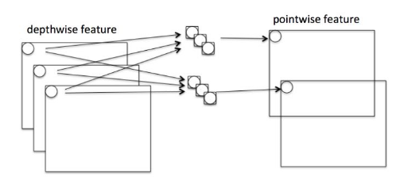
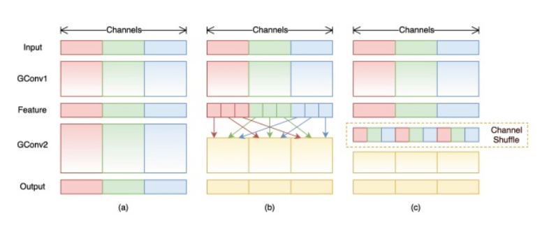
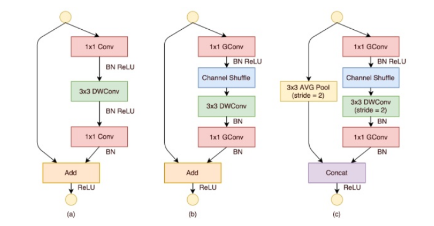
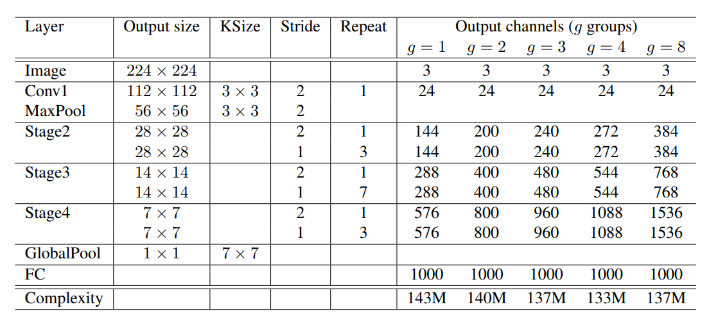
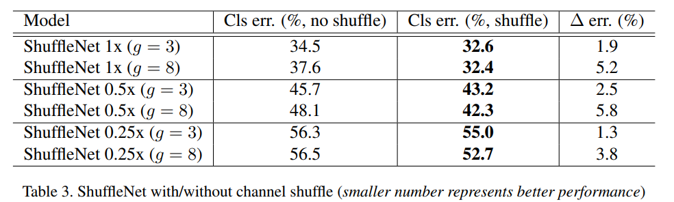
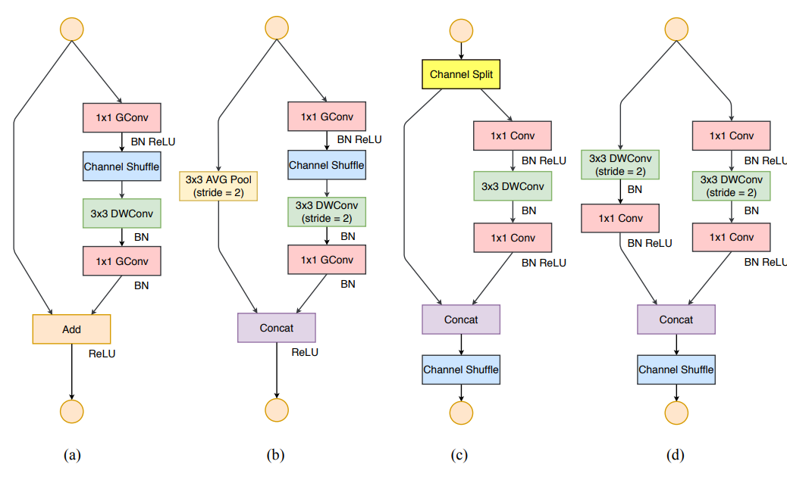
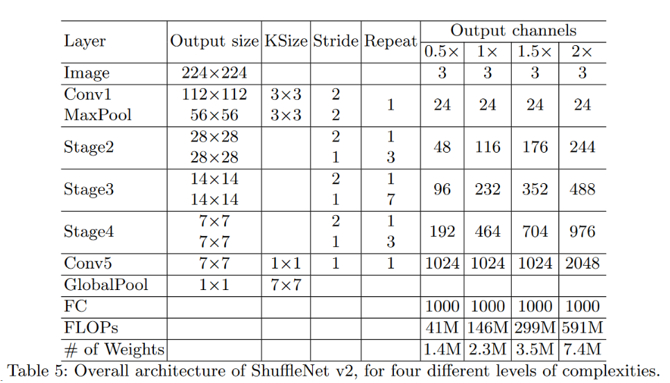

# 卷积神经网络

## 模型进化

- 更深更宽——**AlexNet**到**VGGNet**
- 不同的结构——**VGG**到**Inception/ResNet**
- 优势组合——**Inception + ResNet**
- 自我学习——**NASNet**
- 实用——**MobileNet**

## 卷积类型

### $1\times1$ 卷积

它给神经网络添加了一个非线性函数，从而减少、增加或保持输入层中的通道数量。

使⽤1×1卷积层来替代全连接层（ NiN），从而使空间信息能够⾃然传递到后⾯的层中去。

### 分组卷积

### 深度分离卷积

### 空洞卷积（膨胀卷积）

### 反卷积

## AlexNet

2012年，Alex等人提出的**AlexNet**网络在ImageNet大赛上以远超第二名的成绩夺冠，卷积神经网络乃至深度学习重新引起了广泛的关注。

虽然LeNet在图像分类中取得了较好的成绩，但是并没有引起很多的关注。AlexNet是在LeNet的基础上加深了网络的结构，学习更丰富更高维的图像特征。

> 上图中的输入是224×224，不过经过计算(224−11)/4=54.75并不是论文中的55×55，而使用227×227作为输入，则(227−11)/4+1=55

网络包含8个带权重的层；前5层是卷积层，剩下的3层是全连接层。最后一层全连接层的输出是1000维softmax的输入。

- **卷积层C1：** 

该层的处理流程是： **卷积-->ReLU-->池化-->归一化**

    - 卷积，输入是227×227，使用96个11×11×3的卷积核，得到的FeatureMap为55×55×96。
    
    - ReLU，将卷积层输出的FeatureMap输入到ReLU函数中。
    - 池化，使用3×3步长为2的池化单元（重叠池化，步长小于池化单元的宽度），输出为27×27×96（(55−3)/2+1=27)
    - 局部响应归一化，使用k=2,n=5,α=10−4,β=0.75进行局部归一化，输出的仍然为27×27×96，输出分为两组，每组的大小为27×27×48

- **卷积层C2：**
  该层的处理流程是：**卷积-->ReLU-->池化-->归一化**

  - 卷积，输入是2组27×27×48。使用2组，每组128个尺寸为5×5×48的卷积核，并作了边缘填充padding=2，卷积的步长为1. 则输出的FeatureMap为2组，每组的大小为27×27 ×128. （(27+2∗2−5)/1+1=27）
  - ReLU，将卷积层输出的FeatureMap输入到ReLU函数中
  - 池化运算的尺寸为3×3，步长为2，池化后图像的尺寸为(27−3)/2+1=13，输出为13×13×256
  - 局部响应归一化，使用k=2,n=5,α=10−4,β=0.75进行局部归一化，输出的仍然为13×13×256，输出分为两组，每组的大小为13×13×128

- **卷积层C3:**

  该层的处理流程是： **卷积-->ReLU**

  - 卷积，输入是13×13×256，使用2组共384尺寸为3×3×256的卷积核，做了边缘填充padding=1，卷积的步长为1.则输出的FeatureMap为13×13 ×384
  - ReLU，将卷积层输出的FeatureMap输入到ReLU函数中

- **卷积层C4:**

  该层的处理流程是： **卷积-->ReLU**

  - 卷积，输入是13×13×384，分为两组，每组为13×13×192.使用2组，每组192个尺寸为3×3×192的卷积核，做了边缘填充padding=1，卷积的步长为1.则输出的FeatureMap为13×13 ×384，分为两组，每组为13×13×192
  - ReLU，将卷积层输出的FeatureMap输入到ReLU函数中

- **卷积层C5:**

  该层处理流程为：**卷积-->ReLU-->池化**

  - 卷积，输入为13×13×384，分为两组，每组为13×13×192。使用2组，每组为128尺寸为3×3×192的卷积核，做了边缘填充padding=1，卷积的步长为1.则输出的FeatureMap为13×13×256
  - ReLU，将卷积层输出的FeatureMap输入到ReLU函数中
  - 池化，池化运算的尺寸为3×3，步长为2，池化后图像的尺寸为 (13−3)/2+1=6,即池化后的输出为6×6×256

- **全连接层FC6:**

  该层的流程为：**(卷积)全连接 -->ReLU -->Dropout**

  - 卷积->全连接： 输入为6×6×256,该层有4096个卷积核，每个卷积核的大小为6×6×256。由于卷积核的尺寸刚好与待处理特征图（输入）的尺寸相同，即卷积核中的每个系数只与特征图（输入）尺寸的一个像素值相乘，一一对应，因此，该层被称为全连接层。由于卷积核与特征图的尺寸相同，卷积运算后只有一个值，因此，卷积后的像素层尺寸为4096×1×1，即有4096个神经元。
  - ReLU,这4096个运算结果通过ReLU激活函数生成4096个值
  - Dropout,抑制过拟合，随机的断开某些神经元的连接或者是不激活某些神经元

- **全连接层FC7:**

  流程为：**全连接-->ReLU-->Dropout**

  - 全连接，输入为4096的向量
  - ReLU,这4096个运算结果通过ReLU激活函数生成4096个值
  - Dropout,抑制过拟合，随机的断开某些神经元的连接或者是不激活某些神经元

## VGGNet

VGGNet由牛津大学计算机视觉组合和Google DeepMind公司研究员一起研发的深度卷积神经网络。

它探索了卷积神经网络的深度和其性能之间的关系，通过反复的堆叠3*3的小型卷积核和2*2的最大池化层，成功的构建了16~19层深的卷积神经网络。

VGGNet获得了ILSVRC 2014年比赛的亚军和定位项目的冠军，在top5上的错误率为7.5%。目前为止，VGGNet依然被用来提取图像的特征。

**特点：**

- VGGNet全部使用$3\times3$的卷积核和$2\times2$的池化核，通过不断加深网络结构来提升性能。两个卷积$3\times3$层的串联相当于1个$5\times5$的卷积层，3个$3\times3$的卷积层串联相当于1个$7\times7$的卷积层，即3个$3\times3$卷积层的感受野大小相当于1个 $7\times7$ 的卷积层且参数更少。
- 使用 $1\times1$ 的卷积层来增加非线性变换，**全连接层可以等效为1x1的卷积核进行卷积**。

## ResNet

ResNet在2015年被提出，在ImageNet比赛classification任务上获得第一名。

随着网络深度的不断增加，人们发现深度CNN网络达到一定深度后再一味地增加层数并不能带来进一步地分类性能提高，反而会招致网络收敛变得更慢，分类准确率也变得更差。

**残差结构：**

ResNet使用了一种连接方式叫做**shortcut connection**，其中ResNet提出了两种mapping：

- 一种是**identity mapping**，指的就是图中曲线。identity mapping顾名思义，就是指本身，也就是公式中的x。
- 一种是**residual mapping**，指的就是除了曲线那部分。而residual mapping指的是“差”，也就是y−x，所以残差指的就是F(x)部分。
   所以最后的输出是 y=F(x)+x

> 可以通过$1\times1$ 卷积改变shortcut输出形状，保持与主路径一致 

**两种残差：**

这两种结构分别针对ResNet18/34（左图）和ResNet50/101/152（右图）

一般称整个结构为一个**building block**。其中左图又称**Basic block**，右图又称为**bottleneck** 

**bottleneck** 就是为了降低参数的数目，第一个1x1的卷积把256维channel降到64维，然后在最后通过1x1卷积恢复，整体上用的参数数目：1x1x256x64 + 3x3x64x64 + 1x1x64x256 = 69632，而不使用bottleneck的话就是两个3x3x256的卷积，参数数目: 3x3x256x256x2 = 1179648，差了16.94倍。

**网络结构：**

根据上面表格中的表述，可以将整个网络的主体部分分为4块conv2_x，conv3_x，conv4_x，conv5_x，浅层网络和深层网络的主要差别主要在Conv4，深层网络有更多的层数。

以resnet18为例：

**conv2_x** 中共有2个basicBlock，此部分的feature map输入（conv1的输出）channel为64，输出也是64，输入和输出的channel相同，且feature size也相同，因此可以直接相加，所以就不需要在shortcut中添加那个1*1的卷积了。

**conv3_x**中也有2个basicBlock，此部分的输入channel是64，而输出channel是128，因此不匹配。而且，在这个模块中将feature size缩小了两倍，所以在conv3_x中的第一个basicBlock中，使用了stride=2，此时feature map的size也已经缩小了，所以需要在shortcut中添加$1\times1$ 卷积，并且stride=2，让输入和输出具有相同的形状，从而可以相加。 在conv3_x的第二个block则不要shortcut中的1*1卷积，也没有出现stride=2的情况，因为这个block的输入和输出形状相同。

**conv4_x、conv5_x**和conv3_x的情况一样。

ResNet中的每个conv模块（conv2_x，conv3_x，conv4_x，conv5_x）中，如果当前模块的输入channel以及feature map size与输出的不一样，那么会在当前模块的第一个block（basicBlock或bottleNeck）中使用stride=2将feature map size缩小，并且在shortcut中添加一个$1\times1$ 的卷积，用来将输入channel和输出channel进行匹配。当前模块的所有非第一个block，都是采用正常的结构。

## InceptionNet

### Inception_v1

**原始Inception结构：**

该结构将CNN中常用的卷积（1x1，3x3，5x5）、池化操作（3x3）堆叠在一起（卷积、池化后的尺寸相同，将通道相加），一方面增加了网络的宽度，另一方面也增加了网络对尺度的适应性。

**Inception_v1结构 :**

Inception原始版本，所有的卷积核都在上一层的所有输出上来做，而那个5x5的卷积核所需的计算量就太大了，造成了特征图的厚度很大，为了避免这种情况，在3x3前、5x5前、max pooling后分别加上了1x1的卷积核，以起到了降低特征图厚度的作用

基于Inception构建了**GoogLeNet**的网络结构（共22层）

**特点:**

- GoogLeNet采用了模块化的结构（Inception结构），方便增添和修改；
- 网络最后采用了average pooling（平均池化）来代替全连接层，该想法来自NIN（Network in Network），事实证明这样可以将准确率提高0.6%。但是，实际在最后还是加了一个全连接层，主要是为了方便对输出进行灵活调整；
- 虽然移除了全连接，但是网络中依然使用了Dropout ; 
- 为了避免梯度消失，网络额外增加了2个辅助的softmax用于向前传导梯度（辅助分类器）。辅助分类器是将中间某一层的输出用作分类，并按一个较小的权重（0.3）加到最终分类结果中，这样相当于做了模型融合，同时给网络增加了反向传播的梯度信号，也提供了额外的正则化，对于整个网络的训练很有裨益。而在实际测试的时候，这两个额外的softmax会被去掉。

**结构细节：**

GoogLeNet网络结构明细表解析如下：
**0、输入**
原始输入图像为224x224x3，且都进行了零均值化的预处理操作（图像每个像素减去均值）。
**1、第一层（卷积层）**
使用7x7的卷积核（滑动步长2，padding为3），64通道，输出为112x112x64，卷积后进行ReLU操作
经过3x3的max pooling（步长为2），输出为((112 - 3+1)/2)+1=56，即56x56x64，再进行ReLU操作
**2、第二层（卷积层）**
使用3x3的卷积核（滑动步长为1，padding为1），192通道，输出为56x56x192，卷积后进行ReLU操作
经过3x3的max pooling（步长为2），输出为((56 - 3+1)/2)+1=28，即28x28x192，再进行ReLU操作
**3a、第三层（Inception 3a层）**
分为四个分支，采用不同尺度的卷积核来进行处理
（1）64个1x1的卷积核，然后RuLU，输出28x28x64
（2）96个1x1的卷积核，作为3x3卷积核之前的降维，变成28x28x96，然后进行ReLU计算，再进行128个3x3的卷积（padding为1），输出28x28x128
（3）16个1x1的卷积核，作为5x5卷积核之前的降维，变成28x28x16，进行ReLU计算后，再进行32个5x5的卷积（padding为2），输出28x28x32
（4）pool层，使用3x3的核（padding为1），输出28x28x192，然后进行32个1x1的卷积，输出28x28x32。
将四个结果进行连接，对这四部分输出结果的第三维并联，即64+128+32+32=256，最终输出28x28x256
**3b、第三层（Inception 3b层）**
（1）128个1x1的卷积核，然后RuLU，输出28x28x128
（2）128个1x1的卷积核，作为3x3卷积核之前的降维，变成28x28x128，进行ReLU，再进行192个3x3的卷积（padding为1），输出28x28x192
（3）32个1x1的卷积核，作为5x5卷积核之前的降维，变成28x28x32，进行ReLU计算后，再进行96个5x5的卷积（padding为2），输出28x28x96
（4）pool层，使用3x3的核（padding为1），输出28x28x256，然后进行64个1x1的卷积，输出28x28x64。
将四个结果进行连接，对这四部分输出结果的第三维并联，即128+192+96+64=480，最终输出输出为28x28x480

第四层（4a,4b,4c,4d,4e）、第五层（5a,5b）……，与3a、3b类似，在此就不再重复。

### Inception_v2

#### 卷积分解（Factorizing Convolutions）

大尺寸的卷积核可以带来更大的感受野，但也意味着会产生更多的参数，因此可以用2个连续的3x3卷积层组成的小网络来代替单个的5x5卷积层，即在保持感受野范围的同时又减少了参数量。

那么这种替代方案会造成表达能力的下降吗？通过大量实验表明，**并不会造成表达缺失**。

可以看出，大卷积核完全可以由一系列的3x3卷积核来替代，那能不能再分解得更小一点呢？GoogLeNet团队考虑了**nx1的卷积核**，如下图所示，用3个3x1取代3x3卷积：

因此，任意nxn的卷积都可以通过1xn卷积后接nx1卷积来替代。GoogLeNet团队发现在网络的前期使用这种分解效果并不好，在中度大小的特征图（feature map）上使用效果才会更好（特征图大小建议在12到20之间）

#### 降低特征图大小

一般情况下，如果想让图像缩小，可以有如下两种方式：

先池化再作Inception卷积，或者先作Inception卷积再作池化。但是

方法一（左图）先作pooling（池化）会导致特征表示遇到瓶颈（特征缺失），

方法二（右图）是正常的缩小，但计算量很大。

为了同时保持特征表示且降低计算量，使用两个并行化的模块来降低计算量（卷积、池化并行执行，再进行合并）

**网络结构：**

> 上表中的Figure 5指没有进化的Inception，Figure 6是指小卷积版的Inception（用3x3卷积核代替5x5卷积核），Figure 7是指不对称版的Inception（用1xn、nx1卷积核代替nxn卷积核）。

### Inception_v3

Inception V3一个最重要的改进是卷积分解（Factorization），将7x7分解成两个一维的卷积（1x7,7x1），3x3也是一样（1x3,3x1），这样的好处，既可以加速计算，又可以将1个卷积拆成2个卷积，使得网络深度进一步增加，增加了网络的非线性（每增加一层都要进行ReLU）。
另外，网络输入从224x224变为了299x299。

### Inception_v4

Inception V4主要利用残差连接（Residual Connection）来改进V3结构，得到Inception-ResNet-v1，Inception-ResNet-v2，Inception-v4网络。

通过20个类似的模块组合，Inception-ResNet构建如下：

## Xception

Xception是google提出的对inception的另一种改进，主要采用**深度可分离卷积**来替换原来的卷积操作。

Xception将ResNet的相关卷积变成了**深度可分离卷积**，如下图所示。另外，原来的concat变成了**残差连接**。

## DenseNet

***

CVPR2017年的Best Paper, DenseNet脱离了加深网络层数(ResNet)和加宽网络结构(Inception)来提升网络性能的定式思维,从特征的角度考虑,通过特征重用和旁路(Bypass)设置,既大幅度减少了网络的参数量,又在一定程度上缓解了梯度消失问题的产生.结合信息流和特征复用的假设,DenseNet当之无愧成为2017年计算机视觉顶会的年度最佳论文.

**特点：**

- 相比ResNet拥有更少的参数数量.
- 旁路加强了特征的重用.
- 网络更易于训练,并具有一定的正则效果.
- 缓解了梯度消失和模型退化问题.

**dense block：**

在传统的卷积神经网络中，如果你有L层，那么就会有L个连接，但是在DenseNet中，会有**L(L+1)/2**个连接。

**就是每一层的输入来自前面所有层的输出。**

**网络结构：**

- 表中的k=32、k=48中的k是**growth rate**，表示每个dense block中每层输出的feature map个数。

- 在每个Dense Block中都包含很多个子结构，以DenseNet-169的Dense Block（3）为例，包含32个$1\times1$ 和$3\times3$ 的卷积子结构，第32个子结构的输入是前面31层的输出结果，每层输出的channel是32（growth rate），那么如果不做bottleneck操作，第32层的$3\times3$ 卷积操作的输入就是$31\times32$ +（上一个Dense Block的输出channel），近1000了。而加上$1\times1$ 的卷积，代码中的1*1卷积的channel是growth rate*4，也就是128，然后再作为3*3卷积的输入。这就大大减少了计算量，这就是bottleneck。*
- Transition layer，放在两个Dense Block中间，是因为每个Dense Block结束后的输出channel个数很多，需要用$1\times1$的卷积核来降维。还是以DenseNet-169的Dense Block（3）为例，虽然第32层的3*3卷积输出channel只有32个（growth rate），但是紧接着还会像前面几层一样有通道的concat操作，即将第32层的输出和第32层的输入做concat，前面说过第32层的输入是1000左右的channel，所以最后每个Dense Block的输出也是1000多的channel。因此这个transition layer有个参数reduction（范围是0到1），表示将这些输出缩小到原来的多少倍，默认是0.5，这样传给下一个Dense Block的时候channel数量就会减少一半，这就是transition layer的作用。

> DenseNet-C网络，表示增加了这个Translation layer，该层的1*1卷积的输出channel默认是输入channel到一半。
>
> DenseNet-BC网络，表示既有bottleneck layer，又有Translation layer。

## SENet

***

**Squeeze-and-Excitation Networks** 是2017年提出的网络结构，CPVR2017best paper，将**SENet block**插入到现有的多种分类网络中，都取得了不错的效果。

作者的动机是希望显式地建模特征通道之间的相互依赖关系。另外，作者并未引入新的空间维度来进行特征通道间的融合，而是采用了一种全新的 **特征重标定** 策略。具体来说，就是通过学习的方式来自动获取到每个特征通道的重要程度，然后依照这个重要程度去提升有用的特征并抑制对当前任务用处不大的特征。

通俗的来说SENet的核心思想在于通过网络根据loss去学习特征权重，使得有效的feature map权重大，无效或效果小的feature map权重小的方式训练模型达到更好的结果。SE block嵌在原有的一些分类网络中不可避免地增加了一些参数和计算量，但是在效果面前还是可以接受的 。Sequeeze-and-Excitation(SE) block并不是一个完整的网络结构，而是一个子结构，可以嵌到其他分类或检测模型中。

**结构组成：**

上图是SE 模块的示意图。给定一个输入 x，其特征通道数为 $c_1$，通过一系列卷积等一般变换后得到一个特征通道数为 $c_2 $的特征。与传统的 CNN 不一样的是，接下来通过三个操作来重标定前面得到的特征。

- Ftr 这一步是转换操作并不属于SENet，而是属于原网络。

首先是 **Squeeze** 操作，顺着空间维度来进行特征压缩，将每个二维的特征通道变成一个实数，这个实数某种程度上具有全局的感受野，并且输出的维度和输入的特征通道数相匹配。它表征着在特征通道上响应的全局分布，而且使得靠近输入的层也可以获得全局的感受野，这一点在很多任务中都是非常有用的。

- Squeeze操作，公式非常简单，就是一个global average pooling:将${H}\times\ {W}\times{C}$的输入转换成$1\times1\times C$的输出

其次是 **Excitation** 操作，它是一个类似于循环神经网络中门的机制。通过参数 w 来为每个特征通道生成权重，其中参数 w 被学习用来显式地建模特征通道间的相关性。

- 如公式3。直接看最后一个等号，前面squeeze得到的结果是z，这里先用W1乘以z，就是一个全连接层操作，W1的维度是$\frac{C}{r}\times C$，这个r是一个缩放参数，在文中取的是16，这个参数的目的是为了减少channel个数从而降低计算量。又因为z的维度是$1\times1\times C$，所以W1z的结果就是$1\times1\times \frac{C}{r}$；然后再经过一个ReLU层，输出的维度不变；然后再和W2相乘，和W2相乘也是一个全连接层的过程，W2的维度是$C\times \frac{C}{r}$，因此输出的维度就是；最后再$1\times1\times C$经过sigmoid函数，得到s。

最后是一个 **Reweight** 的操作，将 Excitation 的输出的权重看做是进过特征选择后的每个特征通道的重要性，然后通过乘法逐通道加权到先前的特征上，完成在通道维度上的对原始特征的重标定。

- Fscale每个通道特征乘以一个权重s

**应用举例：**

左图是将 SE 模块嵌入到 Inception 结构的一个示例。方框旁边的维度信息代表该层的输出。

这里我们使用 global average pooling 作为 Squeeze 操作。紧接着两个 Fully Connected 层组成一个 **Bottleneck** 结构去建模通道间的相关性，并输出和输入特征同样数目的权重。我们首先将特征维度降低到输入的 1/16，然后经过 ReLu 激活后再通过一个 Fully Connected 层升回到原来的维度。这样做比直接用一个 Fully Connected 层的好处在于：1）具有更多的非线性，可以更好地拟合通道间复杂的相关性；2）极大地减少了参数量和计算量。然后通过一个 Sigmoid 的门获得 0~1 之间归一化的权重，最后通过一个 Scale 的操作来将归一化后的权重加权到每个通道的特征上。

右图是将 SE 嵌入到 ResNet 模块中的一个例子，操作过程基本和 SE-Inception 一样，只不过是在 Addition 前对分支上 Residual 的特征进行了特征重标定。如果对 Addition 后主支上的特征进行重标定，由于在主干上存在 0~1 的 scale 操作，在网络较深 BP 优化时就会在靠近输入层容易出现梯度消散的情况，导致模型难以优化。

## MobileNet

***

### MobileNet_v1

是谷歌在2017年提出了，专注于移动端或者嵌入式设备中的轻量级CNN网络。

最大的创新点是，提出了**深度可分离卷积（depthwise separable convolution）**

**传统卷积**分成两步，每个卷积核与每张特征图进行按位相乘然后进行相加。

计算量为DF∗DF∗DK∗DK∗M∗N，其中DF为特征图尺寸，DK为卷积核尺寸，M为输入通道数，N为输出通道数。

**深度可分离卷积**将传统卷积的两步进行分离开来，分别是**depthwise**和**pointwise**。

首先按照通道进行计算按位相乘的计算，此时通道数不改变；然后依然得到将第一步的结果，使用1*1的卷积核进行传统的卷积运算，此时通道数可以进行改变。使用了深度可分离卷积，其计算量为DK∗DK∗M∗DF∗DF+1∗1∗M∗N∗DF∗DF。

通过深度可分离卷积，计算量将会下降$\frac{1}{N}+\frac{1}{{D_k}^2}$。当DK=3时，深度可分离卷积比传统卷积少8到9倍的计算量。

其次，v1还存在以下的亮点:

- depthwise后接BN层和RELU6，pointwise后也接BN层和**RELU6**，如下图所示（图中应该是RELU6）。左图是传统卷积，右图是深度可分离卷积。更多的ReLU6，增加了模型的非线性变化，增强了模型的泛化能力。

  

  

- v1还给出了2个超参，

  **宽度乘子α (width multiplier**) : 按比例减少通道数,取值范围为(0,1]),输入与输出通道数将变成αM和αN

  **分辨率乘子β (resolution multiplie)**: 用来改变输入图片的分辨率，

  通过这两个超参，可以进一步缩减模型，文章中也给出了具体的试验结果。此时，我们反过来看，扩大宽度和分辨率，都能提高网络的准确率，但如果单一提升一个的话，准确率很快就会达到饱和，这就是2019年谷歌提出`efficientnet`的原因之一，动态提高深度、宽度、分辨率来提高网络的准确率。

**性能对比：**

同样是MobileNets的架构，使用可分离卷积，精度值下降1%，而参数仅为1/7。

深且瘦（Narrow）的网络比浅且胖（Shallow）的网络准确率高3%：

α 超参数减小的时候，模型准确率随着模型的变瘦而下降：

β超参数减小的时候，模型准确率随着模型的分辨率下降而下降：

### MobileNet_v2

发表于2018年，谷歌的又一力作。V2在V1的基础上，引入了**Inverted Residuals**和**Linear Bottlenecks**。

为什么要引入这两个模块呢？有人发现，在使用V1的时候，发现depthwise部分的卷积核容易费掉，即卷积核大部分为零。作者认为这是ReLU引起的

简单来说，就是当低维信息映射到高维，经过ReLU后再映射回低维时，若映射到的维度相对较高，则信息变换回去的损失较小；若映射到的维度相对较低，则信息变换回去后算是很大。因此，认为**对低维度做ReLU运算，很容易造成信息的丢失。而在高维度进行ReLU运算的话，信息的丢失则会很少。**另外一种解释是，高维信息变换回低维信息时，相当于做了一次特征压缩，会损失一部分信息，而再进过relu后，损失的部分就更加大了。作者为了这个问题，就将ReLU替换成线性激活函数。

#### Inverted Residuals

可以翻译成“倒残差模块”。什么意思呢？我们来对比一下残差模块和倒残差模块的区别。

- **残差模块**：输入首先经过$1\times1$的卷积进行通道压缩，然后使用$3\times3$的卷积进行特征提取，最后在用$1\times1$的卷积把通道数变换回去。整个过程是“压缩-卷积-扩张”。这样做的目的是减少$3\times3$模块的计算量，提高残差模块的计算效率。

- **倒残差模块**：输入首先经过 $1\times1$ 的卷积进行通道扩张，然后使用 $3\times3$ 的**depthwise**卷积，最后使用 $1\times1$ 的**pointwise**卷积将通道数压缩回去。整个过程是“扩张-卷积-压缩”。为什么这么做呢？因为depthwise卷积不能改变通道数，因此特征提取受限于输入的通道数，所以将通道数先提升上去。文中的扩展因子为6。

#### Linear Bottleneck

这个模块是为了解决一开始提出的那个低维-高维-低维的问题，即将最后一层的ReLU替换成线性激活函数，而其他层的激活函数依然是ReLU6。

将两个模块进行结合，如下图所示。

**当stride=1时**，输入首先经过$1\times1$的卷积进行通道数的扩张，此时激活函数为ReLU6；

然后经过$3\times3$的**depthwise**卷积，激活函数是ReLU6；

接着经过$1\times1$的**pointwise**卷积，将通道数压缩回去，激活函数是linear；最后使用shortcut，将两者进行相加。

而**当stride=2时**，由于input和output的特征图的尺寸不一致，所以就没有shortcut了。

最后，给出v2的网络结构。其中，t为扩张系数，c为输出通道数，n为该层重复的次数，s为步长。可以看出，v2的网络比v1网络深了很多，v2有54层。

v2的准确率比v1高出不少，延时也低了很多

### MobileNet_v3

发表于2019年，该v3版本结合了v1的深度可分离卷积、v2的Inverted Residuals和Linear Bottleneck、SE模块，利用NAS（神经结构搜索）来搜索网络的配置和参数。这种方式已经远远超过了人工调参了

v3在v2的版本上有以下的改进：

- 作者发现，计算资源耗费最多的层是网络的输入和输出层，因此作者对这两部分进行了改进。如下图所示，上面是v2的最后输出几层，下面是v3的最后输出的几层。可以看出，v3版本将平均池化层提前了。在使用$1\times1$卷积进行扩张后，就紧接池化层-激活函数，最后使用 $1\times1$ 的卷积进行输出。

  通过这一改变，能减少10ms的延迟，提高了15%的运算速度，且几乎没有任何精度损失。其次，对于v2的输入层，通过 $3\times3$ 卷积将输入扩张成32维。作者发现使用ReLU或者switch激活函数，能将通道数缩减到16维，且准确率保持不变。这又能节省3ms的延时。

  

- 由于嵌入式设备计算sigmoid是会耗费相当大的计算资源的，因此作者提出了**h-switch**作为激活函数。且随着网络的加深，非线性激活函数的成本也会随之减少。所以，只有在较深的层使用**h-switch**才能获得更大的优势。

$$
h-switch[x] = x\frac{Relu6(x+3)}{6}
$$

- 在v2的block上引入SE模块，SE模块是一种轻量级的**通道注意力模块**。在depthwise之后，经过池化层，然后第一个fc层，通道数缩小4倍，再经过第二个fc层，通道数变换回去（扩大4倍），然后与depthwise进行按位相加。

最后，v3的结构如下图所示。作者提供了两个版本的v3，分别是large和small，对应于高资源和低资源的情况。两者都是使用NAS进行搜索出来的。

从下面的试验结果，可以看出v3-large的准确率和计算速度都高于v2。所以，AutoML搭出来的网络，已经能代替大部分调参了。

## ShuffleNet

**ShuffleNet V1**是Face++于2017年提出的轻量级深层神经网络。作者在2018年又提出了基于V1版本改进的**ShuffleNet V2**版本。ShuffleNet V1中的核心思想为group结合shuffle操作来改进传统的ResNet的block。而ShuffleNet V2则根据相同的FLOPs（float-point operations，乘积数量）情况下模型速度差别仍然很大这一现象，指出内存访问损失时间和FLOPS共同决定了网络在实际落地时训练和运行的速度。最终通过实验说明了 卷积层输入输出通道数、group操作数、网络模型分支数以及Elementwise操作数，这四个因素对最终模型速度的影响。ShuffleNet V2根据上述实验结合V1中block的架构对网络结构做出了一定的改进，提升了模型实际引用时的速度。

ShuffleNet V1论文地址：https://arxiv.org/abs/1707.01083
ShuffleNet V2论文地址：https://arxiv.org/abs/1807.11164

### 分组卷积

Group convolution是将输入层的不同特征图进行分组，然后采用不同的卷积核再对各个组进行卷积，这样会降低卷积的计算量。因为一般的卷积都是在所有的输入特征图上做卷积，可以说是全通道卷积，这是一种通道密集连接方式（channel dense connection），而group convolution相比则是一种通道稀疏连接方式（channel sparse connection）。

#### 分组卷积的矛盾——计算量

使用group convolution的网络有很多，如Xception，MobileNet，ResNeXt等。其中Xception和MobileNet采用了depthwise convolution，这是一种比较特殊的group convolution，此时分组数恰好等于通道数，意味着每个组只有一个特征图。是这些网络存在一个很大的弊端是采用了**密集的1x1 pointwise convolution**（如下图）。

这个问题可以解决：对1x1卷积采用channel sparse connection 即分组操作，那样计算量就可以降下来了，但这就涉及到另外一个问题。

#### 分组卷积的矛盾——特征通信

group convolution层另一个问题是**不同组之间的特征图需要通信**，否则就好像分了几个互不相干的路，大家各走各的，会降低网络的特征提取能力，这也可以解释为什么Xception，MobileNet等网络采用密集的1x1 pointwise convolution，因为要保证group convolution之后不同组的特征图之间的信息交流。

#### channel shuffle

为达到特征通信目的，我们不采用dense pointwise convolution，考虑其他的思路：**channel shuffle**。如图b，其含义就是对group convolution之后的特征图进行“重组”，这样可以保证接下了采用的group convolution其输入来自不同的组，因此信息可以在不同组之间流转。图c进一步的展示了**这一过程并随机**，其实是“均匀地打乱”。

在程序上实现channel shuffle是非常容易的：假定将输入层分为 $g$ 组，总通道数为 $g\times n$，首先你将通道那个维度拆分为两个$(g,n)$ 维度，然后将这两个维度转置变成 $(n,g)$，最后重新reshape成一个维度 $g\times n$ 。

### ShuffleNet_v1

ShuffleNet的核心是采用了两种操作：pointwise group convolution和channel shuffle，这在保持精度的同时大大降低了模型的计算量。其基本单元则是在一个残差单元的基础上改进而成。

#### ShuffleNet基本单元

**下图a**展示了基本ResNet轻量级结构，这是一个包含3层的残差单元：首先是1x1卷积，然后是3x3的depthwise convolution（DWConv，主要是为了降低计算量），这里的3x3卷积是瓶颈层（bottleneck），紧接着是1x1卷积，最后是一个短路连接，将输入直接加到输出上。

**下图b**展示了改进思路：将密集的1x1卷积替换成1x1的group convolution，不过在第一个1x1卷积之后增加了一个channel shuffle操作。值得注意的是3x3卷积后面没有增加channel shuffle，按paper的意思，对于这样一个残差单元，一个channel shuffle操作是足够了。还有就是3x3的depthwise convolution之后没有使用ReLU激活函数。

**下图c**展示了其他改进，对原输入采用stride=2的3x3 avg pool，在depthwise convolution卷积处取stride=2保证两个通路shape相同，然后将得到特征图与输出进行连接（concat，借鉴了DenseNet？），而不是相加。极致的降低计算量与参数大小。

#### ShuffleNet网络结构

可以看到开始使用的普通的3x3的卷积和max pool层。然后是三个阶段，每个阶段都是重复堆积了几个ShuffleNet的基本单元。对于每个阶段，第一个基本单元采用的是stride=2，这样特征图width和height各降低一半，而通道数增加一倍。后面的基本单元都是stride=1，特征图和通道数都保持不变。对于基本单元来说，其中瓶颈层，就是3x3卷积层的通道数为输出通道数的1/4，这和残差单元的设计理念是一样的。

#### 对比实验

下表给出了不同g值（分组数）的ShuffleNet在ImageNet上的实验结果。可以看到基本上当g越大时，效果越好，这是因为采用更多的分组后，在相同的计算约束下可以使用更多的通道数，或者说特征图数量增加，网络的特征提取能力增强，网络性能得到提升。注意Shuffle 1x是基准模型，而0.5x和0.25x表示的是在基准模型上将通道数缩小为原来的0.5和0.25。

### ShuffleNet_v2

我们首先来看v1版本和v2版本的基础单元，（a）和（b）是ShuffleNet v1的两种不同block结构，两者的差别在于后者对特征图尺寸做了缩小，这和ResNet中某个stage的两种block功能类似，同理（c）和（d）是ShuffleNet v2的两种不同block结构：

看点如下：

- 从（a）和（c）的对比可以看出首先（c）在开始处增加了一个channel split操作，这个操作将输入特征的通道分成c-c’和c’，c’在文章中采用c/2，这主要是和**第1点**发现对应

- 然后（c）中取消了1*1卷积层中的group操作，这和**第2点**发现对应，同时前面的channel split其实已经算是变相的group操作了

- channel shuffle的操作移到了concat后面，和**第3点**发现对应，同时也是因为第一个1*1卷积层没有group操作，所以在其后面跟channel shuffle也没有太大必要

- 最后是将element-wise add操作替换成concat，这个和**第4点**发现对应。

- 多个（c）结构连接在一起的话，channel split、concat和channel shuffle是可以合并在一起的。（b）和（d）的对比也是同理，只不过因为（d）的开始处没有channel split操作，所以最后concat后特征图通道数翻倍，可以结合后面具体网络结构来看：

现在我们查看一个新的概念：**内存访问消耗时间（memory access cost）**，它正比于模型对内存的消耗（特征大小+卷积核大小），在这篇文章中作者使用该指标来衡量模型的速度而非传统的**FLOPs（float-point operations）**，它更多的侧重卷积层的乘法操作，作者认为FLOPs并不能实质的反应模型速度。

现在我们来看一下这四点发现，分别对应了结构中的四点创新：

- 卷积层的输入和输出特征通道数相等时MAC最小，此时模型速度最快

- 过多的group操作会增大MAC，从而使模型速度变慢

- 模型中的分支数量越少，模型速度越快

- element-wise操作所带来的时间消耗远比在FLOPs上的体现的数值要多，因此要尽可能减少element-wise操作

