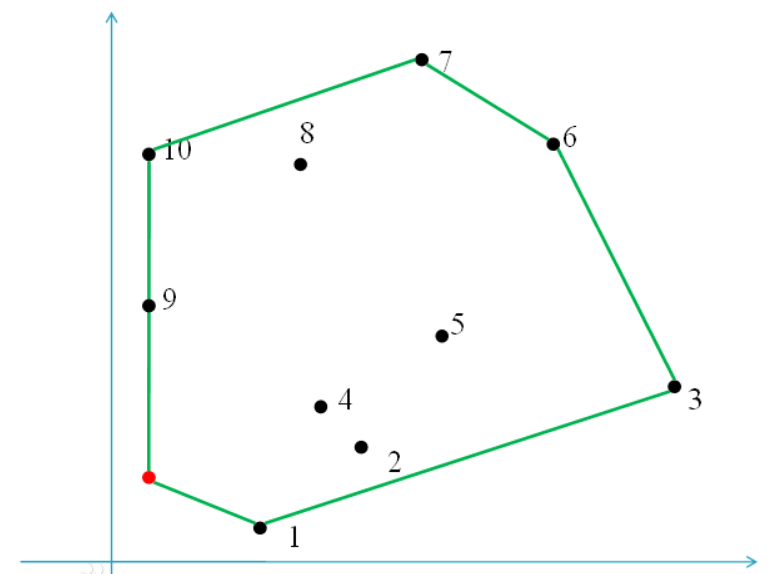
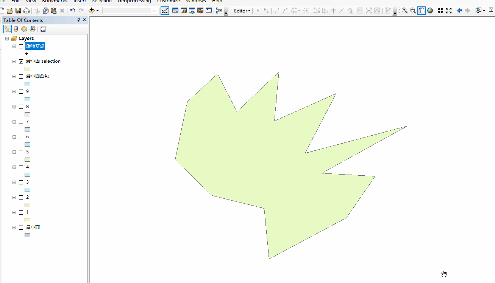
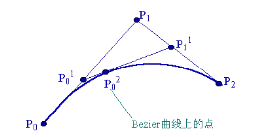

# 数学

## 计算几何

### 角度与弧度

用度(°)、分(′)、秒(″)来测量角的大小的制度叫做**角度制**。1°=60′，1′=60″，1′=(1/60)°，1″=(1/60)′。

用**弧长与半径之比**度量对应圆心角角度的方式，叫做**弧度制**，用符号**rad**表示(radian measure)，读作弧度。

2π rad = 360°，1 π rad = 180°，1°=π/180 rad ，1 rad = (180/π)°≈57.30°=57°18ˊ

### 凸包(Convex Hull)

是一个计算几何（图形学）中的概念。

在一个**实数向量空间**V中，对于给定集合X，所有包含X的**凸集**的交集S被称为X的**凸包**。X的凸包可以用X内所有点(X1，...Xn)的凸组合来构造.

用不严谨的话来讲，给定二维平面上的点集，**凸包就是将最外层的点连接起来构成的凸多边形，它能包含点集中所有的点**。

### 简单外接矩形（MBR）

**minimum bounding rectangle**

是指多边形顶点最大和最小坐标[xmin,ymin,xmax,ymax],为顶点围成的矩形，边与坐标抽平行。

###　最小外接矩形（SMBR）

**smallest minimum bounding rectangle**

与**MBR**不一样，其边不一定与平行于坐标轴，但面积最小

求解算法：

**旋转法**

每次以固定角度旋转边界点，旋转后求出一个MBR，然后求最小的MBR。

1、先求凸包

2、一个凸多边形的最小外接矩形至少过该凸边形的一条边。证明：https://wenku.baidu.com/view/d0816e60b42acfc789eb172ded630b1c59ee9bf6.html

3、通过旋转坐标系的方法，把经过每一条边的最小外接矩形求出来，然后比较面积大小。

***

## 贝塞尔曲线与伯恩斯坦多项式

###　伯恩斯坦多项式

#### 定义

伯恩斯坦多项式可以用来证明，在[ a, b ] 区间上所有的连续函数都可以用多项式来逼近，并且收敛性很强，也就是一致收敛。

就是一个连续函数，你可以将它写成若干个伯恩斯坦多项式相加的形式，并且，随着 n→∞，这个多项式将一致收敛到原函数，这个就是伯恩斯坦斯的**逼近性质**。

伯恩斯坦多项式的第n阶项有如下形式：
$$
\begin{equation}b_{i, n}(t)=\left(\begin{array}{c}
n \\
i
\end{array}\right) \cdot t^{i} \cdot(1-t)^{(n-i)}, \quad t \in[0,1]\end{equation}
$$
其中 i=0, 1, …, n, 而$\begin{equation} \left(\begin{array}{c}  n \\ i  \end{array}\right)=\frac{n!}{i!(n-i)!}\end{equation}$是**二项式系数**。

伯恩斯坦 n 阶多项式可以形成一组 n 阶指数多项式的基底。一般伯恩斯坦多项式可以表示为：
$$
\begin{equation}B_{n}(t)=\sum_{i=0}^{n} \beta_{i} \cdot b_{i, n}(t)\end{equation}
$$
其中，βi叫做**伯恩斯坦系数**。这就是贝塞尔曲线的函数形式。

#### 性质

- 对称性： $b_{i,n}(t) = b_{n-1,n}(1-t)$

- 正性：bi,n(t)⩾0
- 归一化： $\sum_{i=0}^n b_{i,n}(t) = 1$ 
- 极值：
- 临近项关系
- 端点：
- 积分：

### 贝塞尔曲线

#### 推导

**Bézier curve(**贝塞尔曲线**)**是应用于二维图形应用程序的数学曲线。 

曲线定义：**起始点**、**终止点（也称锚点）**、**控制点**。通过调整控制点，贝塞尔曲线的形状会发生变化。 1962年，法国数学家**Pierre Bézier**第一个研究了这种矢量绘制曲线的方法，并给出了详细的计算公式，因此按照这样的公式绘制出来的曲线就用他的姓氏来命名，称为贝塞尔曲线。

原理和简单推导（以三阶为例）：

设$P_0$、$P_0^2$、$P_2$是一条抛物线上顺序三个不同的点。过和$P_0$ ,$P_2$ 点的两切线交于$P_1$ 点，$P_0^2$ 点的切线交$P_0,P_1$和$P_2,P_1$ 于$P_0^1$和$P_1^1$，则如下比例成立：
$$
\begin{equation}\frac{P_{0} P_{0}^{1}}{P_{0}^{1} P_{1}}=\frac{P_{1} P_{1}^{1}}{P_{1}^{1} P_{2}}=\frac{P_{0}^{1} P_{0}^{2}}{P_{0}^{2} P_{1}^{1}}\end{equation}
$$
这是所谓抛物线的**三切线定理**。

当$P_0$，$P_2$固定，引入参数t，令上述比值为t:(1-t)，即有：
$$
\begin{equation}\begin{aligned}
&P_{0}^{1}=(1-t) P_{0}+t P_{1}\\
&P_{1}^{1}=(1-t) P_{1}+t P_{2}\\
&P_{0}^{2}=(1-t) P_{0}^{1}+t P_{1}^{1}
\end{aligned}\end{equation}
$$
t从0变到1，第一、二式就分别表示控制二边形的第一、二条边，它们是两条**一次Bezier曲线**。将一、二式代入第三式得：
$$
\begin{equation}P_{0}^{2}=(1-t)^{2} P_{0}+2 t(1-t) P_{1}+t^{2} P_{2}\end{equation}
$$
当t从0变到1时，它表示了由三顶点P0、P1、P2三点定义的一条**二次Bezier曲线**。这二次Bezier曲线P02可以定义为分别由前两个顶点(P0,P1)和后两个顶点(P1,P2)决定的一次Bezier曲线的线性组合。

依次类推,由四个控制点定义的三次Bezier曲线P03可被定义为分别由(P0,P1,P2)和(P1,P2,P3)确定的二条二次Bezier曲线的线性组合，由(n+1)个控制点Pi(i=0,1,...,n)定义的n次Bezier曲线P0n可被定义为分别由前、后n个控制点定义的两条(n-1)次Bezier曲线P0n-1与P1n-1的线性组合：

$$
\begin{equation}P_{0}^{n}=(1-t) P_{0}^{n-1}+t P_{1}^{n-1} \quad t \in[0,1]\end{equation}
$$
由此得到Bezier曲线的递推计算公式:
$$
\begin{equation}P_{i}^{k}=\left\{\begin{array}{cc}
P_{i} & k=0 \\
(1-t) P_{i}^{k-1}+t^{p-1} & k=1,2, \cdots, n, i=0,1, \cdots, n-k
\end{array}\right.\end{equation}
$$

#### 总结

伯恩斯坦多项式的一般形式$\begin{equation}B_{n}(t)=\sum_{i=0}^{n} \beta_{i} \cdot b_{i, n}(t)\end{equation}$

其中，$\begin{equation}b_{i, n}(t)=\left(\begin{array}{c}
n \\
i
\end{array}\right) \cdot t^{i} \cdot(1-t)^{(n-i)}, \quad t \in[0,1]\end{equation}$ 是 n 阶伯恩斯坦**基底多项式**。而 βi叫做**伯恩斯坦系数**。

**当伯恩斯坦系数是二维平面中的一系列固定点时**，伯恩斯坦多项式就演变成了**贝塞尔曲线**。

B(t)为 t 时间下点的坐标

$P_0$为起点，$P_n$为终点，$P_i$为控制点

#### 一阶贝塞尔曲线(线段)

$\begin{equation}B(t)=(1-t) p_{0}+t P_{1} \quad, t \in[0,1]\end{equation}$

意义：由 P0 至 P1 的连续点， 描述的一条线段

#### 二阶贝塞尔曲线(抛物线)

$\begin{equation}\mathbf{B}(t)=(1-t)^{2} \mathbf{P}_{0}+2 t(1-t) \mathbf{P}_{1}+t^{2} \mathbf{P}_{2}, t \in[0,1]\end{equation}$

由 P0 至 P1 的连续点 Q0，描述一条线段。 
由 P1 至 P2 的连续点 Q1，描述一条线段。 
由 Q0 至 Q1 的连续点 B(t)，描述一条二次贝塞尔曲线。

#### 三阶贝塞尔曲线

$\begin{equation}\mathbf{B}(t)=\mathbf{P}_{0}(1-t)^{3}+3 \mathbf{P}_{1} t(1-t)^{2}+3 \mathbf{P}_{2} t^{2}(1-t)+\mathbf{P}_{3} t^{3}, t \in[0,1]\end{equation}$

#### 通用公式

$$
\begin{equation}P_{i}^{k}=\left\{\begin{array}{cc}
P_{i} & k=0 \\
(1-t) P_{i}^{k-1}+t^{p-1} & k=1,2, \cdots, n, i=0,1, \cdots, n-k
\end{array}\right.\end{equation}
$$

#### 高阶贝塞尔曲线

4阶：

5阶：

