# 目标检测

## 算法分类

**目标检测（Object Detection）**的任务是找出图像中所有感兴趣的目标，确定它们的**类别**和**位置**，是计算机视觉领域的核心问题之一。

目前学术和工业界出现的目标检测算法分成3类：

1. **传统的目标检测算法**：**Cascade + HOG/DPM + Haar/SVM**以及上述方法的改进、优化；
2. **候选区域 + 深度学习分类（Two stage）**：通过提取候选区域，并对相应区域进行以深度学习方法为主的分类的方案：**R-CNN系列**等
3. **基于深度学习的回归方法（One stage）**：**YOLO/SSD/DenseBox** 等

https://github.com/amusi/awesome-object-detection


<<<<<<< HEAD
## 数据集

Pascal VOC https://pjreddie.com/projects/pascal-voc-dataset-mirror/

COCO http://cocodataset.org/#home
=======
## 基本组件

**边界框bounding box**


>>>>>>> b6b15513843bdc29bd1809ac3eb9babe5db83710


## R-CNN

预先找出图中目标可能出现的位置，即**候选区域（Region Proposal）**，利用图像中的纹理、边缘、颜色等信息，可以保证在选取较少窗口(几千甚至几百）的情况下保持较高的召回率（Recall）。选定候选框Region Proposal的方法，**选择性搜索（Selective Search）**

**具体步骤则如下**

一、训练一个分类模型（比如AlexNet）

二、对该模型做fine-tuning

​	1、将分类数从1000改为21，比如20个物体类别 + 1个背景

​	2、去掉最后一个全连接层

三、特征提取

​	1、提取图像的所有候选框（选择性搜索Selective Search）

​	2、对于每一个区域：修正区域大小以适合CNN的输入，做一次前向运算，将第五个池化层的输出（就是对候选框提取到的特征）存到硬盘

四：训练一个SVM分类器（二分类）来判断这个候选框里物体的类别。

​	  每个类别对应一个SVM，判断是不是属于这个类别，是就是positive，反之nagative。

五：使用回归器精细修正候选框位置：对于每一个类，训练一个线性回归模型去判定这个框是否框得完美。


**存在问题**

R-CNN虽然不再像传统方法那样穷举，但R-CNN流程的第一步中对原始图片通过Selective Search提取的候选框region proposal多达2000个左右，而这2000个候选框每个框都需要进行CNN提特征+SVM分类，计算量很大，导致R-CNN检测速度很慢，一张图都需要47s。

有没有方法提速呢？答案是有的，这2000个region proposal不都是图像的一部分吗，那么我们完全可以对图像提一次卷积层特征，然后只需要将region proposal在原图的位置映射到卷积层特征图上，这样对于一张图像我们只需要提一次卷积层特征，然后将每个region proposal的卷积层特征输入到全连接层做后续操作。

但现在的问题是每个region proposal的尺度不一样，而全连接层输入必须是固定的长度，所以直接这样输入全连接层肯定是不行的。SPP Net恰好可以解决这个问题。


### SPP-Net

**SPP：Spatial Pyramid Pooling（空间金字塔池化）**

当全连接层面对各种尺寸的输入数据时，就需要对输入数据进行**crop**等一系列操作以统一图片的尺寸大小，比如224x224（ImageNet）、32x32(LeNet)、96x96等（crop就是从一个大图扣出网络输入大小的patch，比如227×227），或warp（把一个边界框bounding box的内容resize成227×227

但warp/crop这种预处理，导致的问题要么被拉伸变形、要么物体不全，限制了识别精确度。

那借鉴卷积层可以适应任何尺寸，为何不能在卷积层的最后加入某种结构，使得后面全连接层得到的输入变成固定的呢？

这个结构就是**spatial pyramid pooling layer**


**SPP的特点有两个:**

**1、**在普通的CNN机构中，输入图像的尺寸往往是固定的（比如224*224像素），输出则是一个固定维数的向量。

SPP Net在普通的CNN结构中加入了**ROI池化层（ROI Pooling）**，使得网络的输入图像可以是任意尺寸的，输出则是一个固定维数的向量。

ROI池化层一般跟在卷积层后面，此时网络的输入可以是任意尺度的，在SPP layer中每一个pooling的filter会根据输入调整大小，而SPP的输出则是固定维数的向量，然后给到全连接FC层。

**2、**只对原图提取一次卷积特征

在R-CNN中，每个候选框先resize到统一大小，然后分别作为CNN的输入，这样是很低效的。

而SPP Net根据这个缺点做了优化：只对原图进行一次卷积计算，便得到整张图的**卷积特征feature map**，然后找到每个候选框在feature map上的映射patch，将此patch作为每个候选框的卷积特征输入到SPP layer和之后的层，完成特征提取工作。


**ROI pooling**

（1）根据输入image，将ROI映射到feature map对应位置；

（2）将映射后的区域划分为相同大小的sections（sections数量与输出的维度相同）；

（3）对每个sections进行max pooling操作；

例如：一个8x8大小的feature map，一个ROI，输出大小为2x2.


### Fast RCNN

Fast R-CNN在R-CNN的基础上采纳了SPP Net方法，对R-CNN作了改进，使得性能进一步提高。

与R-CNN框架图对比，主要有两处不同：

一、最后一个卷积层后加了一个**ROI pooling layer**，

二、损失函数使用了**分类加回归多任务损失函数(multi-task loss)**，将边框回归Bounding Box Regression直接加入到CNN网络中训练。


### Faster RCNN

Fast RCNN存在的问题：选择性搜索，找出所有的候选框，这个也非常耗时。

所以，在Faster RCNN中引入**Region Proposal Network(RPN)**替代Selective Search，同时引入**anchor box**应对目标形状的变化。

<<<<<<< HEAD


http://www.telesens.co/2018/03/11/object-detection-and-classification-using-r-cnns/#Implementation_Details_Training

#### 非极大值抑制 (NMS)

非最大抑制是一种技术，用于通过**消除重叠程度大于阈值**的框来减少候选框的数量。这些框首先按某些标准排序(通常是右下角的y坐标)。然后，我们检查框列表，并取消那些IOU与框重叠超过阈值的框。通过y坐标对框进行排序会导致保留一组重叠框中最低的框。这可能并不总是想要的结果。R-CNN中使用的NMS根据前景分数对框进行排序。这会导致保留一组重叠框中得分最高的框。下图显示了这两种方法之间的差异。黑色的数字是每个盒子的前景分数。右图显示了对左图应用NMS的结果。第一个数字使用标准网管(框按右下角的y坐标排序)。这会导致框中保留较低的分数。第二个数字使用修改后的NMS(框按前景分数排序)。这导致具有最高前景分数的框被保留，这是更理想的。在这两种情况下，假定盒之间的重叠高于IoU重叠阈值。

建造一个存放待处理候选框的集合H，初始化为包含全部N个框；

建造一个存放最优框的集合M，初始化为空集。

1、将所有集合 H 中的框进行排序，选出分数最高的框 m，从集合 H 移到集合 M；

2、遍历集合 H 中的框，分别与框 m 计算交并比IoU，如果高于某个阈值，则认为此框与 m 重叠，将此框从集合 H 中去除。

3、回到第1步进行迭代，直到集合 H 为空。集合 M 中的框为我们所需。

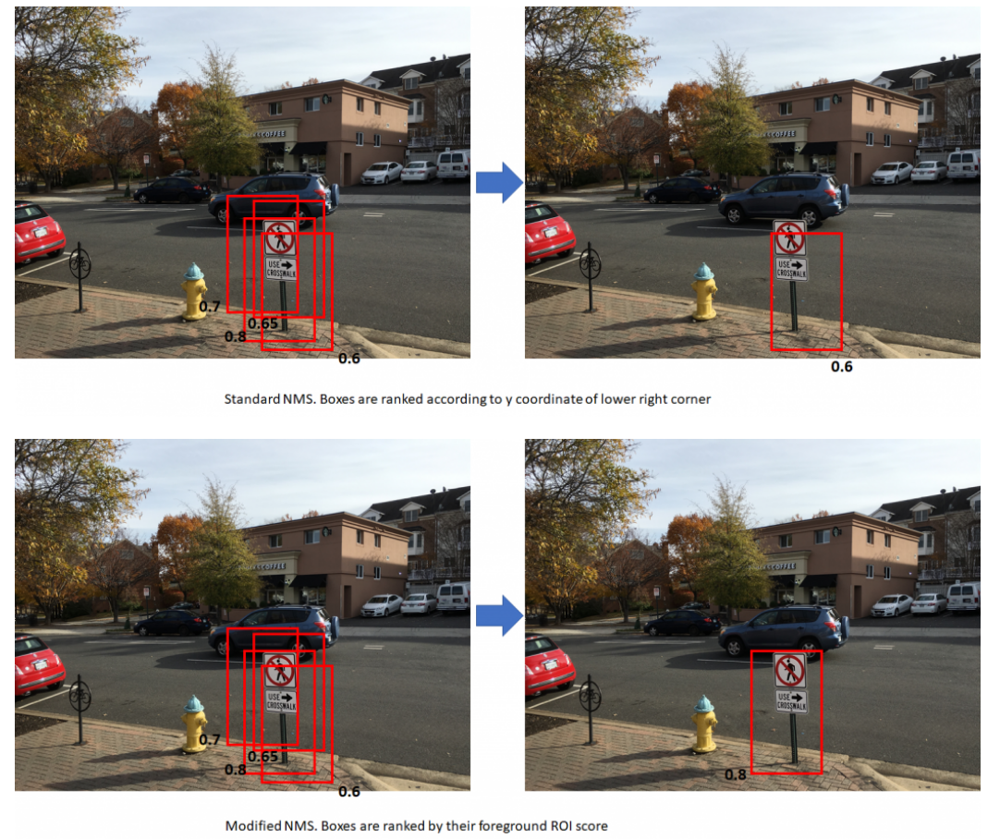


#### 边界框回归系数

**边界框回归系数**(也称为“回归系数”和“回归目标”)：R-CNN的目标之一是产生与对象边界紧密匹配的良好边界框。R-CNN通过获取给定的边界框(由左上角的坐标、宽度和高度定义)并通过应用一组“回归系数”来调整其左上角、宽度和高度来产生这些边界框。

这些系数计算如下：

设目标和原始边界框左上角的x，y坐标分别为$T_x,T_y,O_x,O_y$ ，目标和原始边界框的宽度/高度分别为$T_w,T_h,O_w,O_w$。然后，给出回归目标(将原始边界框转换为目标框的函数的系数)如下：
$$
t_x=\frac{(T_x-O_x)}{O_w},t_y=\frac{(T_y-O_y)}{O_h},t_w=log(\frac{T_w}{O_w}),t_h=log(\frac{T_h}{O_h})
$$
此函数很容易可逆，即，给定左上角的回归系数和坐标以及原始边界框的宽度和高度，就可以很容易地计算出目标框的左上角和宽度和高度。注意，回归系数对于没有剪切的仿射变换是不变的。这是一个重要的点，因为在计算分类损失时，目标回归系数是在原始纵横比下计算的，而分类网络输出回归系数是在正方形特征图(1：1纵横比)上的ROI汇集步骤之后计算的。当我们在下面讨论分类损失时，这一点将变得更加清楚。


#### Image Pre-Processing

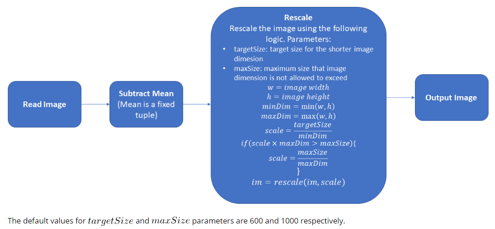


#### Network Architecture

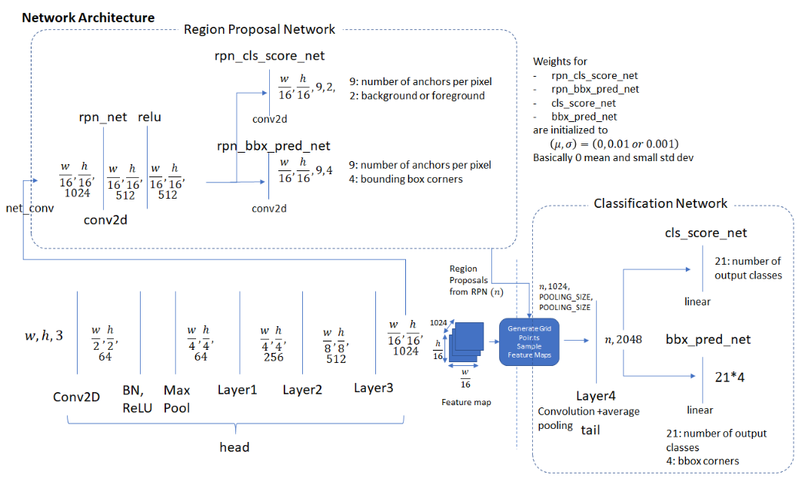


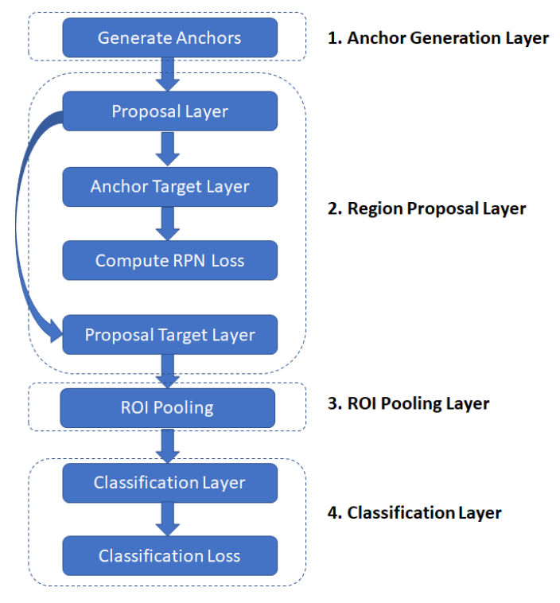

- **Anchor Generation Layer** ：该层首先通过固定数值生成9个不同比例和纵横比的锚框，然后通过在横跨输入图像的均匀间距的网格点上平移来复制这些锚框，从而生成固定数量的“锚框”。
- **Proposal Layer**：根据边框回归系数对锚框进行变换，生成变换后的锚框。然后，通过使用锚框作为前景区域的概率应用非最大抑制来修剪锚点的数量
- **Anchor Target Layer**：该层的目标是产生一组“好的”锚框以及相应的前景/背景标签和目标回归系数，以训练RPN网络。该层的输出仅用于训练RPN网络，不被分类层使用。给定一组锚框(由`Anchor Generation Layer`产生，该层标识前景和背景锚)。有前途的前景锚框是那些与某个真实标签框的IOU高于阈值的锚框。背景长方体是那些与任何地面真实值长方体重叠小于阈值的长方体。该层还输出一组边界框回归变量，即每个锚定目标离最近边界框有多远的测量。这些回归变量仅对前景框有意义，因为背景框没有“最近边界框”的概念。
- **RPN Loss**：RPN损耗函数是在优化训练RPN网络期间最小化的度量。损失函数是以下各项的组合：
  - 由RPN生成的被正确分类为前景/背景的边界框的比例。
  - 预测回归系数与目标回归系数之间的距离度量。
- **Proposal Target Layer**：该层的目标是修剪`proposal layer`层生成的锚框列表，并生成特定于类的边界框回归目标，这些目标可用于训练分类层以生成良好的类标签和回归目标。
- **ROI Pooling Layer**：实现一个空间转换网络，该网络在给定`Proposal Target Layer`生成的区域提案的边界框坐标的情况下对输入要素地图进行采样。这些坐标通常不在整数边界上，因此需要基于插值的采样。
- **Classification Layer**：分类层获取`ROI Pooling Layer`生成的输出特征图，并将其通过一系列卷积层。输出通过两个完全连接的层馈送。第一层产生每个区域建议的类概率分布，第二层产生一组特定于类的边界盒回归变量。
- **Classification Loss**：与RPN损失类似，分类损失是在优化训练分类网络期间最小化的度量。在反向传播过程中，误差梯度也流向RPN网络，因此训练分类层也会修改RPN网络的权值。分类损失是以下各项的组合：
  - RPN生成的边界框被正确分类(作为正确的对象类)的比例。
  - 预测回归系数与目标回归系数之间的距离度量。


#### Anchor Generation Layer

Anchor Generation Layer生成一组大小和纵横比各不相同的边界框(称为“锚框”)，它们遍布整个输入图像。这些边界框对于所有图像都是相同的，即它们与图像的内容无关。RPN网络的目标是学习识别这些框中哪些是好的框，即可能包含前景对象，并产生目标回归系数，当应用于锚框时，目标回归系数会将锚框变成更好的边界框(更贴合被包围的前景对象)。

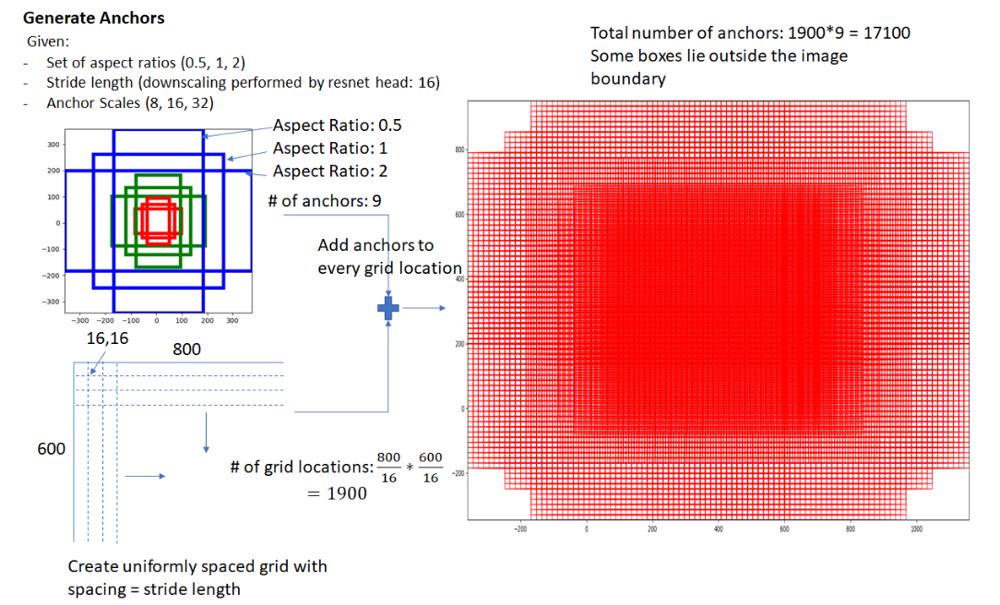


#### Region Proposal Layer

对象检测方法需要产生一组稀疏或密集的一组特征的“区域建议系统”作为输入。R-CNN系统的第一个版本使用选择性搜索方法生成区域提案。在当前的版本中，使用基于“滑动窗口”的技术来生成一组密集的候选区域，然后使用神经网络驱动的RPN来根据区域包含前景对象的概率来对区域提案进行排序。Region Proposal Layer有两个目标：

- 从锚框列表中标识背景锚框和前景锚框。
- 通过应用一组“回归系数”来修改锚框的位置、宽度和高度，以提高锚框的质量。


`Region Proposal Layer`由`Region Proposal Network`和另外三层组成-`Proposal Layer`、`Anchor Target Layer`和`Proposal Target Layer`。


#### Region Proposal Network

`Region Proposal Layer`通过卷积层(代码中称为RPN_NET)运行由头部网络生成的特征地图，然后是RELU。RPN_NET的输出通过两个(1，1)核卷积层来产生背景/前景类分数和概率以及相应的边界盒回归系数。头部网络的步长与生成锚框时使用的步长相匹配，因此锚框的数量与Region Proposal Network产生的信息是1-1对应的(锚框的数量=类别分数的数量=边界框回归系数的数量=$\frac{w}{16}\times\frac{h}{16}\times 9)$ 

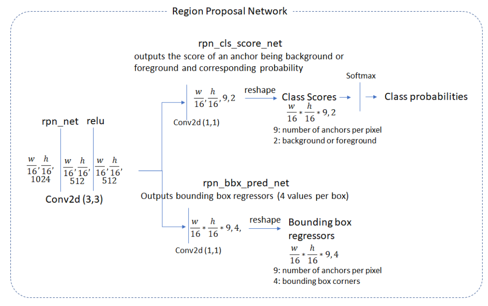


#### Proposal Layer

Proposal Layer采用Anchor Generation Layer生成的锚框，并通过基于前景分数应用非最大抑制来修剪框的数量。它还通过将RPN生成的回归系数应用于相应的锚框来生成变换的边界框。

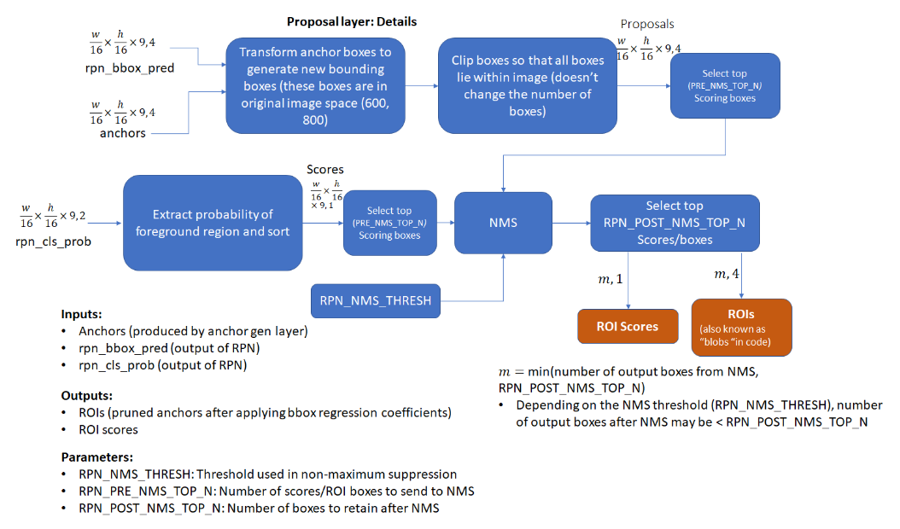


1. for each (H, W) location i

   generate A anchor boxes centered on cell i

   apply predicted bbox deltas at cell i to each of the A anchors

2. clip predicted boxes to image

3. remove predicted boxes with either height or width < threshold

   (NOTE: convert min_size to input image scale stored in im_info[2])

4. sort all (proposal, score) pairs by score from highest to lowest

5. take top pre_nms_topN (e.g. 6000)

6. apply nms (e.g. threshold = 0.7)

7. take after_nms_topN (e.g. 300)

8. return the top proposals (-> RoIs top)


#### Anchor Target Layer

该层的目标是选择可用于训练RPN网络的有希望的锚框：

- 区分前景和背景区域
- 为前景框生成良好的边界框回归系数

首先看看RPN损耗是如何计算的是很有用的。这将揭示计算RPN损失所需的信息，这使得跟踪该层的操作变得容易。


##### Calculating RPN Loss

请记住，RPN层的目标是生成良好的边界框。为了从一组锚框中做到这一点，RPN层必须学会将锚框分类为背景或前景，并计算回归系数以修改前景锚框的位置、宽度和高度，以使其成为“更好的”前景框(更贴合前景对象)。RPN损失是以这样一种方式表示的，以鼓励网络学习这一行为。

RPN损失是分类损失和包围盒回归损失之和。分类损失使用交叉熵损失来惩罚不正确分类的框，并且回归损失使用真实回归系数(使用前景锚框的最接近匹配的地面真值框来计算)和由网络预测的回归系数之间的距离的函数(参见RPN网络体系结构图中的RPN_BBX_PRED_NET)。

现在我们将跟踪锚目标层的实现，看看这些量是如何计算的。我们首先选择位于图像范围内的锚定框。然后，通过首先计算所有锚框(在图像内)与所有地面真实框的IOU来选择好的前景框。使用此重叠信息，两种类型的框被标记为前景：

类型A：对于每个地面事实框，具有最大IOU的所有前景框都与地面事实框重叠。
类型B：与某个地面真实值框重叠的最大值超过阈值的锚定框

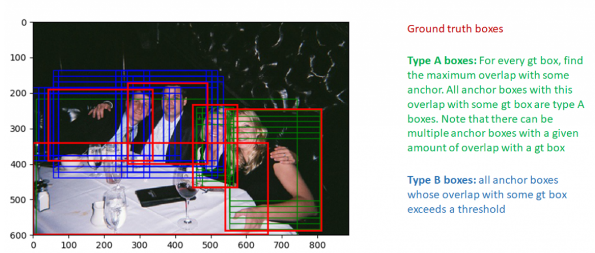

注意，只有与某些地面真实值框重叠超过阈值的锚框才被选择为前景框。这样做是为了避免向RPN呈现“无望的学习任务”，即学习距离最佳匹配场真值框太远的框的回归系数。同样，重叠小于负阈值的框被标记为背景框。并非所有不是前景框的框都标记为背景。既不是前景也不是背景的框被标记为“无关紧要”。这些框不包括在RPN损失的计算中。

还有两个额外的阈值与我们想要达到的背景和前景框的总数以及这个数字中应该是前景的部分相关。如果通过测试的前景框的数量超过阈值，我们会随机将多余的前景框标记为“无关”。类似的逻辑也适用于背景框。

接下来，我们计算前景框和对应的具有最大重叠的地面真实框之间的边界框回归系数。这很简单，只需按照公式计算回归系数即可。


#### Proposal Target Layer

该层的目标是从Proposal Layer输出的ROI列表中选择有希望的ROI。这些有希望的ROI将用于从Head Layer生成的特征地图执行crop pooling，并将其传递给网络的其余部分(Head_To_Tail)，该网络计算预测的班级分数和盒回归系数。

与Anchor Target Layer类似，选择好的proposal(那些与GT框有显著重叠的建议)传递到分类层也很重要。否则，我们将要求分类层学习“毫无希望的学习任务”。

Proposal Target Layer从Proposal Layer计算的ROI开始。利用每个感兴趣区与所有地面真值框的最大重叠度，将感兴趣区分为背景感兴趣区和前景感兴趣区。前景ROI是指最大重叠超过阈值的ROI(TRAIN.FG_THRESH，默认值：0.5)。背景ROI是那些最大重叠在TRAIN.BG_THRESH_LO和TRAIN.BG_THRESH_HI之间的ROI(默认值分别为0.1和0.5)。这是一个“hard negative mining”的例子，用于向分类器呈现困难的背景示例。

还有一些额外的逻辑试图确保前景和背景区域的总数是恒定的。如果发现的背景区域太少，它会尝试通过随机重复一些背景索引来填充批次，以弥补不足。

接下来，在每个ROI和最接近匹配的地面真值框(这还包括背景ROI，因为对于这些ROI还存在重叠的地面真值框)之间计算边界框目标回归目标。这些回归目标为所有类展开，如下图所示。

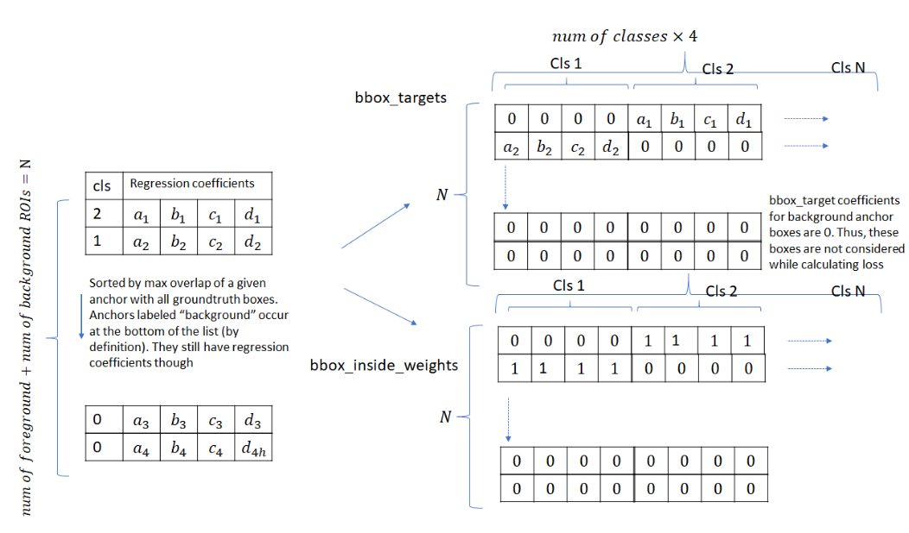

BBOX_INSIDE_WEIGHTS数组充当掩码。它只对每个前景ROI的正确类别为1。背景ROI也是零。因此，在计算分类层损失的边界框回归分量时，仅考虑前景区域的回归系数。这不是分类损失的情况-背景ROI被包括在内，并且它们属于“背景”类。


#### ROI Pooling

建议目标层产生有希望的ROI，以便我们与训练期间使用的相关类别标签和回归系数一起进行分类。下一步是从头网络产生的卷积特征图中提取与这些ROI相对应的区域。然后，通过网络的其余部分(上面所示的网络图中的“尾部”)运行所提取的特征地图，以产生每个ROI的对象类概率分布和回归系数。该层的工作是**从卷积特征图中进行区域提取**。

在“空间转化网络”一文中描述了作物池化背后的关键思想。目标是将扭曲函数(由2x3仿射变换矩阵描述)应用于输入特征映射以输出扭曲特征映射。


#### Classification Layer


=======


**RPN(Region Proposal Network)**

考虑9个可能的候选窗口：三种面积{128,256,512}×三种比例{1:1,1:2,2:1}。这些候选窗口称为**anchors**。


**RPN步骤：**

得到9个anchor，我们给每个anchor分配一个二进制的标签（前景:1,背景:0）。

我们分配正标签给两类anchor：

**1）**与某个**ground truth（GT）**包围盒有最高的IoU重叠的anchor（也许不到0.7），

**2）**与任意GT有大于0.7的IoU交叠的anchor。

注意到一个GT包围盒可能分配正标签给多个anchor。我们分配负标签给与所有GT包围盒的IoU比率都低于0.3的anchor。非正非负的anchor对训练目标没有任何作用，由此输出维度为2x9=18，一共18维。

假设在feature map中每个点上有k个anchor（默认k=9），而每个anhcor要分前景和背景，所以每个点转化为cls=2k 分类scores；而每个anchor都有[x, y, w, h]对应4个偏移量，所以reg=4k 回归坐标(coordinates)

**3）**边框回归：已经计算出前景anchors，使用bounding box regression得到预设anchor-box到ground-truth-box之间的变换参数，即平移（dx和dy）和伸缩参数（dw和dh），由此得到初步确定proposal。

对于窗口一般使用四维向量(x, y, w, h)表示，分别表示窗口的中心点坐标和宽高。我们的目标是寻找一种关系，使得输入原始的anchor A经过映射得到一个跟真实窗口G更接近的预测窗口G'，

**即：给定anchor A=(Ax, Ay, Aw, Ah)，寻找映射f，使得f(Ax, Ay, Aw, Ah)=(G'x, G'y, G'w, G'h)，使(G'x, G'y, G'w, G'h)≈(Gx, Gy, Gw, Gh)。**

**4）**将预测的proposal将anchors映射回原图，判断预测的proposal是否大范围超过边界，剔除严重超出边界的。

**5）**按照分类score进行从大到小排序，提取前2000个预proposal，对这个2000个进行**NMS(非极大值抑制)**，将得到的再次进行排序，输出300个proposal。
>>>>>>> b6b15513843bdc29bd1809ac3eb9babe5db83710


## SSD
***


### DSSD
***


### DSOD
***


### FSSD
***

借鉴FPN的思想，重构一组特征图金字塔，使算法精度明显提升，速度没有下降太多。


### RSSD

***


## RetinaNet

***


## Yolo系列

***

<<<<<<< HEAD
### yolo_v1

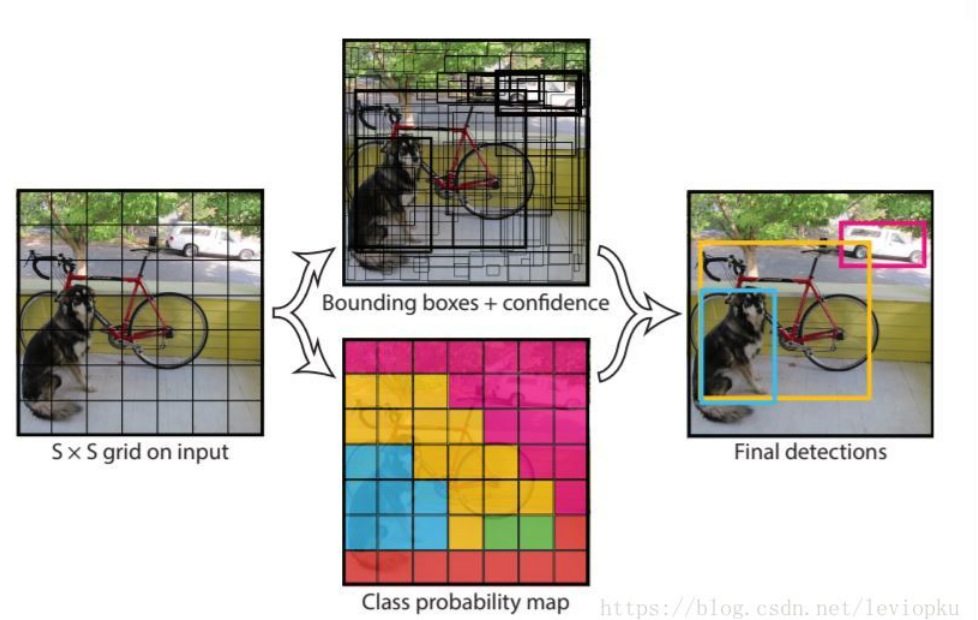

输入图片被划分为7x7个单元格，每个单元格独立作检测。网格只是物体中心点位置的划分之用，并不是对图片进行切片

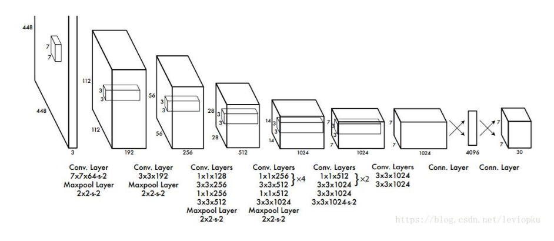

上面是结构图yolo_v1结构图，通过结构图可以轻易知道前向传播的计算过程，是很便于读者理解的。v1的输出是一个7x7x30的张量，7x7表示把输入图片划分位7x7的网格，每一个小单元的另一个维度等于30。30=(2*5+20)。代表能预测2个框的5个参数(x,y,w,h,score)和20个种类。


### yolo_v2

yolo_v2的一大特点是可以”tradeoff“，翻译成中文就是”折中”。v2可以在速度和准确率上进行tradeoff，比如在67帧率下，v2在VOC2007数据集的mAP可以达到76.8; 在40帧率下，mAP可以达到78.6。这样，v2就可以适应多种场景需求，在不需要快的时候，它可以把精度做很高，在不需要很准确的时候，它可以做到很快。

**v2在v1上的提升：**

**batch normalization**： BN能够给模型收敛带来显著地提升，同时也消除了其他形式正则化的必要。

**high resolution classifier(高分辨率分类器)**：所有最顶尖的检测算法都使用了基于ImageNet预训练的分类器。从AlexNet开始，大多数分类器的输入尺寸都是小于256x256的。最早的YOLO算法用的是224x224，现在已经提升到448了。

**Convolutional With Anchor Boxes**: 在yolo_v2的优化尝试中加入了anchor机制。YOLO通过全连接层直接预测Bounding Box的坐标值。faster r-cnn的box主体来自anchor，RPN只是提供精修anchor的offset量。由于预测层是卷积性的，所以RPN预测offset是全局性的。预测offset而不是坐标简化了实际问题，并且更便于网络学习。**作者去除了YOLO的全连接层，使用anchor框来预测bounding box**。首先，作者去除了一层池化层以保证卷积输出具有较高的分辨率。作者把448X448的图像收缩到416大小。因为作者想让输出特征图的维度是奇数(416/32=13，13为奇数)，这样的话会有一个中间单元格(center cell)。物体(尤其是大物体)经常占据图像的中心，所以有一个单独位置恰好在中心位置能够很好地预测物体。YOLO的卷积层下采样这些图像以32(即$2^5$)为采样系数(416/32 = 13)，所以输出feature map为13x13。 
使用了anchor boxes机制之后，准确率有一点点下降。YOLO(指YOLO v1)只能在每张图给出98个预测框，但是使用了anchor boxes机制之后模型能预测超过1000个框。

**Dimension Clusters**: 当作者对yolo使用anchor机制时，遇到了两个问题。1，模板框(prior)的大小是手动挑选的(指anchor prior的大小一开始使人为手动设定的，Faster R-CNN中k=9，大小尺寸一共有3x3种)。box的规格虽然后期可以通过线性回归来调整，但如果一开始就选用更合适的prior(模板框)的话，可以使网络学习更轻松一些。（本文将prior翻译成模板框，是我自己的体会，仅供参考） 
作者并没有手动设定prior，而是在训练集的b-box上用了k-means聚类来自动找到prior。如果用标准k-means(使用欧几里得距离)，较大box会比较小box出现更多的错误。然而，我们真正想要的是能够使IOU得分更高的优选项，与box的大小没有关系。因此，对于距离判断，作者用了： 
d(box, centroid) = 1 - IOU(box, centroid) 

作者对k-means算法取了各种k值，并且画了一个曲线图。最终选择了k=5，这是在模型复杂度和高召回率之间取了一个折中。

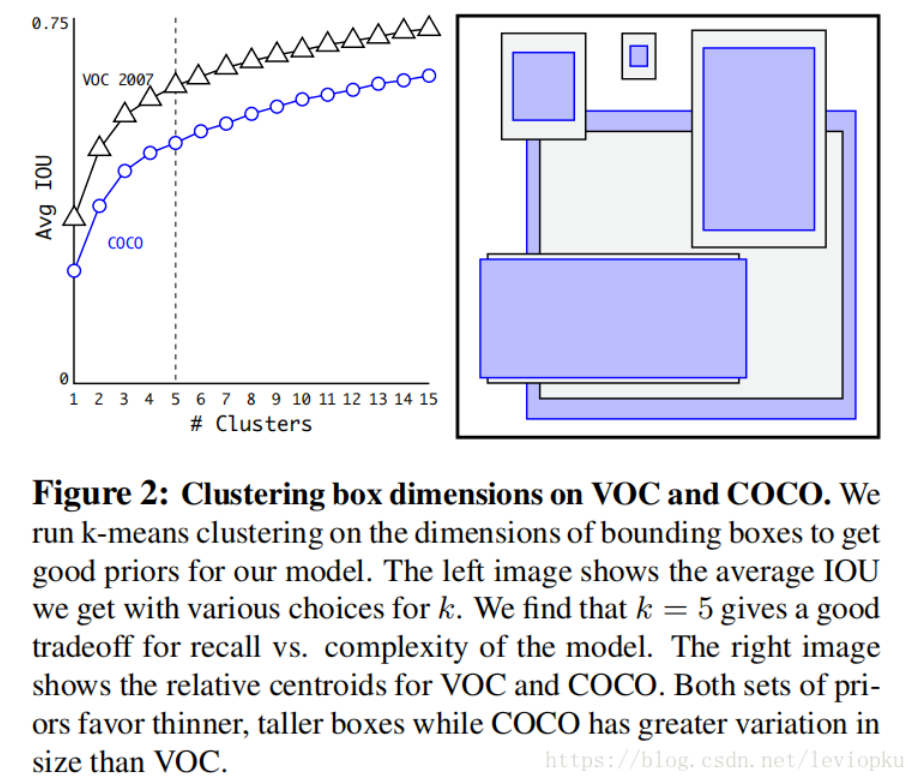

**Direct location prediction**: 当在YOLO中使用anchor boxes机制的时候，遇到了第二个问题：模型不稳定。尤其时早期迭代的时候。不稳定的因素主要来自于为box预测(x,y)位置的时候。

在RPN中，网络预测了值tx和ty以及(x, y)坐标，计算式如下：
$$
x = (t_x\times w_a) - x_a, 
y = (t_y\times h_a) - y_a
$$
例如，预测出tx = 1意味着把框整体向右移动了一个框的距离。 这个公式没有加以限制条件，所以任何anchor box都可以偏移到图像任意的位置上。随机初始化模型会需要很长一段时间才能稳定产生可靠的offsets(偏移量)。 
我们并没有“预测偏移量”，而是遵循了YOLO的方法：直接预测对于网格单元的相对位置。

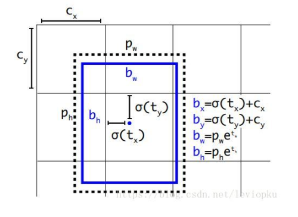

直接预测(x, y)，就像yolo_v1的做法，不过v2是预测一个相对位置，相对单元格的左上角的坐标(如上图所示)。当(x, y)被直接预测出来，那整个bounding box还差w和h需要确定。yolo_v2的做法是既有保守又有激进，x和y直接暴力预测，而w和h通过bounding box prior的调整来确定。yolo为每个bounding box预测出5个坐标(tx,ty,tw,th,to) 

 


### yolo_v3

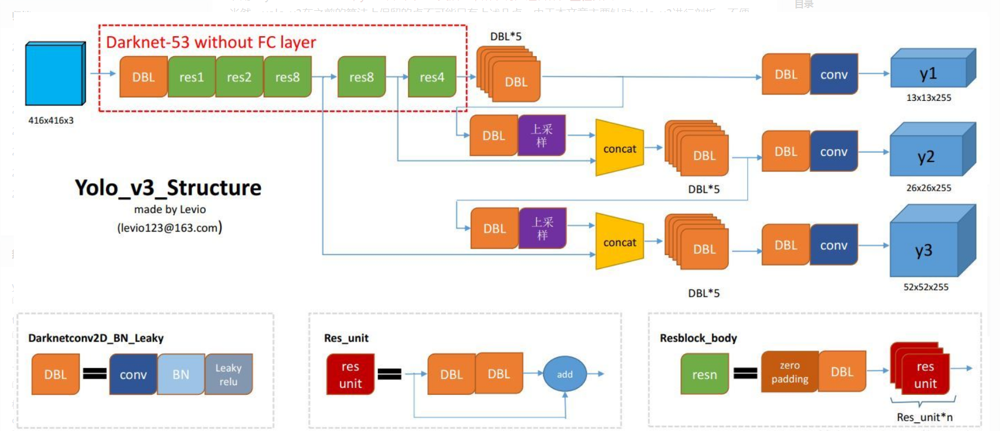

上图表示了yolo_v3整个yolo_body的结构，没有包括把输出解析整理成咱要的[box, class, score]。

**DBL**: 如图1左下角所示，也就是代码中的Darknetconv2d_BN_Leaky，是yolo_v3的基本组件。就是卷积+BN+Leaky relu。对于v3来说，BN和leaky relu已经是和卷积层不可分离的部分了(最后一层卷积除外)，共同构成了最小组件。

**resn**：n代表数字，有res1，res2, … ,res8等等，表示这个res_block里含有多少个res_unit。这是yolo_v3的大组件，yolo_v3开始借鉴了ResNet的残差结构，使用这种结构可以让网络结构更深(从v2的darknet-19上升到v3的darknet-53，前者没有残差结构)。对于res_block的解释，可以在图1的右下角直观看到，其基本组件也是DBL。

**concat**：张量拼接。将darknet中间层和后面的某一层的上采样进行拼接。拼接的操作和残差层add的操作是不一样的，拼接会扩充张量的维度，而add只是直接相加不会导致张量维度的改变。


#### 1、backbone

整个v3结构里面，是没有池化层和全连接层的。前向传播过程中，张量的尺寸变换是通过改变卷积核的步长来实现的，比如stride=(2, 2)，这就等于将图像边长缩小了一半。在yolo_v2中，要经历5次缩小，会将特征图缩小到原输入尺寸的1/32。输入为416x416，则输出为13x13。

yolo_v3也和v2一样，backbone都会将输出特征图缩小到输入的1/32。所以，通常都要求输入图片是32的倍数。

darknet-19是不存在残差结构的，和VGG是同类型的backbone(属于上一代CNN结构)，而darknet-53是可以和resnet-152正面刚的backbone。yolo_v3并没有那么追求速度，而是在保证实时性(fps>36)的基础上追求performance。不过你要想更快，还有一个tiny-darknet作为backbone可以替代darknet-53。


#### 2、Output

yolo v3输出了3个不同尺度的feature map，如上图所示的y1, y2, y3。这也是v3论文中提到的为数不多的改进点：predictions across scales
这个借鉴了FPN，采用多尺度来对不同size的目标进行检测，越精细的grid cell就可以检测出越精细的物体。

y1,y2和y3的深度都是255，边长的规律是13:26:52。对于COCO类别而言，有80个种类，所以每个box应该对每个种类都输出一个概率。yolo v3设定的是每个网格单元预测3个box，所以每个box需要有(x, y, w, h, confidence)五个基本参数，然后还要有80个类别的概率。所以3*(5 + 80) = 255。这个255就是这么来的。

v3用上采样的方法来实现这种多尺度的feature map，可以结合图1和图2右边来看，图1中concat连接的两个张量是具有一样尺度的(两处拼接分别是26x26尺度拼接和52x52尺度拼接，通过(2, 2)上采样来保证concat拼接的张量尺度相同)。作者并没有像SSD那样直接采用backbone中间层的处理结果作为feature map的输出，而是和后面网络层的上采样结果进行一个拼接之后的处理结果作为feature map。为什么这么做呢？ 我感觉是有点玄学在里面，一方面避免和其他算法做法重合，另一方面这也许是试验之后并且结果证明更好的选择，再者有可能就是因为这么做比较节省模型size的。这点的数学原理不用去管，知道作者是这么做的就对了。


#### 3、some tricks

b-box预测手段是v3论文中提到的又一个亮点。先回忆一下v2的b-box预测：想借鉴faster R-CNN RPN中的anchor机制，但不屑于手动设定anchor prior(模板框)，于是用维度聚类的方法来确定anchor box prior(模板框)，最后发现聚类之后确定的prior在k=5也能够又不错的表现，于是就选用k=5。后来呢，v2又嫌弃anchor机制线性回归的不稳定性(因为回归的offset可以使box偏移到图片的任何地方)，所以v2最后选用了自己的方法：直接预测相对位置。预测出b-box中心点相对于网格单元左上角的相对坐标。


yolo_v2直接predict出$t_x,t_y,t_w,t_h,t_o$，并不像`RPN`中anchor机制那样去遍历每一个pixel。可以从上面的公式看出，b-box的位置大小和confidence都可以通过$t_x,t_y,t_w,t_h,t_o$计算得来，v2相当直接predict出了b-box的位置大小和confidence。box宽和高的预测是受prior影响的，对于v2而言，b-box prior数为5，在论文中并没有说明抛弃anchor机制之后是否抛弃了聚类得到的prior，如果prior数继续为5，那么v2需要对不同prior预测出tw和th。

对于v3而言，在prior这里的处理有明确解释：选用的b-box priors 的k=9，对于tiny-yolo的话，k=6。priors都是在数据集上聚类得来的，有确定的数值，如下:

> 10,13,  16,30,  33,23,  30,61,  62,45,  59,119,  116,90,  156,198,  373,326

每个anchor prior(名字叫anchor prior，但并不是用anchor机制)就是两个数字组成的，一个代表高度另一个代表宽度。

v3对b-box进行预测的时候，采用了`logistic regression`。v3每次对b-box进行predict时，输出和v2一样都是$t_x,t_y,t_w,t_h,t_o$，然后通过公式计算出绝对的(x, y, w, h, c)。logistic回归用于对anchor包围的部分进行一个目标性评分(objectness score)，即这块位置是目标的可能性有多大。这一步是在predict之前进行的，可以去掉不必要anchor，可以减少计算量。

如果模板框没有超过我们设定的阈值，我们还是不会对它进行predict。
不同于faster R-CNN的是，yolo_v3只会对1个prior进行操作，也就是那个最佳prior。而logistic回归就是用来从9个anchor priors中找到objectness score(目标存在可能性得分)最高的那一个。logistic回归就是用曲线对prior相对于objectness score映射关系的线性建模。


#### 4、loss

```python
xy_loss = object_mask * box_loss_scale * K.binary_crossentropy(raw_true_xy, raw_pred[..., 0:2],
                                                                       from_logits=True)
wh_loss = object_mask * box_loss_scale * 0.5 * K.square(raw_true_wh - raw_pred[..., 2:4])
confidence_loss = object_mask * K.binary_crossentropy(object_mask, raw_pred[..., 4:5], from_logits=True) + \
                          (1 - object_mask) * K.binary_crossentropy(object_mask, raw_pred[..., 4:5],
                                                                    from_logits=True) * ignore_mask
class_loss = object_mask * K.binary_crossentropy(true_class_probs, raw_pred[..., 5:], from_logits=True)

xy_loss = K.sum(xy_loss) / mf
wh_loss = K.sum(wh_loss) / mf
confidence_loss = K.sum(confidence_loss) / mf
class_loss = K.sum(class_loss) / mf
loss += xy_loss + wh_loss + confidence_loss + class_loss # 四个loss相加
```


### yolo_v3 实现

https://zhuanlan.zhihu.com/p/36899263


#### 配置文件

官方代码使用配置文件构建网络。 *cfg*文件逐块描述网络的布局。 如果您有caffe的经验，配置文件等同于用于描述网络的.protxt文件。

在YOLO中有5种类型的层：

**Convolutional**

```ini
[convolutional]
batch_normalize=1  
filters=64  
size=3  
stride=1  
pad=1  
activation=leaky
```


**Shortcut**

```ini
[shortcut]
from=-3  
activation=linear  
```

*shortcut*层是跳过连接（skip connection），类似于ResNet中使用的连接。 *from*参数为*-3*，表示*shortcut*层的输出是通过将*shortcut*层的前一层和前面的第三层的特征图相加得到的。


**upsample**

```ini
[upsample]
stride=2
```

对前一层的特征图应用双线性上采样，采样因子为stride。


**Route**

```ini
[route]
layers = -4

[route]
layers = -1, 61
```

*route*层具有一个`layers`属性，它可以具有一个或两个值

当*layers*只有一个值时，它会输出由该值索引的层的特征图。在我们的示例中，它是-4，因此该层将输出位于*Route*层前面的第4层的特征图。

当层有两个值时，它会返回由其值所索引的层的特征图的连接。在我们的例子中，它是-1,61，该层输出来自前一层（-1）和第61层的特征图，它们沿着深度维度进行连接。


**YOLO**

```ini
[yolo]
mask = 0,1,2
anchors = 10,13,  16,30,  33,23,  30,61,  62,45,  59,119,  116,90,  156,198,  373,326
classes=80
num=9
jitter=.3
ignore_thresh = .5
truth_thresh = 1
random=1
```

YOLO层对应于第1部分中描述的检测层。*anchors* 描述了9个锚，但仅使用由*mask*标记的属性索引的锚。这里，*mask* 的值是0,1,2，这意味着使用第一，第二和第三个锚。这是有道理的，因为检测层的每个单元预测3个框。总共有三个检测层，共计9个锚。


**Net**

```ini
[net]
# Testing
batch=1
subdivisions=1
# Training
# batch=64
# subdivisions=16
width= 320
height = 320
channels=3
momentum=0.9
decay=0.0005
angle=0
saturation = 1.5
exposure = 1.5
hue=.1
```

cfg中有一种称为*net* 的块，但我不会将其称为层，因为它仅描述有关网络输入和训练参数的信息。它不用于YOLO的前向传播。然而，它确实为我们提供了像网络输入大小这样的信息，我们用它来调整前向传播中的锚。


#### 解析配置

我们定义一个名为`parse_cfg` 的函数，它将配置文件的路径作为输入。

它的作用是解析cfg，并将每个块存储为字典。块的属性及其值在字典中作为键值对存储。在cfg解析过程中，将这些字典——在代码中称为*block*的变量，添加到名为*blocks*的列表变量中。函数将返回这个*blocks（原文是block，但实际上它返回的是blocks列表）*。

```python
def parse_cfg(cfgfile):
    """
    Takes a configuration file
    
    Returns a list of blocks. Each blocks describes a block in the neural
    network to be built. Block is represented as a dictionary in the list
    
    """
    # 我们首先将cfg文件的内容保存在字符串列表中。以下代码在此列表上执行一些预处理。
    file = open(cfgfile, 'r')
    lines = file.read().split('\n')                        # store the lines in a list
    lines = [x for x in lines if len(x) > 0]               # get read of the empty lines 
    lines = [x for x in lines if x[0] != '#']              # get rid of comments
    lines = [x.rstrip().lstrip() for x in lines]           # get rid of fringe whitespaces
    
    # 然后，我们遍历列表以获取blocks。
    block = {}
    blocks = []
    
    for line in lines:
        if line[0] == "[":               # This marks the start of a new block
            if len(block) != 0:          # If block is not empty, implies it is storing values of previous block.
                blocks.append(block)     # add it the blocks list
                block = {}               # re-init the block
            block["type"] = line[1:-1].rstrip()     
        else:
            key,value = line.split("=") 
            block[key.rstrip()] = value.lstrip()
    blocks.append(block)
    
    return blocks
```

```python
{'type': 'net', 'batch': '1', 'subdivisions': '1', 'width': '416', 'height': '416', 'channels': '3', 'momentum': '0.9', 'decay': '0.0005', 'angle': '0', 'saturation': '1.5', 'exposure': '1.5', 'hue': '.1', 'learning_rate': '0.001', 'burn_in': '1000', 'max_batches': '500200', 'policy': 'steps', 'steps': '400000,450000', 'scales': '.1,.1'}
```


#### 创建构建块

现在我们将使用上述parse_cfg返回的列表为配置文件中存在的块构造PyTorch模块。

我们在列表中有5种类型的层（如前文所述）。 PyTorch为*convolutional*和*upsampling*类型提供了预建的层。我们将通过扩展nn.Module类来为其余层编写我们自己的模块。

create_modules函数使用parse_cfg函数返回的*blocks* 列表作为输入。在迭代*blocks* 列表之前，我们定义一个变量*net_info*来存储网络的信息。

```python
def create_modules(blocks):
    net_info = blocks[0]     #Captures the information about the input and pre-processing    
    module_list = nn.ModuleList()
    prev_filters = 3
    output_filters = []
```

我们的函数将返回一个`nn.ModuleList`。这个类相当于一个包含nn.Module对象的普通列表。但是，当我们添加nn.ModuleList作为nn.Module对象的成员（即，当我们向网络添加模块时），nn.ModuleList中的nn.Module对象（模块）的所有参数都作为参数添加nn.Module对象（也就是我们的网络，将nn.ModuleList作为成员加入）。

当我们定义一个新的卷积层时，我们必须定义它的内核维度。虽然内核的高度和宽度由cfg文件提供，但内核的深度正好是前一层中过滤器的数量（或特征图的深度）。这意味着我们需要持续跟踪应用卷积的层的过滤器数量。我们使用变量`prev_filter`来做到这一点。我们将其初始化为3，因为图像具有对应于RGB通道的3个滤波器。

route层的特征图来自前面的层（可能连接后的）的特征图。如果route层后有一个卷积层，那么内核将应用在前面层的特征图上，那些特征图正是route层的特征图。因此，我们不仅需要跟踪前一层中的过滤器数量，还要跟踪前面所有层的。迭代时，我们将每个块的输出过滤器数添加到列表`output_filters`。

现在，我们的想法是迭代块列表，并为每个块创建一个PyTorch模块

```python
for index, x in enumerate(blocks[1:]):
        module = nn.Sequential()

        #check the type of block
        #create a new module for the block
        #append to module_list
```

`nn.Sequential`类用于顺序执行一些nn.Module对象。 你查看一下cfg，你会意识到一个块可能包含多个层。 例如，除了卷积层以外，convolutional型块还具有批量标准化层以及Leaky ReLU激活层。 我们使用nn.Sequential和add_module函数将这些层串在一起。 例如，下面就是我们创建卷积和上采样层的代码。

```python
if (x["type"] == "convolutional"):
            #Get the info about the layer
            activation = x["activation"]
            try:
                batch_normalize = int(x["batch_normalize"])
                bias = False
            except:
                batch_normalize = 0
                bias = True

            filters= int(x["filters"])
            padding = int(x["pad"])
            kernel_size = int(x["size"])
            stride = int(x["stride"])

            if padding:
                pad = (kernel_size - 1) // 2
            else:
                pad = 0

            #Add the convolutional layer
            conv = nn.Conv2d(prev_filters, filters, kernel_size, stride, pad, bias = bias)
            module.add_module("conv_{0}".format(index), conv)

            #Add the Batch Norm Layer
            if batch_normalize:
                bn = nn.BatchNorm2d(filters)
                module.add_module("batch_norm_{0}".format(index), bn)

            #Check the activation. 
            #It is either Linear or a Leaky ReLU for YOLO
            if activation == "leaky":
                activn = nn.LeakyReLU(0.1, inplace = True)
                module.add_module("leaky_{0}".format(index), activn)

        #If it's an upsampling layer
        #We use Bilinear2dUpsampling
        elif (x["type"] == "upsample"):
            stride = int(x["stride"])
            upsample = nn.Upsample(scale_factor = 2, mode = "bilinear")
            module.add_module("upsample_{}".format(index), upsample)
```

接下来，我们编写创建*Route*层和*Shortcut*层的代码。

```python
#If it is a route layer
        elif (x["type"] == "route"):
            x["layers"] = x["layers"].split(',')
            #Start  of a route
            start = int(x["layers"][0])
            #end, if there exists one.
            try:
                end = int(x["layers"][1])
            except:
                end = 0
            #Positive anotation
            if start > 0: 
                start = start - index
            if end > 0:
                end = end - index
            route = EmptyLayer()
            module.add_module("route_{0}".format(index), route)
            if end < 0:
                filters = output_filters[index + start] + output_filters[index + end]
            else:
                filters= output_filters[index + start]

        #shortcut corresponds to skip connection
        elif x["type"] == "shortcut":
            shortcut = EmptyLayer()
            module.add_module("shortcut_{}".format(index), shortcut)
```

有必要对*Route*层的代码做一些解释。首先，我们提取层的属性的值，将其转换为整数并将其存储在列表中。然后我们有一个名为`EmptyLayer`的新层，顾名思义就是一个空层。

```python
class EmptyLayer(nn.Module):
    def __init__(self):
        super(EmptyLayer, self).__init__()
```

现在，空层可能看起来很奇怪，因为它什么都不做。Route层，就像任何其他层一样执行操作（使用前面的层/连接）。在PyTorch中，当我们定义一个新层时，它继承nn.Module，在nn.Module对象的forward函数写入层执行的操作。

为了设计*Route*块的层，我们必须构建一个*nn.Module*对象，它作为*Layers*的成员，使用*Layers*的属性值进行初始化。然后，我们可以在forward函数中编写代码来连接/获取特征图。最后，我们在网络的forward函数中执行该层的操作。

但是，如果连接代码相当简短（在特征图上调用torch.cat），那么设计一个如上所述的层将导致不必要的抽象，这只会增加代码。我们可以做一个空层来代替提出的*Route*层，然后直接在darknet的nn.Module对象的forward函数中执行连接。 

位于Route层之后的卷积层将其内核应用于（可能连接的）前面层的特征图。以下代码更新*filters*变量以保存Route层输出的过滤器数量。

```python
if end < 0:
    #If we are concatenating maps
    filters = output_filters[index + start] + output_filters[index + end]
else:
    filters= output_filters[index + start]
```

*shortcut*层也使用空层，因为它执行非常简单的操作（相加）。没有必要更新*filters*变量，因为它仅仅将前一个层的特征图相加到后面的层的特征图上而已。

最后，我们编写用于创建YOLO层的代码。

```python
#Yolo is the detection layer
        elif x["type"] == "yolo":
            mask = x["mask"].split(",")
            mask = [int(x) for x in mask]

            anchors = x["anchors"].split(",")
            anchors = [int(a) for a in anchors]
            anchors = [(anchors[i], anchors[i+1]) for i in range(0, len(anchors),2)]
            anchors = [anchors[i] for i in mask]

            detection = DetectionLayer(anchors)
            module.add_module("Detection_{}".format(index), detection)
```

我们定义了一个新的层DetectionLayer，它包含用于检测边界框的锚。

```python
class DetectionLayer(nn.Module):
    def __init__(self, anchors):
        super(DetectionLayer, self).__init__()
        self.anchors = anchors
```

在循环结束时，我们会存储一些记录。

```python
 module_list.append(module)
 prev_filters = filters
 output_filters.append(filters)
```

这就结束了循环的主体。在函数create_modules的结尾，我们返回一个包含net_info和module_list的元组。

```python
return (net_info, module_list)
```


#### 定义网络

正如我前面指出的那样，我们使用Pytorch 的*nn.Module*类构建自定义体系结构。让我们为检测器定义一个网络。在*darknet.py*文件中，我们添加以下类。

```python
class Darknet(nn.Module):
    def __init__(self, cfgfile):
        super(Darknet, self).__init__()
        self.blocks = parse_cfg(cfgfile)
        self.net_info, self.module_list = create_modules(self.blocks)
```


####  前向传播

网络的前向传播通过重写*nn.Module*类的*forward*方法来实现。

*forward*有两个目的。首先，计算输出，其次，为了处理更方便，对输出的检测特征图进行变换（例如，因为具有不同尺寸的特征图不能直接链接在一起，对它们进行变换使得跨多个比例的检测特征图可以链起来）。

```python
def forward(self, x, CUDA):
    modules = self.blocks[1:]
    outputs = {}   #We cache the outputs for the route layer
```

*forward* 需要三个参数，self，输入x，和CUDA——如果是True，则会使用GPU来加速正向传递

在这里，我们迭代`self.blocks [1：]`而不是*self.blocks*，因为*self.blocks*的第一个元素是一个*net*块，它不是前向传播的一部分。

由于*route*和*shortcut*层需要前面的层的输出图，因此我们将每个层的输出特征图缓存在字典`outputs`中。键是层的索引，值是特征图

与*create_modules*函数一样，我们现在遍历包含网络模块的*module_list*。这里要注意的是，模块已按照它们在配置文件中的顺序添加。这意味着，我们可以简单地让输入通过每个模块获得输出。

```python
write = 0     #This is explained a bit later
for i, module in enumerate(modules):        
    module_type = (module["type"])
```

如果模块是`convolutional`或`upsampling`，则这是它的前向传播的运作方式。

```python
if module_type == "convolutional" or module_type == "upsample":
            x = self.module_list[i](x)
```

如果您查看`route`层的代码，你会发现我们考虑了两种情况。对于我们需要连接两个特征图的情况，我们使用torch.cat函数并将第二个参数设置为1.这是因为我们想要沿着深度连接特征图。 （在PyTorch中，卷积层的输入和输出格式为B×C×H×W。深度对应于通道维度）。

```python
 elif module_type == "route":
            layers = module["layers"]
            layers = [int(a) for a in layers]

            if (layers[0]) > 0:
                layers[0] = layers[0] - i

            if len(layers) == 1:
                x = outputs[i + (layers[0])]

            else:
                if (layers[1]) > 0:
                    layers[1] = layers[1] - i

                map1 = outputs[i + layers[0]]
                map2 = outputs[i + layers[1]]

                x = torch.cat((map1, map2), 1)

        elif  module_type == "shortcut":
            from_ = int(module["from"])
            x = outputs[i-1] + outputs[i+from_]
```


YOLO层（检测层）的输出是一个卷积特征图，它包含沿特征图深度的边界框属性。单元格预测的边界框属性被相互堆叠在一起。因此，如果您必须访问（5,6）处单元格的第二个边界框，那么您将不得不通过`map [5,6，（5 + C）：2 *（5 + C）]`对它进行索引。这种形式对输出处理（例如根据目标置信度进行阈值处理，向中心坐标添加网格偏移量，应用锚等）非常不方便。

另一个问题是，由于检测发生在三个尺度上，所以预测图的尺寸将会不同。尽管三个特征图的维度不同，但要对它们执行的输出处理操作是相似的。最好在单个张量上进行这些操作，而不是三个单独的张量。为了解决这些问题，我们引入了函数`predict_transform`


####　输出变换

`predict_transform`需要5个参数：*prediction*（输出），*inp_dim*（输入图像尺寸），*anchors*，*num_classes*和一个可选的*CUDA*标志。

```python
def predict_transform(prediction, inp_dim, anchors, num_classes, CUDA = True):
```

predict_transform函数将输入的检测特征图转换成二维张量，其中张量的每一行对应于边界框属性，按以下顺序排列。

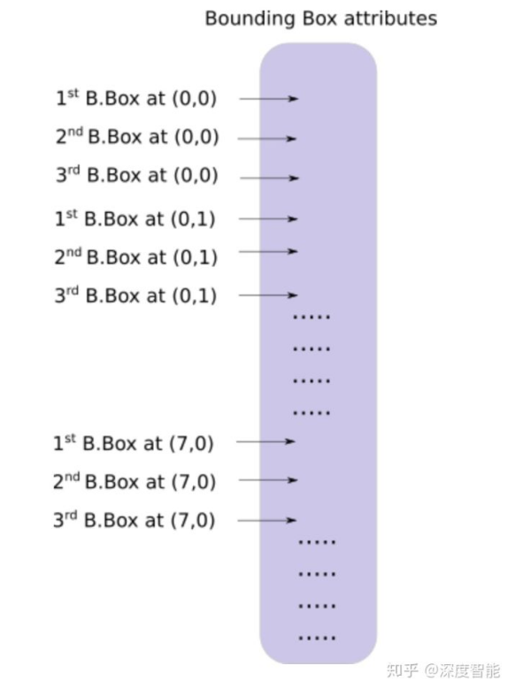

```python
	batch_size = prediction.size(0)
    stride =  inp_dim // prediction.size(2)
    grid_size = inp_dim // stride
    bbox_attrs = 5 + num_classes
    num_anchors = len(anchors)
    
    prediction = prediction.view(batch_size, bbox_attrs*num_anchors, grid_size*grid_size)
    prediction = prediction.transpose(1,2).contiguous()
    prediction = prediction.view(batch_size, grid_size*grid_size*num_anchors, bbox_attrs)
```

锚的尺寸根据*net*块的*height*和*width*属性。这些属性是输入图像的尺寸，它比检测图大（输入图像是检测图的*stride*倍）。因此，我们必须通过检测特征图的*stride*来划分锚。

```python
anchors = [(a[0]/stride, a[1]/stride) for a in anchors]
```

现在，我们需要根据我们在第1部分中讨论的函数来对输出进行变换。

对x，y坐标和目标分数进行Sigmoid变换。

```python
#Sigmoid the  centre_X, centre_Y. and object confidencce
    prediction[:,:,0] = torch.sigmoid(prediction[:,:,0])
    prediction[:,:,1] = torch.sigmoid(prediction[:,:,1])
    prediction[:,:,4] = torch.sigmoid(prediction[:,:,4])
```

将网格偏移添加到预测的中心坐标。

```python
#Add the center offsets
    grid = np.arange(grid_size)
    a,b = np.meshgrid(grid, grid)

    x_offset = torch.FloatTensor(a).view(-1,1)
    y_offset = torch.FloatTensor(b).view(-1,1)

    if CUDA:
        x_offset = x_offset.cuda()
        y_offset = y_offset.cuda()

    x_y_offset = torch.cat((x_offset, y_offset), 1).repeat(1,num_anchors).view(-1,2).unsqueeze(0)

    prediction[:,:,:2] += x_y_offset
```

将锚应用于边界框的尺寸。

```python
#log space transform height and the width
    anchors = torch.FloatTensor(anchors)

    if CUDA:
        anchors = anchors.cuda()

    anchors = anchors.repeat(grid_size*grid_size, 1).unsqueeze(0)
    prediction[:,:,2:4] = torch.exp(prediction[:,:,2:4])*anchors
```

将Sigmoid激活应用于类别分数

```python
prediction[:,:,5: 5 + num_classes] = torch.sigmoid((prediction[:,:, 5 : 5 + num_classes]))
```

我们想要在这里做的最后一件事是将检测图调整为输入图像的大小。此处的边界框属性根据特征图（例如，13 x 13）的大小而定的。如果输入图像是416 x 416，我们将这些属性乘以32或变量*stride*。

```python
prediction[:,:,:4] *= stride
```

这就结束了循环体。在函数结尾处返回预测。

```python
   return prediction
```


#### 重新审视检测层

现在我们已经对输出张量做了变换，我们可以将三个不同尺度的检测图连接成一个大张量。注意，在我们转换之前这是不可能的，因为不能连接具有不同空间维度的特征图。但是从现在起，我们的输出张量仅仅作为一个表格，它的每行由边界框组成，使得连接成为可能。

有一个障碍：我们无法初始化一个空张量，然后将非空（不同形状）张量连接到它。因此，我们延迟收集器（collector）（即保存着检测的张量）的初始化，直到我们获得第一个检测图，然后在我们获得后续的检测时把它级联到收集器。

注意*forward* 函数中循环之前的行：*write = 0*。写入标志用于指示我们是否第一次检测。如果*write*为0，则表示收集器尚未初始化。如果它是1，这意味着收集器已经初始化，我们可以将我们的检测图级联到它。

现在，我们已经使用*predict_transform*函数，我们编写了用于在*forward*函数中处理检测特征图的代码。

```python
elif module_type == 'yolo':        

            anchors = self.module_list[i][0].anchors
            #Get the input dimensions
            inp_dim = int (self.net_info["height"])

            #Get the number of classes
            num_classes = int (module["classes"])

            #Transform 
            x = x.data
            x = predict_transform(x, inp_dim, anchors, num_classes, CUDA)
            if not write:              #if no collector has been intialised. 
                detections = x
                write = 1

            else:       
                detections = torch.cat((detections, x), 1)

        outputs[i] = x
```

```python
return detections
```


#### 测试前向传播

现在，在你的darknet.py文件的顶部定义这个函数，如下所示：

```python
def get_test_input():
    img = cv2.imread("dog-cycle-car.png")
    img = cv2.resize(img, (416,416))          #Resize to the input dimension
    img_ =  img[:,:,::-1].transpose((2,0,1))  # BGR -> RGB | H X W C -> C X H X W 
    img_ = img_[np.newaxis,:,:,:]/255.0       #Add a channel at 0 (for batch) | Normalise
    img_ = torch.from_numpy(img_).float()     #Convert to float
    img_ = Variable(img_)                     # Convert to Variable
    return img_
```

然后，我们输入下面的代码：

```python
model = Darknet("cfg/yolov3.cfg")
inp = get_test_input()
pred = model(inp, torch.cuda.is_available())
print (pred)
```

```python
(  0  ,.,.) = 
   16.0962   17.0541   91.5104  ...     0.4336    0.4692    0.5279
   15.1363   15.2568  166.0840  ...     0.5561    0.5414    0.5318
   14.4763   18.5405  409.4371  ...     0.5908    0.5353    0.4979
               ⋱                ...             
  411.2625  412.0660    9.0127  ...     0.5054    0.4662    0.5043
  412.1762  412.4936   16.0449  ...     0.4815    0.4979    0.4582
  412.1629  411.4338   34.9027  ...     0.4306    0.5462    0.4138
[torch.FloatTensor of size 1x10647x85]
```

该张量的形状为1 x 10647 x 85.第一个维度是批量大小，因为我们使用了单个图像，所以它的大小仅为1。对于批次中的每个图像，我们都有一个10647 x 85的表格。该表格中的每一行代表一个边界框。 （4个bbox属性，1个目标分数和80个类别分数）

此时，我们的网络具有随机权重，并不会产生正确的输出。我们需要在我们的网络中加载一个权重文件。我们将使用官方的权重文件。


#### 了解权重文件

官方权重文件是二进制文件，它包含以序列方式存储的权重

读取权重必须非常小心。权重只是以浮动形式存储，没有任何指引让我们知道它们属于哪一层。如果你搞砸了，你有可能将批量标准化层的权重加载到卷积层的权重中。因为，你只阅读浮点数，所以没有办法区分哪个权重属于哪一层。因此，我们必须了解权重是如何存储的。

首先，权重只属于两种类型的层，即批量标准化层或卷积层。

这些层的权重与其在配置文件中的显示顺序完全相同。所以，如果covolutional块后面跟着一个shortcut块，而shortcut块的后面是另一个convolutional块，那么前面的convolutional块的权重在文件的前面，后面的convolutional块的权重紧跟其后。

当批量标准化层出现在convolutional块中时，不存在偏置项。但是，当没有批量标准化层时，必须从文件中读取偏置“权重”。

下图总结了权重文件是如何存储权重的。

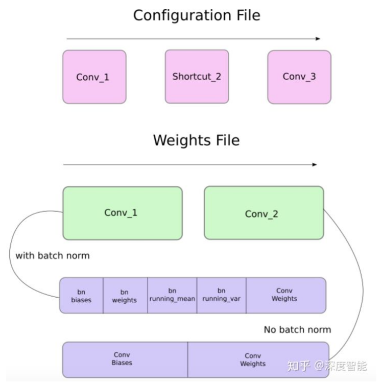


#### 加载权重

让我们写一个函数加载权重。它将是*Darknet*类的成员函数。除了*self*之外，它的另一个参数是权重文件的路径。

```python
def load_weights(self, weightfile):
```

权重文件的前160个字节存储5个*int32*值，它们构成文件的头部。

```python
#Open the weights file
    fp = open(weightfile, "rb")

    #The first 5 values are header information 
    # 1. Major version number
    # 2. Minor Version Number
    # 3. Subversion number 
    # 4,5. Images seen by the network (during training)
    header = np.fromfile(fp, dtype = np.int32, count = 5)
    self.header = torch.from_numpy(header)
    self.seen = self.header[3]
```

剩下的字节按上文中提到的顺序表示权重。权重存储为*float32*或32位浮点数。让我们把权重加载到一个*np.ndarray*中。

```python
 weights = np.fromfile(fp, dtype = np.float32)
```

现在，我们遍历权重文件，并将权重加载到我们网络的模块中。

```python
	ptr = 0
    for i in range(len(self.module_list)):
        module_type = self.blocks[i + 1]["type"]

        #If module_type is convolutional load weights
        #Otherwise ignore.
```

在循环的内部，我们首先检查convolutional块是有存在值为True的*batch_normalize*。基于此，我们加载权重。

```python
if module_type == "convolutional":
            model = self.module_list[i]
            try:
                batch_normalize = int(self.blocks[i+1]["batch_normalize"])
            except:
                batch_normalize = 0

            conv = model[0]
```

我们有一个名为*ptr*的变量来跟踪我们在权重数组中的位置。现在，如果*batch_normalize*为True，我们按如下方式加载权重。

```python
    if (batch_normalize):
            bn = model[1]

            #Get the number of weights of Batch Norm Layer
            num_bn_biases = bn.bias.numel()

            #Load the weights
            bn_biases = torch.from_numpy(weights[ptr:ptr + num_bn_biases])
            ptr += num_bn_biases

            bn_weights = torch.from_numpy(weights[ptr: ptr + num_bn_biases])
            ptr  += num_bn_biases

            bn_running_mean = torch.from_numpy(weights[ptr: ptr + num_bn_biases])
            ptr  += num_bn_biases

            bn_running_var = torch.from_numpy(weights[ptr: ptr + num_bn_biases])
            ptr  += num_bn_biases

            #Cast the loaded weights into dims of model weights. 
            bn_biases = bn_biases.view_as(bn.bias.data)
            bn_weights = bn_weights.view_as(bn.weight.data)
            bn_running_mean = bn_running_mean.view_as(bn.running_mean)
            bn_running_var = bn_running_var.view_as(bn.running_var)

            #Copy the data to model
            bn.bias.data.copy_(bn_biases)
            bn.weight.data.copy_(bn_weights)
            bn.running_mean.copy_(bn_running_mean)
            bn.running_var.copy_(bn_running_var)
```

如果batch_norm不为True，只需加载卷积层的偏置即可。

```python
       else:
            #Number of biases
            num_biases = conv.bias.numel()

            #Load the weights
            conv_biases = torch.from_numpy(weights[ptr: ptr + num_biases])
            ptr = ptr + num_biases

            #reshape the loaded weights according to the dims of the model weights
            conv_biases = conv_biases.view_as(conv.bias.data)

            #Finally copy the data
            conv.bias.data.copy_(conv_biases)
```

最后，我们加载卷积层的权重。

```python
#Let us load the weights for the Convolutional layers
num_weights = conv.weight.numel()

#Do the same as above for weights
conv_weights = torch.from_numpy(weights[ptr:ptr+num_weights])
ptr = ptr + num_weights

conv_weights = conv_weights.view_as(conv.weight.data)
conv.weight.data.copy_(conv_weights)
```

我们完成了这个函数，你现在可以通过调用darknet对象上的load_weights函数来加载Darknet对象中的权重。

```python
model = Darknet("cfg/yolov3.cfg")
model.load_weights("yolov3.weights")
```


#### 目标置信度阈值

在前面的部分中，我们已经建立了一个模型，对于给定的输入图像，输出多个目标检测结果。准确地说，我们的输出是B×10647×85形状的张量。B是一个批量中图像的数量，10647是每个图像预测的边界框的数量，85是边界框属性的数量。

但是，如第1部分所述，我们必须将输出结果根据目标分数阈值和非最大值抑制来获得*true*检测结果（我将在本文其余部分中使用该名称）。为此，我们将在*util.py*文件中创建一个名为`write_results`的函数。

```python
def write_results(prediction, confidence, num_classes, nms_conf = 0.4):
```

这些函数将输入预测，置信度（目标分数阈值），num_classes（在我们的例子中为80）和nms_conf（NMS IoU阈值）作为输入。

我们的预测张量包含B x 10647个边界框的信息。对于每个具有低于阈值的目标分数的边界框，我们将它的每个属性（边界框的整个行）的值设置为零。

```python
    conf_mask = (prediction[:,:,4] > confidence).float().unsqueeze(2)
    prediction = prediction*conf_mask
```


####  非最大值抑制

注意：我假设你已经理解什么是IoU（Intersection over Union）和非最大值抑制。

我们现在具有的边界框属性由中心坐标以及边界框的高度和宽度描述。但是，使用每个框的一对角点的坐标来计算两个框的IoU更容易。因此，我们将框的（中心x，中心y，高度，宽度）属性转换为（左上角x，左上角y，右下角x，右下角y）。

```python
    box_corner = prediction.new(prediction.shape)
    box_corner[:,:,0] = (prediction[:,:,0] - prediction[:,:,2]/2)
    box_corner[:,:,1] = (prediction[:,:,1] - prediction[:,:,3]/2)
    box_corner[:,:,2] = (prediction[:,:,0] + prediction[:,:,2]/2) 
    box_corner[:,:,3] = (prediction[:,:,1] + prediction[:,:,3]/2)
    prediction[:,:,:4] = box_corner[:,:,:4]
```

每幅图像中的*true*检测结果的数量可能不同。例如，批量大小为3，图像1,2和3分别具有5个，2个和4个*true*检测结果。因此，一次只能对一张图像进行置信度阈值和NMS。这意味着，我们不能向量化所涉及的操作，并且必须在*prediction*的第一维（包含批量中的图像索引）上进行循环。

```python
    batch_size = prediction.size(0)

    write = False

    for ind in range(batch_size):
        image_pred = prediction[ind]          #image Tensor
           #confidence threshholding 
           #NMS
```

如前所述，*write*标志用于指示我们尚未初始化*output*，我们将使用张量来保存整个批量的*true*检测结果。

进入循环后，让我们进一步作出解释。注意每个边界框行有85个属性，其中80个是类别分数。此时，我们只关心具有最大值的类别分数。因此，我们从每一行中删除80个类别的分数，并添加具有最大值的类别的索引，以及该类别的类别分数。

```python
        max_conf, max_conf_score = torch.max(image_pred[:,5:5+ num_classes], 1)
        max_conf = max_conf.float().unsqueeze(1)
        max_conf_score = max_conf_score.float().unsqueeze(1)
        seq = (image_pred[:,:5], max_conf, max_conf_score)
        image_pred = torch.cat(seq, 1)
```

还记得我们已经将具有小于阈值的目标置信度的边界框行设置为零吗？现在让我们清除它们。

```python
	non_zero_ind =  (torch.nonzero(image_pred[:,4]))
	try:
    	image_pred_ = image_pred[non_zero_ind.squeeze(),:].view(-1,7)
    except:
       continue
        
        #For PyTorch 0.4 compatibility
        #Since the above code with not raise exception for no detection 
        #as scalars are supported in PyTorch 0.4
    if image_pred_.shape[0] == 0:
        continue 
```

try-except块用于处理没有检测到的情况。在这种情况下，我们使用continue来跳过该图像的循环体的其余部分。

现在，我们来看一个图像中检测到的类。

```python
        #Get the various classes detected in the image
        img_classes = unique(image_pred_[:,-1]) # -1 index holds the class index
```

由于同一个类可以有多个true检测结果，我们使用一个称为*unique*的函数来获取任何给定图像中存在的类。

```python
def unique(tensor):
    tensor_np = tensor.cpu().numpy()
    unique_np = np.unique(tensor_np)
    unique_tensor = torch.from_numpy(unique_np)
    
    tensor_res = tensor.new(unique_tensor.shape)
    tensor_res.copy_(unique_tensor)
    return tensor_res
```

然后，我们按类别进行NMS。

```python
    for cls in img_classes:
        #perform NMS
```

一旦我们进入循环，我们所做的第一件事就是提取特定类的检测结果（用变量cls表示）。

以下代码在原代码文件中有三格缩进，但由于该页面上的空间有限，因此我没有在此缩进。

```python
#get the detections with one particular class
cls_mask = image_pred_*(image_pred_[:,-1] == cls).float().unsqueeze(1)
class_mask_ind = torch.nonzero(cls_mask[:,-2]).squeeze()
image_pred_class = image_pred_[class_mask_ind].view(-1,7)

#sort the detections such that the entry with the maximum objectness
s#confidence is at the top
conf_sort_index = torch.sort(image_pred_class[:,4], descending = True )[1]
image_pred_class = image_pred_class[conf_sort_index]
idx = image_pred_class.size(0)   #Number of detections
```

现在，我们执行NMS。

```python
for i in range(idx):
    #Get the IOUs of all boxes that come after the one we are looking at 
    #in the loop
    try:
        ious = bbox_iou(image_pred_class[i].unsqueeze(0), image_pred_class[i+1:])
    except ValueError:
        break

    except IndexError:
        break

    #Zero out all the detections that have IoU > treshhold
    iou_mask = (ious < nms_conf).float().unsqueeze(1)
    image_pred_class[i+1:] *= iou_mask       

    #Remove the non-zero entries
    non_zero_ind = torch.nonzero(image_pred_class[:,4]).squeeze()
    image_pred_class = image_pred_class[non_zero_ind].view(-1,7)
```

在这里，我们使用一个函数bbox_iou，它的第一个参数是由循环中变量i索引的边界框行。

bbox_iou的第二个参数是包含多行边界框的张量。函数bbox_iou的输出是一个张量，它包含第一个参数所表示的边界框与第二个参数中的每个边界框的IoU。

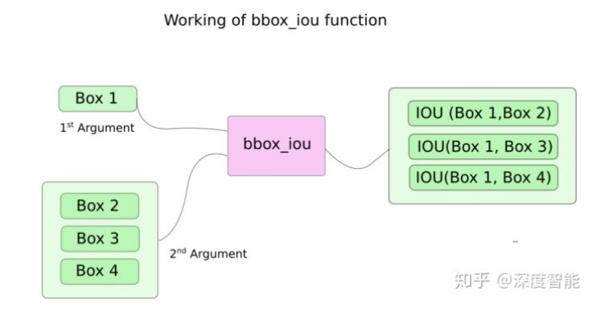

如果我们有两个相同类别的边界框的IoU大于阀值，则具有较低类别置信度的边界框被去除。我们已经把边界框按照其置信度从高到低的顺序排列好。

在循环体中，以下行给出了索引为i的框与所有索引都高于i的边界框的IoU。

```python
ious = bbox_iou(image_pred_class[i].unsqueeze(0), image_pred_class[i+1:])
```

每次迭代，任何具有索引大于i的的边界框，若其IoU大于阈值nms_thresh（具有由i索引的框），则该边界框将被去除。

```python
#Zero out all the detections that have IoU > treshhold
iou_mask = (ious < nms_conf).float().unsqueeze(1)
image_pred_class[i+1:] *= iou_mask       

#Remove the non-zero entries
non_zero_ind = torch.nonzero(image_pred_class[:,4]).squeeze()
image_pred_class = image_pred_class[non_zero_ind]  
```

另外请注意，我们已经将计算IoU的代码行放在try-catch块中。这是因为循环被设计为运行idx迭代（image_pred_class中的行数）。但是，当我们继续循环时，可能会从image_pred_class中删除多个边界框。这意味着，即使从image_pred_class中删除了一个值，我们也不能进行idx迭代。因此，我们可能会索引超出范围的值（IndexError），或者slice_pred_class [i + 1：]可能会返回一个空张量，而赋予空张量的值会触发ValueError。在那个时候，我们可以确定NMS不会删除更多的边界框，并且跳出循环。


#### 计算IOU

这是bbox_iou函数。

```python
def bbox_iou(box1, box2):
    """
    Returns the IoU of two bounding boxes 
    
    
    """
    #Get the coordinates of bounding boxes
    b1_x1, b1_y1, b1_x2, b1_y2 = box1[:,0], box1[:,1], box1[:,2], box1[:,3]
    b2_x1, b2_y1, b2_x2, b2_y2 = box2[:,0], box2[:,1], box2[:,2], box2[:,3]
    
    #get the corrdinates of the intersection rectangle
    inter_rect_x1 =  torch.max(b1_x1, b2_x1)
    inter_rect_y1 =  torch.max(b1_y1, b2_y1)
    inter_rect_x2 =  torch.min(b1_x2, b2_x2)
    inter_rect_y2 =  torch.min(b1_y2, b2_y2)
    
    #Intersection area
    inter_area = torch.clamp(inter_rect_x2 - inter_rect_x1 + 1, min=0) * torch.clamp(inter_rect_y2 - inter_rect_y1 + 1, min=0)
 
    #Union Area
    b1_area = (b1_x2 - b1_x1 + 1)*(b1_y2 - b1_y1 + 1)
    b2_area = (b2_x2 - b2_x1 + 1)*(b2_y2 - b2_y1 + 1)
    
    iou = inter_area / (b1_area + b2_area - inter_area)
    
    return iou
```


#### 写入预测结果

函数*write_results*输出形状为D x 8的张量。这里D是所有图像的*true*检测，每个检测由一行表示。每个检测有8个属性，即检测的图像在所属批次中的索引，4个角坐标，目标分数，最大置信度类别的分数以及该类别的索引。

和以前一样，除非我们有一个检测分配给它，否则我们不会初始化输出张量。一旦它被初始化，我们把后续的检测与它连接。我们使用*write*标志来指示张量是否已经初始化。在遍历类的循环结束时，我们将检测结果添加到张量*output*中。

```python
            batch_ind = image_pred_class.new(image_pred_class.size(0), 1).fill_(ind)      
            #Repeat the batch_id for as many detections of the class cls in the image
            seq = batch_ind, image_pred_class

            if not write:
                output = torch.cat(seq,1)
                write = True
            else:
                out = torch.cat(seq,1)
                output = torch.cat((output,out))
```

在函数结束时，我们检查输出是否已经被初始化。如果它没有意味着在该批次的任何图像都没有检测到任何目标。在这种情况下，我们返回0。

```python
    try:
        return output
    except:
        return 0
```

这部分到此结束。在这篇文章的最后，我们终于有了一个预测张量，它将每个预测列为行。现在唯一剩下的就是创建一个输入流程，从磁盘读取图像，计算预测结果，在图像上绘制边界框，然后显示/写入这些图像。这是我们将在下一部分要做的。


=======
>>>>>>> b6b15513843bdc29bd1809ac3eb9babe5db83710


# 文本检测和识别

一般来说，从场景图片中进行文字识别，需要包括2个步骤：

- **文字检测**：解决的问题是哪里有文字，文字的范围有多少
- **文字识别**：对定位好的文字区域进行识别，主要解决的问题是每个文字是什么，将图像中的文字区域进转化为字符信息。


基于RNN**文字识别**算法主要有两个框架：

1. **CNN+RNN+CTC(CRNN+CTC)**
2. **CNN+Seq2Seq+Attention**


## 数据集

https://www.cnblogs.com/lillylin/p/6893500.html


## CRNN

***

https://arxiv.org/pdf/1507.05717.pdf

全称**Convolutional Recurrent Neural Network，**主要用于端到端地对**不定长**的文本序列进行识别，不用先对单个文字进行切割，而是将文本识别转化为时序依赖的序列学习问题，就是基于图像的序列识别。

整个CRNN网络结构包含三部分，从下到上依次为：

1. CNN（卷积层），使用深度CNN，对输入图像提取特征，得到**特征图**；
2. RNN（循环层），使用双向RNN（BLSTM）对**特征序列**进行预测，对序列中的每个特征向量进行学习，并输出预测标签（真实值）分布；
3. CTC loss（转录层），使用 CTC 损失，把从循环层获取的一系列标签分布转换成最终的标签序列。


**1、CNN**


这里有一个很精彩的改动，一共有四个最大池化层，但是最后两个池化层的窗口尺寸由 2x2 改为 1x2，也就是图片的高度减半了四次（除以 ![[公式]](https://www.zhihu.com/equation?tex=2%5E4) ），而宽度则只减半了两次（除以 ![[公式]](https://www.zhihu.com/equation?tex=2%5E2) ），这是因为文本图像多数都是高较小而宽较长，所以其feature map也是这种高小宽长的矩形形状，如果使用1×2的池化窗口可以尽量保证不丢失在宽度方向的信息，更适合英文字母识别（比如区分i和l）。

**输入图像**高度为32，这是固定的，图片通过 CNN 后，高度就变为1，这点很重要；假设输入图像大小为 ![[公式]](https://www.zhihu.com/equation?tex=%2832%2C+100%2C3%29)，CNN将大小为 ![[公式]](https://www.zhihu.com/equation?tex=%2832%2C+100%2C3%29) 的图像转换为 ![[公式]](https://www.zhihu.com/equation?tex=%281%2C25%2C512%29) 大小的卷积特征图。

可以做如下处理：

- 首先会将图像在固定长宽比的情况下缩放到 ![[公式]](https://www.zhihu.com/equation?tex=32%5Ctimes+W%5Ctimes3) 大小（ ![[公式]](https://www.zhihu.com/equation?tex=W) 代表任意宽度）
- 然后经过CNN后变为 ![[公式]](https://www.zhihu.com/equation?tex=1%5Ctimes+%28W%2F4%29%5Ctimes512)
- 针对LSTM设置 ![[公式]](https://www.zhihu.com/equation?tex=T%3D%28W%2F4%29) ，即可将特征输入LSTM。

所以在处理输入图像的时候，建议在保持长宽比的情况下将高缩放到 ![[公式]](https://www.zhihu.com/equation?tex=32)，这样能够尽量不破坏图像中的文本细节（当然也可以将输入图像缩放到固定宽度，但是这样由于破坏文本的形状，肯定会造成性能下降）。


**2、RNN**

由于卷积层，最大池化层和激活函数在局部区域上执行，因此它们是平移不变的。因此，特征图的每列（即一个特征向量）对应于原始图像的一个矩形区域（称为感受野），并且这些矩形区域与特征图上从左到右的相应列具有相同的顺序。特征序列中的每个向量关联一个感受野。

这些特征向量序列就作为循环层的输入，每个特征向量作为 RNN 在一个时间步（time step）的输入。


由于CNN输出的Feature map是![[公式]](https://www.zhihu.com/equation?tex=%281%2C25%2C512%29)大小，所以对于RNN最大时间长度 ![[公式]](https://www.zhihu.com/equation?tex=T%3D25) （即有25个时间输入，每个输入 ![[公式]](https://www.zhihu.com/equation?tex=x_t) 列向量有 ![[公式]](https://www.zhihu.com/equation?tex=D%3D512) ）。


因为 RNN 有梯度消失的问题，不能获取更多上下文信息，所以 CRNN 中使用的是 **LSTM**。

LSTM 是单向的，它只使用过去的信息。然而，在基于图像的序列中，两个方向的上下文是相互有用且互补的。

**将两个LSTM，一个向前和一个向后组合到一个双向LSTM中**。此外，可以堆叠多层双向LSTM，深层结构允许比浅层抽象更高层次的抽象。


**3、CTC**

在语音识别中，我们的数据集是音频文件和其对应的文本，不幸的是，音频文件和文本很难再单词的单位上对齐。除了语言识别，在OCR，机器翻译中，都存在类似的Sequence to Sequence结构，同样也需要在预处理操作时进行对齐，但是这种对齐有时候是非常困难的。如果不使用对齐而直接训练模型时，由于人的语速的不同，或者字符间距离的不同，导致模型很难收敛。

CTC是一种Loss计算方法，训练样本无需对齐。CTC特点：

- 引入blank字符，解决有些位置没有字符的问题
- 通过递推，快速计算梯度

对于Recurrent Layers，如果使用常见的Softmax cross-entropy loss，则每一列输出都需要对应一个字符元素。那么训练时候每张样本图片都需要标记出每个字符在图片中的位置，再通过CNN感受野对齐到Feature map的每一列获取该列输出对应的Label才能进行训练。

在实际情况中，标记这种对齐样本非常困难（除了标记字符，还要标记每个字符的位置），工作量非常大。另外，由于每张样本的字符数量不同，字体样式不同，字体大小不同，导致每列输出并不一定能与每个字符一一对应。

当然这种问题同样存在于语音识别领域。例如有人说话快，有人说话慢，那么如何进行语音帧对齐，是一直以来困扰语音识别的巨大难题。

所以CTC提出一种对不需要对齐的Loss计算方法，用于训练网络，被广泛应用于文本行识别和语音识别中。


**序列合并机制**

我们现在要将 RNN 输出的序列翻译成最终的识别结果，RNN进行时序分类时，不可避免地会出现很多冗余信息，比如一个字母被连续识别两次，这就需要一套去冗余机制。


比如我们要识别上面这个文本，其中 RNN 中有 5 个时间步，理想情况下 t0, t1, t2 时刻都应映射为“a”，t3, t4 时刻都应映射为“b”，然后将这些字符序列连接起来得到“aaabb”，我们再将连续重复的字符合并成一个，那么最终结果为“ab”。

这似乎是个比较好的方法，但是存在一个问题，如果是book，hello之类的词，合并连续字符后就会得到 bok 和 helo，这显然不行，所以 CTC 有一个blank机制来解决这个问题。

我们以“-”符号代表blank，**RNN 输出序列时，在文本标签中的重复的字符之间插入一个“-”**，比如输出序列为“bbooo-ookk”，则最后将被映射为“book”，即有blank字符隔开的话，连续相同字符就不进行合并。

即对字符序列先删除连续重复字符，然后从路径中删除所有“-”字符，这个称为解码过程，而编码则是由神经网络来实现。引入blank机制，我们就可以很好地解决重复字符的问题。

相同的文本标签可以有多个不同的字符对齐组合，例如，“aa-b”和“aabb”以及“-abb”都代表相同的文本(“ab”)，但是与图像的对齐方式不同。更总结地说，一个文本标签存在一条或多条的路径。


####　tf.nn.ctc_loss

```python
tf.nn.ctc_loss(
    labels,
    logits,
    label_length,
    logit_length,
    logits_time_major=True,
    unique=None,
    blank_index=None,
    name=None
)
```

**Notes:**

1、标签可以是密集的、零填充的张量，带有标签序列长度的矢量，也可以作为SparseTensor。

2、在TPU和GPU上：只支持密集的填充标签。

3、在CPU上：调用者可以使用SparseTensor或稠密的填充标签，但是使用SparseTenser调用将大大加快速度。


**Args:**

- **`labels`**: tensor of shape **[batch_size, max_label_seq_length]** or SparseTensor

- **`logits`**: tensor of shape **[frames, batch_size, num_labels]**, if logits_time_major == False, shape is [batch_size, frames, num_labels].

- **`label_length`**: tensor of shape **[batch_size]** `None if labels is SparseTensor` Length of reference label sequence in labels.
- **`logit_length`**: tensor of shape **[batch_size]** Length of input sequence in logits.
- **`logits_time_major`**: (optional) If True (default), logits is shaped [time, batch, logits]. If False, shape is [batch, time, logits]
- **`unique`**: (optional) Unique label indices as computed by ctc_unique_labels(labels). If supplied, enable a faster, memory efficient implementation on TPU.
- **`blank_index`**: (optional) Set the class index to use for the blank label. Negative values will start from num_classes, ie, -1 will reproduce the ctc_loss behavior of using **num_classes - 1** for the blank symbol. There is some memory/performance overhead to switching from the default of 0 as an additional shifted copy of the logits may be created.
- **`name`**: A name for this `Op`. Defaults to "ctc_loss_dense".


**Returns:**

- **`loss`**: tensor of shape **[batch_size]**, negative log probabilities.


