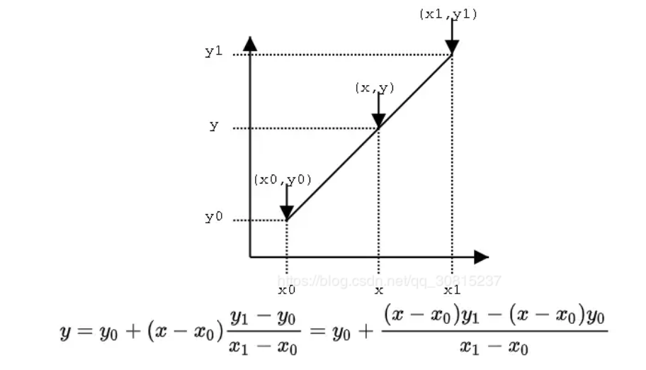
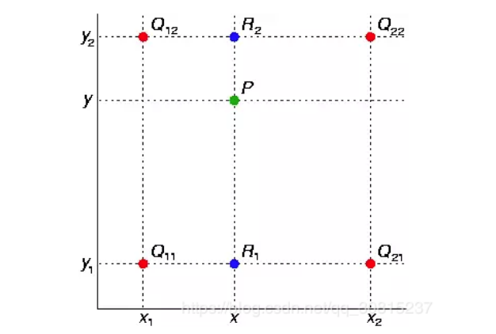
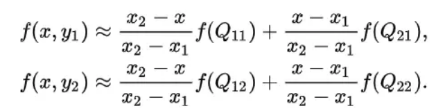
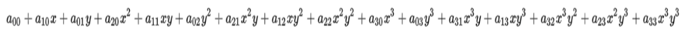
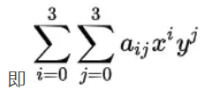
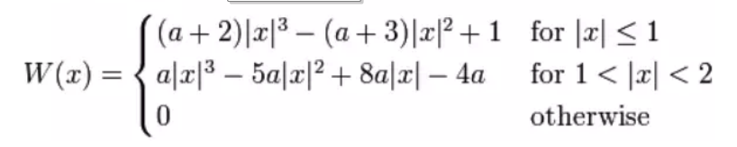
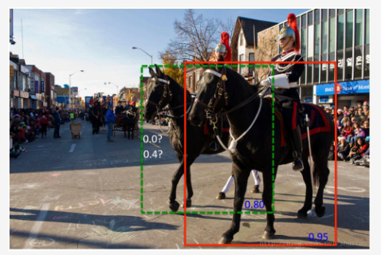

# 神经网络

## 极大似然估计


## 常用的三种插值算法

### 1、最近邻插值法（Nearest Neighbour Interpolation）

这是最简单的一种插值方法，不需要计算，在待求象素的四邻象素中，将距离待求象素最近邻的像素灰度赋给待求象素。设为待求象素坐标(x+u,y+v) ，【注：x,y为整数， u，v为大于零小于1的小数】则待求象素灰度的值 f(x+u,y+v)为 ，**选取距离插入的像素点（x+u, y+v)最近的一个像素点，用它的像素点的灰度值代替插入的像素点。**

特点：最近邻插值法虽然计算量较小，但可能会造成插值生成的图像灰度上的不连续，在灰度变化的地方**可能出现明显的锯齿状**。


### 2、双线性插值

双线性插值，顾名思义，在像素点矩阵上面，x和y两个方向的线性插值所得的结果。那么先看看

**一维**线性插值：



对于**二维**图像：



先在x方向上面线性插值，得到R2、R1像素值：



本质：根据4个近邻像素点的灰度值**做2个方向共3次线性插值**。

特点：双线性内插法的计算比最邻近点法复杂，计算量较大，但没有灰度不连续的缺点，结果基本令人满意。它具有低通滤波性质，使高频分量受损，图像轮廓可能会有一点模糊。


### 3、双三次插值

双三次插值是二维空间中最常用的插值方法。在这种方法中，函数**f 在点 (x, y) 的值可以通过矩形网格中最近的十六个采样点的加权平均**得到，在这里需要使用两个多项式插值三次函数，每个方向使用一个。

双三次插值计算公式：



这个a(i, j)便是加权系数了，所以关键是要把它求解出来。

求解加权系数的公式如下：



特点：三次多项式插值法插值精度高，具有更EI平滑的边缘，图像损失质量低，但是计算量较大。


## 视觉分类任务中样本不平衡问题

在计算机视觉（CV）任务里常常会碰到类别不平衡的问题， 例如： 
1. 图片分类任务，有的类别图片多，有的类别图片少 

2. 检测任务。现在的检测方法如SSD和RCNN系列，都使用anchor机制。 训练时正负anchor的比例很悬殊. 

3. 分割任务， 背景像素数量通常远大于前景像素。 
    从实质上来讲， 它们可以归类成分类问题中的类别不平衡问题：对图片/anchor/像素的分类。 

 再者，除了类不平衡问题， 还有`easy sample overwhelming(压倒)`问题。easy sample如果太多，可能会将有效梯度稀释掉。

这两个问题通常都会一起出现。 就是训练不给力， 且会造成模型退化。


### 常见的解决办法介绍

1. `Hard Negative Mining`， 非online的mining/boosting方法， 以RCNN（2014）为代表， 但在CV里现在应该没有人使用了（吧？）。若感兴趣，推荐去看看OHEM论文里的related work部分。
2. `Mini-batch Sampling`，以Fast R-CNN（2015）和Faster R-CNN（2016）为代表。Fast RCNN在训练分类器， Faster R-CNN在训练RPN时，都会从N = 1或2张图片上随机选取mini_batch_size/2个RoI或anchor， 使用正负样本的比例为1：1。若正样本数量不足就用负样本填充。 使用这种方法的人应该也很少了。从这个方法开始， 包括后面列出的都是online的方法。
3. `Online Hard Example Mining, OHEM`。将所有sample根据当前loss排序，选出loss最大的N个，其余的抛弃。这个方法就只处理了easy sample的问题。
4. `Oline Hard Negative Mining, OHNM`， SSD（2016）里使用的一个OHEM变种， 在Focal Loss里代号为OHEM 1：3。在计算loss时， 使用所有的positive anchor, 使用OHEM选择3倍于positive anchor的negative anchor。同时考虑了类间平衡与easy sample。
5. `Class Balanced Loss`。计算loss时，正负样本上的loss分别计算， 然后通过权重来平衡两者。暂时没找到是在哪提出来的，反正就这么被用起来了。它只考虑了类间平衡。
6. `Focal Loss（2017）`， 最近提出来的。不会像OHEM那样抛弃一部分样本， 而是和Class Balance一样考虑了每个样本， 不同的是难易样本上的loss权重是根据样本难度计算出来的。

从更广义的角度来看，这些方法都是**在计算loss时通过给样本加权重**来解决不平衡与easy example的问题。不同的是，OHEM使用了hard weight（只有0或1），而Focal Loss使用了soft weight（0到1之间）.

| Method              | 是否处理Class Inbalance | 是否处理Easy Example | 权值方式 |
| ------------------- | ----------------------- | -------------------- | -------- |
| OHEM                | No                      | Yes                  | Hard     |
| OHNM(OHEM 1:3)      | Yes                     | Yes                  | Hard     |
| Class Balanced Loss | Yes                     | No                   | Soft     |
| Focal Loss          | No                      | Yes                  | Soft     |


### 实验

数据：Cifar-10, Cifar-100

多分类转换成二分类：`new_label = （label == 1）` 正负样本比例相差悬殊： 9倍和99倍。

模型：5层的CNN，使用`Cross Entropy Loss`，按照不同的方法使用不同的权值方案。以不加任何权重的CE Loss作为baseline。

衡量标准：在这种不平衡的二分类问题里， 准确率已经不适合用来衡量模型的好与坏了。此处使用F-Score作标准.


### 实验细节

#### CE(Cross Entroy Loss)

```python
ce_loss = tf.nn.sigmoid_cross_entropy_with_logits(
                    labels = labels, logits = logits)
num_samples = tf.cast(tf.reduce_prod(tf.shape(labels)), tf.float32)
loss = tf.reduce_sum(ce_loss) / num_samples
```


#### OHEM

分为以下三步： 

1. 计算`ce_loss`, 同CE 

2. 根据`ce_loss`排序， 选出top N 个sample：

   ```python
   num_examples = tf.reduce_prod(labels.shape)
   n_selected = num_examples / 2 # 根据个人喜好只选最难的一半
   # find the most wrongly classified examples:
   
   n_selected = tf.cast(n_selected, tf.int32)
   vals, _ = tf.nn.top_k(ce_loss, k = n_selected)
   th = vals[-1]
   selected_mask = ce_loss >= th
   ```

3. 只计算被选样sample的loss：

   ```python
   loss_weight = tf.cast(selected_mask, tf.float32) 
   loss = tf.reduce_sum(ce_loss * loss_weight) / tf.reduce_sum(loss_weight)
   ```


#### OHNM(OHEM 1:3)

比OHEM要多一步： 

1. 计算`ce_loss`, 同CE 

2. 保留所有positive sample：

   ```python
   pos_weight = tf.cast(tf.equal(labels, 1), tf.float32)
   n_pos = tf.reduce_sum(pos_weight)
   ```

3. 在negative sample里选择出`3 * n_pos`个最难的：

   ```python
   n_neg = tf.reduce_sum(1 - pos_weight)
   n_selected = tf.minimum(n_pos * 3, n_neg)# 防止选择数量超过negative sample的个数
   n_selected = tf.cast(tf.maximum(n_selected, 1), tf.int32) #防止出现什么也没选
   
   neg_mask = tf.equal(labels, 0)
   hardness = tf.where(neg_mask, ce_loss, tf.zeros_like(ce_loss))
   vals, _ = tf.nn.top_k(hardness, k = n_selected)
   th = vals[-1]
   selected_neg_mask = tf.logical_and(hardness >= th, neg_mask)
   neg_weight = tf.cast(selected_neg_mask, tf.float32)
   ```

4. 计算加权loss：

   ```python
   loss_weight = pos_weight + neg_weight
   loss = tf.reduce_sum(ce_loss * loss_weight) / tf.reduce_sum(loss_weight)
   ```


#### Class Balance CE

1 . 找出positive 与negative

```python
pos_weight = tf.cast(tf.equal(labels, 1), tf.float32)
neg_weight = 1 - pos_weight
```

2 . 分别计算loss，然后加起来

```python
n_pos = tf.reduce_sum(pos_weight)
n_neg = tf.reduce_sum(neg_weight)
def has_pos():
     return tf.reduce_sum(ce_loss * pos_weight) / n_pos
def has_neg(): 
     return tf.reduce_sum(ce_loss * neg_weight) / n_neg
def no():
     return tf.constant(0.0)
pos_loss = tf.cond(n_pos > 0, has_pos, no)
neg_loss = tf.cond(n_neg > 0, has_neg, no)

loss = (pos_loss + neg_loss) / 2.0
```


####　Focal Loss

$$
J = -\alpha_{t}(1-p_t)^\gamma log(p_t)
$$

其中$\begin{equation}\alpha_{t}=\left\{\begin{array}{l}
\alpha, \text { for } y==1 \\
1-\alpha, \text { for } y \neq 1
\end{array}\right.\end{equation}$  pt的计算方式上面已经写过， α,γ都是超参数。 


1. 计算pt:

   ```python
   probs = tf.sigmoid(logits)
   
   alpha_t = tf.ones_like(logits) * alpha
   alpha_t = tf.where(labels > 0, alpha_t, 1.0 - alpha_t)
   probs_t = tf.where(labels > 0, probs, 1.0 - probs)
   ```

2. 根据pt计算权重：

   ```python
   weight_matrix = alpha_t * tf.pow((1.0 - probs_t), gamma)
   ```

3. 得到loss：

   ```python
   n_pos = tf.reduce_sum(labels)
   loss = tf.reduce_sum(weight_matrix * ce_loss)/n_pos
   ```


### 实验结果

- 最简单的SGD, 初始lr=0.1, 每200,000步衰减一次， 衰减系数为0.1。Cifar-100上focal_loss的初始lr=0.01。
- batch_size = 128.

**CIFAR-10:**

| Method                     | Precision | Recall | F-Score |
| -------------------------- | --------- | ------ | ------- |
| CE                         | 0.929     | 0.909  | 0.919   |
| CE+OHNM                    | 0.952     | 0.921  | 0.936   |
| CE+OHEM                    | 0.939     | 0.911  | 0.926   |
| CE+Class Balance           | 0.881     | 0.937  | 0.908   |
| CE+Focal Loss (γ=2,α=0.75) | 0.925     | 0.928  | 0.926   |

**CIFAR-100:**

| Method                     | Precision | Recall | F-Score |
| -------------------------- | --------- | ------ | ------- |
| CE                         | 0.928     | 0.640  | 0.757   |
| CE+OHNM                    | 0         | 0      | 0       |
| CE+OHEM                    | 0.903     | 0.650  | 0.756   |
| CE+Class Balance           | 0.468     | 0.900  | 0.516   |
| CE+Focal Loss (γ=2,α=0.75) | 0.826     | 0.710  | 0.763   |


## 非极大值抑制(NMS)及其变种

针对水平文本检测：标准的NMS就可以

针对基于分割方法的多方向文本检测，优先推荐Mask NMS，当然也可以采用Polygon NMS和Inclined NMS

针对基于检测方法的多方向文本检测，优先推荐Polygon NMS和Inclined NMS

### 标准NMS

**适应范围**：标准的NMS一般用于轴对齐的矩形框（即水平bbox）

**基本步骤**
 1.将所有检出的output bbox按cls score划分(如文本检测仅包含文1类，即将output bbox按照其对应的cls score划分为2个集合，1个为bg类，bg类不需要做NMS而已)

2.在每个集合内根据各个bbox的cls score做降序排列，得到一个降序的list_k

3.从list_k中top1 cls score开始，计算该bbox_x与list中其他bbox_y的IoU，若IoU大于阈值T，则剔除该bbox_y，最终保留bbox_x，从list_k中取出

4.对剩余的bbox_x，重复step-3中的迭代操作，直至list_k中所有bbox都完成筛选；

5.对每个集合的list_k，重复step-3、4中的迭代操作，直至所有list_k都完成筛选；

```python
import numpy as np

def nms(dets,thresh):
    #首先为x1,y1,x2,y2,score赋值
    x1 = dets[:,0]              #取所有行第一列的数据
    y1 = dets[:,1]
    x2 = dets[:,2]
    y2 = dets[:,3]
    scores = dets[:,4]

    #按照score的置信度将其排序,argsort()函数是将x中的元素从小到大排列，提取其对应的index(索引)
    order = scores.argsort()[::-1]
    #计算面积
    areas = (x2-x1+1)*(y2-y1+1)

    #保留最后需要保留的边框的索引
    keep = []
    while order.size > 0:
        #order[0]是目前置信度最大的，肯定保留
        i = order[0]
        keep.append(i)
        #计算窗口i与其他窗口的交叠的面积，此处的maximum是np中的广播机制
        xx1 = np.maximum(x1[i],x1[order[1:]])
        yy1 = np.maximum(y1[i],y1[order[1:]])
        xx2 = np.maximum(x2[i],x2[order[1:]])
        yy2 = np.maximum(y2[i],y2[order[1:]])

        #计算相交框的面积,左上右下，画图理解。注意矩形框不相交时w或h算出来会是负数，用0代替
        w = np.maximum(0.0,xx2-xx1+1)
        h = np.maximum(0.0,yy2-yy1+1)
        inter = w*h

        #计算IOU：相交的面积/相并的面积
        ovr = inter/(areas[i]+areas[order[1:]]-inter)

        #inds为所有与窗口i的iou值小于threshold值的窗口的index，其他窗口此次都被窗口i吸收
        inds = np.where(ovr<thresh)[0]                  #np.where就可以得到索引值(3,0,8)之类的，再取第一个索引
        #将order序列更新，由于前面得到的矩形框索引要比矩形框在原order序列中的索引小1（因为计算inter时是少了1的），所以要把这个1加回来
        order = order[inds+1]

    return keep

# test
if __name__ == "__main__":
    dets = np.array([[30, 20, 230, 200, 1],
                     [50, 50, 260, 220, 0.9],
                     [210, 30, 420, 5, 0.8],
                     [430, 280, 460, 360, 0.7]])
    thresh = 0.35
    keep_dets = nms(dets, thresh)
    print(keep_dets)
    print(dets[keep_dets])
```


### Soft-NMS

绝大部分目标检测方法，最后都要用到 NMS-非极大值抑制进行后处理。 通常的做法是将检测框按得分排序，然后保留得分最高的框，同时删除与该框重叠面积大于一定比例的其它框。

这种贪心式方法存在如下图所示的问题： 红色框和绿色框是当前的检测结果，二者的得分分别是0.95和0.80。如果按照传统的NMS进行处理，首先选中得分最高的红色框，然后绿色框就会因为与之重叠面积过大而被删掉。



**思路：不要粗鲁地删除所有IOU大于阈值的框，而是降低其置信度。**


```python
def cpu_soft_nms(np.ndarray[float, ndim=2] boxes, float sigma=0.5, float Nt=0.3, float threshold=0.001, unsigned int method=0):
    cdef unsigned int N = boxes.shape[0]
    cdef float iw, ih, box_area
    cdef float ua
    cdef int pos = 0
    cdef float maxscore = 0
    cdef int maxpos = 0
    cdef float x1,x2,y1,y2,tx1,tx2,ty1,ty2,ts,area,weight,ov

    for i in range(N):
        maxscore = boxes[i, 4]
        maxpos = i

        tx1 = boxes[i,0]
        ty1 = boxes[i,1]
        tx2 = boxes[i,2]
        ty2 = boxes[i,3]
        ts = boxes[i,4]

        pos = i + 1
    # get max box
        while pos < N:
            if maxscore < boxes[pos, 4]:
                maxscore = boxes[pos, 4]
                maxpos = pos
            pos = pos + 1

    # add max box as a detection
        boxes[i,0] = boxes[maxpos,0]
        boxes[i,1] = boxes[maxpos,1]
        boxes[i,2] = boxes[maxpos,2]
        boxes[i,3] = boxes[maxpos,3]
        boxes[i,4] = boxes[maxpos,4]

    # swap ith box with position of max box
        boxes[maxpos,0] = tx1
        boxes[maxpos,1] = ty1
        boxes[maxpos,2] = tx2
        boxes[maxpos,3] = ty2
        boxes[maxpos,4] = ts

        tx1 = boxes[i,0]
        ty1 = boxes[i,1]
        tx2 = boxes[i,2]
        ty2 = boxes[i,3]
        ts = boxes[i,4]

        pos = i + 1
    # NMS iterations, note that N changes if detection boxes fall below threshold
        while pos < N:
            x1 = boxes[pos, 0]
            y1 = boxes[pos, 1]
            x2 = boxes[pos, 2]
            y2 = boxes[pos, 3]
            s = boxes[pos, 4]

            area = (x2 - x1 + 1) * (y2 - y1 + 1)
            iw = (min(tx2, x2) - max(tx1, x1) + 1)
            if iw > 0:
                ih = (min(ty2, y2) - max(ty1, y1) + 1)
                if ih > 0:
                    ua = float((tx2 - tx1 + 1) * (ty2 - ty1 + 1) + area - iw * ih)
                    ov = iw * ih / ua #iou between max box and detection box

                    if method == 1: # linear
                        if ov > Nt:
                            weight = 1 - ov
                        else:
                            weight = 1
                    elif method == 2: # gaussian
                        weight = np.exp(-(ov * ov)/sigma)
                    else: # original NMS
                        if ov > Nt:
                            weight = 0
                        else:
                            weight = 1

                    boxes[pos, 4] = weight*boxes[pos, 4]

            # if box score falls below threshold, discard the box by swapping with last box
            # update N
                    if boxes[pos, 4] < threshold:
                        boxes[pos,0] = boxes[N-1, 0]
                        boxes[pos,1] = boxes[N-1, 1]
                        boxes[pos,2] = boxes[N-1, 2]
                        boxes[pos,3] = boxes[N-1, 3]
                        boxes[pos,4] = boxes[N-1, 4]
                        N = N - 1
                        pos = pos - 1

            pos = pos + 1

    keep = [i for i in range(N)]
    return keep
```


### 局部感知NMS(LANMS)

LANMS是在EAST文本检测中提出的．主要原因：文本检测面临的是成千上万个几何体，如果用普通的NMS，其计算复杂度$O(n^2)$，n是几何体的个数，这是不可接受的．对上述时间复杂度问题，EAST提出了基于行合并几何体的方法，当然这是基于邻近几个几何体是高度相关的假设．注意：这里合并的四边形坐标是通过两个给定四边形的得分进行加权平均的，也就是说这里是“平均”而不是”选择”几何体*,目的是减少计算量．

**适应范围**：LANMS一般用于轴对齐的矩形框（即水平bbox），特别是离得很近的倾斜文本
 当图像中有很多文本时候，就会产生大量的检测框(即下图中中间图中绿色的框，这里总共会产生1400多个绿色框，这里我图片压缩过了，比较模糊)；经过LNMS后，得到最终的结果(即下述中的右图，即蓝色框)


**基本步骤**
1.先对所有的output box结合相应的阈值（大于阈值则进行合并，小于阈值则不和并），依次遍历进行加权合并，得到合并后的bbox集合；
2.对合并后的bbox集合进行标准的NMS操作

```python
import numpy as np
from shapely.geometry import Polygon

def intersection(g, p):
    #取g,p中的几何体信息组成多边形
    g = Polygon(g[:8].reshape((4, 2)))
    p = Polygon(p[:8].reshape((4, 2)))

    # 判断g,p是否为有效的多边形几何体
    if not g.is_valid or not p.is_valid:
        return 0

    # 取两个几何体的交集和并集
    inter = Polygon(g).intersection(Polygon(p)).area
    union = g.area + p.area - inter
    if union == 0:
        return 0
    else:
        return inter/union

def weighted_merge(g, p):
    # 取g,p两个几何体的加权（权重根据对应的检测得分计算得到）
    g[:8] = (g[8] * g[:8] + p[8] * p[:8])/(g[8] + p[8])

    #合并后的几何体的得分为两个几何体得分的总和
    g[8] = (g[8] + p[8])
    return g

def standard_nms(S, thres):
    #标准NMS
    order = np.argsort(S[:, 8])[::-1]
    keep = []
    while order.size > 0:
        i = order[0]
        keep.append(i)
        ovr = np.array([intersection(S[i], S[t]) for t in order[1:]])
        inds = np.where(ovr <= thres)[0]
        order = order[inds+1]

    return S[keep]

def nms_locality(polys, thres=0.3):
    '''
    locality aware nms of EAST
    :param polys: a N*9 numpy array. first 8 coordinates, then prob
    :return: boxes after nms
    '''
    S = []    #合并后的几何体集合
    p = None   #合并后的几何体
    for g in polys:
        if p is not None and intersection(g, p) > thres:#若两个几何体的相交面积大于指定的阈值，则进行合并
            p = weighted_merge(g, p)
        else:    #反之，则保留当前的几何体
            if p is not None:
                S.append(p)
            p = g
    if p is not None:
        S.append(p)
    if len(S) == 0:
        return np.array([])
    return standard_nms(np.array(S), thres)

if __name__ == '__main__':
    # 343,350,448,135,474,143,369,359
    print(Polygon(np.array([[343, 350], [448, 135],
                            [474, 143], [369, 359]])).area)
```


### 倾斜NMS(INMS)

INMS是在2018的文章中提出的，主要是解决倾斜的文本行检测

**适用范围**：一般适用于倾斜文本检测(即带方向的文本)

**基本步骤**
 (rbox代表旋转矩形框)
 1.对输出的检测框rbox按照得分进行降序排序rbox_lists；
 2.依次遍历上述的rbox_lists．具体的做法是：将当前遍历的rbox与剩余的rbox进行交集运算得到相应的相交点集合，并根据判断相交点集合组成的凸边形的面积，计算每两个rbox的IOU；对于大于设定阈值的rbox进行滤除，保留小于设定阈值的rbox；
 3.得到最终的检测框

```python
import numpy as np
import cv2
import tensorflow as tf

def nms_rotate(decode_boxes, scores, iou_threshold, max_output_size,
               use_angle_condition=False, angle_threshold=0, use_gpu=False, gpu_id=0):
    """
    :param boxes: format [x_c, y_c, w, h, theta]
    :param scores: scores of boxes
    :param threshold: iou threshold (0.7 or 0.5)
    :param max_output_size: max number of output
    :return: the remaining index of boxes
    """
    if use_gpu:
        #采用gpu方式
        keep = nms_rotate_gpu(boxes_list=decode_boxes,
                              scores=scores,
                              iou_threshold=iou_threshold,
                              angle_gap_threshold=angle_threshold,
                              use_angle_condition=use_angle_condition,
                              device_id=gpu_id)

        keep = tf.cond(
            tf.greater(tf.shape(keep)[0], max_output_size),
            true_fn=lambda: tf.slice(keep, [0], [max_output_size]),
            false_fn=lambda: keep)
    else:　#采用cpu方式
        keep = tf.py_func(nms_rotate_cpu,
                          inp=[decode_boxes, scores, iou_threshold, max_output_size],
                          Tout=tf.int64)
    return keep

def nms_rotate_cpu(boxes, scores, iou_threshold, max_output_size):
    keep = []　#保留框的结果集合
    order = scores.argsort()[::-1]　#对检测结果得分进行降序排序
    num = boxes.shape[0]　#获取检测框的个数

    suppressed = np.zeros((num), dtype=np.int)
    for _i in range(num):
        if len(keep) >= max_output_size:　　＃若当前保留框集合中的个数大于max_output_size时，直接返回
            break

        i = order[_i]
        if suppressed[i] == 1:　＃对于抑制的检测框直接跳过
            continue
        keep.append(i)　　#保留当前框的索引
        r1 = ((boxes[i, 1], boxes[i, 0]), (boxes[i, 3], boxes[i, 2]), boxes[i, 4])  ＃根据box信息组合成opencv中的旋转bbox
        print("r1:{}".format(r1))
        area_r1 = boxes[i, 2] * boxes[i, 3]　　＃计算当前检测框的面积
        for _j in range(_i + 1, num):　　＃对剩余的而进行遍历
            j = order[_j]
            if suppressed[i] == 1:
                continue
            r2 = ((boxes[j, 1], boxes[j, 0]), (boxes[j, 3], boxes[j, 2]), boxes[j, 4])
            area_r2 = boxes[j, 2] * boxes[j, 3]
            inter = 0.0

            int_pts = cv2.rotatedRectangleIntersection(r1, r2)[1]　＃求两个旋转矩形的交集，并返回相交的点集合
            if int_pts is not None:
                order_pts = cv2.convexHull(int_pts, returnPoints=True)　#求点集的凸边形
                int_area = cv2.contourArea(order_pts)　　#计算当前点集合组成的凸边形的面积
                inter = int_area * 1.0 / (area_r1 + area_r2 - int_area + 0.0000001)

            if inter >= iou_threshold:　　#对大于设定阈值的检测框进行滤除
                suppressed[j] = 1

    return np.array(keep, np.int64)

# gpu的实现方式
def nms_rotate_gpu(boxes_list, scores, iou_threshold, use_angle_condition=False, angle_gap_threshold=0, device_id=0):
    if use_angle_condition:
        y_c, x_c, h, w, theta = tf.unstack(boxes_list, axis=1)
        boxes_list = tf.transpose(tf.stack([x_c, y_c, w, h, theta]))
        det_tensor = tf.concat([boxes_list, tf.expand_dims(scores, axis=1)], axis=1)
        keep = tf.py_func(rotate_gpu_nms,
                          inp=[det_tensor, iou_threshold, device_id],
                          Tout=tf.int64)
        return keep
    else:
        y_c, x_c, h, w, theta = tf.unstack(boxes_list, axis=1)
        boxes_list = tf.transpose(tf.stack([x_c, y_c, w, h, theta]))
        det_tensor = tf.concat([boxes_list, tf.expand_dims(scores, axis=1)], axis=1)
        keep = tf.py_func(rotate_gpu_nms,
                          inp=[det_tensor, iou_threshold, device_id],
                          Tout=tf.int64)
        keep = tf.reshape(keep, [-1])
        return keep

if __name__ == '__main__':
    boxes = np.array([[50, 40, 100, 100, 0],
                      [60, 50, 100, 100, 0],
                      [50, 30, 100, 100, -45.],
                      [200, 190, 100, 100, 0.]])

    scores = np.array([0.99, 0.88, 0.66, 0.77])
    keep = nms_rotate(tf.convert_to_tensor(boxes, dtype=tf.float32), tf.convert_to_tensor(scores, dtype=tf.float32),
                      0.7, 5)
    import os
    os.environ["CUDA_VISIBLE_DEVICES"] = '0'
    with tf.Session() as sess:
        print(sess.run(keep))
```


### 多边形NMS(PNMS)

Polygon NMS是在2017年Detecting Curve Text in the Wild: New Dataset and New Solution文章提出的，主要是针对曲线文本提出的．

**适用范围**：一般适用于不规则形状文本的检测（如曲线文本）

**基本步骤**
其思路和标准NMS一致，将标准NMS中的矩形替换成多边形即可，这里就就不展开详细说明了

```python
import numpy as np
from shapely.geometry import *

def py_cpu_pnms(dets, thresh):
    # 获取检测坐标点及对应的得分
    bbox = dets[:, :4]
    scores = dets[:, 4]　

    #这里文本的标注采用14个点，这里获取的是这14个点的偏移
    info_bbox = dets[:, 5:33]   

    #保存最终点坐标
    pts = []
    for i in xrange(dets.shape[0]):
        pts.append([[int(bbox[i, 0]) + info_bbox[i, j], int(bbox[i, 1]) + info_bbox[i, j+1]] for j in xrange(0,28,2)])

    areas = np.zeros(scores.shape)
    #得分降序
    order = scores.argsort()[::-1]
    inter_areas = np.zeros((scores.shape[0], scores.shape[0]))

    for il in xrange(len(pts)):
        ＃当前点集组成多边形，并计算该多边形的面积
        poly = Polygon(pts[il])
        areas[il] = poly.area

        #多剩余的进行遍历
        for jl in xrange(il, len(pts)):
            polyj = Polygon(pts[jl])

            #计算两个多边形的交集，并计算对应的面积
            inS = poly.intersection(polyj)
            inter_areas[il][jl] = inS.area
            inter_areas[jl][il] = inS.area

    #下面做法和nms一样
    keep = []
    while order.size > 0:
        i = order[0]
        keep.append(i)
        ovr = inter_areas[i][order[1:]] / (areas[i] + areas[order[1:]] - inter_areas[i][order[1:]])
        inds = np.where(ovr <= thresh)[0]
        order = order[inds + 1]

    return keep
```


### 掩膜NMS(MNMS)

MNMS是在FTSN文本检测文章中提出的，基于分割掩膜图的基础上进行IOU计算．如果文本检测采用的是基于分割的方法来的话，个人建议采用该方法：1).它可以很好地区分相近实例文本；2)它可以处理任意形状的文本实例

**适用范围**：采用分割路线的文本检测，都可以适用该方法

**具体步骤**
 1.先将所有的检测按照得分进行降序排序box_lists；
 2.对box_lists进行遍历，每次遍历当前box与剩余box的IOU(它是在掩膜的基础上进行计算的，具体计算公式为
$$
MMI=max(\frac{I}{I_A},\frac{I}{I_B})
$$
，对于大于设定阈值的box进行滤除；
 3.得到最终的检测框

```python
import cv2
import numpy as np
import imutils
import copy

EPS=0.00001

def get_mask(box,mask):
    """根据box获取对应的掩膜"""
    tmp_mask=np.zeros(mask.shape,dtype="uint8")
    tmp=np.array(box.tolist(),dtype=np.int32).reshape(-1,2)
    cv2.fillPoly(tmp_mask, [tmp], (255))
    tmp_mask=cv2.bitwise_and(tmp_mask,mask)
    return tmp_mask,cv2.countNonZero(tmp_mask)


def comput_mmi(area_a,area_b,intersect):
    """
    计算MMI,2018.11.23 add
    :param mask_a: 实例文本a的mask的面积
    :param mask_b: 实例文本b的mask的面积
    :param intersect: 实例文本a和实例文本b的相交面积
    :return:
    """
    if area_a==0 or area_b==0:
        area_a+=EPS
        area_b+=EPS
        print("the area of text is 0")
    return max(float(intersect)/area_a,float(intersect)/area_b)


def mask_nms(dets, mask, thres=0.3):
    """
    mask nms 实现函数
    :param dets: 检测结果，是一个N*9的numpy,
    :param mask: 当前检测的mask
    :param thres: 检测的阈值
    """
    # 获取bbox及对应的score
    bbox_infos=dets[:,:8]
    scores=dets[:,8]

    keep=[]
    order=scores.argsort()[::-1]
    print("order:{}".format(order))
    nums=len(bbox_infos)
    suppressed=np.zeros((nums), dtype=np.int)
    print("lens:{}".format(nums))

    # 循环遍历
    for i in range(nums):
        idx=order[i]
        if suppressed[idx]==1:
            continue
        keep.append(idx)
        mask_a,area_a=get_mask(bbox_infos[idx],mask)
        for j in range(i,nums):
            idx_j=order[j]
            if suppressed[idx_j]==1:
                continue
            mask_b, area_b =get_mask(bbox_infos[idx_j],mask)

            # 获取两个文本的相交面积
            merge_mask=cv2.bitwise_and(mask_a,mask_b)
            area_intersect=cv2.countNonZero(merge_mask)

            #计算MMI
            mmi=comput_mmi(area_a,area_b,area_intersect)
            # print("area_a:{},area_b:{},inte:{},mmi:{}".format(area_a,area_b,area_intersect,mmi))

            if mmi >= thres:
                suppressed[idx_j] = 1

    return dets[keep]
```


## 常用Loss

### 1. BCELoss

用于二分类任务，二值交叉熵(Binary Cross Entropy)。
$$
loss = -ylog(\hat y)-(1-y)log(1-\hat y)
$$


###  2. CELoss

用于**多分类**任务，交叉熵(Cross Entropy)。
$$
loss = -ylog(\hat y)
$$


### 3. MSELoss

计算均方误差 Mean Squared Error (squared L2 Norm)。
$$
loss = \frac{1}{n} \sum_{i=1}^n (y-\hat y)^2
$$


### 4. FocalLoss

**二分类**任务，Focal loss主要是为了解决one-stage目标检测中**正负样本比例严重失衡**的问题。该损失函数降低了大量简单负样本在训练中所占的权重，也可理解为一种**困难样本挖掘**。


### 5. DiceLoss

适用于样本极度不均的情况。


####　1、Dice系数与Dice Loss

**Dice系数**是一种集合相似度度量函数，通常用于计算两个样本的相似度，取值范围在**[0,1]**：
$$
s = \frac{2|X\cap Y|}{|X|+|Y|}
$$
其中 |X∩Y| 是X和Y之间的交集，|X|和|Y|分表表示X和Y的元素的个数，其中，分子的系数为2，是因为分母存在重复计算X和Y之间的共同元素的原因。

**Dice Loss：**
$$
d = 1-\frac{2|X\cap Y|}{|X|+|Y|}
$$
**拉普拉斯平滑(Laplace smoothing) Dice Loss**:
$$
d = 1-\frac{2|X\cap Y| +1 }{|X|+|Y| +1 }
$$
Laplace smoothing 是一个可选改动，即将分子分母全部加 1


#### 2、Dice 系数计算

首先将 |X∩Y| 近似为预测图pred和label GT 之间的点乘，并将点乘的元素的结果相加：

（1）预测分割图与 GT 分割图的点乘：
$$
\begin{equation}|X \cap Y |=\left[\begin{array}{cccc}
0.01 & 0.03 & 0.02 & 0.02 \\
0.05 & 0.12 & 0.09 & 0.07 \\
0.89 & 0.85 & 0.88 & 0.91 \\
0.99 & 0.97 & 0.95 & 0.97
\end{array}\right] *\left[\begin{array}{cccc}
0 & 0 & 0 & 0 \\
0 & 0 & 0 & 0 \\
1 & 1 & 1 & 1 \\
1 & 1 & 1 & 1
\end{array}\right]\end{equation}
$$
（2）逐元素相乘的结果相加：
$$
\begin{equation}| X \cap Y |=\left[\begin{array}{cccc}
0 & 0 & 0 & 0 \\
0 & 0 & 0 & 0 \\
0.89 & 0.85 & 0.88 & 0.91 \\
0.99 & 0.97 & 0.95 & 0.97
\end{array}\right] \rightarrow 7.41(逐元素相加)\end{equation}
$$
对于二分类问题，GT分割图是只有0,1两个值的，因此 |X∩Y| 可以有效的将在 Pred 分割图中未在 GT 分割图中激活的所有像素清零. 对于激活的像素，主要是惩罚低置信度的预测，较高值会得到更好的 Dice 系数.

（3）计算|X|和|Y|，这里可以采用直接元素相加，也可以采用元素平方求和的方法：
$$
\begin{equation}|X|=\left[\begin{array}{cccc}
0.01 & 0.03 & 0.02 & 0.02 \\
0.05 & 0.12 & 0.09 & 0.07 \\
0.89 & 0.85 & 0.88 & 0.91 \\
0.99 & 0.97 & 0.95 & 0.97
\end{array}\right]^{2(可选)}\end{equation} ->7.82(相加)
$$

$$
\begin{equation}|Y|=\left[\begin{array}{llll}
0 & 0 & 0 & 0 \\
0 & 0 & 0 & 0 \\
1 & 1 & 1 & 1 \\
1 & 1 & 1 & 1
\end{array}\right]^{2(可选)} \rightarrow 8(相加)\end{equation}
$$

```python
eps = 1e-5
intersection = torch.sum(y_true_cls * y_pred_cls * training_mask)
union = torch.sum(y_true_cls * training_mask) + torch.sum(y_pred_cls * training_mask) + eps
loss = 1. - (2 * intersection / union)
```


### 6. CTCLoss


