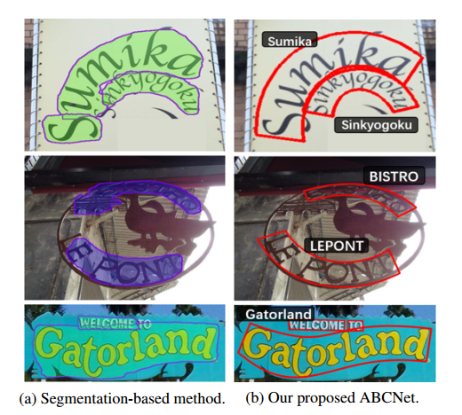

# ABCNet: Real-time Scene Text Spotting with Adaptive Bezier-Curve Network  

## 摘要

场景文本的检测和识别已受到越来越多的研究关注。 现有方法可以大致分为两类：基于字符的方法和基于分段的方法。 这些方法要么用于字符注释的成本很高，要么需要维护复杂的管线，这通常不适用于实时应用程序。 在这里，我们通过提出自适应贝塞尔曲线网络（ABCNet）解决此问题。 我们的贡献包括三个方面：1）首次，我们通过参数化的贝塞尔曲线自适应地拟合了任意形状的文本。 2）我们设计了新颖的BezierAlign层，用于提取具有任意形状的文本实例的准确卷积特征，与以前的方法相比，显着提高了精度。 3）与标准包围盒检测相比，我们的贝塞尔曲线检测引入的计算开销可忽略不计，从而使我们的方法在效率和准确性上均具有优势

对任意形状的基准数据集（Total-Text和CTW1500）进行的实验表明，ABCNet达到了最先进的准确性，同时显着提高了速度。 特别是在Total-Text上，我们的实时版本比最新的最新方法快10倍以上，并且具有可识别的识别精度

代码地址 https://github.com/aim-uofa/adet.  

## 1、简介

场景文本检测和识别由于其在计算机视觉中的众多应用而受到越来越多的关注。 尽管最近已经取得了巨大的进步[10，41，27，35，26，42]，但是由于其大小，纵横比，字体样式，透视图失真和形状方面的多样性，在野外检测和识别文本仍未解决。 尽管深度学习的出现显着改善了场景文本发现任务的性能，但当前的方法对于现实世界的应用程序仍然存在相当大的差距，尤其是在效率方面。

近年来，许多端到端方法[30、36、33、23、43、20]显着提高了任意形状的场景文本点样的性能。 但是，这些方法要么使用维护复杂流水线的基于分段的方法，要么需要大量昂贵的字符级注释。 此外，几乎所有这些方法的推理速度都很慢，从而妨碍了对实时应用程序的部署。 因此，我们的动机是设计一个简单而有效的端到端框架，以发现图像中的定向或弯曲场景文本[5、26]，该框架可确保快速推理时间，同时与状态-状态相比具有同等甚至更好的性能。 最先进的方法。

为了实现此目标，我们提出了一种**自适应Bezier曲线网络**（ABCNet），它是一种端到端的可训练框架，用于任意形状的场景文本点样。 ABCNet通过简单而有效的Bezier曲线自适应实现任意形状的场景文本检测，与标准矩形边界框检测相比，其引入的计算开销可忽略不计。 此外，我们设计了一种新颖的特征对齐层— BezierAlign，以精确计算弯曲形状的文本实例的卷积特征，因此可以以几乎可以忽略的计算开销实现较高的识别精度。 我们首次使用参数化的贝塞尔曲线表示了定向文本或弯曲文本，结果证明了该方法的有效性。 我们的发现结果示例如图1所示。

**图1**.基于分段的结果很容易受到附近文本的影响。 非参数非结构化分割结果使它们很难为后续的识别分支对齐特征。 基于细分的结果通常需要复杂的后处理，从而影响了效率。 得益于参数化的Bezier曲线表示，我们的ABCNet可以生成结构化的检测区域，因此BezierAlign采样过程可用于自然连接识别分支

请注意，诸如TextAlign [11]和FOTS [24]之类的先前方法可以视为ABCNet的特例，因为四边形边界框可以看作是具有4个直线边界的最简单的任意形状的边界框。 另外，ABCNet可以避免复杂的转换，例如2D注意力[19]，使识别分支的设计相当简单。

我们总结了我们的主要贡献如下。

- 为了在图像中准确定位定向的和弯曲的场景文本，我们首次使用Bezier曲线引入了一种新的简洁的弯曲场景文本的参数化表示形式。 与标准边界框表示相比，它引入的计算开销可忽略不计
- 我们提出了一种采样方法，也称为BezierAlign，用于精确的特征对齐，因此识别分支可以自然地连接到整个结构。 通过共享主干特征，可以将识别分支设计为轻型结构。
- 我们方法的简单性使其可以实时执行推理。 ABCNet在两个具有挑战性的数据集Total-Text和CTW1500上实现了最先进的性能，展示了有效性和效率上的优势

### 1.1 相关工作

场景文本点检需要同时检测和识别文本，而不是仅涉及一项任务。 最近，基于深度学习的方法的出现大大提高了文本点测的性能。 检测和识别性能都得到了显着提高。 我们将几种代表性的基于深度学习的场景文本发现方法归纳为以下两类。 图2显示了典型作品的概述。

**图2**.与我们最相关的一些端到端场景文本发现方法概述。 在GT（真实）框内，“ W”，“ R”和“ C”分别表示单词级注释，文本内容和字符级注释。 “ H”，“ Q”和“ P”表示该方法能够分别检测水平，四边形和任意形状的文本。 “ RP”表示该方法可以识别四边形框中的弯曲文本。 “ R”：识别； “ BBox”：边界框。 虚线框表示该方法无法检测到的文本的形状。

常规的端到端场景文本点检Li等。 [18]提出了第一个基于深度学习的端到端可训练场景文本发现方法。 该方法成功地使用了RoI池[34]通过两个阶段的框架来联合检测和识别特征，但是它只能发现水平和聚焦的文本。 其改进的版本[19]显着提高了性能，但速度受到限制。 他等。 [11]和刘等。 [24]采用无锚机制来提高训练和推理速度。 他们使用类似的采样策略，即分别使用文本对齐采样和RoI旋转，以从四边形检测结果中提取特征。 请注意，这两种方法都不能发现任意形状的场景文本。

任意形状的端到端场景文本点检测为了检测任意形状的场景文本，Liao等人。 [30]提出了一个Mask TextSpotter，它巧妙地改进了Mask R-CNN，并使用字符级监督来同时检测和识别字符和实例掩码。该方法显着提高了发现任意形状的场景文本的性能。但是，字符级基础事实是昂贵的，并且在实践中使用免费的合成数据很难为真实数据生成字符级基础事实。它的改进版本[20]大大减轻了对字符级基本事实的依赖。该方法依赖于区域提议网络，这在一定程度上限制了速度。 Sun等。 [36]提出了TextNet，它预先产生四边形检测边界框，然后使用区域提议网络来提供检测特征以进行识别。尽管该方法可以从四边形检测中直接识别任意形状的文本，但是性能仍然受到限制。

最近，秦等人。 [33]建议使用RoI遮罩将焦点放在任意形状的文本区域上。 但是，结果很容易受到异常像素的影响。 另外，分割分支增加了计算负担。 拟合多边形过程还会带来额外的时间消耗； 并且分组结果通常呈锯齿状且不平滑。 文献[23]中的工作是第一种单阶段任意形状的场景文本点样方法，需要字符级的地面真实数据进行训练。 [43]的作者提出了一种新颖的采样方法RoISlide，该方法使用了文本实例的预测段中的融合特征，因此对于较长的任意形状的文本都非常健壮。

## 2、算法

ABCNet是用于发现任意形状的场景文本的端到端可训练框架。 在图3中可以看到一个直观的管道。受[47、37、12]的启发，我们采用单发，无锚卷积神经网络作为检测框架。 卸下锚固盒可大大简化对我们任务的检测。 在这里，在检测头的输出特征图上密集地预测检测，该检测头由4个堆叠的卷积层构成，步幅为1，填充为1，填充为3×3内核。 接下来，我们分两部分介绍拟议ABCNet的关键组件：1）贝塞尔曲线检测； 2）BezierAlign和识别分支。

**图3**.提议的ABCNet的框架。 我们使用三次Bezier曲线和BezierAlign使用Bezier曲线检测结果提取曲线序列特征。 总体框架可高效进行端到端培训。 紫色点代表三次贝塞尔曲线的控制点。

### 2.1、Bezier Curve Detection  

与基于分段的方法[40、44、1、38、45、28]相比，基于回归的方法是任意形状的文本检测的更直接解决方案，例如[26、42]。 但是，以前的基于回归的方法需要复杂的参数化预测以适合文本边界，这在实践中对于各种文本形状不是非常有效且健壮。

为了简化任意形状的场景文本检测，遵循回归方法，我们认为贝塞尔曲线是弯曲文本参数化的理想概念。 贝塞尔曲线代表使用伯恩斯坦多项式[29]作为基础的参数曲线c（t）。 定义如公式（1）所示。
$$
\begin{equation}c(t)=\sum_{i=0}^{n} b_{i} B_{i, n}(t), 0 \leq t \leq 1\end{equation}
$$
其中，n代表角度，bi代表第i个控制点，$B_{i,n}(t)$代表伯恩斯坦基础多项式，如式（2）所示：
$$
\begin{equation}B_{i, n}(t)=\left(\begin{array}{l}
n \\
i
\end{array}\right) t^{i}(1-t)^{n-i}, i=0, \dots, n\end{equation}
$$
其中ni是二项式系数。 为了使用贝塞尔曲线拟合文本的任意形状，我们从现有数据集和现实世界中全面观察了任意形状的场景文本，并通过经验表明三次贝塞尔曲线（即n为3）足以拟合不同种类的文本。 实际中使用任意形状的场景文本。 三次贝塞尔曲线的图示如图4所示。

**图4**。三次贝塞尔曲线。 bi代表控制点。 绿线形成一个控制多边形，黑曲线是三次方贝塞尔曲线。 注意，只有两个端点b1和b4，贝塞尔曲线退化为一条直线。

基于三次贝塞尔曲线，我们可以将任意形状的场景文本检测简化为**总共具有八个控制点的边界框回归**。 请注意，具有四个控制点（四个顶点）的纯文本是任意形状的场景文本的典型情况。 为了保持一致，我们在每个长边的三方点上插入了另外两个控制点。

为了学习控制点的坐标，我们首先生成2.1.1中描述的Bezier曲线地面真相，并按照与[25]中类似的回归方法对目标进行回归。 对于每个文本实例，我们使用
$$
\begin{equation}\Delta_{x}=b_{i x}-x_{\min }, \Delta_{y}=b_{i y}-y_{\min }\end{equation}
$$
其中xmin和ymin分别代表4个顶点的最小x和y值。 预测相对距离的优点在于，它与Bezier曲线控制点是否超出图像边界无关。 在检测头内部，我们只需要一个具有**16个输出通道的卷积层**就可以学习∆x和∆y，这几乎是免费的，而结果仍然是准确的，这将在第3节中进行讨论。

#### 2.1.1、Bezier Ground Truth Generation  

在本节中，我们简要介绍如何基于原始注释生成贝塞尔曲线地面真实性。 任意形状的数据集，例如Total-text [5]和CTW1500 [26]，对文本区域使用了多边形注释。 给定来自弯曲边界的注释点$\{p_i\}_{i=1}^n$，其中pi表示第i个注释点，主要目标是在等式（1）中获得三次贝塞尔曲线c（t）的最佳参数。 为此，我们可以简单地应用标准最小二乘法，如公式（4）所示：
$$
\begin{equation}\left[\begin{array}{ccc}
B_{0,3}\left(t_{0}\right) & \cdots & B_{3,3}\left(t_{0}\right) \\
B_{0,3}\left(t_{1}\right) & \cdots & B_{3,3}\left(t_{1}\right) \\
\vdots & \ddots & \vdots \\
B_{0,3}\left(t_{m}\right) & \cdots & B_{3,3}\left(t_{m}\right)
\end{array}\right]\left[\begin{array}{cc}
b_{x_{0}} & b_{y_{0}} \\
b_{x_{1}} & b_{y_{1}} \\
b_{x_{2}} & b_{y_{2}} \\
b_{x_{3}} & b_{y_{3}}
\end{array}\right]=\left[\begin{array}{cc}
p_{x_{0}} & p_{y_{0}} \\
p_{x_{1}} & p_{y_{1}} \\
\vdots & \vdots \\
p_{x_{m}} & p_{y_{m}}
\end{array}\right]\end{equation}
$$
在此，m表示弯曲边界的注释点数。 对于Total-Text和CTW1500，m分别为5和7。 通过使用累积长度与折线周长之比来计算t。 根据等式（1）和等式（4），我们将原始折线注释转换为参数化的贝塞尔曲线。 请注意，我们直接将第一个和最后一个注释点分别用作第一个（b0）和最后一个（b4）控制点。 在图5中显示了可视化比较，该图显示了生成结果在视觉上甚至可以比原始地面实况更好。 此外，基于结构化的Bezier曲线边界框，我们可以轻松地使用2.2节中描述的BezierAlign将弯曲的文本扭曲为水平格式，而不会出现明显变形。 Bezier曲线生成结果的更多示例如图6所示。我们方法的简单性使其可以在实践中推广到不同种类的文本。

**图5**：贝塞尔曲线生成的比较。 在图（b）中，对于每个曲线边界，红色虚线形成一个控制多边形，红色点表示控制点。 翘曲结果如下所示。 在图（a）中，我们利用TPS [2]和STN [14]将原始地面真实情况扭曲为矩形。 在图（b）中，我们使用生成的Bezier曲线和BezierAlign来扭曲结果。

**图6** ：贝塞尔曲线生成的示例结果。 绿线是最终的贝塞尔曲线结果。 红色虚线表示控制多边形，四个红色端点表示控制点。 放大以获得更好的可视化效果。

#### 2.1.2、Bezier Curve Synthetic Dataset  

如表2所示，对于端到端场景文本发现方法，总是需要大量的自由合成数据。但是，现有的800k SynText数据集[7]仅为大多数纯文本提供四边形边界框。为了使任意形状的场景文本多样化和丰富，我们付出了一些努力，用VGG合成方法合成了150k的合成数据集（94,723个图像包含大部分纯文本，54,327个图像包含大部分弯曲文本）`[7：Synthetic data for text localisation in natural images ]`。特别地，我们从COCOText [39]中过滤掉40k个无文本的背景图像，然后使用[32]和[17]准备每个背景图像的分割蒙版和场景深度，以用于以下文本渲染。为了扩大合成文本的形状多样性，我们通过使用各种艺术字体和语料合成场景文本来修改VGG合成方法，并为所有文本实例生成多边形注释。然后，通过2.1.1节中描述的生成方法，将注释用于生成Bezier曲线地面真相。我们的综合数据示例如图8所示。

**图8**.三次贝塞尔曲线合成数据的示例。

### 2.2、BezierAlign  

为了实现端到端训练，大多数以前的方法都采用各种采样（特征对齐）方法来连接识别分支。通常，采样方法代表网络内区域裁剪过程。换句话说，在给定一个特征图和兴趣区域（RoI）的情况下，使用采样方法选择RoI的特征并有效输出固定大小的特征图。但是，以前基于非分段方法的采样方法，例如RoI Pooling [18]，RoIRotate `[24：Fots]`，Text-Align-Sampling [11]或RoI Transform [36]，无法正确对齐任意形状文本的特征（RoISlide [ 43] numerous predicting segments）。通过利用紧凑的Bezier曲线边界框的参数化性质，我们提出BezierAlign用于特征采样。 BezierAlign是RoIAlign [8]的扩展。与RoIAlign不同，BezierAlign的采样网格形状不是矩形。而是，任意形状的网格的每一列都与文本的Bezier曲线边界正交。采样点在宽度和高度上分别具有等距间隔，它们相对于坐标是双线性插值的

正式给定输入特征图和贝塞尔曲线控制点，我们同时处理大小为hout×wout的矩形输出特征图的所有输出像素。 以位置（giw； gih）为位置的像素gi（来自输出特征图）为例，我们通过等式（5）计算t：
$$
t = \frac{g_{iw}}{w_{out}}
$$
然后，我们使用t和方程式（1）计算上Bezier曲线边界tp和下Bezier曲线边界bp的点。 使用tp和bp，我们可以通过公式（6）线性索引采样点op：
$$
\begin{equation}o p=b p \cdot \frac{g_{i h}}{h_{o u t}}+t p \cdot\left(1-\frac{g_{i h}}{h_{o u t}}\right)\end{equation}
$$
通过op的位置，我们可以轻松地应用双线性插值来计算结果。 图7显示了以前的采样方法与BezierAlign之间的比较。

**图7**.以前的采样方法和BezierAlign之间的比较。 提出的BezierAlign可以准确地采样文本区域的特征，这对于识别训练至关重要。 请注意，对齐过程是在中间卷积特征中处理的

**识别分支**。 受益于共享主干功能和BezierAlign，我们设计了一个轻量级的识别分支，如表1所示，以加快执行速度。 它由6个卷积层，1个双向LSTM [13]层和1个完全连接的层组成。 基于输出分类分数，我们使用经典的CTC损失[6]进行文本字符串（GT）对齐。 请注意，在训练期间，我们直接使用生成的Bezier曲线GT来提取RoI特征。 因此，检测分支不会影响识别分支。 在推断阶段，RoI区域被第2.1节中描述的检测Bezier曲线代替。 实验第3节中的消融研究表明，提出的BezierAlign可显着提高识别性能。

**表1**：识别分支的结构，它是CRNN的简化版本[35]。 对于所有卷积层，填充大小均限制为1。n表示批大小。 c表示通道大小。 h和w代表输出特征图的高度和宽度，nclass代表预测类的编号，在本文中设置为97，包括大写和小写英文字符，数字，符号，一个类别代表所有其他符号，以及最后一个类别的“ EOF”。

## 3、实验

### 3.1. Implemented details  

本文的骨干遵循大多数先前论文的通用设置，即ResNet-50 [9]和功能金字塔网络（FPN）[22]。 对于检测分支，我们在输入图像分辨率为1 / 8、1 / 16、1 / 32、1 / 64和1/128的5个特征图上使用RoIAlign，而对于识别分支，在三个特征图上使用BeIierAlign1 / 4、1 / 8和1/16尺寸。 预训练的数据是从可公开获得的基于英语单词水平的数据集中收集的，包括在2.1.2节中描述的150k合成数据，从原始COCO-Text [39]过滤的15k图像和7k ICDAR-MLT数据[31]。

然后，在目标数据集的训练集上微调预训练的模型。 此外，我们还采用了数据扩充策略，例如随机尺度训练，其中，从560到800中随机选择短尺寸，而从长到小于1333则选择长尺寸； 和随机裁切，我们会确保裁切后的尺寸大于原始尺寸的一半，并且不剪切任何文本（对于某些难以满足条件的特殊情况，我们不会应用随机裁切）。

我们使用4个Tesla V100 GPU（图像批处理大小为32）训练模型。最大迭代为150K。 初始学习速率为0.01，在第70K次迭代时降低为0.001，在第120K次迭代时降低为0.0001。 整个培训过程大约需要3天。

### 3.2. Experimental results on Total-Text  

**数据集**。 全文本数据集[3]是2017年提出的最重要的任意形状场景文本基准之一，它是从各种场景中收集的，包括类似文本的场景复杂性和低对比度背景。 它包含1,555张图像，其中1,255张用于训练，300张用于测试。 为了类似于现实情况，此数据集的大多数图像都包含大量常规文本，同时确保每个图像至少具有一个弯曲文本。 文本实例使用基于单词级别的多边形进行注释。 它的扩展版本[5]通过在文本识别序列之后用固定的十个点注释每个文本实例来改进训练集的注释。 数据集仅包含英文文本。 为了评估端到端的结果，我们采用与以前的方法相同的度量标准，该方法使用F量度来测量词的准确性

**消融研究**：**BezierAlign**。 为了评估提出的组件的有效性，我们对该数据集进行了消融研究。 首先，我们对采样点数量如何影响端到端结果进行了敏感性分析，如**表4**所示。从结果可以看出，采样点数量会显着影响最终性能和效率。 我们发现（7,32）在F-measure和FPS之间达到了最佳折衷，在以下实验中将其用作最终设置。 我们通过将其与图7中所示的以前的采样方法进行比较来进一步评估BezierAlign。**表3**中显示的结果表明BezierAlign可以极大地改善端到端结果。 定性示例如**图9**所示。

**消融研究**：**贝塞尔曲线检测**。 另一个重要组件是Bezier曲线检测，它可以检测任意形状的场景文本。 因此，我们也进行实验以评估Bezier曲线检测的时间消耗。 表5中的结果表明，与标准包围盒检测相比，贝塞尔曲线检测没有引入额外的计算。

**图9**.四边形采样方法和BezierAlign的定性识别结果。 左：原始图像。 右上方：使用四边形抽样得出的结果。 右下：使用BezierAlign的结果。

**与最新技术的比较**。 我们进一步将我们的方法与以前的方法进行比较。 从表2中，我们可以看到我们的单标度结果（短尺寸为800）可以达到竞争性能，同时达到实时推理速度，从而在速度和字精度之间取得更好的折衷。 通过多尺度推理，ABCNet达到了最先进的性能，特别是在运行时间方面，其性能大大优于所有以前的方法。 值得一提的是，我们的更快版本可以比以前的最佳方法[20]快11倍以上，而且具有同等的准确性。

**定性结果**。 ABCNet的一些定性结果如图10所示。结果表明，我们的方法可以准确地检测和识别大多数任意形状的文本。 此外，我们的方法还可以很好地处理直线文本，具有接近四边形的紧凑型边框，并可以正确识别结果。 图中还显示了一些错误，这些错误主要是由于错误地识别了其中一个字符引起的。

**图10**. ABCNet在全部文本上的定性结果。 检测结果以红色边框显示。 浮点数是预测的置信度。 放大以获得更好的可视化效果。

### 3.3. Experimental Results on CTW1500  

**数据集**。 CTW1500 [26]是2017年提出的另一个重要的任意形状的场景文本基准。与Total-Text相比，此数据集同时包含英语和中文文本。 另外，注释基于文本行级别，并且还包括一些类似于文档的文本，即，许多小文本可以堆叠在一起。 CTW1500包含1k训练图像和500个测试图像。

**实验**。 由于该数据集中中文文本的占用量很小，因此我们在培训期间将所有中文文本直接视为“看不见的”课，即第96类。 注意，在我们的实现中，最后一类，即第97类是“ EOF”。 我们遵循与[43]相同的评估指标。 表6中显示了实验结果，这些结果表明，在端到端场景文本点识别方面，ABCNet可以大大超越以前的最新方法。 该数据集的示例结果如图11所示。从图中可以看出，一些长文本行实例包含许多单词，这使得完全匹配的单词准确性非常困难。 换句话说，错误地识别一个字符将导致整个文本得分为零。

**表6**：在CTW1500上的端到端场景文本发现结果。 *表示结果来自[43]。 “无”表示无词典。 “全满”表示我们使用测试集中出现的所有单词。

## 4. 总结

我们提出了ABCNet-一种实时的端到端方法，该方法使用Bezier曲线来任意形状的场景文本点。 通过使用参数化的Bezier曲线重新格式化任意形状的场景文本，ABCNet可以使用Bezier曲线检测任意形状的场景文本，与标准包围盒检测相比，其计算成本可忽略不计。 使用此类常规的Bezier曲线边界框，我们可以自然地通过新的BezierAlign层连接轻量识别分支。

此外，通过使用我们的Bezier曲线综合数据集和公开可用的数据，在两个任意形状的场景文本基准（Total-Text和CTW1500）上进行的实验表明，我们的ABCNet可以达到最先进的性能，并且比以前的方法快很多。

## References  

[1] Youngmin Baek, Bado Lee, Dongyoon Han, Sangdoo Yun,and Hwalsuk Lee. Character Region Awareness for Text Detection. In Proc. IEEE Conf. Comp. Vis. Patt. Recogn., pages 9365–9374, 2019.

[2] Fred L. Bookstein. Principal warps: Thin-plate splines and
the decomposition of deformations. IEEE Trans. Pattern
Anal. Mach. Intell., 11(6):567–585, 1989.

[3] C.-K Chng and C.-S Chan. Total-text: A comprehensive
dataset for scene text detection and recognition. In Proc.
IAPR Int. Conf. Document Analysis Recog., pages 935–942,
2017.

[4] Chee-Kheng Chng, Yuliang Liu, Yipeng Sun, Chun Chet Ng,
Canjie Luo, Zihan Ni, ChuanMing Fang, Shuaitao Zhang,
Junyu Han, Errui Ding, et al. ICDAR2019 Robust Reading Challenge on Arbitrary-Shaped Text (RRC-ArT). Proc.
IAPR Int. Conf. Document Analysis Recog., 2019.

[5] Chee-Kheng Chng, Chee Seng Chan, and Cheng-Lin Liu.
**Total-text: toward orientation robustness in scene text detection**. Int. J. Document Analysis Recogn., pages 1–22, 2019.

[6] Alex Graves, Santiago Fernandez, Faustino Gomez, and ´
Jurgen Schmidhuber. Connectionist temporal classification: ¨
labelling unsegmented sequence data with recurrent neural
networks. In Proc. Int. Conf. Mach. Learn., pages 369–376.
ACM, 2006.

[7] Ankush Gupta, Andrea Vedaldi, and Andrew Zisserman.
Synthetic data for text localisation in natural images. In
Proc. IEEE Conf. Comp. Vis. Patt. Recogn., pages 2315–
2324, 2016.

[8] Kaiming He, Georgia Gkioxari, Piotr Dollr, and Ross Girshick. Mask R-CNN. In Proc. IEEE Int. Conf. Comp. Vis.,
2017.

[9] Kaiming He, Xiangyu Zhang, Shaoqing Ren, and Jian Sun.
Deep residual learning for image recognition. In Proc. IEEE
Conf. Comp. Vis. Patt. Recogn., pages 770–778, 2016.

[10] Tong He, Weilin Huang, Yu Qiao, and Jian Yao. Textattentional convolutional neural network for scene text detection. IEEE Trans. Image Process., 25(6):2529–2541, 2016.

[11] Tong He, Zhi Tian, Weilin Huang, Chunhua Shen, Yu Qiao,
and Changming Sun. An end-to-end textspotter with explicit alignment and attention. In Proc. IEEE Conf. Comp. Vis.
Patt. Recogn., pages 5020–5029, 2018.   

[12] Wenhao He, Xu-Yao Zhang, Fei Yin, and Cheng-Lin Liu.
Deep direct regression for multi-oriented scene text detection. In Proc. IEEE Conf. Comp. Vis. Patt. Recogn., 2017.

[13] Sepp Hochreiter and Jurgen Schmidhuber. Long short-term
memory. In Neural Computation, volume 9, pages 1735–
1780, 1997.

[14] Max Jaderberg, Karen Simonyan, Andrew Zisserman, et al.
Spatial transformer networks. In Proc. Advances in Neural
Inf. Process. Syst., pages 2017–2025, 2015.

[15] D. Karatzas, L. Gomez-Bigorda, et al. ICDAR 2015 competition on robust reading. In Proc. IAPR Int. Conf. Document
Analysis Recog., pages 1156–1160, 2015.

[16] D. Karatzas, F. Shafait, S. Uchida, et al. ICDAR 2013 Robust
Reading Competition. In Proc. IAPR Int. Conf. Document
Analysis Recog., pages 1484–1493, 2013.

[17] Iro Laina, Christian Rupprecht, Vasileios Belagiannis, Federico Tombari, and Nassir Navab. Deeper depth prediction
with fully convolutional residual networks. In Proc. Int.
Conf. 3D vision (3DV), pages 239–248. IEEE, 2016.

[18] Hui Li, Peng Wang, and Chunhua Shen. Towards end-to-end
text spotting with convolutional recurrent neural networks.
In Proc. IEEE Int. Conf. Comp. Vis., pages 5238–5246, 2017.

[19] Hui Li, Peng Wang, and Chunhua Shen. Towards end-to-end
text spotting in natural scenes. arXiv: Comp. Res. Repository, 2019.

[20] Minghui Liao, Pengyuan Lyu, Minghang He, Cong Yao,
Wenhao Wu, and Xiang Bai. Mask textspotter: An end-toend trainable neural network for spotting text with arbitrary
shapes. IEEE Trans. Pattern Anal. Mach. Intell., 2019.

[21] Minghui Liao, Baoguang Shi, Xiang Bai, Xinggang Wang,
and Wenyu Liu. Textboxes: A fast text detector with a single
deep neural network. In Proc. AAAI Conf. Artificial Intell.,
2017.

[22] Tsung-Yi Lin, Piotr Dollar, Ross Girshick, Kaiming He, ´
Bharath Hariharan, and Serge Belongie. Feature pyramid
networks for object detection. In Proc. IEEE Conf. Comp.
Vis. Patt. Recogn., pages 2117–2125, 2017.

[23] Xing Linjie, Tian Zhi, Huang Weilin, and R. Scott Matthew.
Convolutional Character Networks. In Proc. IEEE Int. Conf.
Comp. Vis., 2019.

[24] Xuebo Liu, Ding Liang, Shi Yan, Dagui Chen, Yu Qiao, and
Junjie Yan. **Fots: Fast oriented text spotting with a unified network**. In Proc. IEEE Conf. Comp. Vis. Patt. Recogn.,
pages 5676–5685, 2018.

[25] Yuliang Liu and Lianwen Jin. Deep matching prior network:
Toward tighter multi-oriented text detection. In Proc. IEEE
Conf. Comp. Vis. Patt. Recogn., 2017.

[26] Yuliang Liu, Lianwen Jin, Shuaitao Zhang, Canjie Luo, and
Sheng Zhang. Curved scene text detection via transverse
and longitudinal sequence connection. Pattern Recognition,
90:337–345, 2019.

[27] Yuliang Liu, Sheng Zhang, Lianwen Jin, Lele Xie, Yaqiang
Wu, and Zhepeng Wang. Omnidirectional scene text detection with sequential-free box discretization. Proc. Int. Joint
Conf. Artificial Intell., 2019. 

[28] Shangbang Long, Jiaqiang Ruan, Wenjie Zhang, Xin He,
Wenhao Wu, and Cong Yao. Textsnake: A flexible representation for detecting text of arbitrary shapes. In Proc. Eur.
Conf. Comp. Vis., pages 20–36, 2018.

[29] George G. Lorentz. Bernstein polynomials. American Mathematical Soc., 2013.

[30] Pengyuan Lyu, Minghui Liao, Cong Yao, Wenhao Wu, and
Xiang Bai. Mask textspotter: An end-to-end trainable neural
network for spotting text with arbitrary shapes. In Proc. Eur.
Conf. Comp. Vis., pages 67–83, 2018.

[31] Nibal Nayef, Yash Patel, Michal Busta, Pinaki Nath Chowdhury, Dimosthenis Karatzas, Wafa Khlif, Jiri Matas, Umapada Pal, Jean-Christophe Burie, Cheng-lin Liu, et al.
ICDAR2019 Robust Reading Challenge on Multi-lingual
Scene Text Detection and Recognition–RRC-MLT-2019.
Proc. IAPR Int. Conf. Document Analysis Recog., 2019.

[32] Jordi Pont-Tuset, Pablo Arbelaez, Jonathan T Barron, Ferran Marques, and Jitendra Malik. Multiscale combinatorial
grouping for image segmentation and object proposal generation. IEEE Trans. Pattern Anal. Mach. Intell., 39(1):128–
140, 2016.

[33] Siyang Qin, Alessandro Bissacco, Michalis Raptis, Yasuhisa
Fujii, and Ying Xiao. Towards unconstrained end-to-end text
spotting. Proc. IEEE Int. Conf. Comp. Vis., 2019.

[34] Shaoqing Ren, Kaiming He, Ross Girshick, and Jian Sun.
**Faster R-CNN: Towards real-time object detection with region proposal networks**. In Proc. Advances in Neural Inf.
Process. Syst., pages 91–99, 2015.

[35] Baoguang Shi, Xiang Bai, and Cong Yao. **An end-to-end trainable neural network for image-based sequence recognition and its application to scene text recognition**. IEEE Trans.
Pattern Anal. Mach. Intell., 39(11):2298–2304, 2016.

[36] Yipeng Sun, Chengquan Zhang, Zuming Huang, Jiaming
Liu, Junyu Han, and Errui Ding. TextNet: Irregular Text
Reading from Images with an End-to-End Trainable Network. In Proc. Asian Conf. Comp. Vis., pages 83–99.
Springer, 2018.

[37] Zhi Tian, Chunhua Shen, Hao Chen, and Tong He. FCOS:
Fully Convolutional One-Stage Object Detection. Proc.
IEEE Int. Conf. Comp. Vis., 2019.

[38] Zhuotao Tian, Michelle Shu, Pengyuan Lyu, Ruiyu Li, Chao
Zhou, Xiaoyong Shen, and Jiaya Jia. Learning Shape-Aware
Embedding for Scene Text Detection. In Proc. IEEE Conf.
Comp. Vis. Patt. Recogn., pages 4234–4243, 2019.

[39] Andreas Veit, Tomas Matera, Lukas Neumann, Jiri Matas,
and Serge Belongie. Coco-text: Dataset and benchmark
for text detection and recognition in natural images. arXiv:
Comp. Res. Repository, 2016.

[40] Wenhai Wang, Enze Xie, Xiang Li, Wenbo Hou, Tong Lu,
Gang Yu, and Shuai Shao. Shape Robust Text Detection with
Progressive Scale Expansion Network. Proc. IEEE Conf.
Comp. Vis. Patt. Recogn., 2019.

[41] Wenhai Wang, Enze Xie, Xiaoge Song, Yuhang Zang, Wenjia Wang, Tong Lu, Gang Yu, and Chunhua Shen. Efficient
and Accurate Arbitrary-Shaped Text Detection with Pixel
Aggregation Network. Proc. IEEE Int. Conf. Comp. Vis.,
\2019.   

[42] Xiaobing Wang, Yingying Jiang, Zhenbo Luo, Cheng-Lin
Liu, Hyunsoo Choi, and Sungjin Kim. Arbitrary Shape
Scene Text Detection with Adaptive Text Region Representation. In Proc. IEEE Conf. Comp. Vis. Patt. Recogn., pages
6449–6458, 2019.

[43] Feng Wei, He Wenhao, Yin Fei, Zhang Xu-Yao, and ChengLiu Liu. TextDragon: An end-to-end framework for arbitrary
shaped text spotting. In Proc. IEEE Int. Conf. Comp. Vis.,
2019.

[44] Yongchao Xu, Yukang Wang, Wei Zhou, Yongpan Wang,
Zhibo Yang, and Xiang Bai. Textfield: Learning a deep direction field for irregular scene text detection. IEEE Trans.
Image Process., 2019.

[45] Chengquan Zhang, Borong Liang, Zuming Huang, Mengyi
En, Junyu Han, Errui Ding, and Xinghao Ding. Look More
Than Once: An Accurate Detector for Text of Arbitrary
Shapes. Proc. IEEE Conf. Comp. Vis. Patt. Recogn., 2019.

[46] Zhuoyao Zhong, Lianwen Jin, Shuye Zhang, and Ziyong
Feng. Deeptext: A unified framework for text proposal generation and text detection in natural images. arXiv: Comp.
Res. Repository, 2016.

[47] Zhuoyao Zhong, Lei Sun, and Qiang Huo. An anchor-free
region proposal network for faster r-cnn-based text detection
approaches. Int. J. Document Analysis Recogn., 22(3):315–
327, 2019.

[48] Yixing Zhu and Jun Du. Sliding line point regression for
shape robust scene text detection. In Proc. Int. Conf. Patt.
Recogn., pages 3735–3740. IEEE, 2018.  