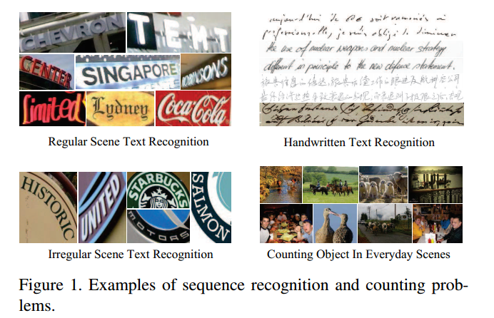
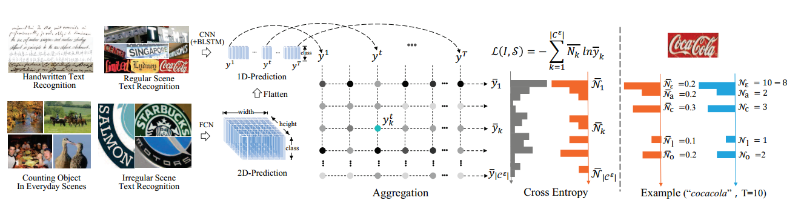

# Aggregation Cross-Entropy for Sequence Recognition

## 摘要

本文从全新的角度提出了一种新的方法，即聚集交叉熵（ACE），用于序列识别。 ACE损失函数表现出对CTC和注意机制的竞争性能，实现起来要快得多（因为它仅涉及四个基本公式），推理回传速度更快（并行大约为O（1）），存储需求更少（无参数且可以忽略不计） 运行时内存），使用方便（通过用ACE替换CTC）。 此外，所提出的ACE损失函数具有两个值得注意的特性：（1）通过将2D预测平整为1D预测作为输入，可以将其直接用于2D预测；（2）在序列注释中仅需要字符及其编号 监督，使其超越了序列识别，例如计数问题。 该代码可从https://github.com/summerlvsong/Aggregation-CrossEntropy公开获得。

## 简介

序列识别或序列标记[13]是将固定序列中的标签序列分配给输入数据序列，例如语音识别[14，2]，场景文本识别[38，39]和手写文本识别[34，48]，如图1所示。深度学习的最新进展[30，41，20]和新的体系结构[42，5，4，46]使得能够构建可以处理一维（ 1D）[38，34]和二维（2D）预测问题[56，4]。对于1D预测问题，由于原始图像中的字符通常是按顺序分布的，因此网络的最上层特征图会在垂直维度上折叠以生成1D预测[5]。典型示例是常规场景文本识别[38、54]，在线/离线手写文本识别[12、34、48]和语音识别[14、2]。对于2D预测问题，输入图像中的字符按特定的空间结构分布。例如，数学表达式识别中相邻字符之间存在高度复杂的空间关系[56，57]。在段落级文本识别中，字符通常逐行分布[4，46]，而在不规则场景文本识别中，它们通常以侧视图或弯曲角度模式分布[51，8]。

对于序列识别问题，传统方法通常要求针对输入序列中的每个片段或时间步分别分离训练目标，从而导致不方便的前段分割和后处理阶段[12]。 CTC [13]和注意力机制[1]的出现，通过规避了输入图像与其相应标签序列之间的先验对齐，大大缓解了这种顺序训练问题。然而，尽管基于CTC的网络在一维预测问题中表现出了卓越的性能，但其基本方法却十分复杂。此外，它的实现，即前向-后向算法[12]，很复杂，导致计算量大。此外，CTC几乎不能应用于二维预测问题。同时，关注机制依靠其关注模块来进行标签对齐，从而导致额外的存储需求和计算消耗。正如Bahdanau等人指出的。 [2]，由于地面真相字符串和注意力预测之间的不匹配，尤其是在较长的输入序列上[25，9]，很难用注意力机制从头开始学习识别模型。 Bai等。文献[3]还认为，不对准问题会混淆和误导训练过程，从而使训练成本高昂并降低识别精度。尽管注意力机制可以适用于2D预测问题，但事实证明，这种机制在存储和时间消耗方面令人望而却步，如[4]和[46]所示。

根据以上观察结果，我们针对序列识别问题提出了一种新颖的聚集交叉熵（ACE）损失函数，如**图2**所示。给定网络的预测结果，ACE损失包括三个简单阶段：（1 ）沿时间维度汇总每个类别的概率； （2）将累积结果和标签标注归一化为所有类别上的概率分布； （3）使用交叉熵比较这两个概率分布。 提议的ACE损失函数的优点可总结如下：

图2.（左）建议的ACE损失函数示意图。 通常，一维和二维预测分别通过集成的CNN-LSTM和FCN模型生成。 对于ACE损失函数，将2D预测进一步平坦化为1D预测fykt； t = 1； 2; ：：：; 吨 在聚合期间，根据yk = PT t = 1 ykt，对每个类别独立累积所有时间步的一维预测。 归一化之后，将预测y与基本事实N一起用于基于交叉熵的损耗估计。 （右）一个简单的示例指示ACE损失函数的注释的生成。 Na = 2表示可口可乐中有两个“ a”。

- 由于其简单性，ACE损失函数的实现要快得多（四个基本公式），推理和向后传播更快（大约为O（1）并行），内存需求更少（无参数和基本运行时内存），并且 与CTC和注意机制相比，使用方便（只需用ACE替换CTC）。 表5，第3.4节和第4.4节对此进行了说明。
- 尽管它很简单，但ACE损失功能仍能达到CTC和注意力机制的竞争性能，这是在规则不规则场景文本识别和手写文本识别问题的实验中建立的
- ACE损失函数可以通过将2D预测平坦化为1D预测来适应2D预测问题，这在不规则场景文本识别和计数问题的实验中得到了验证。
- ACE丢失功能不需要实例订单信息来进行监控，这使其能够超越序列识别（例如计数问题）。

## 相关工作

### 2.1. Connectionist temporal classification  （CTC）

流行的CTC丢失的优势首先在语音识别[16，14]和在线手写文本识别[15，12]中得到了证明。 最近，提出了一个集成的CNN-LSTM-CTC模型来解决场景文本识别问题[38]。 还有一些旨在扩展应用中的CTC的方法。 例如Zhang等。 [55]提出了一种扩展的CTC（ECTC）目标函数，该函数从CTC改编而成，即使只有单词级注释可用，也可以训练基于RNN的音素识别器。 黄等。 [21]开发了一种基于期望最大化的在线CTC算法，该算法允许使用无限长的输入序列训练RNN，而无需进行预分段或外部复位。 但是，CTC的计算过程非常复杂且耗时，并且在应用于2D问题时需要大量的精力来重新布置特征图和注释[46，4]

### 2.2. Attention mechanism  

注意机制首先在机器翻译中提出[1，42]，以使模型能够自动搜索源句子的一部分以进行预测。 然后，该方法在（视觉）问答[32，52]，图像标题生成[50，52，31]，语音识别[2，25，32]和场景文本识别[39，3]等应用中迅速流行。 ，19]。 最重要的是，注意力机制还可以应用于2D预测，例如数学表达式识别[56，57]和段落识别[4，5，46]。 但是，注意力机制依赖于复杂的注意力模块来实现其功能，从而导致额外的网络参数和运行时间。 此外，缺少或多余的字符很容易引起对齐问题，混淆和误导训练过程，从而降低识别精度[3，2，9]。

## Aggregation Cross-Entropy  

形式上，给定输入图像 $I$ 及其来自训练集 $Q$ 的序列注释 $S$，序列识别问题的一般损失函数将评估模型参数下以图像$I$为条件的长度为$L$的注释$S$的概率。 如下：
$$
\begin{equation}\begin{aligned}
\mathcal{L}(\omega) &=-\sum_{(\mathcal{I}, \mathcal{S}) \in \mathcal{Q}} \log P(\mathcal{S} | \mathcal{I} ; \omega) \\
&=-\sum_{(\mathcal{I}, \mathcal{S}) \in \mathcal{Q}} \sum_{l=1}^{L} \log P\left(\mathcal{S}_{l} | l, \mathcal{I} ; \omega\right)
\end{aligned}\end{equation}
$$
其中，$P（S_l | I,w）$ 表示在预测序列的第l位置处预测字符$S_l$的概率。因此，问题在于估计一般损失函数Eq。 （1）基于模型预测$y_k^t; t = 1,2, ··· T; k = 1,2, ··· |C^\epsilon|$，其中$C^\epsilon = C\cup\epsilon$，其中$C$ 是字符集和空白标签。然而，直到流行的CTC损失函数出现之前，直接估计概率的挑战性过大。 CTC损失函数使用向前-向后算法优雅地计算$P（S_l | I,w）$，从而消除了对预分段数据和外部后处理的需求。注意机制通过基于其注意模块直接预测$P（S_l | I,w）$，提供了一种估计一般损失函数的替代解决方案。然而，CTC的前-后算法非常复杂且耗时，而注意力机制则需要额外的复杂网络来确保注意力预测和注释之间的对齐。

在本文中，我们提出ACE损失函数，以基于模型预测$y_k^t$估算一般损失函数。在等式中（1），可以通过最大化序列注释的每个位置处的预测，即，$P（S_l | I,w）$来最小化一般损失函数。但是，由于注释中的第l个字符与模型预测ykt之间的对齐方式不明确，因此基于ykt直接计算$P（S_l | I,w）$非常具有挑战性。因此，不是精确地估计概率$P（S_l | I,w）$，而是通过仅监督每个类别的累积概率来缓解该问题。而不考虑其在注释中的顺序。例如，如果一个类在注解中出现两次，则我们要求它在T个时间步上的累积预测概率恰好为2，并预期其两个相应的预测近似于1。因此，我们可以通过要求网络精确地预测注释中每个类的字符数，从而最大程度地减少一般损失函数，如下所示：
$$
\begin{equation}\begin{aligned}
\mathcal{L}(\omega) &=-\sum_{(\mathcal{I}, S) \in \mathcal{Q}} \sum_{l=1}^{L} \log P\left(\mathcal{S}_{l} | l, \mathcal{I} ; \omega\right) \\
& \approx-\sum_{(\mathcal{I}, S) \in \mathcal{Q}} \sum_{k=1}^{\left|\mathcal{C}^{\ell}\right|} \log P\left(\mathcal{N}_{k} | \mathcal{I} ; \omega\right)
\end{aligned}\end{equation}
$$
其中$N_k$表示字符$C_k$在序列注释S中出现的次数。请注意，此新的损失函数不需要字符顺序信息，而只需要类别及其数量来进行监督。

### 3.1. Regression-Based ACE Loss Function  

现在，问题在于将模型预测$y_k^t$与每个类别的数量预测联系起来。 我们建议通过对T个时间步的第k个字符的概率求和来计算每个类yk的数量，即$y_k = \sum ^T_ {t = 1} y_k^t$，如图2中的汇总所示。请注意，
$$
\begin{equation}\max \sum_{k=1}^{\left|C^{\epsilon}\right|} \log P\left(\mathcal{N}_{k} | \mathcal{I} ; \omega\right) \Leftrightarrow \min \sum_{k=1}^{\left|\mathcal{C}^{\epsilon}\right|}\left(\mathcal{N}_{k}-y_{k}\right)^{2}\end{equation}
$$
因此，我们从回归问题的角度调整损失函数（等式（2））如下：
$$
\begin{equation}\mathcal{L}(\omega)=\frac{1}{2} \sum_{(\mathcal{I}, \mathcal{S}) \in \mathcal{Q}} \sum_{k=1}^{\left|\mathcal{C}^{\epsilon}\right|}\left(\mathcal{N}_{k}-y_{k}\right)^{2}\end{equation}
$$
还应注意，预计总共$（T-|S|）$个预测会产生零排放。 因此，我们有$N_{\epsilon} = T − |S|$。

