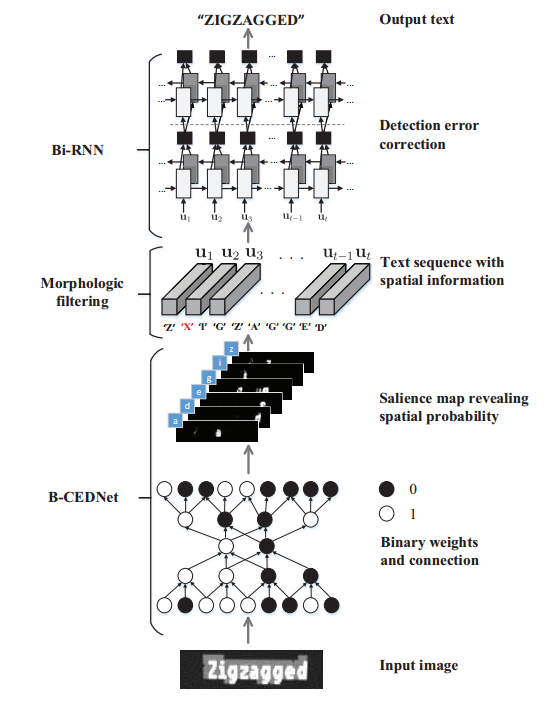

# SqueezedText: A Real-Time Scene Text Recognition by Binary Convolutional Encoder-Decoder Network  

## 摘要

本文提出了一种实时场景文本识别的新方法。一种新型的**二进制卷积编解码网络(B-CEDNet)**和双向递归神经网络(Bi-RNN)一起工作。

采用B-CEDNet作为可视化前端提供详细的字符检测，后端Bi-RNN基于学习进行字符级顺序校正和分类语境知识。

前端B-CEDNet可以进行处理包含字符的多个区域使用一次性前向操作，并在二进制约束下进行训练重要的压缩。因此，它导致了两个非凡的

推理运行时加速以及内存使用减少。用精心设计的字符检测、后端Bi-RNN仅仅处理一个低维特征序列提取字符的类别和空间信息

用于序列校正和分类。通过培训超过1,000,000合成场景文本图像，B-CEDNet召回率0.86，准确率0.88,F-score icda -03和icda -13的0.87。与校正并利用Bi-RNN对实时场景进行分类文本识别达到最先进的准确性，而只有推理运行时的消耗小于1 ms。该流处理流程在GPU上实现，网络规模较小B-CEDNet是1.01 MB, Bi-RNN是3.23 MB比现有的解决方案更快、更小。

## 介绍

卷积神经网络(CNN)的成功已经导致了一个潜在的通用机器学习引擎各种计算机视觉应用(LeCun等，1998;例如文本检测、图像识别和解释。应用，例如高级驾驶辅助系统(ADAS)然而，对于带有文本的路标，则需要超出现有方法的实时处理能力(Jaderberg等，2014;扎德伯格、维达尔迪和泽塞尔曼2014)在处理功能、效率和延迟方面。

对于一个实时场景文本识别应用程序，一个需要一种内存效率高、处理速度快的方法。在这篇论文中，我们发现**二元特征(binary features)(Courbariaux和Bengio 2016)**是有效的和高效的表示场景文本图像。结合**反卷积**技术，介绍了一种用于实时单点字符检测和识别的二进制卷积编解码器网络(B-CEDNet)。

场景文本识别是使用后端字符级顺序进一步增强基于双向递归神经网络(Bi-RNN)的校正与分类。而不是按顺序检测字符(Bissacco等，2013;Wang et al. 2012;史,我们提出的方法，称为**SqueezedText**，可以同时检测多个字符，并提取具有相应空间信息的长度可变字符序列。这个序列将随后执行输入Bi-RNN，然后学习检测错误从前一阶段的特征，提供基于空间和分类的特征水平校正和分类上下文线索。

通过对超过100万幅合成场景文本图像的训练，本文提出的压缩文本可以达到的召回率为icda -03的精度为0.86,F-score为0.87(Lucas等，2003)数据集。更重要的是，它实现了最先进的准确度分别为93.8%、92.7%、94.3%和96.1%icda -03、icda -13、IIIT5K、STV和Synthe90K数据集的83.6%。挤压文本是在GPU上用a实现的B-CEDNet的网络大小为1.01 MB, 3.23 MBBi-RNN;并且平均消耗不到1 ms推理运行时。它可以达到4倍的速度和6倍的体积先进的工作。

## 方法

### SqueezedText概述

整体识别流程如图1所示。给定场景文本图像尺寸为$W_I\times{H_I}$，提出的B-CEDNet生成$W_I\times{H_I}$大小$C$ 的映射，可以组合成S∈RWI×HI×C的3D阵列。注意，C表示字符数加上一个背景类。带有空间信息的字符序列在S中提取U = [u1, u2，···，uT]，首先利用置信因子Fconf对S进行阈值化，然后利用Mmf的核大小进行二值形态学滤波。其中ut∈RDu表示标签向量，表示被检测字符的类别、位置、宽度和高度。提取的序列U将被输入一个Bi-RNN网络，通过上下文校正和分类，对U中的检测错误进行校正，然后输出识别结果。

### 用于字符检测的B-CEDNet

