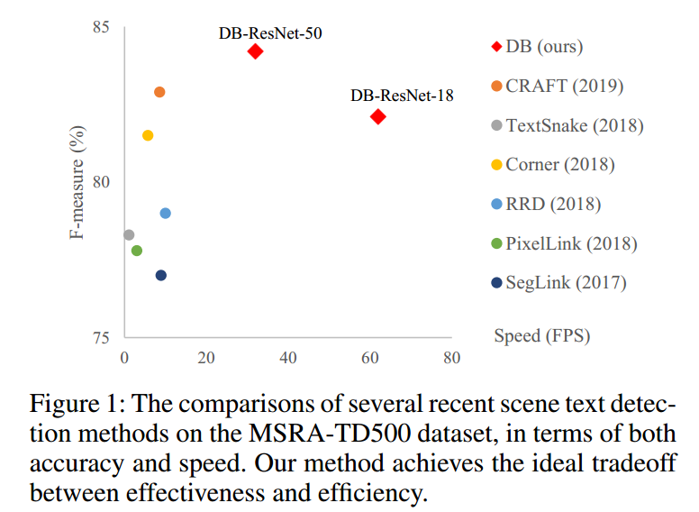
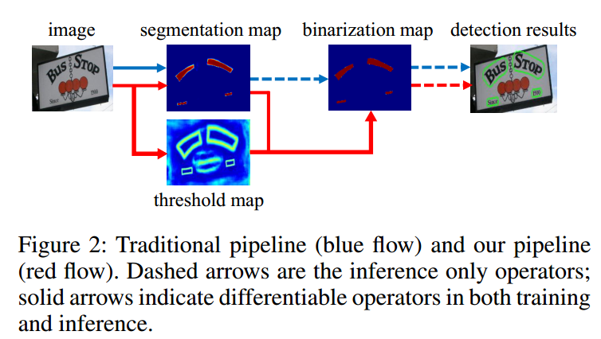
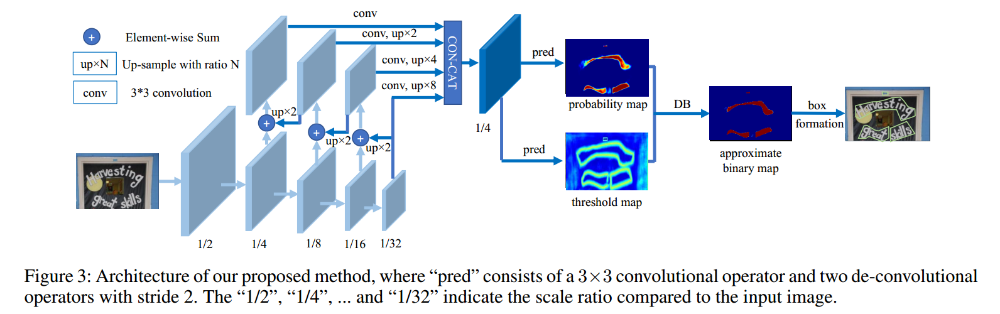
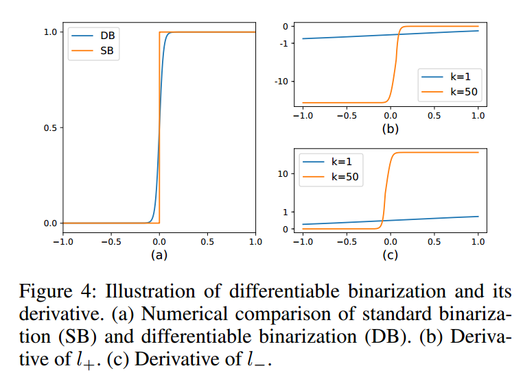
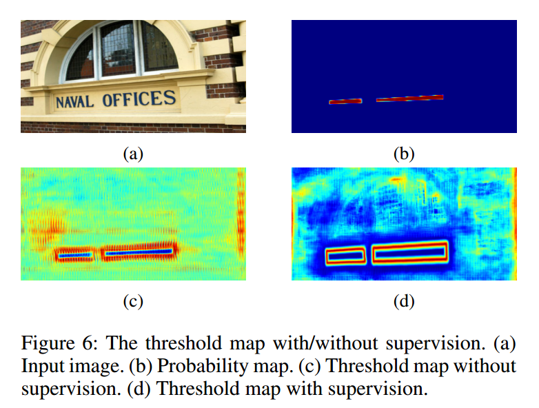
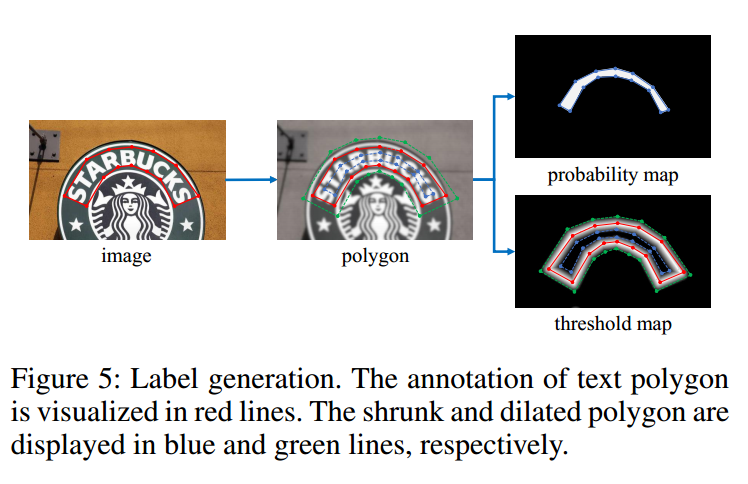

# Real-time Scene Text Detection with Differentiable Binarization  

## 摘要

最近，基于分割的方法在场景文本检测中相当流行，因为分割结果可以更准确地描述各种形状的场景文本，如曲线文本。然而，二值化的后处理对于基于分割的检测是必不可少的，它将分割方法产生的概率图转换为文本的边界框/区域。本文提出了一种在分段网络中执行二值化处理的模块，称为**可微分二值化(DB)**。与DB模块一起优化的分割网络可以自适应地设置二值化阈值，这不仅简化了后处理，而且提高了文本检测的性能。基于一个简单的分割网络，我们在五个基准数据集上验证了DB的性能改进，在检测精度和速度方面都取得了一致的结果。特别是，对于轻量级主干，DB的性能改进非常显著，因此我们可以在检测精度和效率之间寻找理想的折衷。具体地说，使用ResNet-18主干，我们的检测器在MSRA-TD500数据集上实现了82.8的F-Measure，运行速度为62FPS。代码可在以下网址获得：https://github.com/MhLiao/DB.

## 1、简介

近年来，场景图像中的文字阅读因其在图像/视频理解、视觉搜索、自动驾驶、盲人辅助等方面的广泛实际应用而成为一个活跃的研究领域。

作为场景文本阅读的关键组成部分，场景文本检测的目标是定位每个文本实例的边界框或区域，因为场景文本通常具有不同的尺度和形状，包括水平文本、多方向文本和弯曲文本。**基于分割的场景文本检测**由于能够描述各种形状的文本，得益于其在像素级的预测结果，近年来引起了人们的广泛关注。然而，大多数基于分割的方法需要**复杂的后处理**来将像素级预测结果分组到检测到的文本实例中，从而导致推理过程中的相当大的时间开销。以两种最新的场景文本检测方法为例：**PSENet**(Wang等人，2019a)提出了渐进尺度扩展的后处理方法来提高检测精度；**像素嵌入**(Tian et al.。2019)用于根据分割结果对像素进行聚类，这需要计算像素之间的特征距离。

大多数现有的检测方法使用类似于图2所示的后处理流水线(跟随蓝色箭头)：首先，它们设置固定的阈值，用于将分割网络产生的概率图转换为二值图像；然后，使用一些启发式技术，如**像素聚类**，将像素分组为文本实例。我们的流水线(跟随图2中的红色箭头)旨在将二值化操作插入分段网络以进行联合优化。通过这种方式，可以自适应地预测图像每个位置的阈值，从而可以将像素与前景和背景完全区分开来。然而，标准的二值化函数是不可微的，我们提出了一种用于二值化的近似函数，称为微分二值化(DB)，该函数在与分段网络一起训练时是完全可微的。

本文的主要贡献是提出了可微的DB模块，使得二值化过程在CNN中端到端可训练。通过将简单的语义分割网络与所提出的DB模块相结合，提出了一种健壮、快速的场景文本检测器。从使用DB模块的性能评估来看，我们发现我们的检测器比以前最先进的基于分割的方法有几个突出的优势。

- 1.我们的方法在水平文本、多方向文本和弯曲文本等五个场景文本基准数据集上取得了持续较好的性能。
- 2.由于DB可以提供高度健壮的二值化映射，大大简化了后处理，因此我们的方法比以前的主流方法要快得多。
- 3.DB在使用轻量级主干时工作良好，显著提高了与ResNet-18主干的检测性能。
- 4.由于可以在不牺牲性能的情况下在推理阶段移除DB，因此测试不需要额外的内存/时间开销。

## 2、相关工作

目前的场景文本检测方法大致可以分为两类：**基于回归的方法**和**基于分割的方法**。

**基于回归的方法**是一系列直接回归文本实例边界框的模型。**TextBox**(Liao et al.。2017)修改了基于SSD的卷积核的锚点和尺度(Liu等人，2016)，用于文本检测。**TextBox++**(辽、石、白2018)和**DMPNet**(刘、金2017)应用四边形回归检测多向文本。**SSTD**(他等人，2017a)提出了一种粗略识别文本区域的注意机制。**RRD**(廖等人 2018)通过使用旋转不变特征进行分类，使用旋转敏感特征进行回归，将分类和回归解耦，以更好地处理多方向和长文本实例。**East**(周等人 2017)和**DeepReg**(He等人，2017b)是**无锚方法**，它们对多方向文本实例应用像素级回归。**SegLink**(Shii、Bai和Belongie 2017)回归了片段边界框并预测了它们的链接，以处理长文本实例。**DeRPN**(Xie et al.。2019b)提出了一种维度分解区域建议网络来解决场景文本检测中的尺度问题。基于回归的方法通常具有简单的后处理算法(例如，非最大抑制)。但是，它们中的大多数仅限于表示不规则形状(如曲线形状)的准确边界框。

**基于分割的方法**通常结合像素级预测和后处理算法来获得边界框。(张等人)。2016)通过语义分割和基于MSER的算法检测到多方向文本。在(薛、鲁、湛2018)中使用文本边框来拆分文本实例，**Mask TextSpotter**(Lyu等人)。2018a；廖等人。2019)基于**Mask R-CNN**的实例分割方式检测到任意形状的文本实例。**PSENet**(Wang et al.。2019a)提出了通过分割具有不同尺度核的文本实例的渐进式尺度扩展。像素嵌入是在(Tian等人)中提出的。2019)来对来自分割结果的像素进行聚类。**PSENet**(Wang et al.。2019a)和**SAE**(Tian et al.。2019)对分割结果提出了新的后处理算法，导致推理速度较慢。相反，我们的方法在不损失推理速度的情况下 ，通过将二值化过程纳入训练周期来改善分割结果。

**快速场景文本检测方法**兼顾准确性和推理速度。**TextBox**(Liao et al.。2017)、**TextBox++**(廖、史和白2018)、**SegLink**(史、白和Belongie 2017)和**RRD**(廖等人。2018)通过遵循SSD的检测架构实现了快速的文本检测(Liu et al.。(2016年)。**East**(周等人2017)提议应用PVANet(Kim等人。2016)来提高它的速度。它们大多不能处理不规则形状的文本实例，如曲线形状。与以往的快速场景文本检测器相比，我们的方法不仅运行速度更快，而且可以检测出任意形状的文本实例。

## 3、算法

我们提出的方法的体系结构如图3所示。首先，输入图像被馈送到特征金字塔主干。其次，对金字塔特征进行等尺度上采样并叠加生成特征F，然后利用特征F对**概率图**(P)和**阈值图**(T)进行预测。然后，由P和F计算**近似二值图**($\hat{B}$)。在训练期间，对概率图、阈值图和近似二值图进行监督，其中**概率图和近似二值图具有相同的监督**。在推理过程中，通过盒形模块可以很容易地从近似的二值图或概率图中得到包围盒。

> feature map size : **[ batch_size, 256, height/4, width/4 ]**
>
> probility map size : **[batch_size, 1, height, width]**

### 3.1 标准二值化

给定由分割网络产生的概率图$P\in R^{H\times W}$ (其中H和W表示图的高度和宽度)的标准二值化，必须将其转换为二值图$P\in R^{H\times W}$，其中值为1的像素被认为是有效的文本区。通常，此二进制化过程可以描述如下：
$$
B_{i, j}=
\left\{
\begin{array}{ll}
{1} & {\text { if } P_{i, j}>=t} \\
{0} & {\text { otherwise }}
\end{array}
\right.
$$
其中t是预定义阈值，并且(i,j)表示地图中的坐标点。

### 3.2 可微二值化
等式中描述的标准二值化是不可微。因此，在训练期间，它不能随着分段网络一起优化。为了解决此问题，我们建议使用近似阶跃函数执行二值化：
$$
\hat{B}_{i,j}=\frac{1}{1+e^{-k(P_{i,j}-T_{i,j})}}
$$
其中$\hat{B}$ 是近似的二进制图；T是从网络学习的自适应阈值图； **k表示放大因子。根据经验，k被设置为50**。该近似二值化函数的行为类似于标准二值化函数(参见图4)，但是是可微分的，因此可以在训练时段中与分段网络一起优化。具有自适应阈值的可微二值化不仅可以帮助区分文本区域和背景，而且可以将紧密连接的文本实例分离出来。一些示例如图7所示。

DB提高性能的原因可以用梯度的反向传播来解释。让我们以二元交叉熵损失为例。 定义DB函数 $f(x)=\frac{1}{1+e^{-kx}}$ 其中$x=P_{i,j}-T_{i,j}$ 那么正标签的损失 $l_+$ 和负标签的损耗$l_-$为：
$$
\begin{equation}
\begin{aligned}
&l_{+}=-\log \frac{1}{1+e^{-k x}}\\
&l_{-}=-\log \left(1-\frac{1}{1+e^{-k x}}\right)
\end{aligned}
\end{equation}
$$
我们可以很容易地用链式法则计算损失的差值：
$$
\begin{equation}
\begin{aligned}
&\frac{\partial l_{+}}{\partial x}=-k f(x) e^{-k x}\\
&\frac{\partial l_{-}}{\partial x}=k f(x)
\end{aligned}
\end{equation}
$$
l+和l−的导数也如图4所示。从微分中我们可以看出：(1)梯度被放大因子k增大；(2)梯度的放大对于大多数错误预测区域(L+的x<0；L−的x>0)是显著的，从而便于优化并有助于产生更有特色的预测。此外，当$x=P_{i,j}-T_{i,j}$ 时，P的梯度被影响并且通过T在前景和背景之间重新缩放。

### 3.3 自适应阈值
图1中的阈值图从外观上看与(薛、鲁、湛2018)中的文字边框图相似。然而，阈值映射的动机和用法与文本边界映射不同。有监督和无监督的阈值图如图6所示。即使没有对阈值图的监督，阈值图也会突出显示文本边界区域。这表明类似边界的阈值图对最终结果是有利的。因此，为了更好地指导，我们在阈值图上应用了边界式监督。实验部分讨论了有关监督的切除研究。对于用法，使用(薛、鲁、湛2018)中的文本边框图来拆分文本实例，而我们的阈值图作为二值化的阈值。

### 3.4 可变形卷积
可变形卷积(Dai等人。2017年；朱等人。2019)可以为模型提供灵活的接受场，这对于宽高比极高的文本实例尤其有利。以下是(朱等人)。2019年)，调制可变形卷积在ResNet-18或ResNet-50主干中的所有3×3卷积层中分阶段卷积3、卷积4和卷积5应用(He et al.。2016a)。

### 3.5 标签生成

**概率图**的标签生成受到**PSENet**启发。给定一张含文本图像，其文本区域的每个多边形由一组段(segment)描述：
$$
G=\{S_k\}_{k=1}^n
$$
n是顶点的数量，在不同的数据集中可能是不同的，例如，对于ICDAR 2015数据集，为4个和16个CTW1500数据集(Liu等人。2019a)。然后，通过使用**Vatti裁剪算法**(VATI 1992)将多边形G收缩到$G_s$来产生正区域。收缩的偏移D是根据原始多边形的`周长L`和`面积A`计算得出的：
$$
D=\frac{A(1-r^2)}{L}
$$
其中**r是收缩比，经验上设置为0.4**。

使用类似的过程，我们可以为**阈值图**生成标签。首先，以相同的偏移量D来扩展文本多边形G到$G_d$。我们**将$G_s$和$G_d$ 之间的距离作为文本区域的边界**，通过计算到G中最近边的距离来生成阈值图的标签。

### 3.6 最优化
损失函数L可以表示为概率图$L_s$ 的损失、二值图$L_b$ 的损失和阈值图$L_t$ 的损失的加权和：
$$
L=L_s+\alpha\times L_b+\beta\times L_t
$$
其中Ls是概率图的损失，Lb是二进制图的损失。根据损耗数值，将`α和β分别设置为1.0和10`。

我们将二元交叉熵(BCE)损失应用于Ls和Lb两者。为了克服正负数不平衡的问题，在BCE损失中采用了hard negative mining的方法，通过对硬负数的采样来克服正负数的不平衡性。
$$
\begin{equation}
L_{s}=L_{b}=\sum_{i \in S_{l}} y_{i} \log x_{i}+\left(1-y_{i}\right) \log \left(1-x_{i}\right)
\end{equation}
$$
$S_l$ 是正负比为1：3的采样集合。

$L_t$ 被计算为扩展文本多边形$G_d$ 内的预测和标签之间的L1距离之和：
$$
L_t = \sum_{i\in R_d}|y_i^*-x_i^*|
$$
其中$R_d$ 是扩张多边形$G_d$ 内的像素的一组索引；$y^*$ 是阈值图的标签。

在推理过程中，我们可以使用概率图或近似二值图来生成文本边界框，两者产生的结果几乎相同。为了提高效率，我们使用了概率图，这样就可以去掉阈值分支。框的形成过程包括三个步骤：(1)首先以恒定阈值(0.2)对概率图/近似二值图进行二值化，以得到二值图；(2)从二值图中获得连通区域(缩小的文本区域)；(3)利用Vatti裁剪算法(VATI 1992)的偏移量$D^\prime$ 来扩展缩小的区域。$D^\prime$ 的计算公式为:
$$
\begin{equation}
D^{\prime}=\frac{A^{\prime} \times r^{\prime}}{L^{\prime}}
\end{equation}
$$
其中，$A^\prime$ 是缩小多边形的面积；$L^\prime$ 是缩小多边形的周长；$r^\prime$ 根据经验设置为1.5。

## 4、实验

