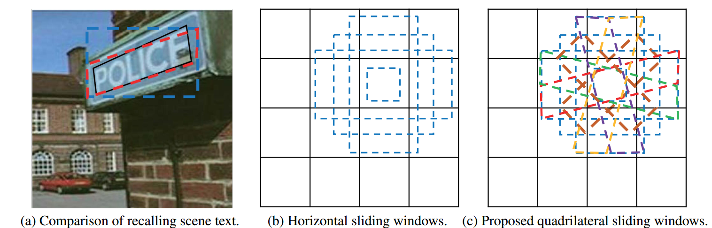
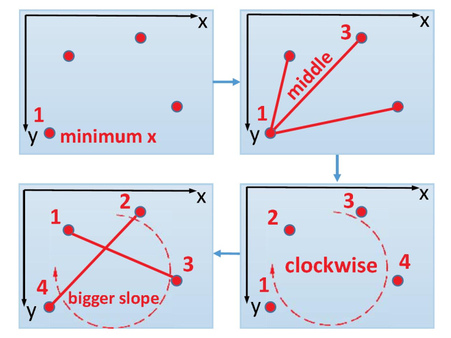
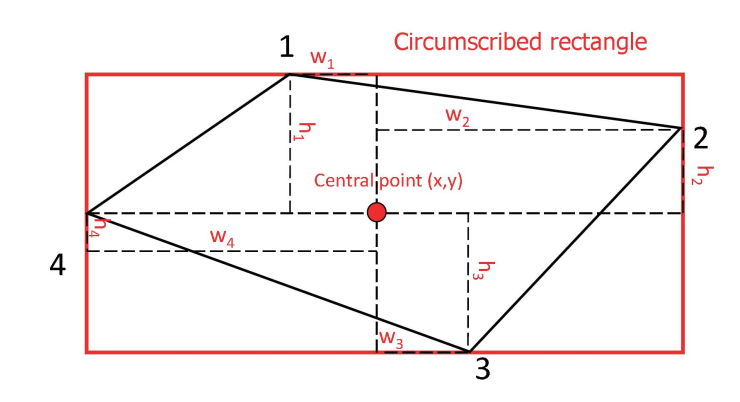

# Deep Matching Prior Network: Toward Tighter Multi-oriented Text Detection

## 摘要

## 1、简介

场景文本检测是许多基于内容的应用程序（例如，多语言翻译，盲目导航和汽车辅助）的重要先决条件[32、31、37、1、34]。 特别地，识别阶段总是需要预先对场景文本进行本地化，因此，对于能够紧密而稳健地对场景文本进行本地化的检测方法提出了重要要求。

摄像机捕获的场景文本通常质量低下； 这些文本可能具有多种方向，透视变形以及文本大小，颜色或比例的变化[40]，这使其成为一项非常具有挑战性的任务[39]。 在过去的几年中，已经成功地使用各种现有方法来检测水平或接近水平的文本[2、4、23、11、10]。 但是，由于水平矩形的限制，在实践中，例如在计算机上调用多向文本是有限制的。 在ICDAR 2015竞赛挑战4“偶然场景文本本地化”中报道了较低的准确性[14]。

近来，已经设计出了多种技术[35、36、13、39]用于多方向文本检测。 这些方法使用旋转矩形来定位定向文本。 然而，Ye and Doermann [34]指出，由于字符变形，文本的边界可能会失去矩形形状，并且矩形约束可能会导致冗余背景噪声，不必要的重叠甚至信息丢失，如图所示。 从图可以看出，基于矩形的方法必须面对三种情况：i）冗余信息可能会降低检测到的置信度的可靠性[18]，并使后续的识别更加困难[40]； ii）边缘文本可能未完全定位； iii）当使用非最大抑制[21]时，不必要的重叠可能会消除真实的预测。

为了解决这些问题，在本文中，我们提出了一种新的基于卷积神经网络（CNN）的方法，称为深度匹配先验网络（DMPNet），用于更严格的文本检测。据我们所知，这是首次尝试检测具有四边形的文本。基本上，我们的方法包括**两个步骤**：大致调用文本并微调预测的边界框。首先，基于对文本固有形状的先验知识，我们在特定的中间卷积层中设计了不同种类的四边形滑动窗口，以通过将重叠区域与预定阈值进行比较来大致调用文本。在此粗略过程中，由于需要计算滑动窗口（SW）和地面真值（GT）之间的许多多边形重叠区域，因此我们设计了一种共享的蒙特卡洛方法来解决此问题，从质量上证明了该方法比以前的方法更准确计算方法[30]。在粗略回忆文本之后，将对那些具有较大重叠区域的SW进行微调，以实现更好的本地化；与现有的使用矩形预测文本的方法[2、4、23、11、10、35、36、39]不同，我们的方法可以使用四边形来更紧密地定位场景文本，这是由于我们打算使用顺序协议和相对回归我们用了。此外，还提出了一种新的平滑Ln损失来进一步回归文本的位置，就鲁棒性和稳定性而言，它比L2损失和平滑L1损失具有更好的总体性能。在公共单词级和多方位数据集上进行的实验（ICDAR 2015健壮的阅读比赛挑战4“偶然场景文本本地化”）表明，在F测度方面，我们的方法优于以前的最新方法[33]

## 3、算法

本节介绍了深度匹配优先级网络（DMPNet）的详细信息。 它包括使我们的方法在文本本地化方面可靠和准确的关键贡献：首先，使用四边形滑动窗口粗略地调用文本； 然后，使用共享的蒙特卡洛方法快速准确地计算多边形面积； 使用四边形对文本进行精细定位，并设计“平滑Ln损失”以适度调整预测的边界框。

### 3.1. Roughly recall text with quadrilateral sliding window  

先前的方法[19，26]已经成功地在中间卷积层中采用了滑动窗口来大致调用文本。 尽管方法[26]可以基于滑动窗口准确地学习区域建议，但是这些方法对于实时或接近实时的应用来说太慢了。 为了提高速度，Liu [19]只是在几个具有不同比例的特征图中的每个位置上评估一小组不同纵横比的先验窗口，可以成功检测大小物体。 但是，在我们的实践中，水平滑动窗口通常很难回忆起多方位的场景文本。 受到最近成功的将文本特征和CNN集成的方法的启发[10，39]，我们提出了许多基于文本内在形状的四边形滑动窗口来大致调用文本。

在此粗略过程中，使用重叠阈值来判断滑动窗口是正值还是负值。 如果滑动窗口为正，它将用于精确定位文本。 基本上，较小的阈值可能会带来大量的背景噪音，从而降低精度，而较大的阈值可能会使文本更难以回忆。 但是，如果使用四边形滑动窗口，则滑动窗口和地面实况之间的重叠区域可以足够大以达到较高的阈值，这有利于提高召回率和精度，如**图2**所示。 我们保留水平滑动窗口，并根据文本固有形状的先验知识在其中同时设计几个四边形：a）在正方形内添加两个45度的矩形； b）在长矩形内添加两个长平行四边形。 c）在高矩形内添加两个高平行四边形。

**图2**.水平滑动窗口和四边形滑动窗口之间的比较。 （a）：黑色边界框代表地面真相； 红色代表我们的方法。 蓝色表示水平滑动窗口。 可以看到，四边形窗口比重叠区域更大的矩形窗口更容易调用文本。 （b）：[19]中使用的水平滑动窗。 （c）：拟议的四边形滑动窗。 不同的四边形滑动窗口可以用不同的颜色区分。

利用这些灵活的滑动窗口，粗略的边界框变得更加准确，因此子序列精细的过程可以更轻松地紧密定位文本。 另外，由于背景噪声较小，因此这些四边形滑动窗口的置信度在实践中可以更可靠，可以用来消除误报。

#### 3.1.1 Shared Monte-Carlo method  

如前所述，对于每个基本事实，我们需要计算每个四边形滑动窗口的重叠面积。 然而，先前的方法[30]只能以无法令人满意的计算精度来计算矩形区域，因此我们提出了一种共享的蒙特卡洛方法，该方法在计算多边形区域时兼具高速性和准确性。 我们的方法包括两个步骤。

a）首先，我们在地面真实情况的外接矩形中均匀采样10,000个点。 可以通过计算总点中重叠点的比例乘以外接矩形的面积来计算地面真值（SGT）的面积。 在此步骤中，地面真相内的所有点都将保留用于共享计算。

b）其次，如果每个滑动窗口的外接矩形和每个地面实况的外接矩形没有相交，则重叠区域被认为是零，我们不需要进一步计算。 如果重叠区域不为零，我们将使用相同的采样策略来计算滑动窗口的面积（SSW），然后从滑动窗口的第一步开始计算多少个保留点。 内点之比乘以外接矩形的面积即为重叠面积。 特别地，此步骤适合使用GPU并行化，因为我们可以使用每个线程来负责使用指定的地面真实性来计算每个滑动窗口，从而可以在短时间内处理数千个滑动窗口。

注意，我们使用[12]中提出的方法来判断一个点是否在多边形内部，该方法也称为交叉数算法或偶数规则算法[5]。 图3显示了先前方法与我们的算法之间的比较，该方法在实践中显示出令人满意的多边形面积计算性能

### 3.2. Finely localize text with quadrangle  

微调过程着重于使用具有较大重叠区域的那些滑动窗口来紧密地定位文本。 与可以由两个对角点确定的水平矩形不同，我们需要预测四个点的坐标以定位四边形。 但是，仅使用4个点来形成四边形很容易自相矛盾，因为主观注释可能会使网络难以确定哪个是第一个点。 因此，在训练之前，必须提前排序4个点。

坐标的顺序协议。可以使用提议的协议确定平面凸四边形中四个点的顺序，该步骤包含四个步骤，如**图4**所示。首先，我们确定最小值为x的第一个点。如果两个点同时具有最小值x，则我们选择值y较小的点作为第一点。其次，我们将第一个点连接到其他三个点，然后从中间斜率的直线中找到第三个点。第二点和第四点在中间线的相反侧（定义为“较大”侧和“较小”侧）。在这里，我们假设中线Lm为：ax + by + c = 0;我们定义了一个不确定点P（xp; yp）。如果Lm（P）> 0，我们假设P在“更大”的一面。如果Lm（P）<0，则在“较小”侧假定P。基于此假设，“较大”侧的点将被分配为第二点，最后一个点将被视为第四点。最后一步是比较两个对角线（第13行和第24行）之间的斜率。从具有较大斜率的线中，选择具有较小x的点作为新的第一点。特别是，如果较大的斜率是无限大的，则将选择y较小的点作为第一点。同样，我们找出第三点，然后可以再次确定第二点和第四点。完成这四个步骤后，可以唯一确定给定凸四边形中四个点的最终顺序。

**图4**.从平面凸四边形唯一确定四个点的顺序的过程。

基于顺序协议，DMPNet可以通过计算到中心点的相对位置来清楚地学习和回归每个点的坐标。与文献[26]不同，对于矩形预测，回归两个坐标和两个长度，我们的回归方法预测对四边形检测的两个坐标和八个长度。对于每个基本事实，四个点的坐标将重新格式化为（x; y; w1; h1; w2; h2; w3; h3; w4; h4），其中x，y是最小外接水平矩形的中心坐标和wi; hi是第i个点（i = f1; 2; 3; 4g）到中心点的相对位置。如**图5**所示，四个点（x1，y1，x2，y2，x3，y3，x4，y4）的坐标=（x + w1，y + h1，x + w2，y + h2，x + w3，y + h3，x + w4，y + h4）。请注意，wi和hi可以为负。实际上，八个坐标足以确定一个四边形的位置，而我们使用十个坐标的原因是因为我们可以避免对不包含相关信息的8个坐标进行回归，因此在实践中更难学习[6]。受[26]的启发，我们还将Lreg（pi; p ∗ i）= R（pi-p ∗ i）用于多任务损失，其中R是我们建议的损失函数（平稳Ln），将在3.4节中进行描述。 。 p ∗ =（p ∗ x; p ∗ y; p ∗ w1; p ∗ h1; p ∗ w2; p ∗ h2; p ∗ w3; p ∗ h3; p ∗ w4; p ∗ h4）表示的十个参数化坐标p =（px; py; pw1; ph1; pw2; ph2; pw3; ph3; pw4; ph4）表示基本事实。

