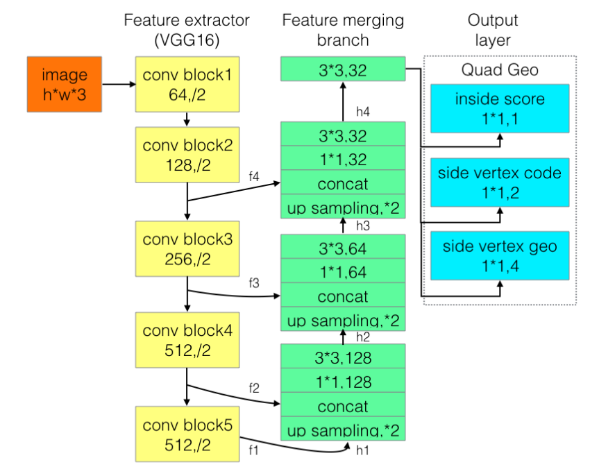

# EAST: An Efficient and Accurate Scene Text Detector

https://arxiv.org/pdf/1704.03155.pdf

## 摘要

用于场景文本检测的先前方法已经在各种基准测试中获得了良好的性能。然而，在处理具有挑战性的场景时，即使配备了深度神经网络模型，它们通常也会达不到很好性能，因为整体性能取决于管道中多个阶段和组件的相互作用。在这项工作中，我们提出了一个简单而强大的管道，可以在自然场景中产生快速准确的文本检测。算法流程直接预测完整图像中任意方向和四边形形状的单词或文本行，消除了使用单个神经网络的不必要的中间步骤（例如，候选聚合和字分区）。我们的算法流程非常简单，可以集中精力设计损耗函数和神经网络架构。在标准数据集（包括ICDAR 2015，COCO-Text和MSRA-TD500）的实验表明，所提出的算法在准确性和效率方面明显优于最先进的方法。在ICDAR 2015数据集上，所提出的算法在720p分辨率下以13.2fps达到0.7820的F-score。

## 简介
最近，提取和理解自然场景中包含的文本信息变得越来越重要和受欢迎，ICDAR系列竞赛的前所未有的大量参与者[30,16,15]和NIST推出的TRAIT 2016评估证明了这一点。[1]。

文本检测作为后续过程的先决条件，在文本信息提取和理解的整个过程中起着至关重要的作用。先前的文本检测方法[2,33,12,7,48]已经在该领域的各种基准上获得了有希望的表现。文本检测的核心是区分文本和背景的功能设计。传统上，特征是手动设计[5,25,40,10,26,45]来捕捉场景文本的属性，而在深度学习中,是基于方法[3,13,11,12,7,48]直接从训练数据中学习有效特征。

然而，现有的方法，无论是传统方法还是基于深度神经网络，主要由若干阶段和组件组成，这些方法和组件可能是次优的和耗时的。因此，这些方法的准确性和效率仍远远不能令人满意。

在本文中，我们提出了一个快速准确的场景文本检测管道，它只有两个阶段。该算法流程使用全卷积网络（FCN）模型直接生成单词或文本行级别预测，剔除冗余和慢速中间步骤。生成的文本预测（可以是旋转的矩形或四边形）被送到非最大抑制算法中以产生最终结果。根据标准基准的定性和定量实验，与现有方法相比，该算法实现了显着增强的性能，同时运行速度更快。具体而言，所提出的算法在ICDAR 2015 [15]（在多尺度下测试时为0.8072），在MSRA-TD500 [40]上为0.7608，在COCO-Text上为0.3945 [36]时，得分为0.7820，优于之前的状态 - 性能最先进的算法，同时平均花费的时间少得多（在Titan-X GPU上，对于我们最好的模型，在720p分辨率下为13.2fps，对于我们最快的模型，为16.8fps）。
这项工作的贡献有三方面：

1. 我们提出了一种场景文本检测方法，包括两个阶段：完全卷积网络和NMS合并阶段。 FCN直接生成文本区域，不包括冗余和耗时的中间步骤。
2. 算法可以灵活地生成字级或线级预测，其几何形状可以是旋转框或四边形，具体取决于具体应用。
3. 所提出的算法在精度和速度方面明显优于最先进的方法。

## 相关工作

场景文本检测和识别已经成为计算机视觉领域长期研究的热点。 已经研究了许多鼓舞人心的想法和有效的方法[5,25,26,24,27,37,11,12,7,41,42,31]。 综合评论和详细分析可以在调查论文中找到[50,35,43]。本节将重点介绍与所提算法最相关的工作。
传统方法依赖于手动设计的特征。基于行程宽度变换（SWT）[5]和最大稳定极值区域（MSER）[25,26]的方法通常通过边缘检测或极值区域提取来寻找候选字符。张等人， [47]利用文本的局部对称性，并为文本区域检测设计了各种特征。FASText [2]是一种快速文本检测系统，它可以调整和修改众所周知的FAST关键点检测器，用于笔画提取。然而，就精度和适应性而言，这些方法落后于基于深度神经网络的方法，尤其是在处理具有挑战性的场景时，例如低分辨率和几何失真。

最近，场景文本检测领域进入了一个新的时代，基于深度神经网络的算法[11,1348,7]逐渐成为主流。黄等人， [11]首先找到使用MSER的候选框，然后使用深度卷积网作为强分类器来修剪误报。Jaderberg等人的方法。 [13]以滑动窗口的方式扫描图像，并使用卷积神经网络模型为每个尺度生成密集的热图。后来，Jaderberg等人。 [12]同时使用CNN和ACF来搜索候选词，并使用回归进一步细化它们。田等人， [34]开发了垂直锚并构建了CNN-RNN联合模型来检测水平文本行。与这些方法不同，张等人。 [48]建议利用FCN [23]进行热图生成，并使用分量投影进行方向估计。这些方法在标准基准测试中获得了优异的性能 然而，如图2（a-d）所示，它们主要由多个阶段和组件组成，例如通过后置滤波的假阳性去除，候选聚合，线形成和字分区。 多个阶段和组件可能需要进行详尽的调整，从而导致次优性能，并增加整个流水线的处理时间。

## 算法

该算法的关键组成部分是神经网络模型，该模型经过训练可直接预测文本实例的存在及其几何形状的完整图像。该模型是一个全卷积的神经网络，适用于文本检测，输出密集的每像素预测的单词或文本行。这消除了候选提案，文本区域形成和字分区等中间步骤。 后处理步骤仅包括预测几何形状的阈值和NMS。 探测器被命名为EAST，因为它是一个高效精确的场景文本检测流程。

### 3.1 Pipeline

我们的算法的高级概述如图2(e)所示。 该算法遵循DenseBox [9]的一般设计，其中图像送入到FCN，并且生成多个像素级文本得分图和几何通道。

预测通道之一是得分图，其像素值在[0,1]的范围内。 其余通道表示从每个像素的视图中包围该单词的几何。 分数代表在相同位置预测的几何形状的置信度。

我们已经为文本区域，旋转框（RBOX）和四边形（QUAD）实验了两种几何形状，并为每种几何设计了不同的损失函数。 然后将阈值处理应用于每个预测区域，其中得分超过预定阈值的几何被认为是有效的并且被保存用于稍后的非最大抑制。 NMS之后的结果被认为是管道的最终输出。

### 3.2 Network Design

在设计用于文本检测的神经网络时必须考虑几个因素。由于字区域的大小（如图5所示）变化很大，因此确定大字的存在需要来自神经网络后期的特征，而预测包含小字区域的精确几何需要早期阶段的低级信息。因此，网络必须使用不同级别的功能来满足这些要求。HyperNet [19]在特征映射上满足这些条件，但在大特征映射上合并大量通道会显着增加后续阶段的计算开销。

为了解决这个问题，我们采用U形[29]的思想逐步合并特征图，同时保持上采样分支较小。我们一起最终得到的网络既可以利用不同级别的功能，又可以保持较低的计算成本。

我们模型的示意图如图3所示。模型可以分解为三个部分：特征提取器，特征合并分支和输出层。
主干网络是在ImageNet [4]数据集上预训练的卷积网络，具有交错卷积和池化层。四个大小级别的特征图，分别是输入的$ \frac{1}{32} $ ,$ \frac{1}{16} $,$\frac{1}{8} $,$ \frac{1}{4} $
图3表示PVANet网络。在我们实验中，我们采用了著名的VGG16网络，提取pooling-2到pooling-5之后的特征图。

在合并分支中，我们逐渐合并它们：
$$
\begin{align*}
&g_{i}=\left\{\begin{array}{ll}
{\operatorname{unpool}\left(h_{i}\right)} & {\text { if } \quad i \leq 3} \\
{\operatorname{conv}_{3 \times 3}\left(h_{i}\right)} & {\text { if } \quad i=4}
\end{array}\right.\\

&h_{i}=\left\{\begin{array}{ll}
{f_{i}} & {\text { if } i=1} \\
{\operatorname{conv}_{3 \times 3}\left(\operatorname{conv}_{1 \times 1}\left(\left[g_{i-1} ; f_{i}\right]\right)\right)} & {\text { otherwise }}
\end{array}\right.
\end{align*}
$$
其中$g_i$ 是合并基础，$h_i$ 是合并特征映射，运算符[·; ·]表示沿通道轴连接特征图。在每个合并阶段，来自最后一个阶段的特征映射首先被馈送到上采样层以使其大小加倍，然后与当前特征映射连接。接下来，conv 1×1[8]减少通道数量并减少计算，然后转换融合信息的conv 3×3，最终产生该合并阶段的输出。在最后一个合并阶段之后，转换3×3层产生合并分支的最终特征图并将其馈送到输出层。

每个卷积的输出通道数如图3所示。我们将分支中的卷积通道数保持较小，这仅增加了一小部分计算开销，使网络计算效率更高。最终输出层包含若干转1×1操作以将32通道的特征图投影到1通道的得分图$F_s$和多通道几何图$F_g$ 中。几何输出可以是RBOX或QUAD之一，在Tab1中汇总:

对于RBOX，几何形状由4个通道的轴对齐边界框（AABB）R和1个通道旋转角θ表示。R的公式与[9]中的公式相同，其中4个通道分别表示从像素位置到矩形的顶部，右侧，底部，左边界的4个距离。

对于QUAD Q，我们使用8个数字来表示从四个角顶点{p i |的坐标偏移 i∈{1,4,3,4}}四边形到像素位置。由于每个距离偏移包含两个数字（Δxi，Δyi），因此几何输出包含8个通道。

### 3.3. Label Generation

#### 3.3.1 Score Map Generation for Quadrangle

不失一般性，我们只考虑几何是四边形的情况。分数图上的四边形的正面积被设计为大致**缩小(shrunk)** 的原始面积，如图4（a）所示。

对于一个四边形 $Q=\{p_i|i=\{1,2,3,4\}\}$ ，其中$p_i=\{x_i,y_i\}$是四边形上的顶点，以顺时针顺序排列。为了缩小Q，我们首先计算每个顶点 $p_i$ 的参考长度$r_i$:
$$
r_i=min(D(p_i,p_{(i\ mod\ 4)+1)}, D(p_i,p_{((i+2)\ mod\ 4)+1)})
$$
其中$D(p_i,p_j)$是$p_i$和$p_j$之间的L2距离。我们首先缩小四边形的两个较长边，然后缩短两个较短边。对于每对两个相对的边，我们通过比较它们的长度的平均值来确定“更长”的对。对于每个边<$p_i$，$p_{(i\ mod\ 4)+1}$>，我们通过将两个端点沿着边缘向内移动$0.3r_i$ 和$0.3r(i\ mod\ 4)+1$ 来缩小它。

#### 3.3.2 Geometry Map Generation

如3.2所述，几何图可以是RBOX或QUAD之一。 RBOX的生成过程如图4（c-e）所示。对于那些文本区域以QUAD样式注释的数据集（例如，ICDAR 2015），我们首先生成一个旋转的矩形，覆盖区域最小的区域。然后对于每个具有正分数的像素，我们计算它到文本框的4个边界的距离，并将它们放到RBOX地面实况的4个通道中。对于QUAD的ground truth，8通道几何图中具有正分数的每个像素的值是其从四边形的4个顶点的坐标偏移。

### 3.4. Loss Functions

#### 损失可以表述为

$$
L = L_s+\lambda_gL_g
$$
其中$L_s$和$L_g$分别代表得分图和几何图形的损失，$λ_g$衡量两次损失之间的重要性。 在我们的实验中，我们将$λ_g$ 置为1。

#### 3.4.1 Loss for Score Map

在大多数最先进的检测算法中，训练图像通过平衡采样和hard negative mining 精心处理，以解决目标物体的不平衡分布**[Densebox,Faster r-cnn]**。这样做可能会提高网络性能。然而，使用这些技术不可避免地引入了不可微分的阶段和更多的参数来调谐和更复杂的管道，这与我们的设计原理相矛盾。

为方便更简单的训练程序，我们使用[38]中引入的平衡交叉熵，由下式给出：
$$
\begin{equation}
\begin{aligned}
L_{\mathrm{s}} &=\text { balanced-xent }\left(\hat{\mathbf{Y}}, \mathbf{Y}^{*}\right) \\
&=-\beta \mathbf{Y}^{*} \log \hat{\mathbf{Y}}-(1-\beta)\left(1-\mathbf{Y}^{*}\right) \log (1-\hat{\mathbf{Y}})
\end{aligned}
\end{equation}
$$
其中Ŷ= $F_s$ 是得分图的预测，Y*是ground truth。参数β是正样本和负样本之间的平衡因子，由下式给出:
$$
\begin{equation}
\beta=1-\frac{\sum_{y^{*} \in \mathbf{Y}} \cdot y^{*}}{\left|\mathbf{Y}^{*}\right|}
\end{equation}
$$
这种平衡的交叉熵损失首先在Yao等人的文本检测中被采用。 [41]作为得分图预测的目标函数。 我们发现它在实践中运作良好。

#### 3.4.2 Loss for Geometries

文本检测的一个挑战是自然场景图像中文本的大小差别很大。直接使用L1或L2损失进行回归将指导损失偏向更大和更长的文本区域。由于我们需要为大文本区域和小文本区域生成准确的文本几何预测，因此回归损失应该是尺寸不变的。因此，我们再RBOX的AABB部分中的采用IoU-loss，以及再QUAD回归采用尺度标准化平滑L1损失。

**RBOX** 对于AABB部分，我们采用[46]中的IoU损失，因为它对不同尺度的物体是不变的。
$$
\begin{equation}
L_{\mathrm{AABB}}=-\log \operatorname{IoU}\left(\hat{\mathbf{R}}, \mathbf{R}^{*}\right)=-\log \frac{\left|\hat{\mathbf{R}} \cap \mathbf{R}^{*}\right|}{\left|\hat{\mathbf{R}} \cup \mathbf{R}^{*}\right|}
\end{equation}
$$
其中R代表预测的AABB几何，R* 代表其相应的ground truth。 很容易看出相交矩形的宽度和高度 |R∩R* | 是
$$
\begin{equation}
\begin{array}{l}
{w_{\mathbf{i}}=\min \left(\hat{d}_{2}, d_{2}^{*}\right)+\min \left(\hat{d}_{4}, d_{4}^{*}\right)} \\
{h_{\mathbf{i}}=\min \left(\hat{d}_{1}, d_{1}^{*}\right)+\min \left(\hat{d}_{3}, d_{3}^{*}\right)}
\end{array}
\end{equation}
$$
其中d1，d2，d3和d4分别表示从像素到其对应矩形的顶部，右侧，底部和左侧边界的距离。对应的联合区域是
$$
\begin{equation}
\left|\hat{\mathbf{R}} \cup \mathbf{R}^{*}\right|=|\hat{\mathbf{R}}|+\left|\mathbf{R}^{*}\right|-\left|\hat{\mathbf{R}} \cap \mathbf{R}^{*}\right|
\end{equation}
$$
因此，可以容易地计算交叉/联合区域。 接下来，旋转角度的损失计算为
$$
\begin{equation}
L_{\theta}\left(\hat{\theta}, \theta^{*}\right)=1-\cos \left(\hat{\theta}-\theta^{*}\right)
\end{equation}
$$
其中θ是对旋转角度的预测，θ*表示基本事实。 最后，整体几何损失是AABB损失和角度损失的加权和，由下式给出
$$
L_g=L_{AABB}+\lambda_\theta L_\theta
$$
其中λθ在我们的实验中设置为10。请注意，无论旋转角度如何，我们都会计算$L_{AABB}$ 当角度被完美预测时，这可以看作是四边形IoU的近似值。 虽然在训练期间并非如此，但它仍然可以为网络施加正确的梯度以学习预测R.

**QUAD 略**

### 3.5. Training

使用ADAM [18]优化器对网络进行端到端的培训。 为了加快学习速度，我们从中均匀采样512x512裁剪图像，形成24的小批量.ADAM的学习率从1e-3开始，每27300个小批量衰减到十分之一，并停在1e-5。 训练网络直到性能停止改善。

### 3.6. Locality-Aware NMS

为了形成最终结果，应将阈值后仍存在的几何形状由NMS合并。 朴素的NMS算法在O（$n^2$）中运行，其中n是候选几何图形的数量，这是不可接受的，因为我们正面临来自密集预测的数以万计的几何图形。

在假设来自附近像素的几何图形倾向于高度相关的假设下，我们建议逐行合并几何图形，并且在合并同一行中的几何图形时，我们将迭代地合并当前遇到的几何图形与最后合并的几何图形。 在最佳情况下，这种改进的技术可以在O（n）中运行。 即使它的最坏情况与朴素一样，只要保持局部性假设，该算法在实践中也足够快地运行。 该过程在算法1中进行了总结

值得一提的是，在WEIGHTEDMERGE（g, p）中，合并的四边形的坐标由两个给定四边形的分数加权平均。 具体来说，如果a = WEIGHTEDMERGE（g; p），则ai = V（g）gi + V（p）pi和V（a）= V（g）+ V（p），其中ai是其中之一 下标i的坐标，而V（a）是几何a的分数。

实际上，我们有一个微妙的区别，我们是“平均”而不是“选择”几何形状，就像在标准NMS程序中那样，它起着投票机制的作用，反过来在馈送视频时引入了稳定效果。 尽管如此，在功能描述上我们仍然采用“ NMS”一词。

# Advanced EAST

该算法所解决的问题是对**长文本预测**效果不好的问题。因此，对EAST的输出层结构进行修改，一个通道预测该像素是否在文本框内；两个通道预测该像素是文本框的头像素还是尾像素；四个通道预测头像素或尾像素对应的距离两个顶点坐标的偏移量。

损失函数仍使用的是EAST算法的类平衡交叉熵损失和SmoothL1损失

输出层分别是1位score map, 是否在文本框内；2位vertex code，是否属于文本框边界像素以及是头还是尾；4位geo，是边界像素可以预测的2个顶点坐标。其中所有像素构成了文本框形状，然后只用边界像素去预测回归顶点坐标。边界像素定义为黄色和绿色框内部所有像素，是用所有的边界像素预测值的加权平均来预测头或尾的短边两端的两个顶点。头和尾部分边界像素分别预测2个顶点，最后得到4个顶点坐标。

