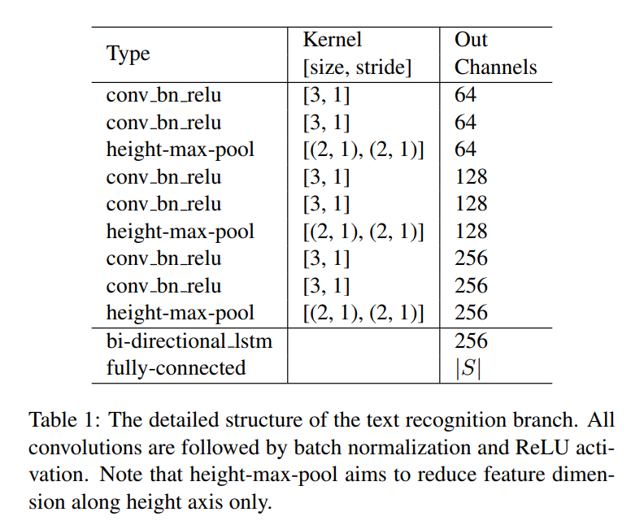

# FOTS: Fast Oriented Text Spotting with a Unified Network

https://arxiv.org/pdf/1801.01671.pdf

## 摘要

附带场景的文本识别被认为是文档分析社区中最困难和最有价值的挑战之一。大多数现有的方法将文本检测和识别作为独立的任务。在这项工作中，我们提出了一个统一的端到端可训练的快速定向文本检测(Fots)网络，用于同时检测和识别，在两个互补的任务之间共享计算和视觉信息。特别地，引入RoIRotate来共享检测和识别之间的卷积特征。得益于卷积共享策略，与基线文本检测网络相比，我们的Fots算法具有较小的计算开销，并且联合训练方法学习了更多的通用特征，使我们的方法比这两个阶段的方法具有更好的性能。在ICDAR 2015、ICDAR 2017 MLT和ICDAR 2013数据集上的实验表明，该方法的性能明显优于现有的文本检测方法，在保持22.6fps的前提下，我们开发的第一个面向实时的文本检测系统在ICDAR 2015文本检测任务上比以往的所有最先进的文本检测结果都提高了5%以上。

## 1、简介

自然图像中的文本阅读由于其在文档分析、场景理解、机器人导航和图像检索中的大量实际应用，在计算机视觉领域引起了越来越多的关注。虽然以往的工作在文本检测和文本识别方面都取得了很大的进展，但由于文本模式变化大，背景高度复杂，仍然具有挑战性。

场景文本阅读中最常见的方式是将其分为文本检测和文本识别，这两个任务被作为两个单独的任务来处理。基于深度学习的方法在这两个方面都占据主导地位。在文本检测中，通常使用卷积神经网络从场景图像中提取特征映射，然后使用不同的解码器对区域进行解码。而在文本识别中，用于顺序预测的网络一个接一个地在文本区域之上进行。这会导致很大的时间开销，特别是对于包含多个文本区域的图像。另一个问题是它忽略了检测和识别中共享的视觉线索之间的相关性。来自文本识别的标签不能监督单个检测网络，反之亦然。

在本文中，我们提出同时考虑文本检测和识别。它导致了可端到端训练的快速定向文本检测系统(FOTS)。与以往的两阶段文本检测不同，我们的方法通过卷积神经网络学习更多的通用特征，这些特征在文本检测和文本识别中是共享的，并且两个任务的监督是互补的。由于特征提取通常需要花费大部分时间，因此它将计算量缩减到单个检测网络，如图1所示。连接检测和识别的关键是ROIRotate，它根据定向检测边界框从特征映射中获取合适的特征。

其体系结构如图2所示。首先利用共享卷积提取特征地图。在特征映射的基础上建立基于全卷积网络的文本检测分支，对检测边界框进行预测。RoIRotate运算符从特征地图中提取与检测结果相对应的文本建议特征。然后，文本建议特征被馈送到递归神经网络(RNN)编码器和连接式时态分类(CTC)解码器用于文本识别。由于网络中的所有模块都是可微分的，因此整个系统可以进行端到端的训练。据我们所知，这是第一个面向文本检测和识别的端到端可训练框架。我们发现，该网络不需要复杂的后处理和超参数整定，就可以很容易地进行训练。

## 2、相关工作

文本定位是计算机视觉和文档分析领域的一个活跃课题。在这一部分中，我们简要介绍了相关的工作，包括文本检测、文本识别和文本检测方法，它们结合在一起。

### 2.1 文本检测（Text Detection）

大多数传统的文本检测方法将文本视为字符的组合。这些基于字符的方法首先定位图像中的字符，然后将它们分组为单词或文本行。基于滑动窗口的方法和基于连通分量的方法是传统方法中具有代表性的两类方法。

近年来，人们提出了许多基于深度学习的方法来直接检测图像中的单词。采用垂直锚定机构预测固定宽度的顺序方案，然后将它们连接起来。通过提出旋转RPN和旋转ROI池，提出了一种适用于任意方向文本的基于旋转的新框架。首先预测文本段，然后使用链接预测将它们链接成完整的实例。通过密集的预测和一步后处理，提出了面向多方向场景文本检测的深度直接回归方法。

### 2.2 文本识别（Text Recognition）

通常，场景文本识别的目的是从规则裁剪但长度可变的文本图像中解码一系列标签。大多数以前的方法捕获单个字符，并在以后细化错误分类的字符。除了字符级的方法外，目前的文本区域识别方法可以分为三类：**基于单词分类的方法**、**基于序列到标签解码的方法**和**基于序列到序列模型的方法**。

Jaderberg等人将单词识别问题归结为一个具有大量类别标签(约90K字)的传统多类别分类任务。苏·埃塔尔框架文本识别是一个序列标注问题，其中RNN建立在HOG特征的基础上，并采用CTC作为解码器。史等人提出深度递归模型对最大限度的CNN特征进行编码，并采用CTC对编码后的序列进行解码。Fujii et al.提出了一种用于生成CTC输入序列的编码器和汇总器网络。Lee等人。[31]使用基于注意力的序列到序列结构来自动聚焦于某些提取的CNN特征，并隐含地学习包含在RNN中的字符级语言模型。为了处理不规则的输入图像，Shih et al.。[45]和刘等人。[37]引入空间注意机制，将扭曲的文本区域转换为适合识别的规范姿态。

### 2.3 文本发现（Text Spotting）

大多数以前的文本检测方法首先使用文本检测模型生成文本建议，然后使用单独的文本识别模型来识别它们。贾德伯格·埃塔尔。[20]首先使用集成模型生成具有较高召回率的整体文本建议，然后使用单词分类器进行单词识别。Gupta等人训练Fully卷积回归网络进行文本检测和单词分类器进行文本识别。廖等人使用基于SSD的文本检测方法和基于CRNN[44]的文本识别方法。

最近，李等人提出了自己的观点。提出了一种端到端的文本检测方法，该方法利用RPN启发的文本建议网络进行文本检测，采用带注意力机制的LSTM进行文本识别。与它们相比，我们的方法主要有两个优点：(1)引入RoIRotate，使用完全不同的文本检测算法来解决更复杂、更困难的情况，而他们的方法只适用于水平文本。(2)我们的方法在速度和性能上都远远优于他们的方法，特别是几乎免费的文本识别步骤使我们的文本识别系统能够以实时的速度运行，而他们的方法处理600×800像素的输入图像需要大约900ms的时间。

## 3、算法

FOTS是一种端到端的可训练框架，可以同时检测和识别自然场景图像中的所有单词。它由四部分组成：**共享卷积**、**文本检测分支**、**RoIRotate运算**和**文本识别分支**。

### 3.1 整体架构

**图2**概述了我们的框架，文本检测分支和识别分支共享卷积特征，**共享网络**的体系结构**如图3**所示。共享网络的主干是**ResNet-50**。受FPN的启发，我们将**低级特征映射**和**高级语义特征映射**连接起来。共享卷积产生的特征图的分辨率是输入图像的四分之一。**文本检测分支**使用共享卷积产生的特征输出文本的密集每像素预测。RoIRotate算法利用检测分支生成的面向文本区域方案，在保持原有区域纵横比不变的情况下，将相应的共享特征转换为固定高度的表示。最后，文本识别分支识别区域建议中的单词。采用CNN和LSTM对文本序列信息进行编码，然后采用CTC解码器。我们的文本识别分支的结构如表1中所示

### 3.2 文本检测分支

我们采用**全卷积网络**作为文本检测器。由于自然场景图像中含有大量的小文本框，在共享卷积块中将特征映射从原来输入图像的**1/32提高到1/4**。在提取共享特征后，应用一次卷积来输出密集的每像素的单词预测。第一通道计算每个像素为正样本的概率。原始文本区域的缩小版本中的像素被视为正值。对于每个正样本，以下4个通道预测其到包含此像素的边界框的顶部、底部、左侧和右侧的距离，最后一个通道预测相关边界框的方向。通过对这些阳性样本应用阈值和NMS，产生最终的检测结果。

在实验中，我们观察到许多类似于文本笔画的模式很难分类，如栅栏、格子等。我们采用**在线难例挖掘(OHEM)**来更好地区分这些模式，这也解决了类不平衡问题。这在ICDAR 2015数据集上提供了约2%的F-Measure改进。

检测分支损失函数由两个小数组成：**文本分类项**和**边框回归项**。文本分类项可以被视为下采样分数图的像素分类损失。只有原始文本区域的缩小版本被认为是正值区域，而边框和缩小版本之间的区域被认为是“无关紧要的”，不会对分类造成损失。将评分图中由OHEM选择的正元素集合表示为Ω，**分类损失函数**可表示为：
$$
\begin{align*}
L_{cls} &= \frac{1}{|\Omega|}\sum_{x\in\Omega}H(p_x,p_x^*)\\
&=\frac{1}{|\Omega|}\sum_{x\in\Omega}(-p_x^*\log p_x - (1-p_x^*)\log (1-p_x))
\end{align*}
$$
其中|·|是集合中的元素数,$H(p_x,p_x^*)$ 表示交叉熵损失。$p_x$ 表示评分图的预测， $p_x^*$ 表示文本的二进制标签索引或非文本。

对于回归损失，我们采用**[Unitbox]**中的IoU损失和**[East]**中的旋转角度损失，因为它们对对象形状、大小和方向的变化具有鲁棒性：
$$
L_{reg}=\frac{1}{|\Omega|}\sum_{x\in \Omega}IoU(R_x,R_x^*)+
\lambda_{\theta}(1-\cos(\theta_x,\theta_x^*))
$$
$IoU(R_x,R_x^*)$ 是预测边框$R_x$ 和 真实边框$R_x^*$ 之间的IoU损失。第二项是旋转角度损失，$\theta_x$ 和$\theta_x^*$ 分别表示预测方向和真实方向。在实验中，我们设置超参数$\lambda_{\theta}$ 为10。

因此，完整的检测损失可以表示为：
$$
L_{detect}=L_{cls}+\lambda_{reg}L_{reg}
$$
超参数$\lambda_{reg}$ 平衡了两个损失，在我们的实验中设置为1。

### 3.3 RoIRotate

RoIRotate对定向特征区域进行变换，得到轴向特征图，如图4所示。在本工作中，我们固定输出高度，保持长宽比不变，以应对文本长度的变化。与ROI池化**[FasterRCNN]**和RoIAlign**[MaskRCNN]**相比，RoIRotate为提取感兴趣区域的特征提供了更一般的操作。我们还与RRPN[39]中提出的RRoI pooling proposed进行了比较。RRoI池化通过最大池化将旋转区域转换为固定大小的区域，而我们使用双线性插值来计算输出值。该操作避免了ROI和提取的特征之间的不对准，并且另外它使得输出特征的长度可变，这更适合于文本识别。

这个过程可以分为两个步骤。首先，通过文本建议的预测或地面真值坐标计算仿射变换参数。然后，对每个区域的共享特征映射分别进行仿射变换，得到文本区域的典范水平特征映射。第一步可以表述为：
$$
\begin{align*}
&t_x=l*\cos{\theta}-t*\sin{\theta}-x\\
&t_y=t*\cos\theta+l*\sin\theta-y\\
&s=\frac{h_t}{t+b}\\
&\omega_t=s*(l+r)\\
&\begin{aligned}
\mathbf{M} &=\left[\begin{array}{ccc}
{\cos \theta} & {-\sin \theta} & {0} \\
{\sin \theta} & {\cos \theta} & {0} \\
{0} & {0} & {1}
\end{array}\right]\left[\begin{array}{ccc}
{s} & {0} & {0} \\
{0} & {s} & {0} \\
{0} & {0} & {1}
\end{array}\right]\left[\begin{array}{ccc}
{1} & {0} & {t_{x}} \\
{0} & {1} & {t_{y}} \\
{0} & {0} & {1}
\end{array}\right] \\
&=s\left[\begin{array}{ccc}
{\cos \theta} & {-\sin \theta} & {t_{x} \cos \theta-t_{y} \sin \theta} \\
{\sin \theta} & {\cos \theta} & {t_{x} \sin \theta+t_{y} \cos \theta} \\
{0} & {0} & {\frac{1}{s}}
\end{array}\right]
\end{aligned}
\end{align*}
$$
其中M是仿射变换矩阵。$h_t$ ,$\omega_t$ 表示仿射变换后的特征图的高度(在我们的设置中等于8)和宽度。(x，y)表示共享特征图中点的坐标，(t，b，l，r)分别表示到文本建议顶部、底部、左侧和右侧的距离，θ表示方向。(t，b，l，r)和θ可以由真实值或检测分支给出。

有了变换参数，就可以很容易地使用仿射变换产生最终的ROI特征：
$$
\begin{equation}
\left(\begin{array}{c}
{x_{i}^{s}} \\
{y_{i}^{s}} \\
{1}
\end{array}\right)=\mathbf{M}^{-1}\left(\begin{array}{c}
{x_{i}^{t}} \\
{y_{i}^{t}} \\
{1}
\end{array}\right)
\end{equation}
$$
并且$\forall i\in[1\dots h_t],\forall j\in[1\dots \omega_t],\forall c\in[1\dots C]$
$$
\begin{equation}
V_{i j}^{c}=\sum_{n}^{h_{s}} \sum_{m}^{w_{s}} U_{n m}^{c} k\left(x_{i j}^{s}-m ; \Phi_{x}\right) k\left(y_{i j}^{s}-n ; \Phi_{y}\right)
\end{equation}
$$
$V_{i j}^{c}$ 是通道c中坐标（i, j）位置的输出值。$U_{n m}^{c}$ 是通道c中坐标（n, m）位置的输入值。$h_s$, $\omega_s$ 表示输入的高和宽。$\Phi_x$,$\Phi_{y}$ 是泛型抽样内核k的参数。它定义了插值方法，特别是本文中的双线性插值。由于文本建议的宽度可能不同，在实际应用中，我们将特征映射填充到最大宽度，而忽略了识别损失函数中的填充部分。

空间变换网络[21]以类似的方式使用仿射变换，但通过不同的方法获得变换参数，并且主要用于图像域，即变换图像本身。RoIRotate将共享卷积产生的特征地图作为输入，生成所有文本提案的特征地图，高度固定，纵横比不变。

与对象分类不同，文本识别对检测噪声非常敏感。预测文本区域的微小误差可能会截断多个字符，不利于网络训练，因此在训练过程中使用地面真实文本区域来代替预测文本区域。在测试时，应用阈值和NMS对预测文本区域进行过滤。在RoIRotate之后，转换后的特征映射被馈送到文本识别分支。

### 3.4 文本识别分支

文本识别分支旨在使用通过共享卷积提取并由RoIRotate变换的区域特征来预测文本标签。考虑到文本区域中标签序列的长度，LSTM的输入要素从原始图像沿着宽轴通过共享卷积只减少两次(如sec 3.2中所述，减少到1/4)。否则将消除紧凑文本区域中的可区分特征，特别是窄形状字符的特征。我们的文本识别分支由类似VGG的[47]顺序卷积、仅沿高度轴减少的池化、一个双向LSTM[42，16]、一个全连接和最终的CTC解码器[9]组成。

首先，该方法将空间特征沿高度轴依次送入若干卷积体，并进行降维处理，提取高层特征。为简单起见，此处报告的所有结果均基于类似VGG的顺序层，如表1中所示。

接下来，提取的高级特征图 $L\in \R^{C\times H\times W}$ 作为一个序列并排列成时间主要形式 $l_1,\dots,l_W \in \R^{C\times H}$ 并输入RNN进行编码。这里我们使用双向LSTM，输出通道D=256每个方向，以捕获输入顺序特征的范围依赖性。然后，隐藏状态 $h_1,\dots,h_W \in \R^D$ 将在两个方向上的每个时间步长计算的结果相加并馈送到完全连接中。完全连接给出了每个状态在字符类S上的分布$x_t \in \R^{|S|}$ 。为了避免在ICDAR 2015这样的小训练数据集上过度拟合，我们在完全连接之前添加了dropout。最后，使用CTC将帧分类分数转换为标签序列。给定每个$h_t$ 在S上的概率分布$x_t$ 以及真实标签序列$y^*=\{y_1,\dots,y_T\} ,T\le W$ 标签$y^*$的条件概率是符合[9]的所有路径π的概率之和：
$$
p(y^*|x)=\sum_{\pi\in\beta^{-1}(y^*)}p(\pi|x)
$$
在$\beta$定义从具有空白和重复标签的可能标签集合到$y^*$ 的多对一映射的情况下，训练过程试图最大化等式求和的对数可能性。(11)覆盖整个训练集。在[9]之后，确认损失可以表示为：
$$
L_{recog}=-\frac{1}{N}\sum_{n=1}^N\log p(y^*_n|x)
$$
其中N是输入图像中的文本区域的数量，$y^*_n$是识别标签。

连接文本检测损失，完整的多任务损失函数表示为：
$$
L = L_{detect}+\lambda_{recog}L_{recog}
$$
其中超参数λ记录控制两个损失之间的权衡。在我们的实验中设置为1。

### 3.5 实现细节

我们使用在ImageNet数据集[29]上训练的模型作为我们的预训练模型。训练过程包括两个步骤：首先使用Synth800k数据集[10]对网络进行10个历元的训练，然后利用真实数据对模型进行微调，直到收敛。不同的任务采用不同的训练数据集，这将在第四节讨论。ICDAR 2015和ICDAR 2017 MLT数据集中的一些模糊文本区域被贴上了“无关”的标签，我们在训练中忽略了它们。

数据增强对于深度神经网络的稳健性非常重要，特别是在实际数据数量有限的情况下，就像我们的情况一样。首先，图像的较长边的大小从640像素调整到2560像素。接下来，图像在[−10◦，10◦]范围内随机旋转。然后，图像的高度被重新缩放，比例从0.8到1.2，而它们的宽度保持不变。最后，从变换后的图像中随机裁剪出640×640个样本。

如第3.2节所述。我们采用OHEM以获得更好的性能。对于每幅图像，选择512个硬负片样本、512个随机负片样本和所有正片样本进行分类。结果正负比从1：60提高到1：3。对于包围盒回归，我们从每幅图像中分别选取128个硬阳性样本和128个随机阳性样本进行训练。

在测试时，该RoIRotate算法从文本检测分支获得预测文本区域后，对这些文本区域应用阈值和NMS，并将选择的文本特征反馈给文本识别分支，从而得到最终的识别结果。对于多尺度测试，将所有尺度的结果合并并再次馈送到网管系统，以获得最终结果。

## 4、实验

