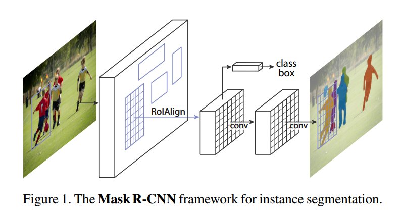
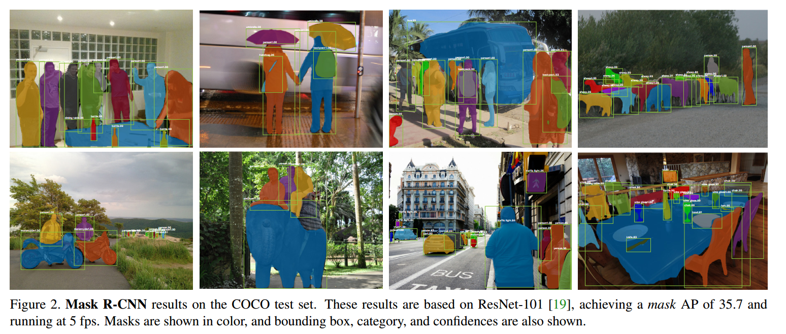
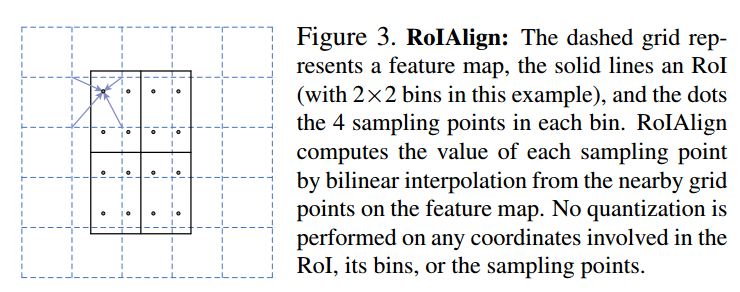
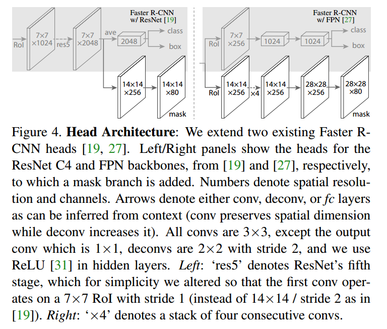

# Mask R-CNN  

## 摘要

我们提出了一个概念上简单、灵活和通用的对象实例分割框架。我们的方法有效地检测图像中的对象，同时为每个实例生成高质量的分割掩模。该方法称为Mask R-CNN，通过在现有的边界框识别分支的基础上增加一个预测对象掩码的分支，从而扩展了更快的R-CNN。MASK R-CNN训练简单，运行速度为5fps，相对Faster R-CNN只增加了很小的开销。此外，Mask R-CNN很容易推广到其他任务，例如，允许我们在相同的框架下估计人体姿势。我们展示了COCO系列挑战中所有三个路径的顶级结果，包括实例分段、边界框对象检测和人关键点检测。在没有花哨的情况下，Mask R-CNN在每项任务上的表现都超过了所有现有的单一模型参赛作品，包括COCO2016挑战赛的获胜者。我们希望我们简单而有效的方法将作为一个坚实的基线，并有助于简化未来在实例级识别方面的研究。代码可在以下网址获得：https://github.com/facebookresearch/Detectron.

## 1、简介

视觉社区在短时间内迅速改进了对象检测和语义分割结果。在很大程度上，这些进展是由强大的基线系统推动的，例如分别用于对象检测和语义分割的Fast/Faster RCNN[12，36]和全卷积网络(FCN)[30]框架。这些方法在概念上是直观的，提供了灵活性和健壮性，以及快速的训练和推理时间。我们在这项工作中的目标是开发一个类似的支持框架用于实例分割。

实例分割具有挑战性，因为它需要正确检测图像中的所有对象，同时精确分割每个实例。因此，它结合了来自对象检测的经典计算机视觉任务的元素，其中目标是对单个对象进行分类并使用边界框定位每个对象，以及语义分割，其中目标是在不区分对象实例的情况下将每个像素分类到固定的类别集合中。鉴于此，人们可能会认为需要复杂的方法才能获得好的结果。然而，我们展示了一个令人惊讶的简单、灵活和快速的系统可以超过先前最先进的实例分割结果。

我们的方法，称为Mask R-CNN，通过在每个感兴趣区域(ROI)上添加一个预测分割掩码的分支，与现有的分类和边界盒回归分支并行，扩展了Faster R-CNN。掩码分支是应用于每个ROI的小FCN，以像素顶元的方式预测分割掩码。相对Faster R-CNN框架，MASK R-CNN易于实施和训练，从而促进了广泛的灵活架构设计。此外，掩码分支只增加了很小的计算开销，从而实现了快速的系统和快速的实验。

原则上，Mask R-CNN是Faster R-CNN的直观扩展，但是正确地构建掩码分支对于良好的效果至关重要。最重要的是，Faster RCNN不是为网络输入和输出之间的像素对齐而设计的。这在处理实例的实际核心操作RoIPool[18，12]如何执行用于特征提取的粗空间量化中最为明显。为了解决这种不对准问题，我们提出了一个简单的、无量化的层，称为**RoIAlign**，它忠实地保留了精确的空间位置。尽管RoIAlign看起来是一个很小的变化，但它有很大的影响：它将掩码精度提高了相对10%到50%，在更严格的本地化指标下显示出更大的收益。其次，我们发现将掩码和类别预测解耦是必要的：我们独立地为每个类别预测一个二进制掩码，类别之间没有竞争，并且依靠网络的ROI分类分支来预测类别。相比之下，FCNs通常以像素为单位进行多类分类，将分割和分类结合在一起，基于我们的实验，对于实例分割效果很差。

没有华而不实的花哨，Mask R-CNN在COCO实例细分任务[28]上超过了之前所有最先进的单模结果，包括来自2016年比赛获胜者的重量级工程参赛作品。作为副产品，我们的方法在COCO目标检测任务中也表现出色。在烧蚀实验中，我们评估了多个基本实例，这使得我们能够展示其健壮性，并分析核心因素的影响。

我们的模型可以在GPU上以每帧200ms的速度运行，在一台8-GPU的机器上，关于COCO的培训需要一到两天的时间。我们相信，快速的训练和测试速度，加上框架的灵活性和准确性，将有利于和简化未来的实例分割研究。

最后，我们通过在COCO关键点数据集[28]上的人体姿态估计任务展示了我们的框架的通用性。通过将每个关键点视为一个热的二进制遮罩，只需最少的修改，就可以应用遮罩R-CNN来检测特定于实例的姿势。MASK R-CNN超越2016年COCO KEYPOINT大赛获胜者，同时运行速度为5fps。因此，掩码R-CNN可以更广泛地被视为实例级识别的灵活框架，并且可以容易地扩展到更复杂的任务。

## 2、相关工作

**R-CNN**：用于包围盒对象检测的基于区域的CNN(R-CNN)方法[13]是关注可管理数量的候选对象区域[42，20]，并在每个ROI上独立地评估卷积网络[25，24]。R-CNN被扩展[18，12]，允许使用RoIPool在特征地图上关注ROI，从而获得更快的速度和更好的准确性。更快的R-CNN[36]通过学习区域提案网络(RPN)的注意机制来推进这一流。更快的R-CNN对许多后续改进具有灵活性和健壮性(例如，[38，27，21])，并且是当前几个基准测试的领先框架

**实例分割**：在RCNN有效性的推动下，许多实例分割方法都是基于分割建议的。早期的方法[13，15，16，9]求助于自下而上的分段[42，2]。DeepMask[33]和后续作品[34，8]学会提出候选片段，然后由Fast R-CNN进行分类。在这些方法中，分割先于识别，这既慢又不准确。同样，Dai et al.。[10]提出了一种复杂的多级级联算法，该算法从包围盒提案中预测细分方案，然后进行分类。相反，我们的方法是基于掩码和类别标签的并行预测，更简单、更灵活。

最近，Li et al.。[26]将[8]中的分段建议系统和[11]中的目标检测系统相结合，实现了“完全卷积实例分割”(FCIS)。文献[8，11，26]中的共同思想是完全卷积地预测一组位置敏感输出通道。这些通道同时寻址对象类、框和掩码，使系统速度更快。但是FCIS在重叠的实例上表现出系统错误并产生虚假边缘(图6)，这表明它受到了分割实例的基本困难的挑战。

实例分割的另一系列解决方案[23，4，3，29]由语义分割的成功驱动。从每个像素的分类结果(例如，FCN输出)开始，这些方法试图将相同类别的像素分割成不同的实例。与这些方法的分割优先策略不同，Mask R-CNN基于实例优先策略。我们预计未来将研究这两种策略的更深层次的结合。

## 3、算法

Mask R-CNN在概念上很简单：Faster R-CNN对每个候选对象有两个输出，一个类标签和一个边界框偏移量；为此，我们添加了输出对象掩码的第三个分支。因此，Mask R-CNN是一个自然而直观的想法。但是附加的遮罩输出不同于类和框输出，需要提取对象的更精细的空间布局。接下来，我们介绍Mask R-CNN的关键元素，包括像素对齐，这是Fast/Faster R-CNN的主要缺失部分。

**Faster R-CNN**：我们首先简要回顾一下Faster R-CNN探测器[36]。Faster R-CNN由两个阶段组成。第一阶段称为区域提案网络(RPN)，提出候选对象边界框。第二阶段，本质上是Fast R-CNN[12]，使用RoIPool从每个候选盒中提取特征，并执行分类和包围盒回归。两个阶段使用的功能可以共享，以加快推理速度。我们建议读者参考[21]，了解Faster R-CNN和其他框架之间最新的、全面的比较。

**Mask R-CNN**：Mask R-CNN采用相同的两阶段程序，具有相同的第一阶段(即RPN)。在第二阶段，除了预测类别和盒偏移量之外，Mask R-CNN还为每个ROI输出一个二进制掩码。这与大多数最近的系统形成了对比，在这些系统中，分类依赖于掩码预测(例如[33，10，26])。我们的方法遵循了Fast R-CNN[12]的精神，它并行地应用了包围盒分类和回归(事实证明，这在很大程度上简化了原始R-CNN的多级管道[13])。

在形式上，在训练过程中，我们将每个采样ROI上的多任务损失定义为$L=L_{cls}+L_{box}+L_{mask}$。分类损失$L_{cls}$和边框损失$L_{box}$与[12]中定义的相同。掩码分支对于每个感兴趣区域都有一个$km^2$维的输出，它编码了K个分辨率为m×m的二进制掩码，K个类别每个对应一个掩码，为此我们应用了一个每像素的Sigmoid，并将L掩码定义为平均的二进制交叉熵损失。对于与地面真实等级k相关联的ROI，仅在第k个掩码上定义L掩码(其他掩码输出不会造成损失)。

我们定义的$L_{mask}$允许网络为每个类别生成掩码，而不会在类别之间产生竞争；我们依靠专用的分类分支来预测用于选择输出掩码的类别标签。这分离了掩码和类预测。这与将FCNs[30]应用于语义分割时的通常做法不同，语义分割通常使用每像素的Softmax和多项式交叉熵损失。在这种情况下，跨类的掩码会相互竞争；在我们的例子中，对于每个像素的Sigmoid和二进制损失，它们不会竞争。实验表明，该公式是获得良好的实例分割效果的关键。

掩码表示：掩码对输入对象的空间布局进行编码。因此，与通过全连接(FC)层不可避免地折叠成短输出向量的类标签或盒偏移不同，提取掩码的空间结构可以通过卷积提供的像素到像素的对应关系来自然地寻址。

具体地说，我们使用FCN[30]从每个ROI预测m×m掩码。这允许遮罩分支中的每个层保持显式的m×m对象空间布局，而不会将其折叠为缺乏空间维度的矢量表示。与以往依赖FC层进行掩码预测的方法[33，34，10]不同，我们的完全卷积表示需要的参数更少，实验证明更准确。

这种像素到像素的行为需要我们的ROI特征(它们本身就是小的特征地图)很好地对齐，以忠实地保持每个像素的显式空间对应关系。这促使我们开发了下面的RoIAlign层，它在掩码预测中起着关键作用。

**RoIAlign**：RoIPool[12]是用于从每个ROI提取小特征地图(例如，7×7)的标准操作。RoIPool首先将浮数ROI量化为特征映射的离散粒度，然后将该量化的ROI细分为本身被量化的空间仓位，最后聚合每个仓位所覆盖的特征值(通常通过最大汇集)。例如，通过计算[x=16]在连续坐标x上执行量化，其中16是特征映射步幅并且[·]是舍入；类似地，当划分为箱(例如，7×7)时执行量化。这些量化引入了ROI和提取的特征之间的未对准。虽然这可能不会影响分类(对小平移是健壮的)，但它对预测像素精确的遮罩有很大的负面影响。

为了解决这个问题，我们提出了RoIAlign层，它去除了RoIPool的苛刻量化，使提取的特征与输入正确对齐。我们提出的更改很简单：我们避免对ROI边界或库进行任何量化(即，我们使用x/16而不是[x/16])。我们使用双线性插值[22]来计算每个ROI bin中四个规则采样位置的输入特征的精确值，并聚合结果(使用最大值或平均值)，有关详细信息，请参见图3。我们注意到，只要不执行量化，结果对确切的采样位置或采样了多少点就不敏感。

RoIAlign带来了很大的改进，如我们在4.2中所示。我们还与文献[10]中提出的RoIWarp运算进行了比较。与RoIAlign不同，RoIWarp忽略了对齐问题，在[10]中实现为量化ROI，就像RoIPool一样。因此，尽管RoIWarp也采用了由[22]驱动的双线性重采样，但它的性能与RoIPool不相上下，如实验所示(更多详细信息见表2c)，从而证明了对齐的关键作用。

**网络架构**：为了演示我们方法的通用性，我们使用多个架构实例化了Mask R-CNN。为清楚起见，我们区分了：(i)用于整个图像的特征提取的卷积骨干体系结构，以及(ii)用于包围盒识别(分类和回归)和分别应用于每个ROI的掩码预测的网络头部。

我们使用术语网络深度特征来表示主干架构。我们评估深度为50或101层的ResNet[19]和ResNeXt[45]网络。最初使用ResNets实现Faster R-CNN[19]是从第4阶段的最后卷积层提取特征，我们称之为C4。例如，该具有ResNet-50的主干由ResNet-50-C4表示。这是[19，10，21，39]中常用的选择。

我们还探索了Lin等人最近提出的另一种更有效的主干。[27]，称为特征金字塔网络(FPN)。FPN使用具有横向连接的自上而下架构，从单比例输入构建网络内要素棱锥体。具有FPN主干的更快的R-CNN根据其规模从特征金字塔的不同层次提取ROI特征，但除此之外，该方法的其余部分类似于普通ResNet。使用ResNet-FPN主干与Mask RCNN进行特征提取，在准确性和速度方面都有很好的提高。有关FPN的更多详细信息，请读者参阅[27]。

对于网络头，我们严格遵循前面工作中提出的体系结构，在该体系结构中添加了一个完全卷积掩码预测分支。具体地说，我们扩展了ResNet[19]和FPN[27]论文中较快的R-CNN盒头。详细信息如图4所示。ResNet-C4主干上的头部包括ResNet的第5个阶段(即9层“res5”[19])，这是计算密集型的。对于FPN，主干已经包括RES5，因此允许使用更少过滤器的更高效的报头。

我们注意到我们的掩码分支具有简单的结构。更复杂的设计有可能提高性能，但不是这项工作的重点。

### 3.1 实现细节

我们根据现有的快速/较快R-CNN工作[12，36，27]设置超参数。虽然这些决策是在原始文献[12，36，27]中针对目标检测做出的，但是我们发现我们的实例分割系统对它们是健壮的。

**训练**：就像在Fast R-CNN中一样，如果ROI的IOU至少为0.5，那么ROI就被认为是正的，否则就被认为是负的。掩模损耗L掩码仅在正ROI上定义。掩码目标是ROI与其相关联的地面真相掩码之间的交集。

我们采用以形象为中心的培训[12]。调整图像的大小，使其比例(较短的边缘)为800像素[27]。每个迷你批次每个GPU有2个图像，每个图像有N个采样ROI，正负比为1：3[12]。对于C4主干，N是64(如[12，36])，对于FPN是512(如[27])。我们在8个GPU(有效小批大小为16)上进行了160k迭代的训练，学习率为0.02，在120k迭代时下降了10。我们使用0.0001的权重衰减和0.9%的动量。使用ResNeXt[45]，我们使用每个GPU 1个图像和相同的迭代次数进行训练，起始学习率为0.01。

RPN锚跨越5个比例和3个纵横比，遵循[27]。为方便消融，RPN单独训练，除非指定，否则不与Mask R-CNN共享功能。对于本文中的每个条目，RPN和Mask R-CNN都有相同的主干，因此它们是可以共享的。

**推论**：在测试时，C4主干的建议号为300(如[36])，FPN的建议号为1000(如[27])。我们对这些建议运行盒子预测分支，然后运行非最大值抑制[14]。然后将掩码分支应用于得分最高的100个检测框。虽然这与训练中使用的并行计算不同，但它加快了推理速度，提高了准确性(由于使用了更少、更准确的ROI)。掩码分支可以预测每个ROI的K个掩码，但是我们仅使用第k个掩码，其中k是分类分支预测的类别。然后，将m×m浮点数掩码输出的大小调整为ROI大小，并以0.5的阈值将其二值化。

请注意，由于我们只在前100个检测盒上计算掩码，Mask R-cnn为其速度更快的R-cnn增加了少量开销(例如，典型模型为20%)。

## 4、实验

