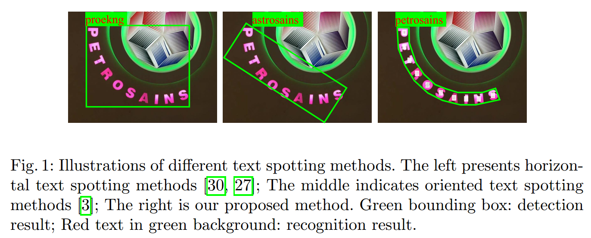
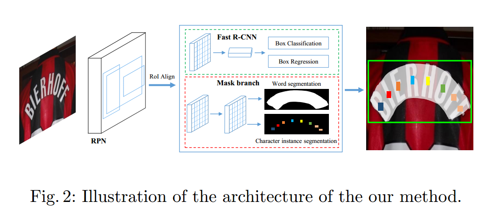
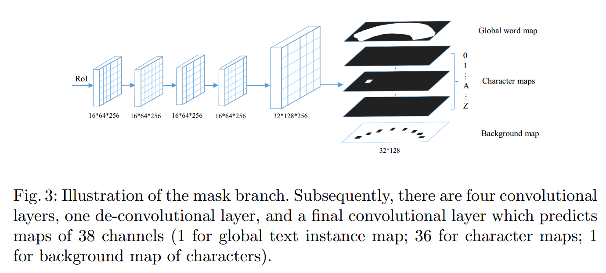

# Mask TextSpotter: An End-to-End Trainable Neural Network for Spotting Text with
Arbitrary Shapes  
## 摘要

近年来，基于深度神经网络的模型在场景文本检测和识别领域占据主导地位。本文研究了自然图像中的场景文本检测问题，旨在同时检测和识别自然图像中的文本。提出了一种端到端的可训练神经网络场景文本检测模型。提议的模型名为Mask TextSpotter，灵感来自最新出版的作品Mask R-CNN。与以往同样使用端到端可训练深度神经网络实现文本检测的方法不同，Mask TextSpotter利用简单流畅的端到端学习过程，通过语义分割获得精确的文本检测和识别。此外，它在处理不规则形状的文本实例(例如曲线文本)方面优于以往的方法。在ICDAR2013、ICDAR2015和Total-Text上的实验表明，该方法在场景文本检测和端到端文本识别任务中都取得了最好的结果。

## 1、简介

近年来，随着神经网络的复兴和图像数据集的增长，场景文本检测与识别引起了计算机视觉领域越来越多的研究兴趣。场景文本检测和识别提供了一种自动、快速的方法来访问包含在自然场景中的文本信息，从而使各种现实世界的应用受益，例如地理位置[58]、即时翻译和盲人辅助。

**场景文本发现（spotting）**是指**同时定位和识别**自然场景中的文本，已有大量的著作[49，21]对其进行了研究。然而，在大多数工作中，除了[27]和[3]之外，文本检测和后续识别是分开处理的。文本区域首先由经过训练的检测器从原始图像中搜索出来，然后馈送到识别模块。这个过程看起来简单而自然，但可能导致检测和识别的性能都不是最优的，因为这两个任务高度相关和互补。一方面，检测的质量很大程度上决定了识别的准确性；另一方面，识别的结果可以在检测阶段提供反馈，帮助拒收误报。

最近，已经提出了两种设计用于场景文本检测的端到端可训练框架的方法[27，3]。受益于检测和识别之间的互补性，这些统一模型的性能明显优于以前的竞争对手。然而，[27]和[3]有两个主要缺点：第一，它们都不能完全以端到端的方式进行训练。[27]在训练阶段应用了课程学习范式[1]，文本识别的子网络被锁定在早期迭代，并仔细选择每个阶段的训练数据。Busta等人。[3]首先对用于检测和识别的网络分别进行预训练，然后联合训练，直到收敛。主要有两个原因阻止[27]和[3]以流畅的、端到端的方式训练模型。一是文本识别部分需要准确的位置进行训练，而早期迭代的位置通常是不准确的；二是采用的LSTM[17]或CTC Lost[11]比一般的CNN更难优化。[27]和[3]的第二个限制在于，这些方法只关注水平或定向文本的阅读。但是，真实场景中文本实例的形状可能会有很大差异，从水平形式或定向形式到弯曲形式。

本文提出了一种名为Mask TextSpotter的文本检测器，它可以检测和识别任意形状的文本实例。这里，任意形状指的是现实世界中各种形式的文本实例。受Mask RCNN[13]生成物体形状掩模的启发，我们通过分割实例文本区域来检测文本。因此，我们的检测器能够检测任意形状的文本。此外，不同于以往的基于序列的识别方法[45，44，26]是针对一维序列设计的，我们**通过语义来识别文本**，解决了不规则文本实例的阅读问题。另一个优点是它不需要精确的位置来识别。因此，检测任务和识别任务可以完全端到端训练，并受益于特征共享和联合优化。

我们在包括水平文本、方向文本和弯曲文本的数据集上验证了我们的模型的有效性。实验结果证明了该算法在文本检测和端到端文本识别任务中的优势。特别地，在ICDAR2015上，在单尺度评估下，我们的方法在检测任务上达到了0.86F-Measure，在端到端识别任务上的性能比以前的最好的方法高出13：2%−25：3%。

本文的主要贡献有四个方面。(1)提出了一种端到端可训练的文本检测模型，该模型具有简单、流畅的训练方案。(2)该方法可以检测和识别各种形状的文本，包括水平文本、方向文本和弯曲文本。(3)与以往的文本检测和识别方法不同，该方法通过语义分割来实现文本的精确检测和识别。(4)在不同的基准上，我们的方法在文本检测和文本检测方面都取得了最好的性能。

## 2、相关工作

### 2.1 场景文本检测

在场景文本识别系统中，文本检测扮演着重要的角色[59]。已经提出了大量的方法来检测场景文本[7，36，37，50，19，23，54，21，47，54，56，30，52，55，34，15，48，43，57，16，35，31]。在[21]中，Jaderberg等人。使用边缘框[60]来生成提案并通过回归来细化候选框。张某等人。[54]利用文本的对称性检测场景文本。改编自速度更快的R-CNN[40]和SSD[33]，并经过精心设计的修改，提出了[56，30]来检测水平单词。

面向多方向的场景文本检测成为近年来的研究热点。姚等人。[52]和张等人的研究成果。[55]通过语义分割检测多向场景文本。田等人。[48]和史等人的观点。[43]提出了先检测文本片段，然后通过空间关系或链接预测将其链接成文本实例的方法。周等人。[57]他等人。[16]直接从密集分段图回归文本框。Lyu等人。[35]提出对文本角点进行检测和分组，生成文本框。面向场景文本检测的旋转敏感回归是由廖等人提出的。[31]。

与目前流行的水平或多向场景文本检测相比，针对任意形状文本实例的研究较少。近年来，由于现实场景中的应用需求，任意形状文本的检测逐渐引起了研究者的关注。在[41]中，Risnumawan et al.。提出了一种基于文本对称性的任意文本检测系统。在文献[4]中，提出了一个关注曲线方向文本检测的数据集。与上述大多数方法不同的是，本文提出了基于实例分割的场景文本检测方法，可以检测任意形状的文本。

### 2.2 场景文本识别

场景文本识别[53、46]旨在将检测或裁剪的图像区域解码成字符序列。以往的场景文本识别方法大致可以分为三个分支：**基于字符的方法**、**基于单词的方法**和**基于序列的方法**。基于字符的识别方法[2，22]大多首先定位单个字符，然后将它们识别并分组为单词。在[20]中，Jaderberg et al.。提出了一种基于单词的文本识别方法，将文本识别看作一个常见的英文单词(90k)分类问题。基于序列的方法将文本识别作为一个序列标注问题来解决。在[44]中，Shih et al.。使用CNN和RNN对图像特征进行建模，并使用CTC[11]输出识别序列。在[26，45]中，Lee et al.。和Shih等人的研究成果。通过基于注意力的顺序到顺序模型识别场景文本。

我们框架中提出的文本识别组件可以归类为基于字符的方法。然而，与以前基于字符的方法不同，我们**使用FCN[42]来同时定位和分类字符**。此外，与为一维序列设计的基于序列的方法相比，我们的方法更适合于处理不规则文本(多方向文本、弯曲文本等)。

### 2.3 场景文本发现

以前的大多数文本识别方法[21，30，12，29]将识别过程分为两个阶段。他们首先使用场景文本检测器[21、30、29]来定位文本实例，然后使用文本识别器[20、44]来获得识别的文本。在[27，3]中，Li et al.。和Busta等人。提出端到端的方法来定位和识别统一网络中的文本，但需要相对复杂的培训过程。与这些方法相比，我们提出的文本检测器不仅可以完全端到端地训练，而且能够检测和识别任意形状(水平、方向和曲线)的场景文本。

### 2.4 通用对象检测和语义分割。

随着深度学习的兴起，通用对象检测和语义分割得到了很大的发展。已经提出了大量的目标检测和分割方法[9、8、40、6、32、33、39、42、5、28、13]。得益于这些方法，场景文本检测和识别在过去几年中取得了明显的进展。我们的方法也受到这些方法的启发。具体地说，我们的方法是从通用的对象实例分割模型Mask R-CNN[13]中改编而来的。然而，我们方法的MASK分支与Mask R-CNN中的MASK分支有关键的区别。我们的掩码分支不仅可以分割文本区域，而且可以预测字符概率图，这意味着我们的方法可以用于识别字符图中的实例序列，而不仅仅是预测对象掩码。

## 3、算法

该方法是一种端到端可训练的文本识别器，可以处理各种形状的文本。它由基于实例分割的文本检测器和基于字符分割的文本识别器组成。

### 3.1 整体框架

该框架在功能上由四个部分组成：**特征金字塔网络**(FPN)[32]作为主干，**区域建议网络**(RPN)[40]用于生成文本建议，**Fast R-CNN**[40]用于包围盒回归，**掩码分支**用于文本实例分割和字符分割。在训练阶段，首先由RPN生成大量的文本方案，然后将方案的ROI特征反馈到Fast R-CNN分支和掩码分支，生成准确的文本候选框、文本实例切分图和字符切分图。

**主干网络**：自然图像中的文本大小各不相同。为了构建所有尺度的高级语义特征地图，我们采用了深度为50的ResNet[14]的特征金字塔结构[32]主干。FPN采用自上而下的结构，融合了来自单尺度输入的不同分辨率的特征，以边际成本提高了精度。

**RPN** ：RPN用于为后续的Fast R-CNN和MASK分支生成文本建议。在[32]之后，我们根据锚的大小将锚分配到不同的阶段。具体地说，锚的面积分别被设置为五级$\{P_2,P_3,P_4,P_5,P_6\}$上的$\{32^2,64^2,128^2,256^2,512^2\}$像素。与[40]中一样，每个阶段也采用不同的高宽比$\{0.5,1,2\}$。通过这种方式，RPN可以处理各种大小和长宽比的文本。**ROI Align**[13]适用于提取提案的区域特征。与**ROI Pooling**[8]相比，ROI Align保留了更准确的位置信息，这对掩码分支中的分割任务非常有利。请注意，文本没有采用特殊的设计，如文本锚的特殊纵横比或方向，如以前的作品[30，15，34]。

**Fast R-CNN**：Fast R-CNN分支包括分类任务和回归任务。此分支的主要功能是为检测提供更准确的边界框。Fast R-CNN的输入为7×7分辨率，由RPN提出的方案通过ROI Align产生。

**掩码分支**：在掩码分支中有两个任务，包括全局文本**实例分割**任务和**字符分割**任务。如图3所示，给定其大小固定为16∗64的输入ROI，通过四个卷积层和一个反卷积层，掩码分支预测38个映射(具有32∗128大小)，包括全局文本实例映射、36个字符映射和字符背景映射。全局文本实例映射可以给出文本区域的准确定位，而与文本实例的形状无关。字符映射是36个字符的地图，包括26个字母和10个阿拉伯数字。后处理时还需要字符背景图，不包括字符区域。

### 3.2 标签生成

