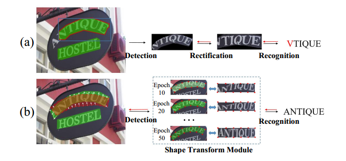
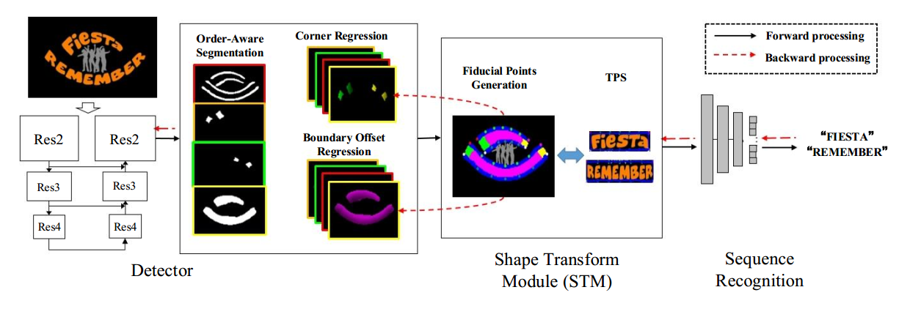

# Text Perceptron: Towards End-to-End Arbitrary-Shaped Text Spotting  

## 摘要

最近已经提出了许多方法来检测不规则的场景文本并获得了可喜的结果。但是，它们的本地化结果可能不能很好地满足以下文本识别部分的要求，这主要是由于两个原因：1）识别任意形状的文本仍然是一项艰巨的任务，并且2）文本检测和文本识别之间普遍存在的不可训练的流水线策略将导致次优表现。为了解决这个不兼容问题，在本文中，我们提出了一种名为Text Perceptron的端到端可训练文本发现方法。具体而言，Text Perceptron首先采用了一种基于分段的高效文本检测器，该检测器可学习潜在文本的阅读顺序和边界信息。然后，设计了新颖的Shape Transform Module（缩写为STM），将检测到的特征区域转换为规则的形态，而无需额外的参数。它将文本检测和随后的识别部分组合到一个完整的框架中，并帮助整个网络实现全局优化。实验表明，我们的方法在两个标准文本基准（即ICDAR 2013和ICDAR 2015）上均具有竞争优势，并且明显优于不规则文本基准SCUT-CTW1500和Total-Text上的现有方法。

## 1、简介

由于场景文本的各种应用（例如高级驾驶员辅助系统中的发票识别和路标读取）具有多种应用，因此，发现场景文本是一个热门的研究主题。 随着深度学习的进步，许多基于深度神经网络的方法（Wang等人2012; Jaderberg，Vedaldi和Zisserman 2014; Li，Wang和Shen 2017; Liu等人2018; He等人2018） 已经提出了从自然图像中发现文本的建议，并取得了可喜的成果。

然而，在现实世界中，许多文本以任意布局（例如多向或弯曲）出现，这使得基于四边形的方法（Liao等人2017; Zhou等人2017; Zhang等人2018）无法在许多情况下都适应得很好。一些工作（Dai等人2018; Long等人2018; Xie等人2019）开始通过将文本蒙版分割为检测结果来专注于不规则文本本地化，并且在Intersection-overUnion（IoU）评估方面取得了相对较好的性能。但是，它们仍然给随后的识别任务带来许多挑战。例如，常见的文本点检管道是在边界框区域内裁剪蒙版的文本，然后采用具有校正功能的识别模型来生成最终的字符序列。不幸的是，这种策略主要在两个方面降低了文本发现的鲁棒性：1）一个需要设计额外的纠正网络，例如（Luo，Jin和Sun 2019）和（Zhan和Lu 2019）中的方法，以将不规则文本转换为普通的。在实践中，如果没有人为标记的几何基础事实，就很难对其进行优化，而且还会带来额外的计算成本。 2）流水线文本发现方法不是端到端可训练的，并且导致性能欠佳，因为无法将识别模型中的错误用于优化文本检测器。在图1（a）中，尽管文本检测器提供了真实的肯定结果，但剪切的文本蒙版仍然会导致错误的识别结果。我们表示上述文本检测和识别之间的不兼容问题。

最近，提出了两种以端到端方式发现不规则文本的方法。 Lyu等人（2018）提出了一个受MaskRCNN（He等人2017）启发的端到端可训练网络，旨在逐字符读取不规则文本。 但是，这种方法会丢失字符之间的上下文信息，并且还需要在字符级注释上花费一定的费用。 Sun等人（2018）尝试使用透视ROI模块转换不规则文本，但是此操作难以处理一些复杂的变形，例如弯曲形状。

这些局限性促使我们探索新的更有效的方法来发现不规则场景文本。 受（Shi等人2016）的启发，薄板样条线（缩写TPS）（Bookstein 1989）可能是一种可行的方法，可以使用一组基准点将各种形状的文本改正为规则形式。 尽管可以通过深度空间转换网络从裁剪后的矩形文本中隐式地学习这些点（Jaderberg等人，2015），但基准点的学习过程却难以优化。 结果，这种方法特别是对于某些复杂失真的文本而言并不健壮。

我们以一种更容易实现的方式尝试解决此问题，如下所示：1）在文本区域上明确找出一组可靠的基准点，以便可以通过TPS直接纠正不规则文本，以及2）通过反向调整动态调整基准点。 从识别到检测的传播错误。 具体来说，我们开发了一个Shape Transform Module（形状转换模块）（缩写为STM）来构建健壮的不规则文本斑点，并消除不兼容问题。 STM将不规则的文本检测和识别集成到端到端的可训练模型中，并迭代地调整基准点以满足以下识别模块。 如图1（b）所示，在早期训练阶段，尽管IoU在检测评估中很高，但转换后的文本区域可能无法满足识别模块的要求。 通过端到端的培训，基准点将逐渐调整以获得更好的识别结果。

**图1**：传统流水线文本发现过程和文本感知器的图示。 子图（a）是一种传统的流水线策略，它将文本检测，纠正和识别结合到一个框架中。 子图（b）是通过应用建议的STM进行的端到端可训练文本发现方法。 黑色和红色箭头分别表示前进和后退处理。 红点表示生成的基准点。

在本文中，我们提出了一个名为Text Perceptron的端到端可训练不规则文本点检器，它由三部分组成：1）基于分段的检测模块，该模块有序地将文本区域描述为四个子区域：中心区域，头部，尾部 顶部和底部边界区域，将在第3节中详细介绍。这里，边界信息不仅有助于分隔彼此非常靠近的文本区域，而且有助于捕获潜在的阅读顺序。 2）STM迭代生成潜在基准点并动态调整其位置，从而减轻了文本检测和识别之间的不兼容性。 3）基于序列的识别模块，用于生成最终字符序列。

本文的主要贡献如下：1）我们设计了一种高效的可识别顺序的文本检测器来提取任意形状的文本。 2）我们开发了差异化STM，致力于以端到端的可训练方式优化检测和识别。 3）大量的实验表明，我们的方法在两个常规文本基准上均取得了竞争性结果，并且在两个非常规文本基准上也大大超过了以前的方法。

## 2、相关工作

## 3、算法

### 3.1 Overview

我们提出了一个名为Text Perceptron的文本检测器，其总体架构如图2所示，该结构由三部分组成：

（1）文本检测器采用ResNet（He等人，2016）和Feature Pyramid Network（缩写为FPN）（Lin等人）。等（2017年）作为骨干，并通过同时学习三个任务来实现：顺序感知的多类语义分割，角点回归和边界偏移回归。这样，文本检测器可以定位任意形状的文本，并在文本检测方面达到最新水平。 

（2）STM负责将文本检测和识别整合到端到端的可训练框架中。此模块根据预测的分数和几何图在文本边界上迭代生成基准点，然后应用可微分的TPS将不规则文本纠正为规则形式。 

（3）文本识别器用于生成预测的字符序列，可以是任何传统的基于序列的方法，例如CRNN（Shi，Bai和Yao 2017），基于注意力的方法（Cheng等人2017）。

**图2**：Text Perceptron的工作流程。 黑色和红色箭头分别表示前进和后退过程

### 3.2 Text Detection Module  

# Perspective RoI Transform（透视ROI变换）

https://arxiv.org/pdf/1812.09900.pdf（TextNet: Irregular Text Reading from Images with an End-to-End Trainable Network）

传统的 RoI-pooling [9]从每个RoI中提取一个小的固定大小的特征图（例如8×8）。 为了提高图像分割精度，Mask R-CNN [13]引入的RoI-Align旨在解决输入和输出特征之间的不对齐问题。 为了更好地设计文本区域，已经开发了大小可变的RoI pooling[25]，以使纵横比保持不变以进行文本识别。 此外，为了处理定向文本区域，在Spatial Transformer Network[21]的思想的推动下，rotational text proposal[5]和RoI-Rotate [30]已开发出仿射变换来解决此问题，以学习变换矩阵。

相比之下，根据生成的四边形建议，我们开发了透视图RoI变换，将任意大小的四边形转换为小的可变宽度和固定高度的特征图，可以将其视为现有方法的推广。 我们提出的RoI变换可以通过透视变换和双线性采样来扭曲每个RoI。 可以在文本提议的坐标和转换后的宽度和高度。可以通过透视变换将来自特征图的每个RoI转换为与轴对齐的特征图。

