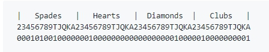

# The Two Plus Two Evaluator

https://web.archive.org/web/20111103160502/http://www.codingthewheel.com/archives/poker-hand-evaluator-roundup#2p2

http://archives1.twoplustwo.com/showflat.php?Cat=0&Number=8513906

 

2 + 2求值程序由一个大型查找表组成，其中包含大约3200万个条目(准确地说是32,487,834个)。

要查找给定的7张扑克牌，您需要在该表中跟踪一条路径，对每张牌执行一次查找。当你拿到最后一张牌时，得到的值就是手牌的官方价值。(注意:查找表也可用于执行5卡和6卡的计算。)

 

想像一下：

你站在棋盘的边缘，棋盘一直延伸到远处的地平线。不是64个，而是3200万个格子。有人随机给你发了一张7张牌的扑克牌。你看你的第一张牌，正好是红桃7。环顾四周，你会注意到附近有52个方格，每个方格都有一张特定的牌。你移动到标记着“红桃7”的方块，因为那是你的第一张牌。

然后看你的第二张牌，正好是方块a。如果你往下看你的脚，你会注意到你所在的广场上有一系列的方向:

1、如果你的第二张牌是黑桃a，转到方块#43,072。
2、如果你的第二张牌是红桃a，转到方块#43,073。
3、如果你的第二张牌是方块a，转到方块#43,074。
4、以此类推，对于剩下的每一张牌。

所以你按照指示走，一直走到43,073号方块。当你到达那里时，你看一下你的第三张牌，它碰巧是一个低级的梅花二。再一次，你低头看你的脚:

1、如果你的第三张牌是黑桃a，转到方块#192,093。
2、如果你的第三张牌是红桃a，转到方块#192,094。
3、…等等
4、如果你的第三张牌是梅花二，转到广场#293,304。

再一次，你按照指示，前往293,304方块，这需要几天的时间。在这里你看着你的第四张牌，按照指示带你去另一个方块，在那里你看着你的第五张牌，如此类推，直到你到达第七张也是最后一张牌的方块。最后一次低头看你的脚，你看到一个数字，闪着深红色的光，发出电火花:

1582

这个数字告诉你你需要知道的一切。它是(你猜对了)你的7张牌的官方仙人掌凯弗-伊恩等值值!(好的，这里稍微简化一下。在实践中，这个数字实际上是手的等价值，与手的类别合并。但你懂的)。


# PokerHandEvaluator Algorithm

### 一.基本的求值算法

我们在此描述的算法适用于拥有5到9张卡片的手。我们以7张牌梭哈扑克为例，因为7张牌是最常见和最典型的情况

我们知道一副牌有52张不同的牌，而一张7张牌的扑克手牌由牌组中的7张不同的牌组成。我们可以轻松地唯一表示一个具有52位二进制数的7张牌扑克手，恰好7位设置为1，45位设置为0。

例如，如果一只手有

 5 of Spades,

 4 of Clubs,

 7 of Spades,

 Jack of Diamonds,

 Ace of Clubs,

 10 of Spades,

 and 5 of Hearts,

我们可以用这样一个52位的二进制来表示:

 

我们可以看到，总共有***\*52 choose 7\**** ***\*= 133,784,560\****个这样的表示组合。如果我们可以将每个hand表示映射到[1,133784560]的数字范围，那么我们可以创建一个大小为133784560的哈希表，并为每个hand在哈希表中分配一个惟一的值。换句话说，我们需要一个完美的哈希函数，它是一个52位的二进制数，恰好7位为1。

首先，我们将所有这些133784560二进制文件按字典顺序排序。如果我们有一个函数接收二进制作为输入，并输出它在字典排序中的位置，那么这个函数就是完美的哈希函数。

让我们将其形式化为一个更一般的问题，并将其命名为***\*HashNBinaryKSum\****。

 ***\*Problem: HashNBinaryKSum\****

 

 ***\*Input: integer n, integer k, an n-bit binary with exactly k bits set to 1\****

 

 ***\*Output:\**** ***\*在所有n位\*******\*包含\*******\*k个\*******\*1\*******\*的二进制\*******\*字典排序中的位置\****

 

考虑一个n = 4和k = 2的例子，二进制0011应该返回1，而1010应该返回5

***\*0011 0101 0110 1001 1010 1100\****

这个问题可以用递归来解决。为了得到排序中的位置，我们可以数一下在这个位置前面有多少个数字。

 

以1010为例，我们可以计算范围[0,1010]内的有效数字的数量。对于范围为[0,1010)的数，我们可以先数[0,1000)中的数，然后数[1,000,1010)。要解决前一种情况[0,1000]，我们可以使用3 choose 2，它是在最后3位中填充2个1的组合数。后一种情况[1000,1010]等价于[000,010)，参数n和k都减少了1，所以它变成了一个更小的问题，可以在另一个递归中解决。

 

我们可以优化循环的递归，示例C代码如下所示。

int hash_binary(unsigned char q[], int len, int k){	int sum = 0;	int i; for (i=0; i<len; i++)	{		if (q[i])		{			if (len-i-1 >= k)				sum += choose[len-i-1][k]; 		k--; 		if (k == 0)				break;		}	} return ++sum;}

在实践中，我们不需要最后的增量，只需将位置视为从0开始的数字，这也完全适合散列表。

我们可以预先计算所有可能的n选k并存储结果。对于一个n位二进制的问题，该函数最多运行n个周期。

如果我们把这个函数应用到扑克牌上，它将花费52个周期来计算哈希值。同时，我们需要一个大小为133784560的哈希表来处理7张牌的扑克牌情况。时间和内存性能都不是我们所期望的。

进入第二章，你会发现一个更高级的算法是如何解决这个问题的。

 

### 二.先对同花进行计算

使扑克评估程序复杂的是同花类别(包括同花顺)。如果我们不关心同花，我们可以忽略花色，将52位二进制简化为13位五进制(以5为基数)。

我们需要以5为基数的原因是，对于每一个rank，可以有0 1 2 3 4张牌，因此有5种可能。

 

所以我们可以把这个问题分成两部分，有同花的手牌和没有同花的手牌。第一个可以用13位二进制表示，第二个可以用13位五进制表示。

 

在7张牌的扑克中，如果一手牌中至少有5张牌花色相同，那这手牌一定是同花或同花顺。因为如果我们在一手牌中至少有5张牌花色相同，这些牌必须有不同的rank，然后从另一花色牌中再组合2张牌，就不能形成炸弹或葫芦。我们也知道，在7张牌的手牌上不可能有两种不同花色的同花。

 

因此，我们可以首先判断手牌是否有同花。一旦我们在7张牌中发现同花，我们就可以停止评估剩下的牌。但是，如果手牌超过7张，我们需要继续计算其他分支。

 

判断一只手是否有同花并不难，只需要每种suit都有一个计数器。同时，我们需要为每个suit维护一个二进制，这样当我们看到一个flush时，我们可以将相应的二进制传递给计算flush hands的函数。

例如，给定输入:

 ***\*5 of Spades,\****

 ***\*4 of Spades,\****

 ***\*7 of Spades,\****

 ***\*Jack of Diamonds,\****

 ***\*Ace of Clubs,\****

 ***\*10 of Spades,\****

 ***\*8 of Spades,\****

我们的4个计数器和二进制文件是:

 ***\*Spades:   counter 5, binary 0000101101100\****

 ***\*Hearts:   counter 0, binary 0000000000000\****

 ***\*Clubs:    counter 1, binary 1000000000000\****

 ***\*Diamonds:  counter 1, binary 0001000000000\****

当我们看到黑桃的计数器大于4时，我们可以将二进制0000101101100传递给下一个函数来计算同花。我们不需要担心其他花色的牌，因为这些牌都不能形成同花。

当然，我们可以使用HashNBinaryKSum函数和三个哈希表(k可以是5、6和7)来计算flush二进制。但是，考虑到2^13 = 8192这个数字不是很大，我们可以直接查找大小为8192的表，这为我们节省了计算完美散列的13个循环。

如果手牌包含不超过7张牌，我们现在可以立即返回同花的值作为最终结果。否则，我们仍然需要遍历非齐平分支，并比较两个结果。

我们将在下一章讨论如何计算五进制。

 

### 三.有限五进制的散列

回想一下，对于suit不再重要的一手牌，我们可以用13位五进制数字表示7张牌。同样，对这种五进制有一个限制，即所有位的总和等于7。

要对五进制进行编码，我们需要13个计数器。当一张新卡进来时，增加相应等级的计数器。例如，如果一只手有2张a, 3张5,1张7和1个j，五进制是2001000103000。

让我们试着为这样一个五进制找到一个完美的哈希函数。与我们在二进制哈希中所做的一样，如果我们按照字典序对所有五进制进行排序，其中每个五进制的所有位的和等于7，那么这个顺序中的位置就是这个五进制的完美哈希。

 ***\*Problem: HashNQuinaryKSum\****

 

 ***\*Input: integer n, integer k, an n-bit quinary with the sum of all bits equal to\****

 ***\*k\****

 

 ***\*Output: the position of the quinary in the lexicographical ordering of all\****

 ***\*n-bit quinaries with sum of all bits equal to k\****

 

与我们在二进制哈希中所做的类似，为了得到五进制的位置，我们可以数一数比这个五进制小多少个有效数字。例如，给定一个4位四进制4300，我们可以首先计算范围[0000,4300]内的有效数字，然后在最后增加结果。量程[0000,4300]可分为[0000,4000)和[44000,4300)。后一个范围相当于参数为n-1和k-4的[000,300]，并成为一个更小的问题。

与二进制哈希不同，[0000,4000]范围不容易计算。我们可以继续将范围划分为[0000,1000)，[1000,2000)，[2000,3000)和[3000,4000)。范围[1000,2000)与k-1等价[000,1000)，范围[2000,3000)与k-2等价[000,1000)，以此类推。

现在剩下的问题是用参数k来求解range[0000, 1000) .这个range可以拆分为[000,400)和[400,1000]，最终可以分成5个小的range。这个问题的结果是5个子问题的结果的和，它们的范围恰好是5的幂。

我们可以使用动态规划来解决所有这些子问题，并将结果存储在一个数组中。我们用一个4*14*8的三维数组dp[l][n][k]，其中n是位的个数，k是k的剩余数，l是排除端点的最有效位。例如，[0000,1000)的结果存储在dp[1][4][k]中，因为排除的端点是1000，结果l为1,n为4。另一个例子是[000,200)，其结果存储在dp[2][3][k]中。

数组dp的基本情况:

 if 0 <= i <= 4:  dp[1][1][i] = 1; if i > 4:  dp[1][1][i] = 0;

例如，k=4的1位五进制有一个实例，它正好是4。但是，没有k=5的1位五进制的实例。

然后对边进行迭代:

 for each i in [1, 13]:  dp[1][i][1] = i; dp[1][i][0] = 1;

一个示例是k=1的3位五进制，它有三个实例001、010、100。如果k=0，唯一的实例是000。

现在我们可以迭代所有的dp[1][i][j]:

 for each i in [2, 13] and j in [2, 7]:  dp[1][i][j] = SUM{k:[0,4]}dp[0][i-1][j-k];

例如，要计算dp[1][2][7]，我们需要枚举从0到4的第二个位，即quinaries 07、16、25、34、43。我们知道07、16、25是无效的，dp[1][1][i] = 0将忽略它们。

现在迭代的其余条目:

 for each l in [2, 4] and i in [1, 13] and j in [0, 7]:  dp[l][i][j] = dp[l-1][i][j] + dp[1][i][j-l+1]

例如dp[4][4][5]，它等于k=5时范围内有效的quinaries的数量[0000,4000]。k=5时，可分为[0000,3000]和[3000,4000)。前者为dp[3][4][5]，后者等于[000,1000)k=k-3，即dp[1][4][2]。

最后，我们可以计算基于dp阵列的五进制散列。示例C代码如下所示。

int hash_quinary(unsigned char q[], int len, int k){	int sum = 0;	int i; for (i=0; i<len; i++) {		sum += dp[q[i]][len-i-1][k]; 	k -= q[i]; 	if (k <= 0)			break;	} return ++sum;}

在实践中，可以忽略最后的增量。

最终的查找哈希表将包含49205个条目，而哈希函数最多需要13个周期来计算。这个算法比其他通过检查所有21种组合来进行7张纸牌评估的算法要好得多。

### 四.终极动态规划算法

还记得在第一章中，我们设法找到了一个从52位受限二进制到散列键(范围从0到133784559)的映射。尽管这个哈希表中的条目数量相当大，但在现代计算机上仍然是可行的。如果我们可以设法提高哈希函数的时间效率，这仍然是一个有用的方法。

让我们回到HashNBinaryKSum的问题:

```c++
 Problem: HashNBinaryKSum

 Input: integer n, integer k, an n-bit binary with exactly k bits set to 1

 Output: the position of the binary in the lexicographical ordering of all n-bit
 binaries with exactly k bits of ones
```

更具体地说，我们正在尝试解决一个n = 52 k = 7的问题。如果我们把52位的二进制代码分成4个块，每个块有13位，我们可以在一个大小为2^13 * 4 * 8的表中预先计算结果，在实际的哈希函数中只进行4次求和。在实践中，如果我们使用16位块而不是13位块，使表的大小变为2^16 * 4 * 8，则会更简单。

这个表的预计算类似于我们在前几章中使用的方法。我将把示例C代码放在这里，并省略解释。

```c++
{
	int dp[65536][4][8]; 

	for (i=0; i<65536; i++) {
		for (j=0; j<4; j++) {
			for (k=0; k<8; k++) {
				int ck = k;
				int s;
				int sum = 0;

				for (s=15; s>=0; s--) {
					if (i & (1 << s)) {
						int n = j*16 + s;

						sum += choose[n][ck];

						ck--;
					}
				}

				dp[i][j][k] = sum;
			}
		}
	}
}
```

哈希函数只需要对dp表的结果求和。C代码如下所示。

```c++
int fast_hash(unsigned long long handid, int k)
{
	int hash = 0;

	unsigned short * a = (unsigned short *)&handid;

	hash += dp_fast[a[3]][3][k];
	k -= bitcount[a[3]];

	hash += dp_fast[a[2]][2][k];
	k -= bitcount[a[2]];

	hash += dp_fast[a[1]][1][k];
	k -= bitcount[a[1]];

	hash += dp_fast[a[0]][0][k];

	return hash;
}
```

虽然这个算法只需要很少的CPU周期来计算散列值(4加3减)，但是总体性能比我们在前一章中使用的差。部分原因可能是dp表大于正常的页面大小(64Kbytes)。如果我们把块切成8位,使用一个表的大小2 ^ 8 * 8 * 8,这将在哈希函数的数量增加一倍(8项和7衰减),性能改善,但仍不能击败前一章在我的环境中使用的算法。

总之，虽然它是一种使用很少CPU周期的算法，但是真正的性能受到内存访问时间的限制，这并不会使它比我们在第2章到第3章中使用的算法快很多。