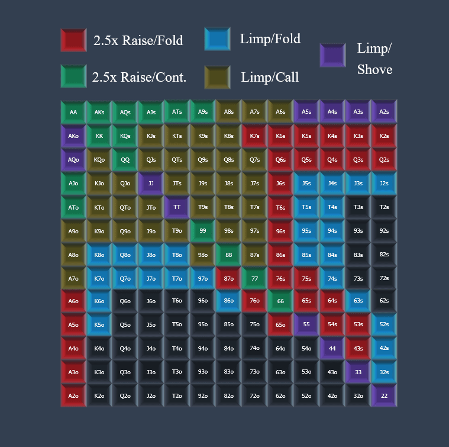
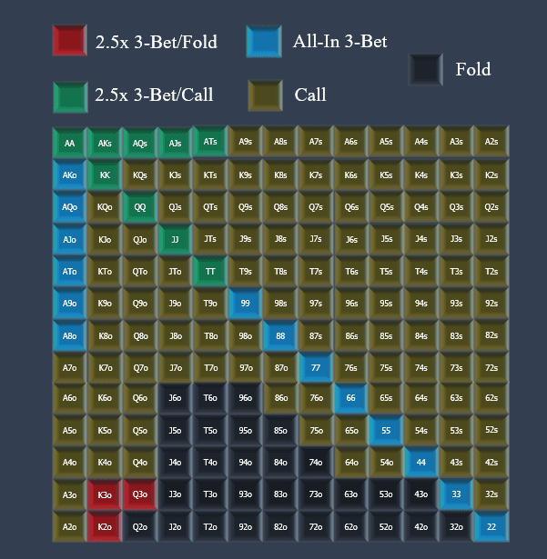

## 1. 胜利与差异

Spin＆Go是最令人兴奋和节奏最快的扑克形式之一。 玩家以三手快速加注赛（Sit and Go）的方式进行比赛，奖池在比赛开始时随机旋转。 奖池范围从买入费的2倍一直到买入费12,000的累积奖金池。 胜利者全力以赴，使每场比赛都成为最后一场战斗，但是，对于最大的奖池比赛的输家来说，有一定的补偿。

在本系列文章中，我们将学习如何掌握Spin＆Go的艺术。 我们将开发可靠的翻牌前范围和复杂的翻牌后策略，以期长期获得较高的赢率。 然而，短期是一个完全不同的世界，充满了起伏。 尽管这在任何形式的扑克中都是如此，但“旋转与围棋”的差异有些独特。 让我们探究一下进入这种游戏形式的动荡世界时会发生什么。

### Cash game vs. Spin and Go 

现金游戏在短期内可能会波动，但获胜玩家的长期图表可能看起来像这样：

当我们缩小时，我们看到熟练的玩家的优势加上大量的手牌已经将短期的起伏转变为长期的相对稳定的上升曲线。 产生这种晚上影响的原因是，每个会话进行的变异量大致相同。 在数十万手的周期中，这种恒定的运气率导致技能和结果之间保持稳定的相关性。

Spin＆Go最引人注目的是没有一个恒定的方差状态，而是多层的状态。 看看获胜的Spin＆Go玩家的图表：

### 第一阶段–下坡（2x奖池）

上图所示，这位获胜玩家不可避免地遭受了失败，这是他参加大多数锦标赛时所获得的奖池比通常的标准坐坐比赛低的原因。 在$ 7的Spin and Go中，最常见的奖池是$ 14。 该奖池将在大约72％的时间中被旋转。

如果获胜的玩家被迫在三手游戏中反复玩这种规模的奖池，那么他将需要50％的获胜率才能达到收支平衡，而在如此快速的盲注结构下，即使对于最佳的玩家，这也是不可能的。 世界。 幸运的是，可以旋转更大奖池的事实弥补了Spin＆Go磨合的这一阶段，为足够熟练的玩家打败游戏创造了可能性，实际上，许多熟练的玩家确实以此为生 游戏的格式。 不过，获胜的 7玩家将在他参加的每1000场比赛中，参加这些 14奖池比赛中的约720场比赛。 他在此阶段的目标是建立35％或更高的长期获胜率。 这样，他将使这些小的奖池旋转对他的资金造成的损害最小化，同时等待不可避免的较大旋转，如果他参加足够的锦标赛，这种旋转在统计上是有保证的。

关于这些奖池的好消息是，许多较弱的玩家会不断地旋转它们而感到沮丧，然后开始轻率地比赛，也许在25bb的起始筹码中全押翻牌前几乎用任何手。 这种频繁的“喷涌”使得2x奖池锦标赛的胜率比大型锦标赛更高。

### 第二阶段–上升（3x，5x，10x和25x奖池）

这些稀有但仍相对常见的奖池分别以20％，7.5％，0.5％和0.1％的时间旋转。 它们使玩家能够弥补在2x奖池中损失的钱，并使游戏完全公平。 当然，短期内会有一定程度的差异，这是由您赢得这些较大奖池的频率波动引起的，而另一层差异是由您赢得这些奖项的频率引起的。 只需赢得较大比例的较大彩池，即可在Spin＆and Gos中保持良好状态，这将大大推动您的上升势头。 参加足够多的比赛，这将使比赛更加平均。

由于这些奖池的出现频率较低，因此我们应该期望休闲玩家和较弱的常规玩家在这些游戏中玩得太紧，这将使我们能够以有利可图的方式大幅度扩大偷窃范围。

### 第三阶段–尖峰（120x，240x和12,000x奖池）

这是游戏变得非常令人兴奋的地方。 您可能会想：“这些永远不会发生在我身上”，但是如果您将Spin＆Gos做为游戏的主要形式，那么很可能会在某些时候遇到120倍和240倍的奖池。 至于大的； 与不时涉足游戏的人相比，它更有可能落入常规的Spin＆Go玩家手中。 这些池分别发生时间的0.0075％，0.0030％和0.0001％。 用更多的人类语言：百万分之75，百万分之30和百万分之一。

参加足够多的锦标赛，这些更大的池中的一些最终会如愿以偿。 这是将“旋转即走”与其他更平凡的游戏形式分开的阶段。 除非您连续玩了数周并且以某种方式保持清醒，否则在一场现金游戏中没有赢得120个买入的机会。 玩Spin＆Go可以在三分钟内突然改变您的扑克职业。 虽然秒杀锦标赛不是击败比赛的必要条件，但它们提供了童话般的一天的诱惑。 但是请记住，旋转奖池只是成功的一半。 我们仍然需要赢得它。 因此，让我们接受培训。

| **Prize Pool Multiplier** | **$0.25 First-Place Prize** | **$1 First-Place Prize** | **$2 First-Place Prize** | **Frequency**        |
| :------------------------ | :-------------------------- | :----------------------- | :----------------------- | :------------------- |
| 12,000                    | $2,500                      | $10,000                  | $20,000                  | 1 in 1,000,000       |
| 240                       | $50                         | $200                     | $400                     | 30 in 1,000,000      |
| 120                       | $25                         | $100                     | $200                     | 75 in 1,000,000      |
| 25                        | $6.25                       | $25                      | $50                      | 1,000 in 1,000,000   |
| 10                        | $2.50                       | $10                      | $20                      | 5,000 in 1,000,000   |
| 5                         | $1.25                       | $5                       | $10                      | 85,000 in 1,000,000  |
| 3                         | $0.75                       | $3                       | $6                       | 414,012 in 1,000,000 |
| 2                         | $0.50                       | $2                       | $4                       | 494,882 in 1,000,000 |

## 2. 早期open范围

锦标赛的开始通常是您最大的优势所在。 这是由于25个大盲注的筹码深度较大，允许较弱的对手产生更大的错误。 可靠的翻牌前策略将立即使我们处于稳定状态，并为我们带来缓慢但始终如一的优势。 我们将使用“策略”一词来指代有关我们范围的游戏计划，其中“线”一词将用来描述我们用某只手采取的行动。

### Opening the Button Three Handed

我们在BU（按钮）上选择的加注大小为**2BB**。 如果我们开始将其扩大到更大，那么问题在于，当对手选择**jam**时，我们会增加他们的EV，方法是将更多的死钱悬在那儿以屈服于shove。 这是我们的开局范围，以及我们如何应对shove，这是25bb筹码时最常见的3bet大小。 在这样的筹码深度下，很少有空间制定3-bet / fold策略。 它将涉及3bet至5-6bb，但是我们现在将忽略此选项，因为在您许多人会开始使用的下限范围内，它几乎不会发生。

这个开锅范围将有74％的时间弃牌。这看似很多，但可以根据小人的风险回报率（以24-25bb的风险赢得2.5bb的底池）的可怜程度来确定

想象一下，在盲注为10/20的情况下，我们在BU上开到40，而BB用A7o之类的手推开了我们。如上所述，我们将折叠74％的时间。

当我们弃牌时，恶棍获得70的收益，因为他取消了加注以及盲注。这发生在74％的时间。他的EV为+70 x 0.74 = +51.8。

当我们不弃牌时，小人将只拥有30％的股权，而我们的绿色公开/跟注范围则是。 这意味着他将获得底池1010的30％。他平均将获得303的回报，相当于损失480 – 303 =177。这发生了26％，因此他的EV为177 x 0.26 = -46。

总体而言，反派推举A7o之类的手是略有盈利的。 这很好，因为，首先，A7o比普通手好很多；其次，大多数玩家不会经常推这种手。 如果我们担心自己正在与非常有能力的玩家对战，或者某游戏中的玩家池（例如2x奖池$ 1的游戏）特别推波助澜，那么我们应该稍微加大这个偷窃范围并/或开始 叫更多手

### Opening the Small Blind

从SB，我们被有利的底池赔率激励去玩很多手牌。 通过构造**limp**范围来利用这一点是明智的。 但是，这并不意味着我们也不需要提高范围，并且确实有很多手牌没有那么合适的下注。 让我们来了解一下该策略，然后我将对其进行更详细的说明。

首先，是什么使一个合适的limp/call手牌，即limp然后call正常大小的加注？ 一个很好的选择是这手牌，对任何两张牌（BB的起始范围）都具有很高的可玩性和价值，但不能承受3bet。 出于这个原因，我们以此方式玩了很多翻牌圈适合的和偏牌平庸的游戏。

相比之下，limp/fold手牌具有一定的可玩性，但支配性强，过于脆弱，无法open。 limp/call使limp/fold保持平衡，使我们难以加注。 较弱的玩家在该位置上犯了错误，因为其limp/fold太多（有时像83o这样的手甚至在这里继续）而且limp/raise也不够。

好的limp/raise手牌全押时拥有不错的价值，但这也很脆弱。 尽管JJ和TT是弱势的raise手牌，他们很乐意用张牌将其张开，但将A2s-A5s和22-55视为半诈bl。 这些手渴望弃牌，但是当他们被迫在翻牌前以25BB的筹码深度进行筹码时表现不错。

现在到举手。 绿色的手牌是纯粹的价值，并且对建造底池感兴趣，而不介意3bet，因为它们足够强壮而不会fold。 

A2o-A6o可能对对手造成阻挡，可能3下注和翻牌比较差，因此不要介意在翻牌前拿起彩池，同时拒绝持有两张像J7o这样的活泼垃圾卡的价值。

诸如K3和75s之类的牌是极化加注范围的抢手部分。 他们非常乐于折纸，因为在此过程中他们不会放弃太多的公平性。 将它们与像KTo这样的li弱/跟注保持率进行对比，后者在任何两张牌上都能很好地发挥，但如果要打开，则在过滤后的3下注范围内的表现不佳。

我们的SB策略并不像BU范围那么简单，但是它非常合乎逻辑，并且以清晰的定性方式进行分块操作，这与您在扑克旅行中可能会遇到的一些令人困惑且不必要的精确范围不同。

## 3. 早期的守护大盲

在锦标赛的早期阶段，对我们的大盲注最常见的攻击是BU最低加注和SB 2.5x加注。 SB之所以选择更大的规模，是因为我们的股票作为BB时，其股票更容易实现为BB，因此，如果我们进行小幅加薪，其EV会更高。 为了阻止我们进行任何跟注，SB需要比BU筹集更多的资金。 本文假定在所有情况下，堆栈大小都在25BB左右，因为它们是Spin＆Go刚开始的时候。

### Defending Against the BU Min-Raise

我们将要在该位置采取的动作是：**弃牌**，**跟注**，**3bet小注**和**3bet全押**。 上次我们说过，我们不太可能会遇到很多以平衡方式使用小型3bet策略的对手。 我们应该期望这些范围主要由低赌注锦标赛中的坚果手组成（如果有的话）。 结果，我们经常可以弃牌到3bet下注。 我们将在BB中建立的较小的3-bet范围是平衡的，将包含诈bl和强值手牌，这些手牌试图通过变小来诱导动作。

我们还将在这个位置上展开全押3bet下注，这是一种非常合乎逻辑的方法，很多手拥有良好的权益和阻击力组合，但在我们的小3局中不如价值手那么轻松 下注范围。

当面对一个小的头寸空位时，底池赔率和变现能力都在我们这一边，因此不要被扁平化区域BB vs SB的宽度所震惊。 是的，我们被激励在这里持有很多非常薄弱的股票而失败，并且不，我们不希望所有股票都获利。 但是，我们确实希望比折叠做得更好，每当这样做时，我们就要付出整个盲注的代价。

这样考虑一下，如果BU开局2bb，SB弃牌，而我们在BB中有83s，我们的投资就是1BB。 翻牌圈底池为4.5BB。 如果我们能拿回1BB，即底池的22％，我们就可以在防守端达到收支平衡。 这可能吗？ 看起来是这样； 请记住，BU的射程也很弱。 这两张合适的牌应该让我们有底池的将近四分之一，这解释了为什么我们进行这些跟那些想摆脱麻烦的ABC玩家显得如此陌生的原因。 良好的底池赔率和麻烦齐头并进，所以在盲目防守时，尝试拥抱不舒服的情况。 现在进入范围图：

唯一渴望鼓励采取行动而不是通过干扰来保护自己的资产的人是那些遥遥领先的人[QQ-AA]。 这组人被虚张声势[K5o-K6o]所平衡，这些虚张声势对恶棍的KK，AK和KQ有很好的阻拦作用，并且有些弱到不能跟注，也不介意3下注和弃牌，因为他们打得很差 翻牌后的任何方式。 通过三下注挥霍一只合适的牌，然后在一个点上折叠成一ve，这是很可惜的，在这个位置，BU经常会通过推或折对小三下注做出反应。 值得注意的是，对于较弱的被动玩家，根本不使用3-bet小诈范围是不正确的，并且在采取此操作时，您应坚定地坚持较大的对子。

### Defending Against the SB 2.5x Raise

看看我们的策略相对于稍大的SB开盘如何在BB中略有变化：

现在最大的不同是，我们的有利位置可以通过跟单并提高此线的EV来实现更高的股权实现度。 如您所见，这会导致用适当的手进行频繁的跟注，甚至有些平庸的持仓。 无需用KQs和KJo之类的牌就可以很好地进行反击，通常可以通过将Villain的许多主导手放在锅中而受益。

相反，即使调用了Asho，主导Axe的手也将是最受欢迎的，因此他们选择以这种方式玩，但很少看到翻牌。

请注意，由于我们现在可以放平，所以3-bet诈small小手现在较弱。 这是因为我们的3个下注/弃牌是严格选择的，因此决不能成为对开盘的有利获利。 这样可以确保我们不会因为弃牌而弃牌3bet而浪费EV。 同样，通过优先使用King阻止程序来选择这些虚张声势的手。 当然，Ace阻挡器甚至更好，但是Ax只是玩得太厉害，无论是推杆还是跟注，都考虑过3bet/fold。

最终，我们扩大了3bet的小赔率范围，因为现在就位可以让[TT-JJ，ATs-AKs]的巨大权益转化为非常高的EV翻牌后。 因此，与反对BU公开赛相比，我们更愿意鼓励用这些手采取行动。 此外，SB vs BB的情况范围更广，因此反派被迫用更多手牌捍卫我们的3下注，从而增加了更多弱手对垒的范围。

## 4. 早期limp处理

尽管我们从BU提出了加注或弃牌的策略，但我们必须准备面对较弱的玩家，他们不知道25BB最小加注的优势。 弱的策略在BU上较差，因为将25BB的筹码提升到2BB会为就位玩家提供非常有利的筹码与底池比率，正如我们所看到的，对于盲注，没有理想的3-bet大小。 我们将从处理BU瘫痪的简化策略开始。 SB可能会完成，但这将是一个有上限的范围，并且不会显着改变我们的策略。 然后，我们将仅在面对SB软弱无力的情况下，继续推荐一种开发性的两极分化养育策略。

### When BU Limps

在20-25bb的堆叠深度下，这里有四个主要选择。

- **Raise not all in and fold to a jam**
- **Raise not all in and call a jam**
- **Raise all-in**
- **Check**

值得指出的是，当SB进入底池时，由于底池尺寸膨胀和风险回报率的提高，我们有动机被迫比正常情况下jam更大的范围。 通常，BU潜行者和SB完成者都将设定范围上限，并且将它们的范围折叠得太多，以至于一无所获。 因此，下面的推铲范围是针对这种情况而量身定制的，而不是针对存在很多陷阱where回的几乎不存在的情况。 但是，对于那些非常被动的玩家，我们应该保持双眼，这些玩家基本上只能通过弯进入底池。 我们应该克制自己不受喜欢陷阱的玩家的攻击。

首先，我们想鼓励我们持有的优质股票采取行动。 我们现在应该从本系列的早期部分开始熟悉这个概念。 由于大多数行者天生是被动的，因此我们期望在这里不会经常出现这种情况，但是值得我们划清界限，继续limp/ 3bet。

其次，我们要用非常不同的牌来进行下注，即如果像KJs这样的话，那些拥有全押净值的牌，这是一个很好的例子，弱者最有可能li之以鼻然后决定叫a。小对夫妇持有此类股份约50％，而Ax处于领先地位。斧头还会挡住状态最差的手，例如AA和AK。有时候，玩家会在持有这种牌时变得混乱，最好推开能减少对手持有怪物的组合可能性的牌。不必担心推带来的巨大风险。当然，冒险24BB赢得3BB并不是一个很大的比率，但是我们很少被人跟注，并且当这种情况发生时，我们将拥有足够的公平性，因此我们不必为此担心。以非常可靠的频率捡拾死钱是非常值得的，因为在这种快速格式下，每个芯片对于生存都是至关重要的。推杆范围内适合的连接器在被典型的“ lim一拐”之类的手（如KQo）呼叫时，可以非常活泼。 76年代战机和连队也很可能会伸出主导T7战机的手。

最后，我们的检查手构成了我们范围的绝大部分。 这是正常现象，因为我们可以免费观看翻牌，然后决定是否进行进一步的投资，这一切都是由BU和他平静的翻牌前行为提供的。 像JT一样的手看起来像是诱人的加注，但是它们可以在pot肿的底池中占据优势，并且在恶棍的J8和T6尚未从底池中吹出的情况下可以很好地发挥作用。

### When SB Limps

由SB弱势提升是一个更现实的威胁，一些球员将SB策略基于这样的比赛，但在大多数情况下，我们很可能会看到limp/fold或limp/call。 我们想在这里加注但不是全押的两种牌型如下：

- Value hands that need to build the pot.
- Bluffs with some potential that can fold out better hands.

前一组由高级手组成–在此无需过多添加。诈uff小组将由合适的垃圾桶，合适的短挡板和一些合适的低劣连接器组成，这些连接器位于Q5o之类的手后面，这可能会使SB完整并折叠到加高位置。

我们可能想要全押的牌将再次是各种较高的下注额，但可玩性较低的牌，例如小对和Ax。

因此，我们将检查的手将剩下的是：

- 平庸的手可以主导SB的杀范围，但又不想建立底池并导致SB缩小他的范围。
- 完全的垃圾，如果我们要筹集资金，那将是超支的垃圾，并且只用很少的筹码就可以建造花盆。

我们的策略应该如下。 请注意，由于处于适当位置，我们将规模降至3BB。 这有助于阻止小人因为加重他的回报率而使他退缩，这只有在我们有位置时才是好事。

这种策略几乎是两极化的。 我们用两种需要的手来缩小反派的范围：压窄范围的手，可以更好地弃牌并且如果被召唤仍然具有潜力的手。 其他一切都乐于在更大范围内失败。 都是非常合乎逻辑的东西。

## 5. SB vs. BU 和3-Bet 池

在本期中，我们将在旋转和开始的早期阶段概述SB的3-bet或弃牌策略，然后研究如何处理3bet池，与之相比，剩下的筹码很少

### SB vs. The BU Min Raise

首先，在这个地方跟注要避免使用两个单词。 在SB中将平坦的通话范围建立到您的游戏中存在三个主要问题。

1、底池赔率不能证明用很多手进行位置错位的投资是合理的。无论如何，有利可图的手最好是3-bet。

2、不关闭操作会破坏调用的EV。 BB 3-bets小注或small的时间将消灭我们赚到的任何获利，而我们被允许看到翻牌的时间。

3、我们鼓励人们以3-bet溢价手的方式增值并建立底池，同时我们拥有很大的股权优势。 这意味着我们选择建立的任何呼叫范围都将是一个上限，这对于BB来说很容易攻击。 因此，打出合理的防御频率来打3bet就变得不可能了。

我们将从面对BU提升的SB那里采取的选择是：

- 3-bet all in
- 3-bet small for value
- 3-bet small as a bluff
- Fold

再说一次，我们的小手3bet是那些由于有力的失败而希望鼓励行动的手。 在盲注分别为10和20的情况下，BU加注到40，而我们将其提高到100。这个3下注的大小阻止了Villain在他的开局范围内打出最差的牌（请注意，如果80的大小将使他过高的跟注能力）， 同时如果我们碰巧保持3bet的小诈allowing范围，则可以让我们弃牌。

双手3-bet小到虚张声势，然后折叠成卡纸，就在我们的下注范围之外。 他们将拥有有用的拦截器（例如：EG。A8o），或者在恶棍打出3bet（例如，EG。T8）的情况下具有一定的可玩性。 这里的想法是，这些持有的股票将没有足够的股权来与结构合理的BU策略进行有利可图的交易，因此其余的都是最好的。 因此，他们进入了以最低成本寻求翻牌前弃牌率的范围。

最后，我们有些推的组合是高资产净值，但对冲牌友好度较低的组合，例如AKo。 其他推手是半诈and，由于弃牌率和足够的赢率来补偿我们被召回的时间，因此造成了有利可图的阻塞。 当然，像A3s和98s这样的牌子希望弃牌，但它们的选择是基于这样的事实，即如果不幸被召唤，他们还有一些资产可以依靠。

### Playing 3-Bet Pots

在翻牌圈，BU跟注我们的小3bet后，我们将底池建立到200，而有效筹码只有400，假设这是Spin＆Go的开始。 如此小的筹码比率为我们提供了一系列有趣的剥削选择。 我们将讨论针对regs的博弈论方法，以及针对弱势玩家的更具剥削性的游戏计划。 我们应该注意，后者是迄今为止我们将要遇到的最常见的玩家类型，因此我们的默认游戏将是一种剥削性游戏。

让我们先从774r的干燥翻牌开始， 这是一个很大程度上错过了两个范围的翻牌。 我建议我的学生想象它像一块透明的玻璃，不会改变翻牌前的情况。 这些有益的翻牌圈意味着翻牌圈之前存在的任何范围优势仍然存在。 作为三位赌注的我们，我们有很多对手无法握住的强大手牌。 此外，由于翻牌前的筹码量很小，因此我们对范围进行了调整，以包含比诈唬高得多的价值手牌。 这给了我们这个翻牌圈非常明显和决定性的范围优势。

当您具有较大的范围优势时，通常对所有范围进行c-bet都是正确的。 对手对此无能为力，因为我们的范围比他强。 对于恶棍，我们将不会经常折腾，以使虚张声势成为一个好主意，因此，即使我们押注了翻牌圈的所有组合，我们仍然保持平衡和受到保护。 至于尺码，我们应该选择设置转弯的尺码。 由于有效筹码仅为底池的2倍，因此没有空间将钱存入三个街道。 此处的GTO投注所有范围的底池，大约一半，但实际上，我们通常可以通过以更具剥削性的方式来划分范围来做得更好。

### 对抗弱势者更有利可图的剥削方案如下：

像AA和KK这样的人被大力鼓励进行check。 考虑到我们只需要两条街道下注就可以拿到钱，所以这种慢玩完全可以用无敌手在干牌上证明。这样，我们就可以从小人较弱的一手人手（如果他下注或 通过在转牌（如果他下注的话）下注），但是通过下注，我们允许恶棍以虚张声势进行投资，他可能会弃牌而弃牌。 通过检查这些怪异的手，我们扩大了反派可以偿还的部分。 TT-QQ很不错，因为它们可以通过折叠叠牌获得保护。 换句话说，这些对更加脆弱，当他们领先时，现在就结束牌局可以从中获得更多收益。 再说一次，我们应该权衡小人在被检查到的时候失败翻牌的机会，并且仍然倾向于检查这些对子与激进对手的对决。

用像ATs-AKs这样的手，抓诈比下注更有意义。 通过下注，我们通常只会弃牌，而我们通常会主导其中的许多。 AKs是半脆弱的，但远不如66，它讨厌更多的转牌。 在此基础板上检查/调用这些手是完全合理的。

当我们在这个地方有空气时，例如Q8，我们可以虚张声势半锅，然后弃牌。 我们可以预期，由于对手的范围被限制，并且翻牌没有给他任何真正的帮助，因此该赌注会比预期的更多地运转。 玩家在这里的c-bet弃牌太多，因此拥有虚张声势的高下注范围是一个不错的选择。 对于非常被动的玩家，我们可能选择check/fold，因为通过check，我们可以免费获取有关对手是否与翻牌圈相关的信息，而不必浪费时间下注。 面对面的被动玩家与对手进行对抗非常有利可图，这是因为他们可以预测自己的下注范围。

## 6. Post-Flop BU vs. BB

当我们的BU最低开局被BB平跟，我们直接进入翻牌圈时，底池为90，有效筹码量为460。这允许下注大小，从而在3条街道上筹集资金，并降低了赔率。 玩一个冒险的选择，因为我们不能承受让彩池停滞的麻烦，除非我们确定由于读牌，检查自己的强牌胜于下注。

### Flop Texture and Strategy

作为BU上的翻牌前加注者，我们的范围很广，但是也没有上限，并且不包含84s这样的烂垃圾。 但是，正如我们在第3部分中所看到的，BB的范围是有上限的，非常宽的，并且充满了垃圾。这意味着我们将在三种类型的翻牌中拥有很大的优势。 所有的翻牌分为三类之一：

类型1：翻牌保留了我们的范围优势，甚至使其更加强大。这些触发器要么无害，要么很高，要么两者兼而有之。示例包括A♠K♦7♥，K♣8♣2♦和Q♥4♠2♣。

类型2：可以使对手的范围有所追赶。通过提供可以击败我们大一对的手或至少击败相当大的对手的能力，第二类型的板例如Q♠Q♥6♣，10♥8♥4♦，K，Q♣10♥。

类型3：可让对手的攻击范围大为追赶。这些通常是潮湿的人字拖，其中恶棍可以使用各种一对饼干。例如：J♠9♠8♣，7♦6♦5♣，K♥9♥8♥。

我们的工作是首先确定翻牌类型，然后假设BB对我们check，然后实施适当的c-bet策略

•在类型1上：我们将所有范围下注于25到80之间。小额下注是将我们所有范围保持在一起并提高我们的股权优势的好方法。 恶棍将不得不召集一些非常薄弱的持有人，这使我们可以进行微弱的价值下注，并且还必须弃掉他范围内最差的部分，从而允许我们利用边际摊牌价值手来拒绝廉价的股票。 大手和虚张声势可以通过在转牌圈下更大的赌注来弥补这种缓慢的底池增长。 由于Spin＆Go是非常浅薄的游戏，因此即使下注25，也将开始为河牌筹码。

•在类型2上：我们希望扩大check范围，但仍希望在大多数时间下注。check的原因是我们的价值优势不如第一类型的翻牌圈那么强大。 恶棍的范围现在已经大大超过了翻牌前的坚果持有量。 结果，我们将检查一些完全废弃的垃圾作为放弃，并检查一些平庸的藏品，以控制底池和抓虚张声势。 例如，翻牌为Q♥Q♠5♠时，恶棍每当持有Q后就表现出色，这为他的范围提供了一定程度的平衡。 我们可能会在这里check像J♣J♥这样的牌来控制底池，并放弃K♦4♦。 由于我们所下注的是少而稀的手，少了无希望的手，因此我们的下注规模可能会稍大。 35到80应该很好。

•在类型3上：我们想以更高的频率进行落后check。 在翻牌圈中，例如A♣9♣8♣，在反派范围内有很多坚果牌。 回想一下，他正在用接近100％的合适起手牌将我们的小BU弄平。 结果，我们现在对所下的赌注将保持高度的选择性，选择用强力牌和精心挑选的半诈骗来开出更大的c-bet，并选择检查更多的边际手。 我们要下注同花，组，两对和一些顶对的好主力； 但是要check大多数低位对以及一些较弱的高对对，当然，没有像5♠4♠这样的前景的手。 当反派的范围被限制更大时（如果他再次在转弯和/或河牌上check），并且我们的糟糕权益不再是选择诈uff的相关因素时，这种手牌可能会在随后的时候诈。 当我们在翻牌圈进行c-bet投注时，由于这些湿板的价值更加迫切，我们在这里的大小大约为50至80。

### Polarizing on the Turn

当BB跟住我们的翻牌c-bet时，他的范围会增强，这将消除我们在更有利的翻牌上所持的范围优势的很大一部分。 BB的范围缩小的事实导致均衡，至少从理论上讲，这迫使我们在turn上更有选择性地下注。 这意味着我们在翻牌圈中使用的许多虚张声势现在都会放弃，而我们所做的许多更稀薄的价值/保护性下注都是通过在翻牌圈下注完成的，现在将落后于底池控制。

结果是我们的转牌下注范围将始终是两极化的。 极化的下注范围是选择最佳诈唬和较强手牌的范围，check介于中间的任何手牌或具有摊牌价值的手牌，这些手牌没有多次下注的实力。 在底牌为J♠7♦5♥2♥的牌面上，我们在翻牌圈下的每一手都下注。 转牌时，我们开始将手放在99，AQ和K4s等检查范围内。 我们用QJ，22和75s之类的手牌价值下注，通过虚张声势，例如A3、98等来平衡这些手。

## 7. Bluffing the Turn

显而易见，Spin＆Go是PokerStars上一些较软的游戏。 闪电般的快速结构和获得高分的机会，吸引了那些没有时间玩现金游戏或MTT的休闲玩家。 此外，这种格式的节奏快节奏有时可能会引起人们对思维的漠视。 所有这些意味着，弃牌率通常低于平均水平，尤其是在2倍乘员锦标赛中。

因此，与其他大多数格式相比，Spin＆Go中的诈骗点利润更少。 今天，我们将首先概述在正常弃牌率时如何建立可靠的虚张声势策略，然后如何确定在Spin＆Gos中应该剥削性缩小甚至完全删除虚张声势范围的点。

### Bluffing Blank Turns

我们已经在翻牌圈讨论了c-bet诈唬，所以今天的重点是转牌圈。 翻牌圈是Q♥10♦5♥，我们已经从SB limp进入并被允许看到翻牌圈Heads Up。 我们用有效筹码中的500来对此纹理（20到40）进行小赌注，这是我们将用很多不同的手以很高的频率下注的赌注。 我们的翻牌策略是合理的，因为我们的杀范围配备了Qx和Tx牌，而BB在翻牌前会raise很多这样的牌。 回顾第2集，以提醒我们此位置的翻牌前limp策略。 对手跟注c-bet，转牌是2♣，是最空白的空白。 底池现在是80。

我们的turn游戏计划应该如何应对有能力的对手，而后者不会因为“什么都没改变”而第二次将其范围内的所有东西都跟注。我们应该在这一点上将自己的范围两极化，并出于以下独特的原因选择下注手： ：

- value：我们领先于反派的下注范围。

- bluff：我们在跟注时落后，但是由于有更好的牌手而拥有足够的平均弃牌率，加上即兴发挥使赌注可赢。

因此，我们的bluff应该是没有太多摊牌价值的牌。 在这里投注T6毫无意义。 该手不需要保护，因为反派在此翻牌圈上没有此动作，因此他对T没有随机过牌。 我们通常已经在翻牌圈下注了Kx，Ax通常会在翻牌前加注我们。

我们既不能bluff，也不能用T6进行价值下注，因为在转牌中只有所有人都可以更好地进行跟注。 然后，我们的诈骗范围（拥有未知或平均弃牌率）将由[KJ，J9，J8，98]之类的牌组成。 这些是bluff的主要候选人。 如果我们处于平均弃牌率较高的玩家池中，我们还可以在诈范围内添加一些手牌，而这些坚果的潜力较小，例如：[A3s，76]，但我们必须以较低的频率进行此类bluff以免我们的范围很快失控。 当我们在这个位置bluff时，我们将使用60到80的大小，因为我们的范围已经极化，所以施加更大的压力。 这样一来，底池大小将达到240，这样我们就可以在最后一条街道上以正常的下注大小来威胁对手的大部分筹码。

正如我们已经指出的，Spin＆Go玩家池中的弃牌率低于扑克之星上其他格式的弃牌率。 对于较弱的玩家，我们应该在空白局上押哪些手上有选择，因为这些对手通常被翻牌结构所蒙蔽，并且在第二次下注时不会意识到我们的范围会增加。 致命的口号是：“如果我在翻牌圈领先，我仍然领先。” 尽管这可能是正确的，但这并不意味着他们像翻牌圈那样经常出现。 在这次淘汰赛中，我建议您只对KJ和J9这样的高筹码手对较弱的粘性对手虚张声势。 这些手由于极好的即兴性，只需要很少的弃牌就可以诈。

理论和实践通常是诈骗的两个完全不同的领域，在空白转弯的旋转池中尤其如此。

### Bluffing Game-Changer Turns

“ Game Changer”是我创造的一个术语，用来描述在翻牌圈中不存在的转弯产生新的手牌强度的可能性。常见的例子有同花转牌，大的over card和潜在的顺子。

除了上面的翻牌是6♣5♣2♥而转牌是K♣之外，情况与上面相同。 从理论上讲，在这种情况下，当我们持有俱乐部时，我们应该鼓励虚张声势，因为我们减少了小人的同花顺组合，并从他的好手中获得了更多的资产。 这并不是说我们必须完全虚张声势，只有俱乐部。 将一些A♥3♥，8♠7♠和9♦7♦放入混合物中也可以。

实际上，在Spin＆Gos中，这是一个转折点，即使粘性较弱的玩家也可以期望更多的弃牌率。 原因是：“发生了很多变化。”对于一个单纯的玩家，只看翻牌的质地（这将是我们很多反对者，Spin＆Gos的小对手），翻牌就变得很恐怖。 可怕的同花顺和臭名昭著的AK刚到那里，即使这些手在我们的范围内很少见，较弱的玩家也可以轻松地将它们可视化，并且似乎有令人信服的理由考虑一次折叠按钮。

在改变游戏规则的回合中，由于这些牌增加了弃牌率，因此即使在此玩家池中，我们也应该随意使用理论方法。

## 8. River Play

在这一期中，我们将研究两个河牌决策。 第一个是综合示例。 第二个是我今天早上玩的一手牌，当时我进入了Spin＆Go区域以撰写本文。

### Example 1 – Bluff Catching the River

我们在BB中跟注了BU的最低加注，翻牌：K♠4♠4♥7♥2♣。我们用7♠6♠跟注了他的翻牌圈和转牌圈下注后，我们将面对底池大小的shove。河牌圈的底池是300，对手全押300。

分析这种情况有两种主要方法。 

首先，我们可以在理论上针对一个平衡的对手进行讨论，我们的手牌是否会成为一个好的抓诈手牌。

其次，我们可以在实践中考虑这个人是否不平衡，以及我们是否应该做一些不同于“标准”理论的事情。

### In Theory

从理论上讲，如果我们是在抓诈，我们就是试图捍卫我们大部分的范围，以使对手无法从bluff中获利。 这与尝试使他的bluff丢掉局面是完全不同的，我们只有在认为他过度bluff（过度虚张声势）的情况下才这样做。 恶棍冒着一个单位赢得一个单位的风险（下注彩池大小的赌注），因此他要想在虚张声势下达到收支平衡就必须达到**50％**的成功率。 在博弈论中，这是我们应该多久尝试call一次河牌圈。

我们应该问的下一个问题是：是我们的手牌到达了河牌范围的前50％。 这个问题不仅是要问绝对数量上我们手中最强的50％的手是什么，还有什么是最有利可图的手。 这个问题的答案全都与卡的取出有关。 我们希望对手出现在那张破烂的同花抽签中。 当我们握住黑桃时，我们正在减少他握住那部分范围的频率。 因此，任何有两张黑桃或两颗红心的手牌自然是一个较低的EV虚张声势捕手牌。 其他所有条件都一样。 另一方面，我们不希望恶棍保持自己的价值范围，因此拥有T，J，Q或A可以很好地消除一些典型的价值博弈的强顶对手。 call时，这将改善我们的EV。

我们可以将第一部分称为阻挡听牌。第二部分，关于阻挡具有正面阻挡者的大顶对手牌。

考虑到这一点，我们应该如何看待K♠4♠4♥7♥2♣上的7♠6♠？ 在负面阻拦方面，不幸的是，我们有两个黑桃，这使得对手不太可能有同花抽牌。 从正面来看，我们也挡住了K7和77。总的来说，握住K会更好，这将显着减少Villain的顶级对子手牌。 如果我们真的必须用7来跟注，则可以使用不会严重阻塞抽奖的组合。 从理论上讲，这手牌很容易弃牌，因为就跟注的适合性而言，它比我们的河牌范围还低一半。 但是，众所周知，**博弈论并不总是现实中的正确选择**。

### In Practice

在Spin＆Go中，call的范围太广是常见现象。 较新的被动玩家通常不喜欢两件事：盖牌和进行大笔投资。 因此，我们应该期望这些游戏中的人群拒绝屈服于bluff，而使bluff本身很少。 除非我们读到对手非常进取， 例如，我们已经看到他已经用空气攻击底池，raise或在翻牌圈加注中间对子，那么我们应该假设我们面对的是一个不经常在河牌圈bluff全押下注的玩家。

这意味着我们可能想用理论方法告诉我们的一些手来弃牌，然后用7♠6♠进行弃牌，这在剥削模型中比在理论模型中更为清晰。

### Example 2 – When the River is Horrible

今天早些时候，我决定通过快速练习让自己进入Spin＆Go思维定势。 有趣的翻牌后位置在这种形式下并不是很常见，所有的钱都在翻牌前飞来飞去，但是在一场锦标赛的初期，以下位置出现了：

BU弃牌后，我在SB以9♣6♣ limp进入。 BB似乎是典型的被动型Spin＆Go休闲娱乐玩家，limp进底池，让人们看到免费的翻牌，并且通常使用“ check”和“ call”按钮而不是下注和弃牌。 对手可预见的check了，翻牌Q♦10♠9♥。 我认为我的手牌是一个理论上清晰的check/call，但是对抗一些软弱的玩家，小的价值下注也是很合理的。

我选择了check，当对手押半池时，我很不情愿地跟注。 并不是我希望在这名球员身上有足够的实力，但是我得到3:1的底池赔率，并且可能发生一些不错的事情。 我可以翻6或9，这些回合对我来说会有一定程度的隐含赔率，因为虽然对手不是那种在翻牌圈什么也不下注的玩家，但他是那种可以用这些转牌上有东西。 其次，我不需要以这个价格获得最好的帮助，而且如果恶棍在用Jx或Kx等在锅底上刺一个便宜的刺，那么我不希望以后在这对人中被淘汰 除非他有所改善

转牌来了一张9，我领先。 我在这里的游戏富有剥削性和直观性。 进行check可能让潜在的粘性对手用Tx和Jx之类的边缘手逃出底池。 到目前为止，领先下注是最有效的赚钱方式，可以从他的业务范围中这些非常可能的领域中赚钱。 不要以为在这里donk是“鱼”或“非标准”的打法， 这应该是最有利可图的方式。

我领先下注60在80的底池，对手跟注。 河牌J♣。 我有个问题，对手的范围中有很少的顺子，显然击败了我。 这是否意味着我应该check？

不，绝对不是。 有一条更强大的路线可用。 对手的范围中还有很多一对和两对。 如果我check，我可能从他们那里没有更多的价值。 第二，如果我check，我将必须弃牌至合理的下注大小，因为他觉得有必要打赌平庸的下注而不是免费摊牌。 尽管这可能还可以，但我没有更多的价值，当他出于某种原因用“我代表顺子”对进行下注时，我偶尔会弃牌。

我选择了所谓的“阻挡下注”。 我下注50在200的底池，这是我们被动的对手经常用一对和两副牌来跟注的大小，在没有国王的情况下几乎不会加注，并且通常会面朝上对抗。 它是唯一允许我们用相对弱的持有力（如在此跳动中跳闸）下注于价值的真实下注规模。

## 9. Heads up with 10-15 Big Blinds

### The Final Raise

能够进行最后的加注是有利的，因为它可以确保我们同时拥有弃牌权和通过查看所有五张社区卡来实现我们所有股权的能力。 当然，当最终的加注表示与底池大小相比相当小的投资时，投入最终的加注实际上只是一个有效的想法。 为了获得最终发言权而不得不冒险下20倍的底池通常是不值得的。

回到第2集，我们在BU上使用25BB构建了最小加注或弃牌游戏。 这种筹码量的好处是，当我们加注到2BB后，盲注的玩家就不会有过分有效的3bet大小了。 我们看到一把子给他们带来了不高的回报率风险，使我们可以弃牌而不被利用。 我们还看到，小的3bet是一个非常糟糕的主意，因为任何没有坚果或不愿意折叠成4下注卡纸的手牌。 换句话说，我们的对手没有有效的方法来进行最后加注。 结果，我们选择了最小加注作为进入底池的唯一方法。

### Heads Up as the BU

现在到今天的话题。 一名选手被淘汰出局，我们发现自己在BU上以12-15BB领先。 现在最小筹码的问题是，当我们达到2BB时，恶棍以的形式具有很好的风险回报率。 他可以以合理的费用进行最后的加注，只承担底池4-5倍的风险，这迫使我们要么没有弃牌价值，要么弃牌。 这极大地减少了我们可以全权参与的手牌数量。 如果我们进行最后的加注，那么更多的手牌将成为有利可图的shove手牌。 有效大小的最终加注非常重要，我们应该预先计划筹码与底池比率，以确保拥有这种奢侈的是我们而不是对手。

假设有效筹码量（两个玩家筹码量中的较低者）为12BB。 提升到2BB可以为对手提供一个非常有效的推手，为了保卫足够的组合，我们将不得不大大缩小我们的最低open范围，使其超出值得建立的范围。

解决这个问题的第一个解药是建立limp范围。 我们不想像QTo那样被迫shove或fold，我们宁可在较大范围内下注。 如果对手小raise，我们可以跟注。 如果他shove，我们可以安全地弃牌，因为他的最终加注幅度太大而无法发挥作用，我们可以经常弃牌而不会被剥削。 当然，我们将选择shove对抗小幅加注为了价值和bluff。 我们也可以选择通过limp/call来慢打诸如QQ +之类的大对子，但是对于像[88-JJ]这样的弱手却宁愿拒绝公平交易的情况，情况则并非如此。 我们还会有些手无力，只是弃牌几下而已，这些都是具有一些小优点的组合，无法承受翻牌前的大量投资。 我想到了Q3和87o。

解决12BB筹码量的最终加注问题的第二种方法是开发一个open-shove范围。 这应该包括在被跟注时拥有同等的牌，但是却讨厌玩翻牌并试图在很多翻牌上shove的手牌。 因此，对A3，A8o和44 open-jam是好的。 我们还可以选择对像AJo-AKo这样的大型西装王牌进行jam处理。 这些在被召唤时很容易成为收藏夹，并被视为对翻牌友好程度较低的手，他们倾向于在投资时总是看全部五张牌。 这是我们在12BB堆栈深度的BU策略的整体结构：

### Exploiting（剥削）

剥削地说，这是Spin＆Go中最有利可图的情况之一。 正如我们已经指出的那样，这些锦标赛中充斥着实力较弱的玩家，他们没有像BU那样精致的翻牌前策略单挑。 您会遇到只打算limp/fold的玩家。 您会发现有人用100％的手将BU放大3倍，从而使您可以想象到最有利可图的最终加薪。 在这种情况下，您甚至会发现将BU弃牌60-70％的玩家。

结果是我们不应该假设我们的对手在玩像我们在本文中学到的策略那样的事情。 当锦标赛进行单挑时，您应该已经对剩下的对手有了大致的了解。 您将可以从一英里远的地方告诉普通人。 一旦看到频繁的BU加注最少的三手牌，并且SB中的推或弃牌游戏面对BU加注，则很有可能该玩家至少具有半胜任能力。 另一方面，如果小人在旋转与围棋开始时以三手牌下注他的BU，提高BB的3-4倍，或者从SB平跟BU，那么他很有可能会成为 可预测的被动弱者-最常见的娱乐方式。 在这种情况下，您可能可以不受惩罚地在BU上单手抬起100％的limp。

睁大你的眼睛。 这些范围供您自己使用； 您的对手可能没有看到他们。 您会注意到对手如何意外偏离对手，从而赢得更多胜利。

## 10. Heads up with 7-9 Big Blinds

最后，我们到达一个堆栈深度足够浅的位置，可以恢复为shove或fold策略。 BU在这两个选项之间进行选择，BB会跟注或弃牌。 深度为7BB的深度与深度为9BB的深度之间存在一些差异，但是这些差异很小，因此，为简单起见，我们将这一堆栈深度范围归为一类。

### BU Push or Fold Game

首先，请注意，limp现在不切实际，因为它将为我们的对手带来可怕的有效最终加薪。 如果这完全模棱两可，请返回并重新阅读第9部分。在7-9BB的堆栈深度，抓住有效的最后加注权的方法就是简单地推。 因此，BU在这种情况下的性能要比BB好得多，因此必须积极参与BU。 我们必须利用这样一个事实，即我们需要比最终对手要求更少的手牌牌力。 请看以下7-9BB的BU推或折叠表：

如果您还没有后期sit and go比赛的丰富经验，那么这个范围可能看起来很广。 然而，由于最终加注的效果如何，最好用Q4o和87o这样的弱手进行操作。 由于对手不会通过跟注来实现弃牌，因此他将不得不比对手更好地弃牌，这是因为在整个推手范围内，他们的持牌不足。 例如，持有Q6o时，恶棍相对于Q4o和87o分别拥有60％和56％的股权。 显然，他想call。 对他来说不幸的是，在我们整个范围内，他的资产仅占42％。 如果我们深8BB，那么他的风险将是赢得7BB底池的7BB（我们的8BB加他的死钱1BB。）7 / (7 + 9) = 0.44

恶棍需要44％的权益才能对我们的推手有所帮助。 因此，我们策略的目标是找到一个最佳位置，在该位置上我们可以尽可能多地举手，而又不会使我们的范围变得足够弱，以使反派人可以开始取消明显位于起手牌底层的手牌。 如果我们失去控制权并开始推销任意两张牌，那么Q6o实际上成为我们范围内的最爱，这绝对是理智的选择。 由此可以得出结论，如果我们认为对手在“旋转与围棋”较晚比赛中玩得太紧，那么我们应该用任意两张牌来加注。 弃用Q6o是对这种策略的一个巨大错误，因此，如果小人不注意我们的推手频率，或者不知道他可以对付它的范围（更有可能），我们应该随意扩大此干扰范围 。

在查看我们应该如何在BB中对我们上面建议的BU推入或弃牌范围做出反应之前，先简单介绍一下如何开发人群。 如果我们li脚，很多玩家，尤其是低于30美元的Spin＆Gos级别的玩家，会经常检查BB。 因此，完全不合理的理论选择是用7-9BB来加强BU来对抗此类对手。 这个想法是，被动玩家的范围中有80％会检查大盲位，当他加注时，我们会遇到非常高的净值牌，我们很高兴自己没有加注76分。 这些平静的对手会让我们看到翻牌圈，翻牌后拿起彩池，并有礼貌地在我们有实力时警告我们。 考虑对这种玩家li弱很多非常不好的牌。

### BB Calling Strategy

BU挺身而出，我们陷入了以7-9bb筹码深度成为大盲注而没有弃牌率的弊端。 我们正面临有效的最终加薪，对此我们无能为力。 这就是比赛后期的结构。 生活是千变万化的，在这个地方并不是特别令人愉悦，但是，尽管如此，我们有责任确保通过正确的举手从困境中获得最大的收益。

我将推荐的通话范围是与BU的最佳推杆范围相比表现最佳的范围。 我们必须记住，有许多对手将BU的频率提高到了预期的一半，而其他一些人则认为他们需要阻塞100％的起手牌。 我们的通话范围必须分别针对这两种类型的弱玩家缩小或扩大。 这是我们应该如何对BB做出反应，以达到我为BU建议的干扰范围：

同样，我们建议了一个可能使新玩家感到震惊的范围，但请记住，这只是对最佳推杆范围的正确反应。 大多数娱乐对手都通过太宽或太紧推而错位BU。 一旦您发现对手高频率折叠BU或以不合适的堆叠深度进行行以进行limp，就该大幅加强此调用策略了。 部分原因是因为许多推荐的call都将变为-EV，而被动对手则是强加，而且因为我们的BU对此类玩家的EV很高。 如果轮到我们享受BU时，我们将拥有各种剥削选择，则在BB中进行微利的看涨期权的动机就更少了。 让这些指针动起来，等待一个可以使用Villain的缺陷来获得更大优势的地方，但是请记住不要等待太久，因为时钟在这种涡轮增压格式中滴答作响，而且很快。

一般而言，在较低赌注的Spin＆Go中，我们应该比理论上更保守地对待这两个位置。 根据较弱的对手将如何处理堆栈深度的急剧变化，可以在锦标赛后期获得巨大的优势。 不要害怕尝试在理论上次优的游戏，以获取开发优势。 但是，如果反派看起来很稳固，则以上图表将在Spin＆Go的此阶段为您提供健康的策略。

## 11. 成功的秘密

许多玩家认为玩`Spin＆Go`游戏并没有任何技巧。 他们错了–赢得Spin＆Go涉及很多技巧。 如果您认为他们更多是关于运气的，而当失败时将其归咎于运气不好，那么很可能您只是在为别人拿走钱的事实找借口。

首先要了解的是可变奖池产生的心理因素。 在Spin＆Go中，旋转器将创建一个随机分配的奖池，该奖池可以是买入额的10,000倍！ 如果对手以低价旋转，他们将感到沮丧，而如果旋转者以高价落地，对手可能会过于焦虑。 尽管您可能以前没有考虑过这一点，但是旋转后奖池的大小将直接影响该旋转游戏的策略。

我会说奖池的大小是游戏的主要因素。 在您考虑Spin＆Go策略之前，您必须先了解Spinner着陆的内容。 当微调器落入低价时，您的对手往往会感到沮丧，并且打得非常松散和不负责任。 他们将双手合十并弃牌，并决定跟注，押出不太可能领先的手。

当微调获得高额奖金时，情况恰恰相反。 您的对手会过于焦虑，并且过于接近自己的范围。 这意味着他们会打得很紧，不应该在应有的时候跟注，而在有利可图的时候不要推。 您可以利用这两种情况。 Spin＆Go和Hyper-Tubo Sit＆Go之间唯一真正的区别是可变奖池的影响。 当您永远不知道自己要做什么时，很难制定总体策略！

当“旋转即玩”首次开始时，至关重要的是，您要尽早了解对手的风格。 如果小人经验不足，则在奖池低的情况下他更有可能打松散的手，而在奖池高的情况下，他会玩得更紧密，用更强的手。 在第一种情况下，您可以通过稍微收紧自己并发挥更大的作用范围来利用。 在后一种情况下，您可以通过不断偷走百叶窗并试图制造小的虚张声势来构建对手筹码，从而利用对手的胆怯。

最后一种类型的对手需要考虑-就是不管奖金池的大小，他都不会改变自己的比赛方式的选手。 这些通常是常规的Spin＆Go玩家，而与这些人相比，您不应该调整策略。

当百叶窗真的很低并且您仍然有500筹码的开始筹码时，看到很多翻牌圈将非常诱人。 但是，重要的是不要太着迷。 您仍应保持与以前相同的逻辑，并牢记Spin＆Go的大小将如何影响您的对手。 在Spin＆Go的大约70％的比赛中，您将获得双倍买入的头奖。 在这些比赛中，您一开始必须打得更紧一些，因为您的对手会打得很松。 当奖金更高时，您的对手将在更窄的范围内玩，您应该更多地举手才能利用（通过偷盲注和在翻牌圈诈）。

相对较短的堆栈和快速的结构，Spin＆Go的诈唬概念很有趣。 首先，您必须开始使用非常简单的ABC扑克风格来玩Spin＆Go。 如果这种方法有效，并且您看到通过这种方式获得了可观的投资回报，那么您可以开始开放您的游戏并寻找虚张声势的好地方。 您需要一些经验来获得这款游戏的“时机”，并完美地控制自己的筹码量。 只有在这一点上，你才应该虚张声势。

在**早期阶段，您不应该推翻翻牌前**。 即使看起来您立即面临压力，您实际上也没有。 在早期阶段，您有25个大盲位可玩，因此在开始推/折叠之前，您有很多动作要使用。 到了某个时候，我们必须要在翻牌前大量下注，而我认为这样做的时候就是我们有7个或更少的大盲注堆栈。 就像在任何类型的扑克游戏中一样，您应该寻找有利的情况将筹码放到中间，而不仅仅是赌博。

当对手开始与您对战时，您的跟注要求将大大不同，这取决于对手和旋转并进行的奖池。 如果您感觉到您的对手因为奖池不足而感到沮丧，那么您可以在早期阶段用A7s + / 44 + / KJ +进行跟注。 但是，如果奖池很高，那么您希望有更好的机会。 我会将此手的范围调整为现在的AJo + / 88 +。

最后要讨论的是Spin＆Go的赢家通吃的结构。 因此，**较弱的玩家往往玩得过激**。 这是一个错误。 您需要保持镇定，并始终知道堆栈中大盲注的数量–通常比您想像的要多！ 肯定有一个论点是尝试先抬起头来看看那里发生了什么。 在大多数情况下，您将以15-20个大盲注级别进行单挑，这绰绰有余。 如果你这么深，你可以胜过对手而不用举手。

我认为这比从一开始就试图“为胜利而战”更好的方法。 在所有形式的扑克中，您都必须努力赢得胜利。 您必须阅读对手，跟踪盲注，调整策略并跟踪赢得胜利所必需的许多其他细节。 如果您只是全力以赴，而不是分析情况，那说明您的游戏方式不正确。 如果现在开始单挑，则是时候进行非常积极的比赛了。 如果您的对手有10个或更少的大盲注，则您可以举很多手–我会推非常广泛的所有对子和75s以上！