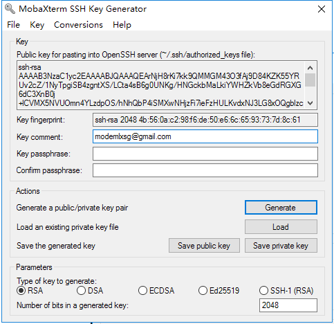
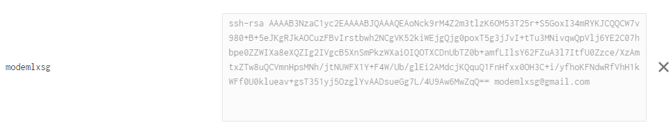
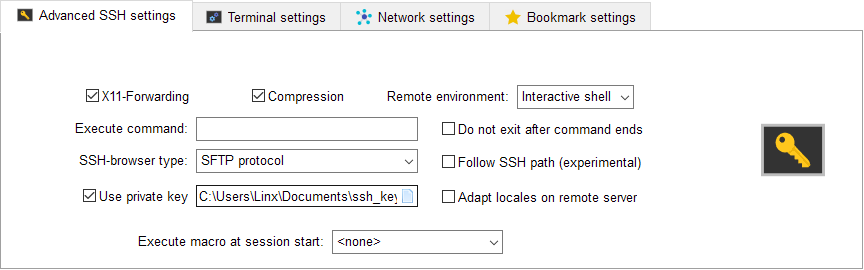
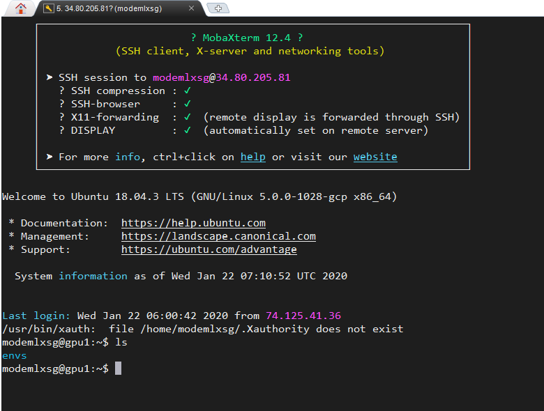

## GCP环境搭建


```shell
# python 安装
sudo apt-get install python3

# pip安装
sudo apt-get install software-properties-common
sudo apt-add-repository universe
sudo apt-get update
sudo apt-get install python3-pip

# virtualenv安装
sudo pip3 install -U virtualenv

#创建python环境
mkdir ./envs
cd envs
virtualenv --system-site-packages -p python3 env_tf2
source ./env_tf2/bin/activate #激活环境

<<<<<<< HEAD
# 安装TensorFlow or pytorch
pip install tensorflow
pip install torch torchvision
=======
# 安装TensorFlow
pip install tensorflow
>>>>>>> b6b15513843bdc29bd1809ac3eb9babe5db83710

# 安装其他库
pip install numpy pandas matplotlib sklearn jupyterlab

## 安装npm
sudo apt-get install npm

```

配置VPC IP地址 --改静态ip

配置防火墙规则

```shell
# jupyter 配置
jupyter lab --generate-config

c = get_config()
c.NotebookApp.ip = '*'
c.NotebookApp.open_browser = False
c.NotebookApp.port = 6006
c.NotebookApp.allow_remote_access = True
```


## GPU配置

https://tensorflow.google.cn/install/gpu

```powershell
mkdir cuda_install
cd cuda_install/
vim install.sh
# 添加安装脚本
sh +x install.sh #运行脚本,最好一条条运行
# 重启 
nvidia-smi #查看驱动是否安装成功

# 测试GPU是否可用
tf.test.is_gpu_available()

#解决依赖问题
#aptitude 与 apt-get 一样，是 Debian 及其衍生系统中功能极其强大的包管理工具。与 apt-get 不同的是，aptitude #在处理依赖问题上更佳一些。
sudo apt-get install aptitude
<<<<<<< HEAD
sudo aptitude install `缺少的包` # 把教程中apt-get改成aptitude进行安装
=======
sudo aptitude install `缺少的包`
>>>>>>> b6b15513843bdc29bd1809ac3eb9babe5db83710
```


## MobaXterm 连接

**SSH秘钥对生成**

tools -> ssh key generate (RSA 2048 移动鼠标加速生成) -> 修改key comment为GCP用户 -> save public and private key



**GCP 元数据中添加公钥**



**moba连接使用私钥**







## VSCode Remote

1、安装扩展Remote Devlopment

2、Remote SSH path修改为，git/usr/bin/ssh.exe

3、服务器端启用密码登录。vim /etc/ssh/sshd_config 修改`PasswordAuthentication` 为 `yes` (`PermitRootLogin yes` 允许root登录)

4、修改当前用户密码 `sudo su`  -> `passwd 'user'` 

5、重启ssh `/etc/init.d/ssh restart`

4、Code runner设置

```json
{
    "code-runner.saveAllFilesBeforeRun": true, //运行前保存
    "code-runner.clearPreviousOutput": true,	//运行清除以前输出
    "code-runner.executorMap": {	
         "python": "/home/modemlxsg/envs/env_torch/bin/python",
    }
}
```


### SSH文件上传

```bash
scp H:\dataset\ICDAR2015\ch4_training_images.zip modemlxsg@34.80.205.81:/home/modemlxsg/dataset
```


