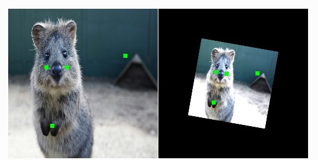
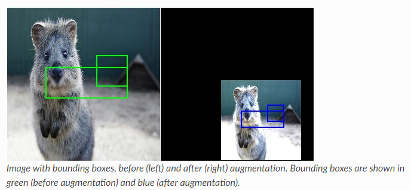
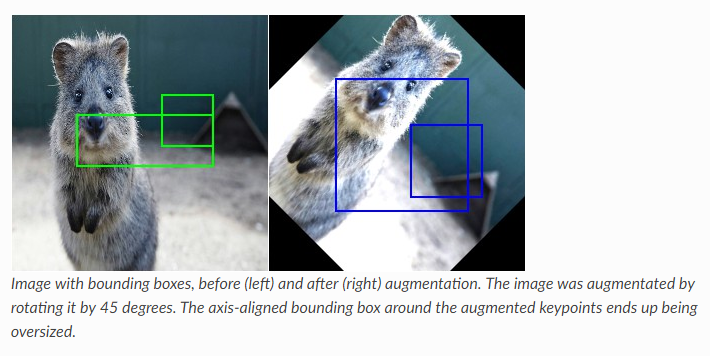
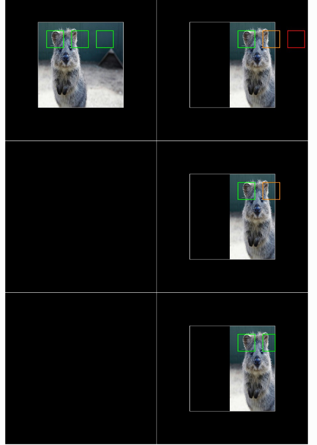
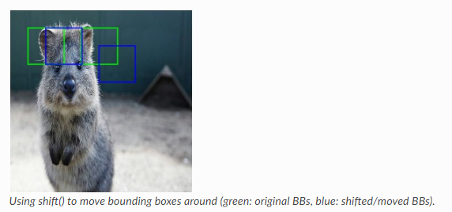
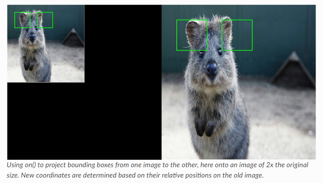
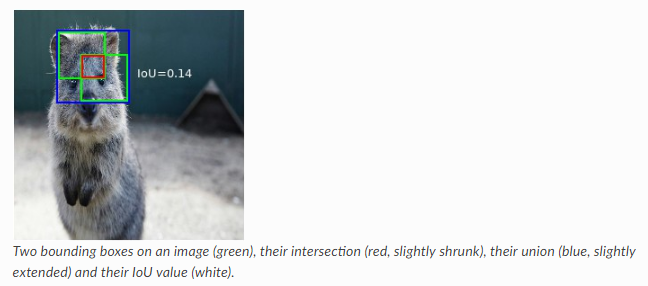
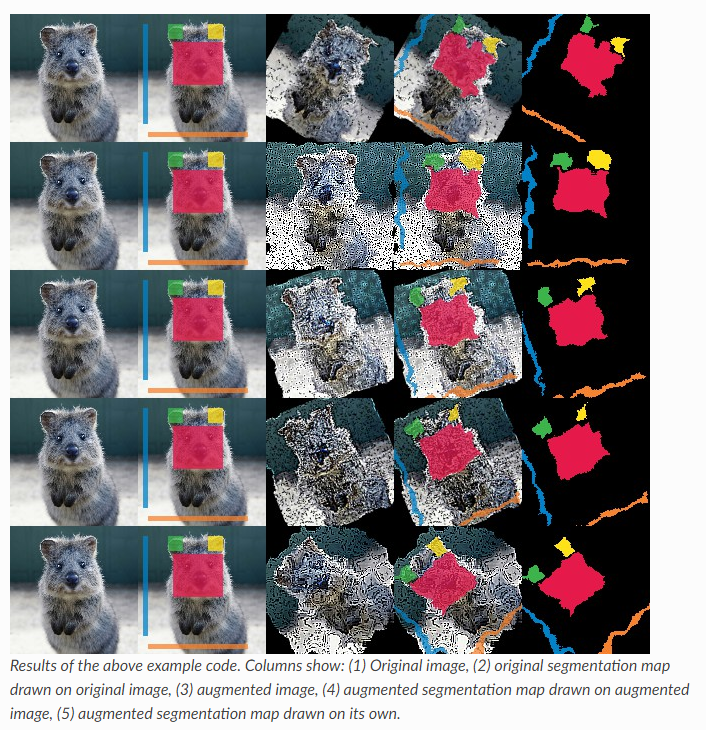
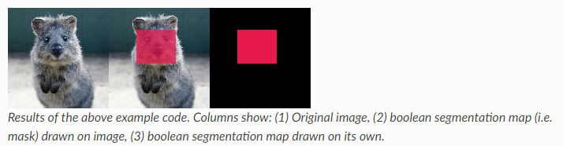
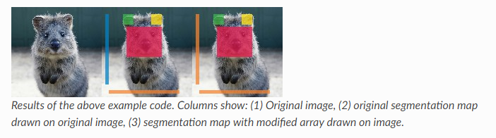

# Imgaug

https://imgaug.readthedocs.io/en/latest/

`imgaug`是一个用于机器学习实验中图像增强的库。它支持广泛的增强技术，允许轻松地将它们组合起来，并以随机顺序或在多CPU核上执行它们，具有简单但功能强大的随机接口，不仅可以增强图像，而且还可以增加关键点/地标、边界框、热图和分割图。


## Basic

下面的示例显示了一个标准用例。增强序列(裁剪+水平翻转+高斯模糊)在脚本开始时定义一次。然后，在用于训练之前，许多批次都会被加载和增强。

```python
from imgaug import augmenters as iaa

seq = iaa.Sequential([
    iaa.Crop(px=(0, 16)), # crop images from each side by 0 to 16px (randomly chosen)
    iaa.Fliplr(0.5), # horizontally flip 50% of the images
    iaa.GaussianBlur(sigma=(0, 3.0)) # blur images with a sigma of 0 to 3.0
])

for batch_idx in range(1000):
    # 'images' should be either a 4D numpy array of shape (N, height, width, channels)
    # or a list of 3D numpy arrays, each having shape (height, width, channels).
    # Grayscale images must have shape (height, width, 1) each.
    # All images must have numpy's dtype uint8. Values are expected to be in
    # range 0-255.
    images = load_batch(batch_idx)
    images_aug = seq(images=images)
    train_on_images(images_aug)
```

下面的示例显示了可能对许多常见实验有用的增强序列。它将农作物和仿射变换应用于图像，水平翻转一些图像，增加一些噪声和模糊，同时也改变对比度和亮度。

```python
import numpy as np
import imgaug as ia
import imgaug.augmenters as iaa


ia.seed(1)

# Example batch of images.
# The array has shape (32, 64, 64, 3) and dtype uint8.
images = np.array(
    [ia.quokka(size=(64, 64)) for _ in range(32)],
    dtype=np.uint8
)

seq = iaa.Sequential([
    iaa.Fliplr(0.5), # horizontal flips
    iaa.Crop(percent=(0, 0.1)), # random crops
    # Small gaussian blur with random sigma between 0 and 0.5.
    # But we only blur about 50% of all images.
    iaa.Sometimes(
        0.5,
        iaa.GaussianBlur(sigma=(0, 0.5))
    ),
    # Strengthen or weaken the contrast in each image.
    iaa.LinearContrast((0.75, 1.5)),
    # Add gaussian noise.
    # For 50% of all images, we sample the noise once per pixel.
    # For the other 50% of all images, we sample the noise per pixel AND
    # channel. This can change the color (not only brightness) of the
    # pixels.
    iaa.AdditiveGaussianNoise(loc=0, scale=(0.0, 0.05*255), per_channel=0.5),
    # Make some images brighter and some darker.
    # In 20% of all cases, we sample the multiplier once per channel,
    # which can end up changing the color of the images.
    iaa.Multiply((0.8, 1.2), per_channel=0.2),
    # Apply affine transformations to each image.
    # Scale/zoom them, translate/move them, rotate them and shear them.
    iaa.Affine(
        scale={"x": (0.8, 1.2), "y": (0.8, 1.2)},
        translate_percent={"x": (-0.2, 0.2), "y": (-0.2, 0.2)},
        rotate=(-25, 25),
        shear=(-8, 8)
    )
], random_order=True) # apply augmenters in random order

images_aug = seq(images=images)
```

下面的示例显示了包含许多不同增强器的大型增强序列，从而导致增强图像的显着变化。根据用例的不同，序列可能太强了。偶尔，它也会破坏图像的变化太多。要削弱这种影响，可以降低`iaa.SomeOf((0，5)，...)`的值。例如`(0，3)`或通过在有时`sometimes=lambda aug：iaa.sometimes(0.5, aug)`中减少而减少一些预言家的概率，有时(0.5，Aug)值为0.5到0.3。

```python
import numpy as np
import imgaug as ia
import imgaug.augmenters as iaa


ia.seed(1)

# Example batch of images.
# The array has shape (32, 64, 64, 3) and dtype uint8.
images = np.array(
    [ia.quokka(size=(64, 64)) for _ in range(32)],
    dtype=np.uint8
)

# Sometimes(0.5, ...) applies the given augmenter in 50% of all cases,
# e.g. Sometimes(0.5, GaussianBlur(0.3)) would blur roughly every second
# image.
sometimes = lambda aug: iaa.Sometimes(0.5, aug)

# Define our sequence of augmentation steps that will be applied to every image.
seq = iaa.Sequential(
    [
        #
        # Apply the following augmenters to most images.
        #
        iaa.Fliplr(0.5), # horizontally flip 50% of all images
        iaa.Flipud(0.2), # vertically flip 20% of all images

        # crop some of the images by 0-10% of their height/width
        sometimes(iaa.Crop(percent=(0, 0.1))),

        # Apply affine transformations to some of the images
        # - scale to 80-120% of image height/width (each axis independently)
        # - translate by -20 to +20 relative to height/width (per axis)
        # - rotate by -45 to +45 degrees
        # - shear by -16 to +16 degrees
        # - order: use nearest neighbour or bilinear interpolation (fast)
        # - mode: use any available mode to fill newly created pixels
        #         see API or scikit-image for which modes are available
        # - cval: if the mode is constant, then use a random brightness
        #         for the newly created pixels (e.g. sometimes black,
        #         sometimes white)
        sometimes(iaa.Affine(
            scale={"x": (0.8, 1.2), "y": (0.8, 1.2)},
            translate_percent={"x": (-0.2, 0.2), "y": (-0.2, 0.2)},
            rotate=(-45, 45),
            shear=(-16, 16),
            order=[0, 1],
            cval=(0, 255),
            mode=ia.ALL
        )),

        #
        # Execute 0 to 5 of the following (less important) augmenters per
        # image. Don't execute all of them, as that would often be way too
        # strong.
        #
        iaa.SomeOf((0, 5),
            [
                # Convert some images into their superpixel representation,
                # sample between 20 and 200 superpixels per image, but do
                # not replace all superpixels with their average, only
                # some of them (p_replace).
                sometimes(
                    iaa.Superpixels(
                        p_replace=(0, 1.0),
                        n_segments=(20, 200)
                    )
                ),

                # Blur each image with varying strength using
                # gaussian blur (sigma between 0 and 3.0),
                # average/uniform blur (kernel size between 2x2 and 7x7)
                # median blur (kernel size between 3x3 and 11x11).
                iaa.OneOf([
                    iaa.GaussianBlur((0, 3.0)),
                    iaa.AverageBlur(k=(2, 7)),
                    iaa.MedianBlur(k=(3, 11)),
                ]),

                # Sharpen each image, overlay the result with the original
                # image using an alpha between 0 (no sharpening) and 1
                # (full sharpening effect).
                iaa.Sharpen(alpha=(0, 1.0), lightness=(0.75, 1.5)),

                # Same as sharpen, but for an embossing effect.
                iaa.Emboss(alpha=(0, 1.0), strength=(0, 2.0)),

                # Search in some images either for all edges or for
                # directed edges. These edges are then marked in a black
                # and white image and overlayed with the original image
                # using an alpha of 0 to 0.7.
                sometimes(iaa.OneOf([
                    iaa.EdgeDetect(alpha=(0, 0.7)),
                    iaa.DirectedEdgeDetect(
                        alpha=(0, 0.7), direction=(0.0, 1.0)
                    ),
                ])),

                # Add gaussian noise to some images.
                # In 50% of these cases, the noise is randomly sampled per
                # channel and pixel.
                # In the other 50% of all cases it is sampled once per
                # pixel (i.e. brightness change).
                iaa.AdditiveGaussianNoise(
                    loc=0, scale=(0.0, 0.05*255), per_channel=0.5
                ),

                # Either drop randomly 1 to 10% of all pixels (i.e. set
                # them to black) or drop them on an image with 2-5% percent
                # of the original size, leading to large dropped
                # rectangles.
                iaa.OneOf([
                    iaa.Dropout((0.01, 0.1), per_channel=0.5),
                    iaa.CoarseDropout(
                        (0.03, 0.15), size_percent=(0.02, 0.05),
                        per_channel=0.2
                    ),
                ]),

                # Invert each image's channel with 5% probability.
                # This sets each pixel value v to 255-v.
                iaa.Invert(0.05, per_channel=True), # invert color channels

                # Add a value of -10 to 10 to each pixel.
                iaa.Add((-10, 10), per_channel=0.5),

                # Change brightness of images (50-150% of original value).
                iaa.Multiply((0.5, 1.5), per_channel=0.5),

                # Improve or worsen the contrast of images.
                iaa.LinearContrast((0.5, 2.0), per_channel=0.5),

                # Convert each image to grayscale and then overlay the
                # result with the original with random alpha. I.e. remove
                # colors with varying strengths.
                iaa.Grayscale(alpha=(0.0, 1.0)),

                # In some images move pixels locally around (with random
                # strengths).
                sometimes(
                    iaa.ElasticTransformation(alpha=(0.5, 3.5), sigma=0.25)
                ),

                # In some images distort local areas with varying strength.
                sometimes(iaa.PiecewiseAffine(scale=(0.01, 0.05)))
            ],
            # do all of the above augmentations in random order
            random_order=True
        )
    ],
    # do all of the above augmentations in random order
    random_order=True
)

images_aug = seq(images=images)
```


## keypoints

imgaug不仅可以处理图像，而且还可以处理这些图像上的关键点/地标。例如，如果图像在增强过程中旋转，也可以相应地旋转所有地标。

下面的示例加载一个图像并在其上放置四个关键点。然后增强图像，使其更亮、稍微旋转和缩放。这些增强也适用于关键点。然后在增强前后显示图像(并在其上画关键点)。

```python
import imgaug as ia
import imgaug.augmenters as iaa
from imgaug.augmentables import Keypoint, KeypointsOnImage


ia.seed(1)

image = ia.quokka(size=(256, 256))
kps = KeypointsOnImage([
    Keypoint(x=65, y=100),
    Keypoint(x=75, y=200),
    Keypoint(x=100, y=100),
    Keypoint(x=200, y=80)
], shape=image.shape)

seq = iaa.Sequential([
    iaa.Multiply((1.2, 1.5)), # change brightness, doesn't affect keypoints
    iaa.Affine(
        rotate=10,
        scale=(0.5, 0.7)
    ) # rotate by exactly 10deg and scale to 50-70%, affects keypoints
])

# Augment keypoints and images.
image_aug, kps_aug = seq(image=image, keypoints=kps)

# print coordinates before/after augmentation (see below)
# use after.x_int and after.y_int to get rounded integer coordinates
for i in range(len(kps.keypoints)):
    before = kps.keypoints[i]
    after = kps_aug.keypoints[i]
    print("Keypoint %d: (%.8f, %.8f) -> (%.8f, %.8f)" % (
        i, before.x, before.y, after.x, after.y)
    )

# image with keypoints before/after augmentation (shown below)
image_before = kps.draw_on_image(image, size=7)
image_after = kps_aug.draw_on_image(image_aug, size=7)
```




## Bounding Boxes

imgaug提供对包围框(也称为矩形，感兴趣区域)的支持。例如，如果图像在增强过程中被旋转，库也可以相应地旋转其上的所有包围框。

库的边界框支持的特性：

- 将边界框表示为对象(`imgaug.augmentables.bbs.BoundingBox`)。

- 增强包围盒。

- 在图像上画边框。

- 移动/变换图像上的边界框，将它们投影到其他图像上(例如，调整大小后放到相同的图像上)，计算它们的交叉点/联合值和IOU值。


### 简单示例

下面的示例加载一个图像并在其上放置两个边界框。然后增强图像，使其更亮、稍微旋转和缩放。这些增强也适用于包围盒。然后在增强前后显示图像(并在其上画边框)。

```python
import imgaug as ia
import imgaug.augmenters as iaa
from imgaug.augmentables.bbs import BoundingBox, BoundingBoxesOnImage


ia.seed(1)

image = ia.quokka(size=(256, 256))
bbs = BoundingBoxesOnImage([
    BoundingBox(x1=65, y1=100, x2=200, y2=150),
    BoundingBox(x1=150, y1=80, x2=200, y2=130)
], shape=image.shape)

seq = iaa.Sequential([
    iaa.Multiply((1.2, 1.5)), # change brightness, doesn't affect BBs
    iaa.Affine(
        translate_px={"x": 40, "y": 60},
        scale=(0.5, 0.7)
    ) # translate by 40/60px on x/y axis, and scale to 50-70%, affects BBs
])

# Augment BBs and images.
image_aug, bbs_aug = seq(image=image, bounding_boxes=bbs)

# print coordinates before/after augmentation (see below)
# use .x1_int, .y_int, ... to get integer coordinates
for i in range(len(bbs.bounding_boxes)):
    before = bbs.bounding_boxes[i]
    after = bbs_aug.bounding_boxes[i]
    print("BB %d: (%.4f, %.4f, %.4f, %.4f) -> (%.4f, %.4f, %.4f, %.4f)" % (
        i,
        before.x1, before.y1, before.x2, before.y2,
        after.x1, after.y1, after.x2, after.y2)
    )

# image with BBs before/after augmentation (shown below)
image_before = bbs.draw_on_image(image, size=2)
image_after = bbs_aug.draw_on_image(image_aug, size=2, color=[0, 0, 255])
```



请注意，边框增强的工作方式是增强每个框的边缘坐标，然后围绕这些增广坐标绘制一个边界框。因此，这些新的包围框中的每一个都是对轴对齐的.这有时会导致超大的新边框，特别是在旋转的情况下。下面的图像显示了上面示例中相同代码的结果，但是仿射被仿射(旋转=45)所代替：




### 处理图像外部的边框

当增强图像和它们各自的包围框时，这些框可以完全或部分地在图像平面之外结束。默认情况下，库仍然返回这些框，尽管这可能不是所需的。下面的示例演示如何(A)删除完全/部分位于图像之外的边框，以及(B)如何裁剪部分位于图像之外的边框，使其完全在图像中。

```python
import numpy as np
import imgaug as ia
import imgaug.augmenters as iaa
from imgaug.augmentables.bbs import BoundingBox, BoundingBoxesOnImage


ia.seed(1)

GREEN = [0, 255, 0]
ORANGE = [255, 140, 0]
RED = [255, 0, 0]

# Pad image with a 1px white and (BY-1)px black border
def pad(image, by):
    image_border1 = ia.pad(image, top=1, right=1, bottom=1, left=1,
                           mode="constant", cval=255)
    image_border2 = ia.pad(image_border1, top=by-1, right=by-1,
                           bottom=by-1, left=by-1,
                           mode="constant", cval=0)
    return image_border2

# Draw BBs on an image
# and before doing that, extend the image plane by BORDER pixels.
# Mark BBs inside the image plane with green color, those partially inside
# with orange and those fully outside with red.
def draw_bbs(image, bbs, border):
    image_border = pad(image, border)
    for bb in bbs.bounding_boxes:
        if bb.is_fully_within_image(image.shape):
            color = GREEN
        elif bb.is_partly_within_image(image.shape):
            color = ORANGE
        else:
            color = RED
        image_border = bb.shift(left=border, top=border)\
                         .draw_on_image(image_border, size=2, color=color)

    return image_border

# Define example image with three small square BBs next to each other.
# Augment these BBs by shifting them to the right.
image = ia.quokka(size=(256, 256))
bbs = BoundingBoxesOnImage([
    BoundingBox(x1=25, x2=75, y1=25, y2=75),
    BoundingBox(x1=100, x2=150, y1=25, y2=75),
    BoundingBox(x1=175, x2=225, y1=25, y2=75)
], shape=image.shape)

seq = iaa.Affine(translate_px={"x": 120})
image_aug, bbs_aug = seq(image=image, bounding_boxes=bbs)

# Draw the BBs (a) in their original form, (b) after augmentation,
# (c) after augmentation and removing those fully outside the image,
# (d) after augmentation and removing those fully outside the image and
# clipping those partially inside the image so that they are fully inside.
image_before = draw_bbs(image, bbs, 100)
image_after1 = draw_bbs(image_aug, bbs_aug, 100)
image_after2 = draw_bbs(image_aug, bbs_aug.remove_out_of_image(), 100)
image_after3 = draw_bbs(image_aug, bbs_aug.remove_out_of_image().clip_out_of_image(), 100)
```



上述示例代码的结果。左上角：原始/无增广的图像，有边框(在这里，图像周围有一个额外的黑色边框)。右上方：增强后的图像(向右平移120 px)。一个边框现在完全超出图像区域(红色)，另一个部分在它外面(橙色)。右，中间：在使用.reemove_outof_Image()之后，完全超出图像区域的bb被移除。右，中心：在使用.remove_out_of_Image()和.clip_out_of_Image()之后，一个BB被删除，部分位于图像区域之外的一个被裁剪成完全在它里面。


### 移动/变换包围框

函数`shift(top=<int>，right=<int>，bottom=<int>，left=<int>)`可用于更改所有或特定边框的x/y位置。

```python
import imgaug as ia
from imgaug.augmentables.bbs import BoundingBox, BoundingBoxesOnImage

ia.seed(1)

# Define image and two bounding boxes
image = ia.quokka(size=(256, 256))
bbs = BoundingBoxesOnImage([
    BoundingBox(x1=25, x2=75, y1=25, y2=75),
    BoundingBox(x1=100, x2=150, y1=25, y2=75)
], shape=image.shape)

# Move both BBs 25px to the right and the second BB 25px down
bbs_shifted = bbs.shift(left=25)
bbs_shifted.bounding_boxes[1] = bbs_shifted.bounding_boxes[1].shift(top=25)

# Draw images before/after moving BBs
image = bbs.draw_on_image(image, color=[0, 255, 0], size=2, alpha=0.75)
image = bbs_shifted.draw_on_image(image, color=[0, 0, 255], size=2, alpha=0.75)
```




### 包围框在缩放图像上的投影

使用函数`.on(Image)`，可以很容易地将包围框投影到同一图像的缩放版本上。这会改变包围框的坐标。例如，如果边框的左上角坐标在x=10%和y=15%时，它在新图像上仍然是x/y 10%/15%，但绝对像素值将根据新图像的高度/宽度而变化。

```python
import imgaug as ia
from imgaug.augmentables.bbs import BoundingBox, BoundingBoxesOnImage


ia.seed(1)

# Define image with two bounding boxes
image = ia.quokka(size=(256, 256))
bbs = BoundingBoxesOnImage([
    BoundingBox(x1=25, x2=75, y1=25, y2=75),
    BoundingBox(x1=100, x2=150, y1=25, y2=75)
], shape=image.shape)

# Rescale image and bounding boxes
image_rescaled = ia.imresize_single_image(image, (512, 512))
bbs_rescaled = bbs.on(image_rescaled)

# Draw image before/after rescaling and with rescaled bounding boxes
image_bbs = bbs.draw_on_image(image, size=2)
image_rescaled_bbs = bbs_rescaled.draw_on_image(image_rescaled, size=2)
```




### 计算交集、并集和IOU

```python
import numpy as np
import imgaug as ia
from imgaug.augmentables.bbs import BoundingBox


ia.seed(1)

# Define image with two bounding boxes.
image = ia.quokka(size=(256, 256))
bb1 = BoundingBox(x1=50, x2=100, y1=25, y2=75)
bb2 = BoundingBox(x1=75, x2=125, y1=50, y2=100)

# Compute intersection, union and IoU value
# Intersection and union are both bounding boxes. They are here
# decreased/increased in size purely for better visualization.
bb_inters = bb1.intersection(bb2).extend(all_sides=-1)
bb_union = bb1.union(bb2).extend(all_sides=2)
iou = bb1.iou(bb2)

# Draw bounding boxes, intersection, union and IoU value on image.
image_bbs = np.copy(image)
image_bbs = bb1.draw_on_image(image_bbs, size=2, color=[0, 255, 0])
image_bbs = bb2.draw_on_image(image_bbs, size=2, color=[0, 255, 0])
image_bbs = bb_inters.draw_on_image(image_bbs, size=2, color=[255, 0, 0])
image_bbs = bb_union.draw_on_image(image_bbs, size=2, color=[0, 0, 255])
image_bbs = ia.draw_text(
    image_bbs, text="IoU=%.2f" % (iou,),
    x=bb_union.x2+10, y=bb_union.y1+bb_union.height//2,
    color=[255, 255, 255], size=13
)
```




## Heatmaps


## Segmentation Maps and Masks

imgaug提供了对数据分割映射的支持，例如语义分割映射、实例分割映射或普通掩码。分割映射可以相应地扩展到图像。例如，如果图像旋转45°，该图像的相应分割映射也将旋转45°。

注：所有分割映射的增强函数都是在增强地面真相数据的假设下实现的。因此，分割地图将受到改变图像几何形状的增强(例如仿射变换、裁剪、调整大小)的影响，而不受其他增强(如高斯噪声、饱和度变化、灰度缩放、脱落、…)的影响。。

库的分割映射支持功能：

- 将分割映射表示为对象`imgaug.augmentables.segmaps.SegmentationMapsOnImage`
- 支持整数映射(整数类型，通常为`int32`)和布尔掩码(dtype `numpy.bool_`)
- 增强分割映射(仅影响几何增强，例如仿射变换、裁剪、…)。
- 使用不同的分辨率分割地图和图像(例如，32x32分割映射和对应图像的256x256)。
- 绘制分割地图--单独绘制或在图像上绘制`SegmentationMapsOnImage.draw()`，`SegmentationMapsOnImage.draw_on_image()`
- 调整分割映射大小`SegmentationMapsOnImage.resize()`
- 按像素数量或所需纵横比划分的填充分割图`SegmentationMapsOnImage.pad()`, `SegmentationMapsOnImage.pad_to_aspect_ratio()`


### 简单示例

下面的示例加载一个标准图像并定义相应的int 32分段映射。以同样的方式对图像和分割图进行了增强，并对结果进行了可视化。

```python
import imageio
import numpy as np
import imgaug as ia
import imgaug.augmenters as iaa
from imgaug.augmentables.segmaps import SegmentationMapsOnImage

ia.seed(1)

# Load an example image (uint8, 128x128x3).
image = ia.quokka(size=(128, 128), extract="square")

# Define an example segmentation map (int32, 128x128).
# Here, we arbitrarily place some squares on the image.
# Class 0 is our intended background class.
segmap = np.zeros((128, 128, 1), dtype=np.int32)
segmap[28:71, 35:85, 0] = 1
segmap[10:25, 30:45, 0] = 2
segmap[10:25, 70:85, 0] = 3
segmap[10:110, 5:10, 0] = 4
segmap[118:123, 10:110, 0] = 5
segmap = SegmentationMapsOnImage(segmap, shape=image.shape)

# Define our augmentation pipeline.
seq = iaa.Sequential([
    iaa.Dropout([0.05, 0.2]),      # drop 5% or 20% of all pixels
    iaa.Sharpen((0.0, 1.0)),       # sharpen the image
    iaa.Affine(rotate=(-45, 45)),  # rotate by -45 to 45 degrees (affects segmaps)
    iaa.ElasticTransformation(alpha=50, sigma=5)  # apply water effect (affects segmaps)
], random_order=True)

# Augment images and segmaps.
images_aug = []
segmaps_aug = []
for _ in range(5):
    images_aug_i, segmaps_aug_i = seq(image=image, segmentation_maps=segmap)
    images_aug.append(images_aug_i)
    segmaps_aug.append(segmaps_aug_i)

# We want to generate an image containing the original input image and
# segmentation maps before/after augmentation. (Both multiple times for
# multiple augmentations.)
#
# The whole image is supposed to have five columns:
# (1) original image,
# (2) original image with segmap,
# (3) augmented image,
# (4) augmented segmap on augmented image,
# (5) augmented segmap on its own in.
#
# We now generate the cells of these columns.
#
# Note that draw_on_image() and draw() both return lists of drawn
# images. Assuming that the segmentation map array has shape (H,W,C),
# the list contains C items.
cells = []
for image_aug, segmap_aug in zip(images_aug, segmaps_aug):
    cells.append(image)                                         # column 1
    cells.append(segmap.draw_on_image(image)[0])                # column 2
    cells.append(image_aug)                                     # column 3
    cells.append(segmap_aug.draw_on_image(image_aug)[0])        # column 4
    cells.append(segmap_aug.draw(size=image_aug.shape[:2])[0])  # column 5

# Convert cells to a grid image and save.
grid_image = ia.draw_grid(cells, cols=5)
imageio.imwrite("example_segmaps.jpg", grid_image)
```




### 使用布尔掩码

为了增强掩码，您可以简单地使用布尔数组。其他一切都与int 32地图相同。下面的代码显示了一个示例，非常类似于上面针对int 32映射的代码。它可以将`np.zeros((128，128，1)，dtype=np.int 32)`更改为`np.zeros((128，128，1)，dtype=bool)`。

```python
import imageio
import numpy as np
import imgaug as ia
from imgaug.augmentables.segmaps import SegmentationMapsOnImage

# Load an example image (uint8, 128x128x3).
image = ia.quokka(size=(128, 128), extract="square")

# Create an example mask (bool, 128x128).
# Here, we arbitrarily place a square on the image.
segmap = np.zeros((128, 128, 1), dtype=bool)
segmap[28:71, 35:85, 0] = True
segmap = SegmentationMapsOnImage(segmap, shape=image.shape)

# Draw three columns: (1) original image,
# (2) original image with mask on top, (3) only mask
cells = [
    image,
    segmap.draw_on_image(image)[0],
    segmap.draw(size=image.shape[:2])[0]
]

# Convert cells to a grid image and save.
grid_image = ia.draw_grid(cells, cols=3)
imageio.imwrite("example_segmaps_bool.jpg", grid_image)
```




### 访问分割映射数组

增强后，通常需要重新访问分割映射数组。这可以使用`SegmentationMapsOnImage.get_arr()`来完成，它返回一个形状和dtype与原先作为`arr`提供给`SegmentationMapsOnImage(arr，.)`的分段映射数组。

```python
import imageio
import numpy as np
import imgaug as ia
from imgaug.augmentables.segmaps import SegmentationMapsOnImage

# Load an example image (uint8, 128x128x3).
image = ia.quokka(size=(128, 128), extract="square")

# Create an example segmentation map (int32, 128x128).
# Here, we arbitrarily place some squares on the image.
# Class 0 is the background class.
segmap = np.zeros((128, 128, 1), dtype=np.int32)
segmap[28:71, 35:85, 0] = 1
segmap[10:25, 30:45, 0] = 2
segmap[10:25, 70:85, 0] = 3
segmap[10:110, 5:10, 0] = 4
segmap[118:123, 10:110, 0] = 5
segmap1 = SegmentationMapsOnImage(segmap, shape=image.shape)

# Read out the segmentation map's array, change it and create a new
# segmentation map
arr = segmap1.get_arr()
arr[10:110, 5:10, 0] = 5
segmap2 = ia.SegmentationMapsOnImage(arr, shape=image.shape)

# Draw three columns: (1) original image, (2) original image with
# unaltered segmentation map on top, (3) original image with altered
# segmentation map on top
cells = [
    image,
    segmap1.draw_on_image(image)[0],
    segmap2.draw_on_image(image)[0]
]

# Convert cells to grid image and save.
grid_image = ia.draw_grid(cells, cols=3)
imageio.imwrite("example_segmaps_array.jpg", grid_image)
```




### 调整尺寸和填充

分割地图可以很容易地调整大小和填充。这些方法与用于热图的方法相同(请参阅：Doc：exameseheatmap)，尽管分段映射不提供通过平均池或最大池进行调整的功能。resize()方法也默认为最近邻插值(而不是三次插值)，建议不要更改它。

调整大小和填充的函数如下：

- `SegmentationMapsOnImage.resize(sizes, interpolation="nearest")`: Resizes to `sizes` given as a tuple `(height, width)`. Interpolation can be `nearest`, `linear`, `cubic` and `area`, but only`nearest` is actually recommended.
- `SegmentationMapsOnImage.pad(top=0, right=0, bottom=0, left=0, mode="constant", cval=0)`: Pads the segmentation map by given pixel amounts. Uses by default constant value padding with value `0`, i.e. zero-padding. Possible padding modes are the same as for `numpy.pad()`, i.e. `constant`, `edge`, `linear_ramp`, `maximum`, `mean`, `median`, `minimum`, `reflect`, `symmetric` and `wrap`.
- `SegmentationMapsOnImage.pad_to_aspect_ratio(aspect_ratio, mode="constant", cval=0,return_pad_amounts=False)`: Same as `pad()`, but pads an image towards a desired aspect ratio (`ratio = width / height`). E.g. use `1.0` for squared segmentation maps or `2.0` for maps that are twice as wide as they are high.


# API

## imgaug.augmenters.meta

***

- [`Augmenter`](https://imgaug.readthedocs.io/en/latest/source/api_augmenters_meta.html#imgaug.augmenters.meta.Augmenter) (base class for all augmenters)
- [`Sequential`](https://imgaug.readthedocs.io/en/latest/source/api_augmenters_meta.html#imgaug.augmenters.meta.Sequential)
- [`SomeOf`](https://imgaug.readthedocs.io/en/latest/source/api_augmenters_meta.html#imgaug.augmenters.meta.SomeOf)
- [`OneOf`](https://imgaug.readthedocs.io/en/latest/source/api_augmenters_meta.html#imgaug.augmenters.meta.OneOf)
- [`Sometimes`](https://imgaug.readthedocs.io/en/latest/source/api_augmenters_meta.html#imgaug.augmenters.meta.Sometimes)
- [`WithChannels`](https://imgaug.readthedocs.io/en/latest/source/api_augmenters_meta.html#imgaug.augmenters.meta.WithChannels)
- [`Identity`](https://imgaug.readthedocs.io/en/latest/source/api_augmenters_meta.html#imgaug.augmenters.meta.Identity)
- [`Noop`](https://imgaug.readthedocs.io/en/latest/source/api_augmenters_meta.html#imgaug.augmenters.meta.Noop)
- [`Lambda`](https://imgaug.readthedocs.io/en/latest/source/api_augmenters_meta.html#imgaug.augmenters.meta.Lambda)
- [`AssertLambda`](https://imgaug.readthedocs.io/en/latest/source/api_augmenters_meta.html#imgaug.augmenters.meta.AssertLambda)
- [`AssertShape`](https://imgaug.readthedocs.io/en/latest/source/api_augmenters_meta.html#imgaug.augmenters.meta.AssertShape)
- [`ChannelShuffle`](https://imgaug.readthedocs.io/en/latest/source/api_augmenters_meta.html#imgaug.augmenters.meta.ChannelShuffle)


###  Augmenter

> class imgaug.augmenters.meta.**Augmenter**(seed=None, name=None, random_state='deprecated', deterministic='deprecated')

增强器对象的基类。所有的增强器都是从这个类派生出来的。


**Methods:**

|                                                              |                                                              |
| ------------------------------------------------------------ | ------------------------------------------------------------ |
| `__call__`(self, \*args, \*\*kwargs)                         | Alias for [`augment()`](https://imgaug.readthedocs.io/en/latest/source/api_augmenters_meta.html#imgaug.augmenters.meta.Augmenter.augment). |
| [`augment`](https://imgaug.readthedocs.io/en/latest/source/api_augmenters_meta.html#imgaug.augmenters.meta.Augmenter.augment)(self[, return_batch, hooks]) | Augment a batch.                                             |
| [`augment_batch`](https://imgaug.readthedocs.io/en/latest/source/api_augmenters_meta.html#imgaug.augmenters.meta.Augmenter.augment_batch)(self, batch[, hooks]) | **Deprecated**.                                              |
| [`augment_batch_`](https://imgaug.readthedocs.io/en/latest/source/api_augmenters_meta.html#imgaug.augmenters.meta.Augmenter.augment_batch_)(self, batch[, parents, hooks]) | Augment a single batch in-place.                             |
| [`augment_batches`](https://imgaug.readthedocs.io/en/latest/source/api_augmenters_meta.html#imgaug.augmenters.meta.Augmenter.augment_batches)(self, batches[, hooks, …]) | Augment multiple batches.                                    |
| [`augment_bounding_boxes`](https://imgaug.readthedocs.io/en/latest/source/api_augmenters_meta.html#imgaug.augmenters.meta.Augmenter.augment_bounding_boxes)(self, …[, parents, …]) | Augment a batch of bounding boxes.                           |
| [`augment_heatmaps`](https://imgaug.readthedocs.io/en/latest/source/api_augmenters_meta.html#imgaug.augmenters.meta.Augmenter.augment_heatmaps)(self, heatmaps[, parents, …]) | Augment a batch of heatmaps.                                 |
| [`augment_image`](https://imgaug.readthedocs.io/en/latest/source/api_augmenters_meta.html#imgaug.augmenters.meta.Augmenter.augment_image)(self, image[, hooks]) | Augment a single image.                                      |
| [`augment_images`](https://imgaug.readthedocs.io/en/latest/source/api_augmenters_meta.html#imgaug.augmenters.meta.Augmenter.augment_images)(self, images[, parents, hooks]) | Augment a batch of images.                                   |
| [`augment_keypoints`](https://imgaug.readthedocs.io/en/latest/source/api_augmenters_meta.html#imgaug.augmenters.meta.Augmenter.augment_keypoints)(self, keypoints_on_images) | Augment a batch of keypoints/landmarks.                      |
| [`augment_line_strings`](https://imgaug.readthedocs.io/en/latest/source/api_augmenters_meta.html#imgaug.augmenters.meta.Augmenter.augment_line_strings)(self, …[, parents, hooks]) | Augment a batch of line strings.                             |
| [`augment_polygons`](https://imgaug.readthedocs.io/en/latest/source/api_augmenters_meta.html#imgaug.augmenters.meta.Augmenter.augment_polygons)(self, polygons_on_images[, …]) | Augment a batch of polygons.                                 |
| [`augment_segmentation_maps`](https://imgaug.readthedocs.io/en/latest/source/api_augmenters_meta.html#imgaug.augmenters.meta.Augmenter.augment_segmentation_maps)(self, segmaps[, …]) | Augment a batch of segmentation maps.                        |
| [`copy`](https://imgaug.readthedocs.io/en/latest/source/api_augmenters_meta.html#imgaug.augmenters.meta.Augmenter.copy)(self) | Create a shallow copy of this Augmenter instance.            |
| [`copy_random_state`](https://imgaug.readthedocs.io/en/latest/source/api_augmenters_meta.html#imgaug.augmenters.meta.Augmenter.copy_random_state)(self, source[, recursive, …]) | Copy the RNGs from a source augmenter sequence.              |
| [`copy_random_state_`](https://imgaug.readthedocs.io/en/latest/source/api_augmenters_meta.html#imgaug.augmenters.meta.Augmenter.copy_random_state_)(self, source[, …]) | Copy the RNGs from a source augmenter sequence (in-place).   |
| [`deepcopy`](https://imgaug.readthedocs.io/en/latest/source/api_augmenters_meta.html#imgaug.augmenters.meta.Augmenter.deepcopy)(self) | Create a deep copy of this Augmenter instance.               |
| [`draw_grid`](https://imgaug.readthedocs.io/en/latest/source/api_augmenters_meta.html#imgaug.augmenters.meta.Augmenter.draw_grid)(self, images, rows, cols) | Augment images and draw the results as a single grid-like image. |
| [`find_augmenters`](https://imgaug.readthedocs.io/en/latest/source/api_augmenters_meta.html#imgaug.augmenters.meta.Augmenter.find_augmenters)(self, func[, parents, flat]) | Find augmenters that match a condition.                      |
| [`find_augmenters_by_name`](https://imgaug.readthedocs.io/en/latest/source/api_augmenters_meta.html#imgaug.augmenters.meta.Augmenter.find_augmenters_by_name)(self, name[, regex, …]) | Find augmenter(s) by name.                                   |
| [`find_augmenters_by_names`](https://imgaug.readthedocs.io/en/latest/source/api_augmenters_meta.html#imgaug.augmenters.meta.Augmenter.find_augmenters_by_names)(self, names[, …]) | Find augmenter(s) by names.                                  |
| [`get_all_children`](https://imgaug.readthedocs.io/en/latest/source/api_augmenters_meta.html#imgaug.augmenters.meta.Augmenter.get_all_children)(self[, flat]) | Get all children of this augmenter as a list.                |
| [`get_children_lists`](https://imgaug.readthedocs.io/en/latest/source/api_augmenters_meta.html#imgaug.augmenters.meta.Augmenter.get_children_lists)(self) | Get a list of lists of children of this augmenter.           |
| [`get_parameters`](https://imgaug.readthedocs.io/en/latest/source/api_augmenters_meta.html#imgaug.augmenters.meta.Augmenter.get_parameters)(self) | Get the parameters of this augmenter.                        |
| [`localize_random_state`](https://imgaug.readthedocs.io/en/latest/source/api_augmenters_meta.html#imgaug.augmenters.meta.Augmenter.localize_random_state)(self[, recursive]) | Assign augmenter-specific RNGs to this augmenter and its children. |
| [`localize_random_state_`](https://imgaug.readthedocs.io/en/latest/source/api_augmenters_meta.html#imgaug.augmenters.meta.Augmenter.localize_random_state_)(self[, recursive]) | Assign augmenter-specific RNGs to this augmenter and its children. |
| [`pool`](https://imgaug.readthedocs.io/en/latest/source/api_augmenters_meta.html#imgaug.augmenters.meta.Augmenter.pool)(self[, processes, maxtasksperchild, seed]) | Create a pool used for multicore augmentation.               |
| [`remove_augmenters`](https://imgaug.readthedocs.io/en/latest/source/api_augmenters_meta.html#imgaug.augmenters.meta.Augmenter.remove_augmenters)(self, func[, copy, …]) | Remove this augmenter or children that match a condition.    |
| [`remove_augmenters_`](https://imgaug.readthedocs.io/en/latest/source/api_augmenters_meta.html#imgaug.augmenters.meta.Augmenter.remove_augmenters_)(self, func[, parents]) | Remove in-place children of this augmenter that match a condition. |
| [`remove_augmenters_inplace`](https://imgaug.readthedocs.io/en/latest/source/api_augmenters_meta.html#imgaug.augmenters.meta.Augmenter.remove_augmenters_inplace)(self, func[, parents]) | **Deprecated**.                                              |
| [`reseed`](https://imgaug.readthedocs.io/en/latest/source/api_augmenters_meta.html#imgaug.augmenters.meta.Augmenter.reseed)(self[, random_state, deterministic_too]) | **Deprecated**.                                              |
| [`seed_`](https://imgaug.readthedocs.io/en/latest/source/api_augmenters_meta.html#imgaug.augmenters.meta.Augmenter.seed_)(self[, entropy, deterministic_too]) | Seed this augmenter and all of its children.                 |
| [`show_grid`](https://imgaug.readthedocs.io/en/latest/source/api_augmenters_meta.html#imgaug.augmenters.meta.Augmenter.show_grid)(self, images, rows, cols) | Augment images and plot the results as a single grid-like image. |
| [`to_deterministic`](https://imgaug.readthedocs.io/en/latest/source/api_augmenters_meta.html#imgaug.augmenters.meta.Augmenter.to_deterministic)(self[, n]) | Convert this augmenter from a stochastic to a deterministic one. |


### Sequential

> class imgaug.augmenters.meta.**Sequential**(children=None, random_order=False, seed=None, name=None, random_state='deprecated', deterministic='deprecated')

List augmenter containing child augmenters to apply to inputs.


**Methods:**

|                                                              |                                                              |
| ------------------------------------------------------------ | ------------------------------------------------------------ |
| `__call__`(self, \*args, \*\*kwargs)                         | Alias for [`augment()`](https://imgaug.readthedocs.io/en/latest/source/api_augmenters_meta.html#imgaug.augmenters.meta.Augmenter.augment). |
| [`add`](https://imgaug.readthedocs.io/en/latest/source/api_augmenters_meta.html#imgaug.augmenters.meta.Sequential.add)(self, augmenter) | Add an augmenter to the list of child augmenters.            |
| `append`(self, object, /)                                    | Append object to the end of the list.                        |
| `augment`(self[, return_batch, hooks])                       | Augment a batch.                                             |
| `augment_batch`(self, batch[, hooks])                        | **Deprecated**.                                              |
| `augment_batch_`(self, batch[, parents, hooks])              | Augment a single batch in-place.                             |
| `augment_batches`(self, batches[, hooks, …])                 | Augment multiple batches.                                    |
| `augment_bounding_boxes`(self, …[, parents, …])              | Augment a batch of bounding boxes.                           |
| `augment_heatmaps`(self, heatmaps[, parents, …])             | Augment a batch of heatmaps.                                 |
| `augment_image`(self, image[, hooks])                        | Augment a single image.                                      |
| `augment_images`(self, images[, parents, hooks])             | Augment a batch of images.                                   |
| `augment_keypoints`(self, keypoints_on_images)               | Augment a batch of keypoints/landmarks.                      |
| `augment_line_strings`(self, …[, parents, hooks])            | Augment a batch of line strings.                             |
| `augment_polygons`(self, polygons_on_images[, …])            | Augment a batch of polygons.                                 |
| `augment_segmentation_maps`(self, segmaps[, …])              | Augment a batch of segmentation maps.                        |
| `clear`(self, /)                                             | Remove all items from list.                                  |
| `copy`(self)                                                 | Create a shallow copy of this Augmenter instance.            |
| `copy_random_state`(self, source[, recursive, …])            | Copy the RNGs from a source augmenter sequence.              |
| `copy_random_state_`(self, source[, …])                      | Copy the RNGs from a source augmenter sequence (in-place).   |
| `count`(self, value, /)                                      | Return number of occurrences of value.                       |
| `deepcopy`(self)                                             | Create a deep copy of this Augmenter instance.               |
| `draw_grid`(self, images, rows, cols)                        | Augment images and draw the results as a single grid-like image. |
| `extend`(self, iterable, /)                                  | Extend list by appending elements from the iterable.         |
| `find_augmenters`(self, func[, parents, flat])               | Find augmenters that match a condition.                      |
| `find_augmenters_by_name`(self, name[, regex, …])            | Find augmenter(s) by name.                                   |
| `find_augmenters_by_names`(self, names[, …])                 | Find augmenter(s) by names.                                  |
| `get_all_children`(self[, flat])                             | Get all children of this augmenter as a list.                |
| [`get_children_lists`](https://imgaug.readthedocs.io/en/latest/source/api_augmenters_meta.html#imgaug.augmenters.meta.Sequential.get_children_lists)(self) | See [`get_children_lists()`](https://imgaug.readthedocs.io/en/latest/source/api_augmenters_meta.html#imgaug.augmenters.meta.Augmenter.get_children_lists). |
| [`get_parameters`](https://imgaug.readthedocs.io/en/latest/source/api_augmenters_meta.html#imgaug.augmenters.meta.Sequential.get_parameters)(self) | See [`get_parameters()`](https://imgaug.readthedocs.io/en/latest/source/api_augmenters_meta.html#imgaug.augmenters.meta.Augmenter.get_parameters). |
| `index`(self, value[, start, stop])                          | Return first index of value.                                 |
| `insert`(self, index, object, /)                             | Insert object before index.                                  |
| `localize_random_state`(self[, recursive])                   | Assign augmenter-specific RNGs to this augmenter and its children. |
| `localize_random_state_`(self[, recursive])                  | Assign augmenter-specific RNGs to this augmenter and its children. |
| `pool`(self[, processes, maxtasksperchild, seed])            | Create a pool used for multicore augmentation.               |
| `pop`(self[, index])                                         | Remove and return item at index (default last).              |
| `remove`(self, value, /)                                     | Remove first occurrence of value.                            |
| `remove_augmenters`(self, func[, copy, …])                   | Remove this augmenter or children that match a condition.    |
| `remove_augmenters_`(self, func[, parents])                  | Remove in-place children of this augmenter that match a condition. |
| `remove_augmenters_inplace`(self, func[, parents])           | **Deprecated**.                                              |
| `reseed`(self[, random_state, deterministic_too])            | **Deprecated**.                                              |
| `reverse`(self, /)                                           | Reverse *IN PLACE*.                                          |
| `seed_`(self[, entropy, deterministic_too])                  | Seed this augmenter and all of its children.                 |
| `show_grid`(self, images, rows, cols)                        | Augment images and plot the results as a single grid-like image. |
| `sort`(self, /, \*[, key, reverse])                          | Stable sort *IN PLACE*.                                      |
| `to_deterministic`(self[, n])                                | Convert this augmenter from a stochastic to a deterministic one. |


## imgaug.augmentables.kps

***


###　Keypoint

> class imgaug.augmentables.kps.**Keypoint**(x, y)

图像上的一个关键点(又称地标)。


| Attributes: |                                                              |
| :---------- | ------------------------------------------------------------ |
| coords      | Get the xy-coordinates as an `(N,2)` ndarray.                |
| x_int       | Get the keypoint’s x-coordinate, rounded to the closest integer. |
| xy          | Get the keypoint’s x- and y-coordinate as a single array.    |
| xy_int      | Get the keypoint’s xy-coord, rounded to closest integer.     |
| y_int       | Get the keypoint’s y-coordinate, rounded to the closest integer. |


| Methods:                                                     |                                                              |
| ------------------------------------------------------------ | ------------------------------------------------------------ |
| [`almost_equals`](https://imgaug.readthedocs.io/en/latest/source/api_augmentables_kps.html#imgaug.augmentables.kps.Keypoint.almost_equals)(self, other[, max_distance]) | Compare this and another KP’s coordinates.                   |
| [`compute_out_of_image_fraction`](https://imgaug.readthedocs.io/en/latest/source/api_augmentables_kps.html#imgaug.augmentables.kps.Keypoint.compute_out_of_image_fraction)(self, image) | Compute fraction of the keypoint that is out of the image plane. |
| [`coords_almost_equals`](https://imgaug.readthedocs.io/en/latest/source/api_augmentables_kps.html#imgaug.augmentables.kps.Keypoint.coords_almost_equals)(self, other[, max_distance]) | Estimate if this and another KP have almost identical coordinates. |
| [`copy`](https://imgaug.readthedocs.io/en/latest/source/api_augmentables_kps.html#imgaug.augmentables.kps.Keypoint.copy)(self[, x, y]) | Create a shallow copy of the keypoint instance.              |
| [`deepcopy`](https://imgaug.readthedocs.io/en/latest/source/api_augmentables_kps.html#imgaug.augmentables.kps.Keypoint.deepcopy)(self[, x, y]) | Create a deep copy of the keypoint instance.                 |
| [`draw_on_image`](https://imgaug.readthedocs.io/en/latest/source/api_augmentables_kps.html#imgaug.augmentables.kps.Keypoint.draw_on_image)(self, image[, color, alpha, …]) | Draw the keypoint onto a given image.                        |
| [`generate_similar_points_manhattan`](https://imgaug.readthedocs.io/en/latest/source/api_augmentables_kps.html#imgaug.augmentables.kps.Keypoint.generate_similar_points_manhattan)(self, …) | Generate nearby points based on manhattan distance.          |
| [`is_out_of_image`](https://imgaug.readthedocs.io/en/latest/source/api_augmentables_kps.html#imgaug.augmentables.kps.Keypoint.is_out_of_image)(self, image) | Estimate whether this point is outside of the given image plane. |
| [`project`](https://imgaug.readthedocs.io/en/latest/source/api_augmentables_kps.html#imgaug.augmentables.kps.Keypoint.project)(self, from_shape, to_shape) | Project the keypoint onto a new position on a new image.     |
| [`project_`](https://imgaug.readthedocs.io/en/latest/source/api_augmentables_kps.html#imgaug.augmentables.kps.Keypoint.project_)(self, from_shape, to_shape) | Project in-place the keypoint onto a new position on a new image. |
| [`shift`](https://imgaug.readthedocs.io/en/latest/source/api_augmentables_kps.html#imgaug.augmentables.kps.Keypoint.shift)(self[, x, y]) | Move the keypoint around on an image.                        |
| [`shift_`](https://imgaug.readthedocs.io/en/latest/source/api_augmentables_kps.html#imgaug.augmentables.kps.Keypoint.shift_)(self[, x, y]) | Move the keypoint around on an image in-place.               |


### KeypointsOnImage

> class imgaug.augmentables.kps.**KeypointsOnImage**(keypoints, shape)

一个图像上所有关键点的容器。


| Attributes: |                                                        |
| :---------- | ------------------------------------------------------ |
| empty       | Determine whether this object contains zero keypoints. |
| height      | Get the image height.                                  |
| items       | Get the keypoints in this container.                   |
| width       | Get the image width.                                   |


| Methods:                                                     |                                                              |
| ------------------------------------------------------------ | ------------------------------------------------------------ |
| [`clip_out_of_image`](https://imgaug.readthedocs.io/en/latest/source/api_augmentables_kps.html#imgaug.augmentables.kps.KeypointsOnImage.clip_out_of_image)(self) | Remove all KPs that are outside of the image plane.          |
| [`clip_out_of_image_`](https://imgaug.readthedocs.io/en/latest/source/api_augmentables_kps.html#imgaug.augmentables.kps.KeypointsOnImage.clip_out_of_image_)(self) | Remove all KPs that are outside of the image plane.          |
| [`copy`](https://imgaug.readthedocs.io/en/latest/source/api_augmentables_kps.html#imgaug.augmentables.kps.KeypointsOnImage.copy)(self[, keypoints, shape]) | Create a shallow copy of the `KeypointsOnImage` object.      |
| [`deepcopy`](https://imgaug.readthedocs.io/en/latest/source/api_augmentables_kps.html#imgaug.augmentables.kps.KeypointsOnImage.deepcopy)(self[, keypoints, shape]) | Create a deep copy of the `KeypointsOnImage` object.         |
| [`draw_on_image`](https://imgaug.readthedocs.io/en/latest/source/api_augmentables_kps.html#imgaug.augmentables.kps.KeypointsOnImage.draw_on_image)(self, image[, color, alpha, …]) | Draw all keypoints onto a given image.                       |
| [`fill_from_xy_array_`](https://imgaug.readthedocs.io/en/latest/source/api_augmentables_kps.html#imgaug.augmentables.kps.KeypointsOnImage.fill_from_xy_array_)(self, xy) | Modify the keypoint coordinates of this instance in-place.   |
| [`from_coords_array`](https://imgaug.readthedocs.io/en/latest/source/api_augmentables_kps.html#imgaug.augmentables.kps.KeypointsOnImage.from_coords_array)(coords, shape) | **Deprecated**.                                              |
| [`from_distance_maps`](https://imgaug.readthedocs.io/en/latest/source/api_augmentables_kps.html#imgaug.augmentables.kps.KeypointsOnImage.from_distance_maps)(distance_maps[, …]) | Convert outputs of `to_distance_maps()` to `KeypointsOnImage`. |
| [`from_keypoint_image`](https://imgaug.readthedocs.io/en/latest/source/api_augmentables_kps.html#imgaug.augmentables.kps.KeypointsOnImage.from_keypoint_image)(image[, …]) | Convert `to_keypoint_image()` outputs to `KeypointsOnImage`. |
| [`from_xy_array`](https://imgaug.readthedocs.io/en/latest/source/api_augmentables_kps.html#imgaug.augmentables.kps.KeypointsOnImage.from_xy_array)(xy, shape) | Convert an `(N,2)` array to a `KeypointsOnImage` object.     |
| [`get_coords_array`](https://imgaug.readthedocs.io/en/latest/source/api_augmentables_kps.html#imgaug.augmentables.kps.KeypointsOnImage.get_coords_array)(self) | **Deprecated**.                                              |
| [`invert_to_keypoints_on_image_`](https://imgaug.readthedocs.io/en/latest/source/api_augmentables_kps.html#imgaug.augmentables.kps.KeypointsOnImage.invert_to_keypoints_on_image_)(self, kpsoi) | Invert the output of `to_keypoints_on_image()` in-place.     |
| [`on`](https://imgaug.readthedocs.io/en/latest/source/api_augmentables_kps.html#imgaug.augmentables.kps.KeypointsOnImage.on)(self, image) | Project all keypoints from one image shape to a new one.     |
| [`on_`](https://imgaug.readthedocs.io/en/latest/source/api_augmentables_kps.html#imgaug.augmentables.kps.KeypointsOnImage.on_)(self, image) | Project all keypoints from one image shape to a new one in-place. |
| [`remove_out_of_image_fraction`](https://imgaug.readthedocs.io/en/latest/source/api_augmentables_kps.html#imgaug.augmentables.kps.KeypointsOnImage.remove_out_of_image_fraction)(self, fraction) | Remove all KPs with an out of image fraction of at least fraction. |
| [`remove_out_of_image_fraction_`](https://imgaug.readthedocs.io/en/latest/source/api_augmentables_kps.html#imgaug.augmentables.kps.KeypointsOnImage.remove_out_of_image_fraction_)(self, fraction) | Remove all KPs with an OOI fraction of at least fraction in-place. |
| [`shift`](https://imgaug.readthedocs.io/en/latest/source/api_augmentables_kps.html#imgaug.augmentables.kps.KeypointsOnImage.shift)(self[, x, y]) | Move the keypoints on the x/y-axis.                          |
| [`shift_`](https://imgaug.readthedocs.io/en/latest/source/api_augmentables_kps.html#imgaug.augmentables.kps.KeypointsOnImage.shift_)(self[, x, y]) | Move the keypoints on the x/y-axis in-place.                 |
| [`to_distance_maps`](https://imgaug.readthedocs.io/en/latest/source/api_augmentables_kps.html#imgaug.augmentables.kps.KeypointsOnImage.to_distance_maps)(self[, inverted]) | Generate a `(H,W,N)` array of distance maps for `N` keypoints. |
| [`to_keypoint_image`](https://imgaug.readthedocs.io/en/latest/source/api_augmentables_kps.html#imgaug.augmentables.kps.KeypointsOnImage.to_keypoint_image)(self[, size]) | Create an `(H,W,N)` image with keypoint coordinates set to `255`. |
| [`to_keypoints_on_image`](https://imgaug.readthedocs.io/en/latest/source/api_augmentables_kps.html#imgaug.augmentables.kps.KeypointsOnImage.to_keypoints_on_image)(self) | Convert the keypoints to one `KeypointsOnImage` instance.    |
| [`to_xy_array`](https://imgaug.readthedocs.io/en/latest/source/api_augmentables_kps.html#imgaug.augmentables.kps.KeypointsOnImage.to_xy_array)(self) | Convert all keypoint coordinates to an array of shape `(N,2)`. |


## imgaug.augmentables.bbs

### BoundingBox

> class imgaug.augmentables.bbs.**BoundingBox**(x1, y1, x2, y2, label=None)

每个包围框由其左上角和右下角参数化。两者都以x和y坐标表示。这些拐角是用来放置在包围盒区域内的。因此，一个完全位于图像内部但具有最大扩展的边界框将具有坐标(0.0，0.0)和(W-epsilon，H-epsilon)。注意，坐标作为浮动保存在内部。


**Attributes:**	
area
Estimate the area of the bounding box.

center_x
Estimate the x-coordinate of the center point of the bounding box.

center_y
Estimate the y-coordinate of the center point of the bounding box.

coords
Get the top-left and bottom-right coordinates as one array.

height
Estimate the height of the bounding box.

width
Estimate the width of the bounding box.

x1_int
Get the x-coordinate of the top left corner as an integer.

x2_int
Get the x-coordinate of the bottom left corner as an integer.

y1_int
Get the y-coordinate of the top left corner as an integer.

y2_int
Get the y-coordinate of the bottom left corner as an integer.


**Methods:**

|                                                              |                                                              |
| ------------------------------------------------------------ | ------------------------------------------------------------ |
| [`almost_equals`](https://imgaug.readthedocs.io/en/latest/source/api_augmentables_bbs.html#imgaug.augmentables.bbs.BoundingBox.almost_equals)(self, other[, max_distance]) | Compare this and another BB’s label and coordinates.         |
| [`clip_out_of_image`](https://imgaug.readthedocs.io/en/latest/source/api_augmentables_bbs.html#imgaug.augmentables.bbs.BoundingBox.clip_out_of_image)(self, image) | Clip off all parts of the BB box that are outside of the image. |
| [`clip_out_of_image_`](https://imgaug.readthedocs.io/en/latest/source/api_augmentables_bbs.html#imgaug.augmentables.bbs.BoundingBox.clip_out_of_image_)(self, image) | Clip off parts of the BB box that are outside of the image in-place. |
| [`compute_out_of_image_area`](https://imgaug.readthedocs.io/en/latest/source/api_augmentables_bbs.html#imgaug.augmentables.bbs.BoundingBox.compute_out_of_image_area)(self, image) | Compute the area of the BB that is outside of the image plane. |
| [`compute_out_of_image_fraction`](https://imgaug.readthedocs.io/en/latest/source/api_augmentables_bbs.html#imgaug.augmentables.bbs.BoundingBox.compute_out_of_image_fraction)(self, image) | Compute fraction of BB area outside of the image plane.      |
| [`contains`](https://imgaug.readthedocs.io/en/latest/source/api_augmentables_bbs.html#imgaug.augmentables.bbs.BoundingBox.contains)(self, other) | Estimate whether the bounding box contains a given point.    |
| [`coords_almost_equals`](https://imgaug.readthedocs.io/en/latest/source/api_augmentables_bbs.html#imgaug.augmentables.bbs.BoundingBox.coords_almost_equals)(self, other[, max_distance]) | Estimate if this and another BB have almost identical coordinates. |
| [`copy`](https://imgaug.readthedocs.io/en/latest/source/api_augmentables_bbs.html#imgaug.augmentables.bbs.BoundingBox.copy)(self[, x1, y1, x2, y2, label]) | Create a shallow copy of this BoundingBox instance.          |
| [`cut_out_of_image`](https://imgaug.readthedocs.io/en/latest/source/api_augmentables_bbs.html#imgaug.augmentables.bbs.BoundingBox.cut_out_of_image)(self, \*args, \*\*kwargs) | **Deprecated**.                                              |
| [`deepcopy`](https://imgaug.readthedocs.io/en/latest/source/api_augmentables_bbs.html#imgaug.augmentables.bbs.BoundingBox.deepcopy)(self[, x1, y1, x2, y2, label]) | Create a deep copy of the BoundingBox object.                |
| [`draw_box_on_image`](https://imgaug.readthedocs.io/en/latest/source/api_augmentables_bbs.html#imgaug.augmentables.bbs.BoundingBox.draw_box_on_image)(self, image[, color, …]) | Draw the rectangle of the bounding box on an image.          |
| [`draw_label_on_image`](https://imgaug.readthedocs.io/en/latest/source/api_augmentables_bbs.html#imgaug.augmentables.bbs.BoundingBox.draw_label_on_image)(self, image[, color, …]) | Draw a box showing the BB’s label.                           |
| [`draw_on_image`](https://imgaug.readthedocs.io/en/latest/source/api_augmentables_bbs.html#imgaug.augmentables.bbs.BoundingBox.draw_on_image)(self, image[, color, alpha, …]) | Draw the bounding box on an image.                           |
| [`extend`](https://imgaug.readthedocs.io/en/latest/source/api_augmentables_bbs.html#imgaug.augmentables.bbs.BoundingBox.extend)(self[, all_sides, top, right, …]) | Extend the size of the bounding box along its sides.         |
| [`extend_`](https://imgaug.readthedocs.io/en/latest/source/api_augmentables_bbs.html#imgaug.augmentables.bbs.BoundingBox.extend_)(self[, all_sides, top, right, …]) | Extend the size of the bounding box along its sides in-place. |
| [`extract_from_image`](https://imgaug.readthedocs.io/en/latest/source/api_augmentables_bbs.html#imgaug.augmentables.bbs.BoundingBox.extract_from_image)(self, image[, pad, …]) | Extract the image pixels within the bounding box.            |
| [`from_point_soup`](https://imgaug.readthedocs.io/en/latest/source/api_augmentables_bbs.html#imgaug.augmentables.bbs.BoundingBox.from_point_soup)(xy) | Convert a `(2P,) or (P,2) ndarray` to a BB instance.         |
| [`intersection`](https://imgaug.readthedocs.io/en/latest/source/api_augmentables_bbs.html#imgaug.augmentables.bbs.BoundingBox.intersection)(self, other[, default]) | Compute the intersection BB between this BB and another BB.  |
| [`iou`](https://imgaug.readthedocs.io/en/latest/source/api_augmentables_bbs.html#imgaug.augmentables.bbs.BoundingBox.iou)(self, other) | Compute the IoU between this bounding box and another one.   |
| [`is_fully_within_image`](https://imgaug.readthedocs.io/en/latest/source/api_augmentables_bbs.html#imgaug.augmentables.bbs.BoundingBox.is_fully_within_image)(self, image) | Estimate whether the bounding box is fully inside the image area. |
| [`is_out_of_image`](https://imgaug.readthedocs.io/en/latest/source/api_augmentables_bbs.html#imgaug.augmentables.bbs.BoundingBox.is_out_of_image)(self, image[, fully, partly]) | Estimate whether the BB is partially/fully outside of the image area. |
| [`is_partly_within_image`](https://imgaug.readthedocs.io/en/latest/source/api_augmentables_bbs.html#imgaug.augmentables.bbs.BoundingBox.is_partly_within_image)(self, image) | Estimate whether the BB is at least partially inside the image area. |
| [`project`](https://imgaug.readthedocs.io/en/latest/source/api_augmentables_bbs.html#imgaug.augmentables.bbs.BoundingBox.project)(self, from_shape, to_shape) | Project the bounding box onto a differently shaped image.    |
| [`project_`](https://imgaug.readthedocs.io/en/latest/source/api_augmentables_bbs.html#imgaug.augmentables.bbs.BoundingBox.project_)(self, from_shape, to_shape) | Project the bounding box onto a differently shaped image in-place. |
| [`shift`](https://imgaug.readthedocs.io/en/latest/source/api_augmentables_bbs.html#imgaug.augmentables.bbs.BoundingBox.shift)(self[, x, y, top, right, bottom, left]) | Move this bounding box along the x/y-axis.                   |
| [`shift_`](https://imgaug.readthedocs.io/en/latest/source/api_augmentables_bbs.html#imgaug.augmentables.bbs.BoundingBox.shift_)(self[, x, y]) | Move this bounding box along the x/y-axis in-place.          |
| [`to_keypoints`](https://imgaug.readthedocs.io/en/latest/source/api_augmentables_bbs.html#imgaug.augmentables.bbs.BoundingBox.to_keypoints)(self) | Convert the BB’s corners to keypoints (clockwise, from top left). |
| [`to_polygon`](https://imgaug.readthedocs.io/en/latest/source/api_augmentables_bbs.html#imgaug.augmentables.bbs.BoundingBox.to_polygon)(self) | Convert this bounding box to a polygon covering the same area. |
| [`union`](https://imgaug.readthedocs.io/en/latest/source/api_augmentables_bbs.html#imgaug.augmentables.bbs.BoundingBox.union)(self, other) | Compute the union BB between this BB and another BB.         |


### BoundingBoxesOnImage

> class imgaug.augmentables.bbs.**BoundingBoxesOnImage**(bounding_boxes, shape)

容器，用于单个图像上所有边界框的列表。

**Parameters**:	
`bounding_boxes` (list of imgaug.augmentables.bbs.BoundingBox) – List of bounding boxes on the image.

`shape` (tuple of int or ndarray) – The shape of the image on which the objects are placed. Either an image with shape (H,W,[C]) or a tuple denoting such an image shape.

```python
>>> import numpy as np
>>> from imgaug.augmentables.bbs import BoundingBox, BoundingBoxesOnImage
>>>
>>> image = np.zeros((100, 100))
>>> bbs = [
>>>     BoundingBox(x1=10, y1=20, x2=20, y2=30),
>>>     BoundingBox(x1=25, y1=50, x2=30, y2=70)
>>> ]
>>> bbs_oi = BoundingBoxesOnImage(bbs, shape=image.shape)
```


|                                                              |                                                              |
| ------------------------------------------------------------ | ------------------------------------------------------------ |
| [`clip_out_of_image`](https://imgaug.readthedocs.io/en/latest/source/api_augmentables_bbs.html#imgaug.augmentables.bbs.BoundingBoxesOnImage.clip_out_of_image)(self) | Clip off all parts from all BBs that are outside of the image. |
| [`clip_out_of_image_`](https://imgaug.readthedocs.io/en/latest/source/api_augmentables_bbs.html#imgaug.augmentables.bbs.BoundingBoxesOnImage.clip_out_of_image_)(self) | Clip off in-place all parts from all BBs that are outside of the image. |
| [`copy`](https://imgaug.readthedocs.io/en/latest/source/api_augmentables_bbs.html#imgaug.augmentables.bbs.BoundingBoxesOnImage.copy)(self[, bounding_boxes, shape]) | Create a shallow copy of the `BoundingBoxesOnImage` instance. |
| [`cut_out_of_image`](https://imgaug.readthedocs.io/en/latest/source/api_augmentables_bbs.html#imgaug.augmentables.bbs.BoundingBoxesOnImage.cut_out_of_image)(self) | **Deprecated**.                                              |
| [`deepcopy`](https://imgaug.readthedocs.io/en/latest/source/api_augmentables_bbs.html#imgaug.augmentables.bbs.BoundingBoxesOnImage.deepcopy)(self[, bounding_boxes, shape]) | Create a deep copy of the `BoundingBoxesOnImage` object.     |
| [`draw_on_image`](https://imgaug.readthedocs.io/en/latest/source/api_augmentables_bbs.html#imgaug.augmentables.bbs.BoundingBoxesOnImage.draw_on_image)(self, image[, color, alpha, …]) | Draw all bounding boxes onto a given image.                  |
| [`fill_from_xy_array_`](https://imgaug.readthedocs.io/en/latest/source/api_augmentables_bbs.html#imgaug.augmentables.bbs.BoundingBoxesOnImage.fill_from_xy_array_)(self, xy) | Modify the BB coordinates of this instance in-place.         |
| [`fill_from_xyxy_array_`](https://imgaug.readthedocs.io/en/latest/source/api_augmentables_bbs.html#imgaug.augmentables.bbs.BoundingBoxesOnImage.fill_from_xyxy_array_)(self, xyxy) | Modify the BB coordinates of this instance in-place.         |
| [`from_point_soups`](https://imgaug.readthedocs.io/en/latest/source/api_augmentables_bbs.html#imgaug.augmentables.bbs.BoundingBoxesOnImage.from_point_soups)(xy, shape) | Convert an `(N, 2P) or (N, P, 2) ndarray` to a BBsOI instance. |
| [`from_xyxy_array`](https://imgaug.readthedocs.io/en/latest/source/api_augmentables_bbs.html#imgaug.augmentables.bbs.BoundingBoxesOnImage.from_xyxy_array)(xyxy, shape) | Convert an `(N, 4) or (N, 2, 2) ndarray` to a BBsOI instance. |
| [`invert_to_keypoints_on_image_`](https://imgaug.readthedocs.io/en/latest/source/api_augmentables_bbs.html#imgaug.augmentables.bbs.BoundingBoxesOnImage.invert_to_keypoints_on_image_)(self, kpsoi) | Invert the output of `to_keypoints_on_image()` in-place.     |
| [`on`](https://imgaug.readthedocs.io/en/latest/source/api_augmentables_bbs.html#imgaug.augmentables.bbs.BoundingBoxesOnImage.on)(self, image) | Project bounding boxes from one image (shape) to a another one. |
| [`on_`](https://imgaug.readthedocs.io/en/latest/source/api_augmentables_bbs.html#imgaug.augmentables.bbs.BoundingBoxesOnImage.on_)(self, image) | Project BBs from one image (shape) to a another one in-place. |
| [`remove_out_of_image`](https://imgaug.readthedocs.io/en/latest/source/api_augmentables_bbs.html#imgaug.augmentables.bbs.BoundingBoxesOnImage.remove_out_of_image)(self[, fully, partly]) | Remove all BBs that are fully/partially outside of the image. |
| [`remove_out_of_image_`](https://imgaug.readthedocs.io/en/latest/source/api_augmentables_bbs.html#imgaug.augmentables.bbs.BoundingBoxesOnImage.remove_out_of_image_)(self[, fully, partly]) | Remove in-place all BBs that are fully/partially outside of the image. |
| [`remove_out_of_image_fraction`](https://imgaug.readthedocs.io/en/latest/source/api_augmentables_bbs.html#imgaug.augmentables.bbs.BoundingBoxesOnImage.remove_out_of_image_fraction)(self, fraction) | Remove all BBs with an out of image fraction of at least fraction. |
| [`remove_out_of_image_fraction_`](https://imgaug.readthedocs.io/en/latest/source/api_augmentables_bbs.html#imgaug.augmentables.bbs.BoundingBoxesOnImage.remove_out_of_image_fraction_)(self, fraction) | Remove in-place all BBs with an OOI fraction of at least fraction. |
| [`shift`](https://imgaug.readthedocs.io/en/latest/source/api_augmentables_bbs.html#imgaug.augmentables.bbs.BoundingBoxesOnImage.shift)(self[, x, y, top, right, bottom, left]) | Move all BBs along the x/y-axis.                             |
| [`shift_`](https://imgaug.readthedocs.io/en/latest/source/api_augmentables_bbs.html#imgaug.augmentables.bbs.BoundingBoxesOnImage.shift_)(self[, x, y]) | Move all BBs along the x/y-axis in-place.                    |
| [`to_keypoints_on_image`](https://imgaug.readthedocs.io/en/latest/source/api_augmentables_bbs.html#imgaug.augmentables.bbs.BoundingBoxesOnImage.to_keypoints_on_image)(self) | Convert the bounding boxes to one `KeypointsOnImage` instance. |
| [`to_polygons_on_image`](https://imgaug.readthedocs.io/en/latest/source/api_augmentables_bbs.html#imgaug.augmentables.bbs.BoundingBoxesOnImage.to_polygons_on_image)(self) | Convert the bounding boxes to one `PolygonsOnImage` instance. |
| [`to_xy_array`](https://imgaug.readthedocs.io/en/latest/source/api_augmentables_bbs.html#imgaug.augmentables.bbs.BoundingBoxesOnImage.to_xy_array)(self) | Convert the `BoundingBoxesOnImage` object to an `(N,2) ndarray`. |
| [`to_xyxy_array`](https://imgaug.readthedocs.io/en/latest/source/api_augmentables_bbs.html#imgaug.augmentables.bbs.BoundingBoxesOnImage.to_xyxy_array)(self[, dtype]) | Convert the `BoundingBoxesOnImage` object to an `(N,4) ndarray`. |


## imgaug.augmenters.size

- [`Resize`](https://imgaug.readthedocs.io/en/latest/source/api_augmenters_size.html#imgaug.augmenters.size.Resize)
- [`CropAndPad`](https://imgaug.readthedocs.io/en/latest/source/api_augmenters_size.html#imgaug.augmenters.size.CropAndPad)
- [`Crop`](https://imgaug.readthedocs.io/en/latest/source/api_augmenters_size.html#imgaug.augmenters.size.Crop)
- [`Pad`](https://imgaug.readthedocs.io/en/latest/source/api_augmenters_size.html#imgaug.augmenters.size.Pad)
- [`PadToFixedSize`](https://imgaug.readthedocs.io/en/latest/source/api_augmenters_size.html#imgaug.augmenters.size.PadToFixedSize)
- [`CenterPadToFixedSize`](https://imgaug.readthedocs.io/en/latest/source/api_augmenters_size.html#imgaug.augmenters.size.CenterPadToFixedSize)
- [`CropToFixedSize`](https://imgaug.readthedocs.io/en/latest/source/api_augmenters_size.html#imgaug.augmenters.size.CropToFixedSize)
- [`CenterCropToFixedSize`](https://imgaug.readthedocs.io/en/latest/source/api_augmenters_size.html#imgaug.augmenters.size.CenterCropToFixedSize)
- [`CropToMultiplesOf`](https://imgaug.readthedocs.io/en/latest/source/api_augmenters_size.html#imgaug.augmenters.size.CropToMultiplesOf)
- [`CenterCropToMultiplesOf`](https://imgaug.readthedocs.io/en/latest/source/api_augmenters_size.html#imgaug.augmenters.size.CenterCropToMultiplesOf)
- [`PadToMultiplesOf`](https://imgaug.readthedocs.io/en/latest/source/api_augmenters_size.html#imgaug.augmenters.size.PadToMultiplesOf)
- [`CenterPadToMultiplesOf`](https://imgaug.readthedocs.io/en/latest/source/api_augmenters_size.html#imgaug.augmenters.size.CenterPadToMultiplesOf)
- [`CropToPowersOf`](https://imgaug.readthedocs.io/en/latest/source/api_augmenters_size.html#imgaug.augmenters.size.CropToPowersOf)
- [`CenterCropToPowersOf`](https://imgaug.readthedocs.io/en/latest/source/api_augmenters_size.html#imgaug.augmenters.size.CenterCropToPowersOf)
- [`PadToPowersOf`](https://imgaug.readthedocs.io/en/latest/source/api_augmenters_size.html#imgaug.augmenters.size.PadToPowersOf)
- [`CenterPadToPowersOf`](https://imgaug.readthedocs.io/en/latest/source/api_augmenters_size.html#imgaug.augmenters.size.CenterPadToPowersOf)
- [`CropToAspectRatio`](https://imgaug.readthedocs.io/en/latest/source/api_augmenters_size.html#imgaug.augmenters.size.CropToAspectRatio)
- [`CenterCropToAspectRatio`](https://imgaug.readthedocs.io/en/latest/source/api_augmenters_size.html#imgaug.augmenters.size.CenterCropToAspectRatio)
- [`PadToAspectRatio`](https://imgaug.readthedocs.io/en/latest/source/api_augmenters_size.html#imgaug.augmenters.size.PadToAspectRatio)
- [`CenterPadToAspectRatio`](https://imgaug.readthedocs.io/en/latest/source/api_augmenters_size.html#imgaug.augmenters.size.CenterPadToAspectRatio)
- [`CropToSquare`](https://imgaug.readthedocs.io/en/latest/source/api_augmenters_size.html#imgaug.augmenters.size.CropToSquare)
- [`CenterCropToSquare`](https://imgaug.readthedocs.io/en/latest/source/api_augmenters_size.html#imgaug.augmenters.size.CenterCropToSquare)
- [`PadToSquare`](https://imgaug.readthedocs.io/en/latest/source/api_augmenters_size.html#imgaug.augmenters.size.PadToSquare)
- [`CenterPadToSquare`](https://imgaug.readthedocs.io/en/latest/source/api_augmenters_size.html#imgaug.augmenters.size.CenterPadToSquare)
- [`KeepSizeByResize`](https://imgaug.readthedocs.io/en/latest/source/api_augmenters_size.html#imgaug.augmenters.size.KeepSizeByResize)


###　Resize

> class imgaug.augmenters.size.**Resize**(size, interpolation='cubic', seed=None, name=None, random_state='deprecated', deterministic='deprecated')

将图像大小调整到指定高度和宽度的增强器。


| Parameters:                                                  |                                                              |
| :----------------------------------------------------------- | ------------------------------------------------------------ |
| **size** (`keep` or `int` or `float` or `tuple of int` or `tuple of float` or `list of int` or `list of float` or imgaug.parameters.StochasticParameter or dict*) – | 如果字符串值`keep`，则将保留原始高度和宽度值(图像不调整大小)。<br />如果这是`int`，则此值将始终用作图像的新高度和宽度。<br />如果这是`float` v，则每幅图像的高度H和宽度W将更改为H\*v和W\*v。<br />如果这是一个`tuple`，那么它应该有两个条目(a，b)。如果其中至少有一个是浮点数，则将从范围[a，b]取样一个值，并用作浮动值来调整图像的大小(见上文)。<br /如果两者都是int s，则将从离散范围[a..b]取样一个值，并将其用作整数值来调整图像的大小(见上文)。<br />如果这是一个`list`，将从列表中选择一个随机值来调整图像的大小。列表中的所有值必须是int s或Float s(不可能混合)。 |
| **interpolation** (`imgaug.ALL` or `int` or str or list of int or list of str or imgaug.parameters.StochasticParameter, optional*) – | If `imgaug.ALL`, then a random interpolation from `nearest`, `linear`, `area` or `cubic` will be picked (per image). |


### Pad

> class imgaug.augmenters.size.**Pad**(px=None, percent=None, pad_mode='constant', pad_cval=0, keep_size=True, sample_independently=True, seed=None, name=None, random_state='deprecated', deterministic='deprecated')

Pad图像，即向它们添加列/行像素。

**Parameters:**

- **px** (*None or int or imgaug.parameters.StochasticParameter or tuple, optional*) :

  要在图像的每一侧放置的像素数。期望值范围为[0，inf]。可以设置此或参数百分比，而不是同时设置两者。

- **percent** (*None or int or float or imgaug.parameters.StochasticParameter or tuple,* 

  作为图像高度/宽度的一小部分而给出的图像两侧要衬垫的像素数。例如，如果设置为0.1，则增强器将始终在图像的顶部和底部(各占10%)以及左右宽度的10%填充图像的10%。期望值范围为[0.0，inf]。可以任一设置此参数或参数px，而不是同时设置这两个参数。

- **pad_mode** (*imgaug.ALL or str or list of str or imgaug.parameters.StochasticParameter,* )

  要使用的填充模式。可用模式与numpy填充模式匹配。 `constant`, `edge`, `linear_ramp`, `maximum`, `median`, `minimum`, `reflect`, `symmetric`, `wrap`. 

- **pad_cval** (*number or tuple of number list of number or imgaug.parameters.StochasticParameter, optional*) 

  如果pad_mode为`constant`，则使用常值；如果模式为`linear_ramp`，则使用结束值。有关更多细节，请参见pad()。

- **keep_size** (*bool, optional*) 

  填充后，结果图像通常具有与原始输入图像不同的高度/宽度。如果此参数设置为True，则填充图像的大小将调整为输入图像的大小，即增强器的输出形状总是与输入形状相同。

- **sample_independently** (*bool, optional*) 

  如果为`False`，并且px / percent的值在所有图像侧面上都恰好形成一个概率分布，则将从该概率分布中仅采样一个值并将其用于所有侧面。 即 这样，所有面的填充量都相同。 如果为True，则将独立采样四个值，每侧一个。


### PadToSquare

> class imgaug.augmenters.size.**PadToSquare**(pad_mode='constant', pad_cval=0, position='uniform', seed=None, name=None, random_state='deprecated', deterministic='deprecated')

pad图像，直到他们的高度和宽度是相同的。

This augmenter is identical to [`PadToAspectRatio`](https://imgaug.readthedocs.io/en/latest/source/api_augmenters_size.html#imgaug.augmenters.size.PadToAspectRatio) with `aspect_ratio=1.0`.

| Parameters:                                                  |                                                              |
| ------------------------------------------------------------ | ------------------------------------------------------------ |
| **pad_mode** (*imgaug.ALL or str or list of str or imgaug.parameters.StochasticParameter, optional*) | 要使用的填充模式。可用模式与numpy填充模式匹配。`constant`, `edge`, `linear_ramp`, `maximum`, `median`, `minimum`, `reflect`, `symmetric`, `wrap`. |
| **pad_cval** (*number or tuple of number or list of number or imgaug.parameters.StochasticParameter, optional*) | 如果PAD模式为`constant`，则使用的常量值；如果模式为`linear_ramp`，则为要使用的结束值。 |
| **position** (*{‘uniform’, ‘normal’, ‘center’, ‘left-top’, ‘left-center’, ‘left-bottom’, ‘center-top’, ‘center-center’, ‘center-bottom’, ‘right-top’, ‘right-center’, ‘right-bottom’} or tuple of float or StochasticParameter or tuple of StochasticParameter, optional*) |                                                              |
|                                                              |                                                              |


## imgaug.augmenters.color

影响图像颜色或图像色彩空间的增强器

- [`InColorspace`](https://imgaug.readthedocs.io/en/latest/source/api_augmenters_color.html#imgaug.augmenters.color.InColorspace) (deprecated)
- [`WithColorspace`](https://imgaug.readthedocs.io/en/latest/source/api_augmenters_color.html#imgaug.augmenters.color.WithColorspace)
- [`WithBrightnessChannels`](https://imgaug.readthedocs.io/en/latest/source/api_augmenters_color.html#imgaug.augmenters.color.WithBrightnessChannels)
- [`MultiplyAndAddToBrightness`](https://imgaug.readthedocs.io/en/latest/source/api_augmenters_color.html#imgaug.augmenters.color.MultiplyAndAddToBrightness)
- [`MultiplyBrightness`](https://imgaug.readthedocs.io/en/latest/source/api_augmenters_color.html#imgaug.augmenters.color.MultiplyBrightness)
- [`AddToBrightness`](https://imgaug.readthedocs.io/en/latest/source/api_augmenters_color.html#imgaug.augmenters.color.AddToBrightness)
- [`WithHueAndSaturation`](https://imgaug.readthedocs.io/en/latest/source/api_augmenters_color.html#imgaug.augmenters.color.WithHueAndSaturation)
- [`MultiplyHueAndSaturation`](https://imgaug.readthedocs.io/en/latest/source/api_augmenters_color.html#imgaug.augmenters.color.MultiplyHueAndSaturation)
- [`MultiplyHue`](https://imgaug.readthedocs.io/en/latest/source/api_augmenters_color.html#imgaug.augmenters.color.MultiplyHue)
- [`MultiplySaturation`](https://imgaug.readthedocs.io/en/latest/source/api_augmenters_color.html#imgaug.augmenters.color.MultiplySaturation)
- [`RemoveSaturation`](https://imgaug.readthedocs.io/en/latest/source/api_augmenters_color.html#imgaug.augmenters.color.RemoveSaturation)
- [`AddToHueAndSaturation`](https://imgaug.readthedocs.io/en/latest/source/api_augmenters_color.html#imgaug.augmenters.color.AddToHueAndSaturation)
- [`AddToHue`](https://imgaug.readthedocs.io/en/latest/source/api_augmenters_color.html#imgaug.augmenters.color.AddToHue)
- [`AddToSaturation`](https://imgaug.readthedocs.io/en/latest/source/api_augmenters_color.html#imgaug.augmenters.color.AddToSaturation)
- [`ChangeColorspace`](https://imgaug.readthedocs.io/en/latest/source/api_augmenters_color.html#imgaug.augmenters.color.ChangeColorspace)
- [`Grayscale`](https://imgaug.readthedocs.io/en/latest/source/api_augmenters_color.html#imgaug.augmenters.color.Grayscale)
- [`ChangeColorTemperature`](https://imgaug.readthedocs.io/en/latest/source/api_augmenters_color.html#imgaug.augmenters.color.ChangeColorTemperature)
- [`KMeansColorQuantization`](https://imgaug.readthedocs.io/en/latest/source/api_augmenters_color.html#imgaug.augmenters.color.KMeansColorQuantization)
- [`UniformColorQuantization`](https://imgaug.readthedocs.io/en/latest/source/api_augmenters_color.html#imgaug.augmenters.color.UniformColorQuantization)
- [`Posterize`](https://imgaug.readthedocs.io/en/latest/source/api_augmenters_color.html#imgaug.augmenters.color.Posterize)


### Grayscale

> class imgaug.augmenters.color.**Grayscale**(alpha=1, from_colorspace='RGB', seed=None, name=None, random_state='deprecated', deterministic='deprecated')

增强器将图像转换为灰度版本。输出通道的数目仍然是`3`，即这个增强器只是“移除”颜色。


### ChangeColorspace

> class imgaug.augmenters.color.**ChangeColorspace**(to_colorspace, from_colorspace='RGB', alpha=1.0, seed=None, name=None, random_state='deprecated', deterministic='deprecated')

增强器改变图像的颜色空间。

此增强器尝试在0-255上投影颜色空间值范围。它输出dtype=uint 8图像。


Parameters:

- **to_colorspace**:(`str` or `list of str` or `imgaug.parameters.StochasticParameter`)
  - 如果是字符串，则必须在允许的颜色空间中。 `RGB`, `BGR`, `GRAY`, `CIE`, `YCrCb`, `HSV`, `HLS`, `Lab`, `Luv`. 
  - 如果是一个列表，那么它应该是一个字符串列表，每个字符串都是一个允许的颜色空间。每个图像将从列表中选择一个随机元素。
  - 如果是StochasticParameter，则需要返回字符串。每幅图像将绘制一个新的样本。


## imgaug.augmenters.blend

将两个图像彼此融合的增强器


## imgaug.augmenters.blur

使图像模糊的增强器

- [`GaussianBlur`](https://imgaug.readthedocs.io/en/latest/source/api_augmenters_blur.html#imgaug.augmenters.blur.GaussianBlur)
- [`AverageBlur`](https://imgaug.readthedocs.io/en/latest/source/api_augmenters_blur.html#imgaug.augmenters.blur.AverageBlur)
- [`MedianBlur`](https://imgaug.readthedocs.io/en/latest/source/api_augmenters_blur.html#imgaug.augmenters.blur.MedianBlur)
- [`BilateralBlur`](https://imgaug.readthedocs.io/en/latest/source/api_augmenters_blur.html#imgaug.augmenters.blur.BilateralBlur)
- [`MotionBlur`](https://imgaug.readthedocs.io/en/latest/source/api_augmenters_blur.html#imgaug.augmenters.blur.MotionBlur)
- [`MeanShiftBlur`](https://imgaug.readthedocs.io/en/latest/source/api_augmenters_blur.html#imgaug.augmenters.blur.MeanShiftBlur)


## imgaug.augmenters.collections

其他增强器的集合


## imgaug.augmenters.contrast

执行对比度变化的增强器


## imgaug.augmenters.convolutional

基于将卷积核应用于图像的增强器


## imgaug.augmenters.flip

将镜像/翻转操作应用于图像的增强器。

- [`Fliplr`](https://imgaug.readthedocs.io/en/latest/source/api_augmenters_flip.html#imgaug.augmenters.flip.Fliplr)
- [`Flipud`](https://imgaug.readthedocs.io/en/latest/source/api_augmenters_flip.html#imgaug.augmenters.flip.Flipud)


## imgaug.augmenters.geometric

应用仿射或类似变换的增强器

- [`Affine`](https://imgaug.readthedocs.io/en/latest/source/api_augmenters_geometric.html#imgaug.augmenters.geometric.Affine)
- [`ScaleX`](https://imgaug.readthedocs.io/en/latest/source/api_augmenters_geometric.html#imgaug.augmenters.geometric.ScaleX)
- [`ScaleY`](https://imgaug.readthedocs.io/en/latest/source/api_augmenters_geometric.html#imgaug.augmenters.geometric.ScaleY)
- [`TranslateX`](https://imgaug.readthedocs.io/en/latest/source/api_augmenters_geometric.html#imgaug.augmenters.geometric.TranslateX)
- [`TranslateY`](https://imgaug.readthedocs.io/en/latest/source/api_augmenters_geometric.html#imgaug.augmenters.geometric.TranslateY)
- [`Rotate`](https://imgaug.readthedocs.io/en/latest/source/api_augmenters_geometric.html#imgaug.augmenters.geometric.Rotate)
- [`ShearX`](https://imgaug.readthedocs.io/en/latest/source/api_augmenters_geometric.html#imgaug.augmenters.geometric.ShearX)
- [`ShearY`](https://imgaug.readthedocs.io/en/latest/source/api_augmenters_geometric.html#imgaug.augmenters.geometric.ShearY)
- [`AffineCv2`](https://imgaug.readthedocs.io/en/latest/source/api_augmenters_geometric.html#imgaug.augmenters.geometric.AffineCv2)
- [`PiecewiseAffine`](https://imgaug.readthedocs.io/en/latest/source/api_augmenters_geometric.html#imgaug.augmenters.geometric.PiecewiseAffine)
- [`PerspectiveTransform`](https://imgaug.readthedocs.io/en/latest/source/api_augmenters_geometric.html#imgaug.augmenters.geometric.PerspectiveTransform)
- [`ElasticTransformation`](https://imgaug.readthedocs.io/en/latest/source/api_augmenters_geometric.html#imgaug.augmenters.geometric.ElasticTransformation)
- [`Rot90`](https://imgaug.readthedocs.io/en/latest/source/api_augmenters_geometric.html#imgaug.augmenters.geometric.Rot90)
- [`WithPolarWarping`](https://imgaug.readthedocs.io/en/latest/source/api_augmenters_geometric.html#imgaug.augmenters.geometric.WithPolarWarping)
- [`Jigsaw`](https://imgaug.readthedocs.io/en/latest/source/api_augmenters_geometric.html#imgaug.augmenters.geometric.Jigsaw)


### Affine

> class imgaug.augmenters.geometric.**Affine**(scale=None, translate_percent=None, translate_px=None, rotate=None, shear=None, order=1, cval=0, mode='constant', fit_output=False, backend='auto', seed=None, name=None, random_state='deprecated', deterministic='deprecated')

增强器将仿射变换应用于图像，这主要是OpenCV和skimage中相应类和函数的包装。

仿射转换涉及：

- Translation (“move” image on the x-/y-axis) 平移
- Rotation 选择
- Scaling (“zoom” in/out) 缩放
- Shear (move one side of the image, turning a square into a trapezoid) 裁剪

所有这些变换都可以在图像中创建“新”像素，而没有定义内容，例如 如果将图像向左平移，则会在右侧创建像素。 必须定义一种方法来处理这些像素值。 此类的参数`cval`和`mode`对此进行了处理。

一些转换涉及在输入图像的几个像素之间进行插值以生成输出像素值。参数`order` 涉及用于此的插值方法。

尽管此增强器支持与相应图像大小不同的分段图和热图，但强烈建议使用相同的纵横比。 例如。 对于形状为（200，100，3）的图像，良好的segmap / heatmap阵列形状也应遵循2：1的比例，理想情况下为（200，100，C），（100，50，C）或（50，25， C）。 否则，涉及旋转或剪切的转换将产生未对齐的输出。 出于性能原因，没有明确验证长宽比是否相似。


**Parameters:**

- **scale** (number or tuple of number or list of number or imgaug.parameters.StochasticParameter or dict {“x”: number/tuple/list/StochasticParameter, “y”: number/tuple/list/StochasticParameter}, optional)

  要使用的比例因子，其中1.0表示“无变化”，而0.5则缩小到原始大小的50％。

  - 如果为单个数字，则该值将用于所有图像。
  - 如果是元组（a，b），则将从[a，b]间隔为每个图像统一采样一个值。该值将同时用于x轴和y轴。
  - 如果是列表，则将从每个图像的列表中采样一个随机值（再次用于x轴和y轴）。
  - 如果是StochasticParameter，则将从该参数中为每个图像采样一个值（再次用于x和y轴）。
  - 如果是字典，则期望具有键x和/或y。 这些键中的每个键都可以具有如上所述的相同值。 使用字典可以为两个轴设置不同的值，然后每个轴将独立进行采样，从而导致两个轴之间的采样不同。

- **translate_percent** (None or number or tuple of number or list of number or imgaug.parameters.StochasticParameter or dict {“x”: number/tuple/list/StochasticParameter, “y”: number/tuple/list/StochasticParameter}, optional)

  平移是图像高度/宽度的一部分（x平移，y平移），其中0表示“无变化”，而0.5表示“轴尺寸的一半”。

  - 如果为None，则等效于0.0，除非translate_px具有非None的值。
  - 如果为单个数字，则该值将用于所有图像。
  - 如果是元组（a，b），则将从[a，b]间隔为每个图像统一采样一个值。该采样的分数值将在x轴和y轴上相同使用
  - 如果是列表，则将从每个图像的列表中采样一个随机值（再次用于x轴和y轴）
  - 如果是StochasticParameter，则将从该参数中为每个图像采样一个值（再次用于x和y轴）。
  - 如果是字典，则期望具有键x和/或y。 这些键中的每个键都可以具有如上所述的相同值。 使用字典可以为两个轴设置不同的值，然后每个轴将独立进行采样，从而导致两个轴之间的采样不同。

- **translate_px** 以像素为单位的平移，取值同上

- **rotate** 旋转度数（非弧度），即期望值范围约为[-360，360]。旋转发生在图像中心附近，而不是其他某些框架中的左上角。

- **shear** 剪切度（非弧度），即期望值范围在[-360，360]左右，合理值在[-45，45]范围内。

- **order**  (*int or iterable of int or imgaug.ALL or imgaug.parameters.StochasticParameter, optional*)

  - `0` -> `cv2.INTER_NEAREST`
  - `1` -> `cv2.INTER_LINEAR`
  - `2` -> `cv2.INTER_CUBIC`
  - `3` -> `cv2.INTER_CUBIC`
  - `4` -> `cv2.INTER_CUBIC`

- **cval** 填充新创建的像素时要使用的常数值。 （例如，向右平移1px将在图像左侧创建一个新的1px宽的像素列）。 该值仅在mode = constant时使用。 uint8图像的期望值范围是[0，255]。 它可能是一个浮点值。

- **mode** 填充新创建的像素时使用的方法。与skimage（和numpy.pad（））中的含义相同：

  - `constant` -> `cv2.BORDER_CONSTANT`
  - `edge` -> `cv2.BORDER_REPLICATE`
  - `symmetric` -> `cv2.BORDER_REFLECT`
  - `reflect` -> `cv2.BORDER_REFLECT_101`
  - `wrap` -> `cv2.BORDER_WRAP`

- **fit_output** 是否修改仿射变换以使整个输出图像始终包含在像平面中（True），还是接受部分图像不在像平面中（False）。 可以认为这是先应用仿射变换，然后再应用第二个变换在新图像上“放大”，以使其适合图像平面，这对于避免图像的角在图像平面后超出图像平面非常有用。 应用旋转。 但是，它将否定转换和缩放。 还要注意，激活此选项可能导致图像尺寸与输入图像尺寸不同。 为了避免这种情况，请将Affine包装在KeepSizeByResize中，例如`KeepSizeByResize(Affine(...))`.

- **backend** 用作后端的框架。 有效值为auto，skimage（scikit图像的扭曲）和cv2（OpenCV的扭曲）。 如果使用auto，则扩充器将在可能的情况下自动尝试使用cv2（顺序必须为[0，1，3]）。 如果cv2不支持order / dtype，它将默默地退回到skimage。 cv2通常比skimage更快。 它还支持RGB cval，而skimage将求助于强度cval（即与RGB相同的值的3倍）。 如果选择了cv2，并且阶数为2或4，它将自动退回到阶数3。


**Examples**

```python
>>> import imgaug.augmenters as iaa
>>> aug = iaa.Affine(scale=2.0)
>>> aug = iaa.Affine(translate_px=16)
>>> aug = iaa.Affine(translate_percent=0.1)
>>> aug = iaa.Affine(rotate=35)
>>> aug = iaa.Affine(shear=15)
>>> aug = iaa.Affine(translate_px=(-16, 16))
>>> aug = iaa.Affine(translate_px={"x": (-16, 16), "y": (-4, 4)})
>>> aug = iaa.Affine(scale=2.0, order=[0, 1])
>>> aug = iaa.Affine(translate_px=16, cval=(0, 255))
>>> aug = iaa.Affine(translate_px=16, mode=["constant", "edge"])
>>> aug = iaa.Affine(shear={"y": (-45, 45)})
```


### PiecewiseAffine

> class imgaug.augmenters.geometric.**PiecewiseAffine**(scale=(0.0, 0.04), nb_rows=(2, 4), nb_cols=(2, 4), order=1, cval=0, mode='constant', absolute_scale=False, polygon_recoverer=None, seed=None, name=None, random_state='deprecated', deterministic='deprecated')

应用局部之间不同的仿射变换

该扩充器在图像上放置点的规则网格，并通过仿射变换在这些点的附近随机移动。这导致局部失真。

这主要是scikit-image的PiecewiseAffine的包装。另请参阅仿射以了解类似技术。


### PerspectiveTransform

> classimgaug.augmenters.geometric.**PerspectiveTransform**(scale=(0.0, 0.06), cval=0, mode='constant', keep_size=True, fit_output=False, polygon_recoverer='auto', seed=None, name=None, random_state='deprecated', deterministic='deprecated')

将随机四点透视变换应用于图像。

四个点中的每个点都使用距其相应角点的随机距离放置在图像上。 该距离是从正态分布中采样的。 因此，大多数变换不会对图像产生太大的影响，而有些“聚焦”在图像内部的多边形上。

这种增强器的结果与Crop有一些相似之处

