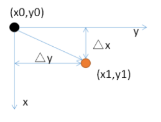
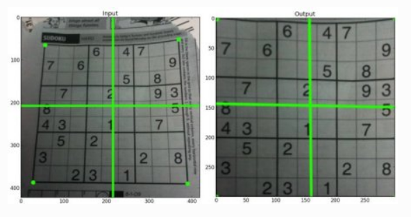
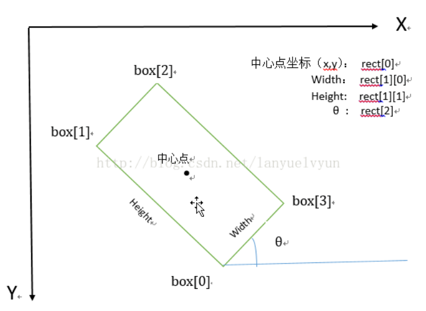

# OpenCV

## 图像变换

OpenCV提供了两个转换函数**cv.warpAffine（仿射变换）**和**cv.warpPerspective（透视变换）**，您可以使用它们进行各种转换。

**cv.warpAffine**采用**2x3**转换矩阵，而**cv.warpPerspective**采用**3x3**转换矩阵作为输入。


### 平移



x = x0 + △x

y = y0 + △y
$$
\begin{equation}
\left[\begin{array}{c}
{x} \\
{y} \\
{1}
\end{array}\right]=\left[\begin{array}{lll}
{1} & {0} & {\Delta x} \\
{0} & {1} & {\Delta y} \\
{0} & {0} & {1}
\end{array}\right]\left[\begin{array}{c}
{x 0} \\
{y 0} \\
{1}
\end{array}\right]
\end{equation}
$$


### 镜像

**·水平镜像操作**：以原图像的**垂直中轴线为中心**，将图像分为**左右两部分**进行对称变换。

**·垂直镜像操作**：以原图像的**水平中轴线**为中心，将图像分为**上下两部分**进行对称变换。
$$
\begin{equation}
\left.\left[\begin{array}{c}
{x} \\
{y} \\
{1}
\end{array}\right]=\left[\begin{array}{ccc}
{1} & {0} & {0} \\
{0} & {-1} & {W} \\
{0} & {0} & {1}
\end{array}\right] \begin{array}{c}
{x 0} \\
{y 0} \\
{1}
\end{array}\right\}
\end{equation}
$$

$$
\begin{equation}
\begin{aligned}
&x =x 0\\
&y =W-y 0
\end{aligned}
\end{equation}
$$


### 旋转

旋转操作会有一个旋转中心，这个旋转中心一般为图像的中心
$$
\begin{equation}
\begin{array}{l}
{x =x_0 \cdot \cos \theta+y_0 \cdot \sin \theta} \\
{y =-x_0 \cdot \sin \theta+y_0 \cdot \cos \theta}
\end{array}
\end{equation}
$$

$$
\begin{equation}
\left[\begin{array}{c}
{\mathbf{x} } \\
{\mathbf{y}} \\
{\mathbf{1}}
\end{array}\right]=\left[\begin{array}{ccc}
{\cos \theta} & {\sin \theta} & {\mathbf{0}} \\
{-\sin \theta} & {\cos \theta} & {0} \\
{0} & {0} & {1}
\end{array}\right]\left[\begin{array}{c}
{x \mathbf{0}} \\
{y \mathbf{0}} \\
{\mathbf{1}}
\end{array}\right]
\end{equation}
$$

为了找到转换矩阵，OpenCV提供了一个函数**cv.getRotationMatrix2D**。请检查以下示例，该示例将图像相对于中心旋转90度而没有任何缩放比例。

```python
img = cv.imread('messi5.jpg',0)
rows,cols = img.shape
# cols-1 和 rows-1 是坐标限制
M = cv.getRotationMatrix2D(((cols-1)/2.0,(rows-1)/2.0),90,1)
dst = cv.warpAffine(img,M,(cols,rows))
```


### 仿射

在仿射变换中，原始图像中的所有平行线在输出图像中仍将平行。为了找到变换矩阵，我们需要输入图像中的三个点及其在输出图像中的对应位置。然后**cv.getAffineTransform**将创建一个2x3矩阵，该矩阵将传递给**cv.warpAffine**。

```python
img = cv.imread('drawing.png')
rows,cols,ch = img.shape
pts1 = np.float32([[50,50],[200,50],[50,200]])
pts2 = np.float32([[10,100],[200,50],[100,250]])

M = cv.getAffineTransform(pts1,pts2)

dst = cv.warpAffine(img,M,(cols,rows))
plt.subplot(121),plt.imshow(img),plt.title('Input')
plt.subplot(122),plt.imshow(dst),plt.title('Output')
```


### 透视

对于透视变换，您需要3x3变换矩阵。即使在转换后，直线也将保持直线。要找到此变换矩阵，您需要在输入图像上有4个点，在输出图像上需要相应的点。在这四个点中，其中三个不应共线。然后可以通过函数**cv.getPerspectiveTransform**找到变换矩阵。然后将**cv.warpPerspective**应用于此3x3转换矩阵。

```python
img = cv.imread('sudoku.png')
rows,cols,ch = img.shape
pts1 = np.float32([[56,65],[368,52],[28,387],[389,390]])
pts2 = np.float32([[0,0],[300,0],[0,300],[300,300]])

M = cv.getPerspectiveTransform(pts1,pts2)

dst = cv.warpPerspective(img,M,(300,300))
plt.subplot(121),plt.imshow(img),plt.title('Input')
plt.subplot(122),plt.imshow(dst),plt.title('Output')
plt.show()
```




# API

| 主要模块（Main Modules） | 描述                   |
| ------------------------ | ---------------------- |
| core                     | 核心功能               |
| imgproc                  | 图像处理               |
| imgcodecs                | 图像文件的读写         |
| videoio                  | 视频 I/O               |
| highgui                  | 高级GUI                |
| video                    | 视频分析               |
| calib3d                  | 摄像机标定和三维重建   |
| features2d               | 2D特征框架             |
| objdetect                | 目标检测               |
| dnn                      | 深度神经网络模块       |
| ml                       | 机器学习               |
| flann                    | 多维空间中的聚类和搜索 |
| photo                    | 计算摄影学             |
| stitching                | 图像拼接               |
| gapi                     |                        |
|                          |                        |
|                          |                        |


## imgproc

| 模块                                      | 描述                 |
| ----------------------------------------- | -------------------- |
| Image Filtering                           | 图象滤波             |
| Geometric Image Transformations           | 几何学的图形变换     |
| Miscellaneous Image Transformations       | 各种各样的图像转换   |
| Drawing Functions                         | 绘图功能             |
| Color Space Conversions                   | 颜色空间转换         |
| ColorMaps in OpenCV                       |                      |
| Planar Subdivision                        | 平面细分             |
| Histograms                                | 直方图               |
| Structural Analysis and Shape Descriptors | 结构分析和形状描述符 |
| Motion Analysis and Object Tracking       | 运动分析和目标跟踪   |
| Feature Detection                         | 特征检测             |
| Object Detection                          | 目标检测             |


### Geometric Image Transformations（几何图形转换）

#### convertMaps

> void cv::**convertMaps** (InputArray map1, InputArray map2, OutputArray dstmap1, OutputArray dstmap2, int dstmap1type, bool nninterpolation=false)

将图像转换映射从一种表示转换为另一种表示


#### getAffineTransform 

> Mat  cv::**getAffineTransform** (const Point2f src[], const Point2f dst[]) 
>
> Mat  cv::**getAffineTransform** (InputArray src, InputArray dst) 

从对应的三对点计算仿射变换。计算一个2x3的矩阵。


#### getPerspectiveTransform

> Mat  cv::**getPerspectiveTransform** (InputArray src, InputArray dst, int solveMethod=DECOMP_LU) 
>
> Mat  cv::**getPerspectiveTransform** (const Point2f src[], const Point2f dst[], int solveMethod=DECOMP_LU) 

从四对对应的点计算一个透视图转换。


#### getRectSubPix 

> void  cv::**getRectSubPix** (InputArray image, Size patchSize, Point2f center, OutputArray patch, int patchType=-1) 


#### getRotationMatrix2D 

> Mat  cv::**getRotationMatrix2D** (Point2f center, double angle, double scale) 
>
> Matx23d  cv::**getRotationMatrix2D_** (Point2f center, double angle, double scale) 


#### invertAffineTransform 

> void  cv::**invertAffineTransform** (InputArray M, OutputArray iM) 


#### linearPolar 

> void  cv::**linearPolar** (InputArray src, OutputArray dst, Point2f center, double maxRadius, int flags) 

将图像重新映射到极坐标空间


#### logPolar 

> void  cv::**logPolar** (InputArray src, OutputArray dst, Point2f center, double M, int flags) 


#### remap

> void  cv::**remap** (InputArray src, OutputArray dst, InputArray map1, InputArray map2, int interpolation, int borderMode=BORDER_CONSTANT, const Scalar &borderValue=Scalar()) 


#### resize 

> void  cv::**resize** (InputArray src, OutputArray dst, Size dsize, double fx=0, double fy=0, int interpolation=INTER_LINEAR) 
>
> `python`: dst = cv.**resize**( src, dsize[, dst[, fx[, fy[, interpolation]]]] ) 

改变图像大小。

如果dsize=0,则 dsize = Size(round(fx\*src.cols), round(fy\*src.rows))。dszie与fx,fy必须有一个非零。


#### warpAffine 

> void  cv::**warpAffine** (InputArray src, OutputArray dst, InputArray M, Size dsize, int flags=INTER_LINEAR, int borderMode=BORDER_CONSTANT, const Scalar &borderValue=Scalar()) 
>
> `python`: dst = cv.**warpAffine**( src, M, dsize[, dst[, flags[, borderMode[, borderValue]]]] ) 

对图像应用仿射变换.


```python
matrix = cv2.getRotationMatrix2D(rotate_box[0], rotate_box[2], 1.0)
im_affine = cv2.warpAffine(im, matrix, (im.shape[1],im.shape[0]))
```


#### warpPerspective 

> void  cv::**warpPerspective** (InputArray src, OutputArray dst, InputArray M, Size dsize, int flags=INTER_LINEAR, int borderMode=BORDER_CONSTANT, const Scalar &borderValue=Scalar()) 


#### warpPolar 

> void  cv::**warpPolar** (InputArray src, OutputArray dst, Size dsize, Point2f center, double maxRadius, int flags) 


### Structural Analysis and Shape Descriptors（结构分析和形状描述）


#### approxPolyDP 

> void  cv::**approxPolyDP** (InputArray curve, OutputArray approxCurve, double epsilon, bool closed) 

以指定的精度逼近多边形曲线


#### arcLength 

> double  cv::**arcLength** (InputArray curve, bool closed) 

计算轮廓周长或曲线长度


#### boundingRect 

> Rect  cv::**boundingRect** (InputArray array) 

计算一个点集或灰度图像的非零像素的上右边界矩形


#### boxPoints 

> void  cv::**boxPoints** (RotatedRect box, OutputArray points) 

找到一个旋转矩形的四个顶点。用于绘制旋转矩形


#### connectedComponents 

> int  cv::**connectedComponents** (InputArray image, OutputArray labels, int connectivity, int ltype, int ccltype) 
>
> int  cv::**connectedComponents** (InputArray image, OutputArray labels, int connectivity=8, int ltype=CV_32S) 
>
> 

计算布尔图像的标记图像的连通分量


#### connectedComponentsWithStats 

> int  cv::**connectedComponentsWithStats** (InputArray image, OutputArray labels, OutputArray stats, OutputArray centroids, int connectivity, int ltype, int ccltype) 
>
> int  cv::**connectedComponentsWithStats** (InputArray image, OutputArray labels, OutputArray stats, OutputArray centroids, int connectivity=8, int ltype=CV_32S) 

计算布尔图像的标记图像的连接组件，并为每个标记生成一个统计输出


#### contourArea 

> double  cv::**contourArea** (InputArray contour, bool oriented=false) 

计算等高线面积


#### convexHull 

> void  cv::convexHull (InputArray points, OutputArray hull, bool clockwise=false, bool returnPoints=true) 

求点集的凸包


#### convexityDefects 

> void  cv::**convexityDefects** (InputArray contour, InputArray convexhull, OutputArray convexityDefects) 

求轮廓的凸性缺陷


#### createGeneralizedHoughBallard 

> cv::**createGeneralizedHoughBallard** ()


#### createGeneralizedHoughGuil 

> cv::**createGeneralizedHoughGuil** ()


#### findContours 

> void  cv::**findContours** (InputArray image, OutputArrayOfArrays contours, OutputArray hierarchy, int mode, int method, Point offset=Point()) 

查找二值图像中的轮廓


#### fitEllipse 

> RotatedRect  cv::**fitEllipse** (InputArray points) 
>
> RotatedRect  cv::**fitEllipseAMS** (InputArray points) 
>
> RotatedRect  cv::**fitEllipseDirect** (InputArray points) 

在一组2D点周围安装一个椭圆。


#### fitLine

> void  cv::**fitLine** (InputArray points, OutputArray line, int distType, double param, double reps, double aeps) 

将直线与2D或3D点集匹配


#### HuMoments 

> void  cv::**HuMoments** (const Moments &moments, double hu[7]) 
>
> void  cv::**HuMoments** (const Moments &m, OutputArray hu) 

计算七个Hu不变量


#### intersectConvexConvex 

> float  cv::**intersectConvexConvex** (InputArray _p1, InputArray _p2, OutputArray _p12, bool handleNested=true) 

求两个凸多边形的交点


#### isContourConvex 

> bool  cv::**isContourConvex** (InputArray contour) 

测试轮廓凸度


#### matchShapes 

> double  cv::**matchShapes** (InputArray contour1, InputArray contour2, int method, double parameter) 

比较两个形状


#### minAreaRect 

> RotatedRect  cv::**minAreaRect** (InputArray points) 

查找包含输入2D点集的最小区域的旋转矩形。

返回一个Box2D结构rect：（最小外接矩形的中心（x，y），（宽度，高度），旋转角度）

```python
box1 = np.array([[733, 113], [966, 60], [969, 150], [732, 187]])
box2 = np.array([[784,317], [847,317], [844,338], [782,338,]])
cv2.polylines(im, [box1,box2], True, (0, 0, 255))

rotate_box = cv2.minAreaRect(box1)
rect = cv2.boxPoints(rotate_box)
rect = np.intp(rect)
cv2.polylines(im, [rect], True, (255, 0, 0))

print(rotate_box)
((849.0, 123.49998474121094), (250.78915405273438, 89.38561248779297), -8.873284339904785)
print(rect)
[[732 186]
 [718  98]
 [966  60]
 [979 148]]
```

- 旋转角度θ是水平轴（x轴）逆时针旋转，直到碰到矩形的第一条边停住，此时该边与水平轴的夹角。并且这个边的边长是width，另一条边边长是height。也就是说，在这里，width与height不是按照长短来定义的。

- 在opencv中，坐标系原点在左上角，相对于x轴，逆时针旋转角度为负，顺时针旋转角度为正。所以，θ∈（-90度，0]。
  

  


#### minEnclosingCircle 

> void  cv::**minEnclosingCircle** (InputArray points, Point2f &center, float &radius) 

求包围2D点集的最小面积的圆。


#### minEnclosingTriangle  

> double  cv::**minEnclosingTriangle** (InputArray points, OutputArray triangle) 

找到一个包含二维点集的最小面积三角形，并返回其面积。


#### moments 

> Moments  cv::**moments** (InputArray array, bool binaryImage=false) 

计算多边形或栅格化形状的三阶之前的所有力矩


#### pointPolygonTest 

> double  cv::**pointPolygonTest** (InputArray contour, Point2f pt, bool measureDist) 

执行点对轮廓的测试


#### rotatedRectangleIntersection 

> int  cv::rotatedRectangleIntersection (const RotatedRect &rect1, const RotatedRect &rect2, OutputArray intersectingRegion) 

找出两个旋转的矩形之间是否有交点。


### Drawing Functions(画图函数)

#### arrowedLine 

> void  cv::**arrowedLine** (InputOutputArray img, Point pt1, Point pt2, const Scalar &color, int thickness=1, int line_type=8, int shift=0, double tipLength=0.1) 
>

绘制从第一个点指向第二个点的箭头段


#### circle 

> void  cv::circle (InputOutputArray img, Point center, int radius, const Scalar &color, int thickness=1, int lineType=LINE_8, int shift=0) 


#### clipLine 

> bool  cv::**clipLine** (Size imgSize, Point &pt1, Point &pt2) 
>
> bool  cv::**clipLine** (Size2l imgSize, Point2l &pt1, Point2l &pt2) 
>
> bool  cv::**clipLine** (Rect imgRect, Point &pt1, Point &pt2) 

将线裁剪到图像矩形上


#### drawContours 

> void  cv::**drawContours** (InputOutputArray image, InputArrayOfArrays contours, int contourIdx, const Scalar &color, int thickness=1, int lineType=LINE_8, InputArray hierarchy=noArray(), int maxLevel=INT_MAX, Point offset=Point()) 
>
> `python` : image = cv.drawContours( image, contours, contourIdx, color[, thickness[, lineType[, hierarchy[, maxLevel[, offset]]]]] ) 

绘制轮廓或填充轮廓


#### drawMarker 

> void  cv::**drawMarker** (InputOutputArray img, Point position, const Scalar &color, int markerType=MARKER_CROSS, int markerSize=20, int thickness=1, int line_type=8) 

在图像中预定义的位置上绘制标记


#### ellipse 

> void  cv::**ellipse** (InputOutputArray img, Point center, Size axes, double angle, double startAngle, double endAngle, const Scalar &color, int thickness=1, int lineType=LINE_8, int shift=0) 
>
> void  cv::**ellipse** (InputOutputArray img, const RotatedRect &box, const Scalar &color, int thickness=1, int lineType=LINE_8) 


#### ellipse2Poly 

> void  cv::**ellipse2Poly** (Point center, Size axes, int angle, int arcStart, int arcEnd, int delta, std::vector< Point > &pts) 
>
> void  cv::**ellipse2Poly** (Point2d center, Size2d axes, int angle, int arcStart, int arcEnd, int delta, std::vector< Point2d > &pts) 

用折线近似椭圆弧。


#### fillConvexPoly 

> void  cv::**fillConvexPoly** (InputOutputArray img, const Point *pts, int npts, const Scalar &color, int lineType=LINE_8, int shift=0) 
>
> void  cv::**fillConvexPoly** (InputOutputArray img, InputArray points, const Scalar &color, int lineType=LINE_8, int shift=0) 

填充凸多边形


#### fillPoly 

> void  cv::**fillPoly** (InputOutputArray img, const Point **pts, const int *npts, int ncontours, const Scalar &color, int lineType=LINE_8, int shift=0, Point offset=Point()) 
>
> void  cv::**fillPoly** (InputOutputArray img, InputArrayOfArrays pts, const Scalar &color, int lineType=LINE_8, int shift=0, Point offset=Point()) 

填充由一个或多个多边形包围的区域


#### getFontScaleFromHeight 

> double  cv::**getFontScaleFromHeight** (const int fontFace, const int pixelHeight, const int thickness=1) 

计算用于实现给定高度(以像素为单位)的特定字体大小。


#### getTextSize 

> Size  cv::**getTextSize** (const String &text, int fontFace, double fontScale, int thickness, int *baseLine) 

计算文本字符串的宽度和高度。


#### line 

> void  cv::**line** (InputOutputArray img, Point pt1, Point pt2, const Scalar &color, int thickness=1, int lineType=LINE_8, int shift=0) 


#### polylines 

> void  cv::**polylines** (InputOutputArray img, const Point *const *pts, const int *npts, int ncontours, bool isClosed, const Scalar &color, int thickness=1, int lineType=LINE_8, int shift=0) 
>
> void  cv::**polylines** (InputOutputArray img, InputArrayOfArrays pts, bool isClosed, const Scalar &color, int thickness=1, int lineType=LINE_8, int shift=0) 

绘制多个多边形曲线。

```python
box1 = np.array([[733, 113], [966, 60], [969, 150], [732, 187]])
box2 = np.array([[784,317], [847,317], [844,338], [782,338,]])
cv2.polylines(im, [box1,box2], True, (0, 0, 255))
```


#### putText 

> void  cv::**putText** (InputOutputArray img, const String &text, Point org, int fontFace, double fontScale, Scalar color, int thickness=1, int lineType=LINE_8, bool bottomLeftOrigin=false) 

Draws a text string.


#### rectangle 

> void  cv::**rectangle** (InputOutputArray img, Point pt1, Point pt2, const Scalar &color, int thickness=1, int lineType=LINE_8, int shift=0) 
>
> void  cv::**rectangle** (InputOutputArray img, Rect rec, const Scalar &color, int thickness=1, int lineType=LINE_8, int shift=0) 


