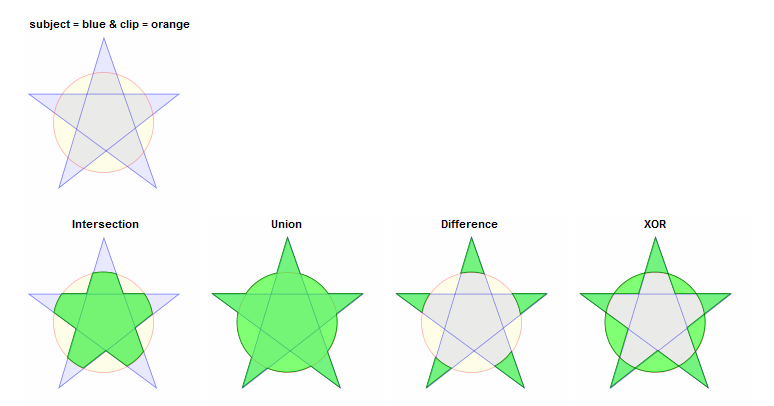
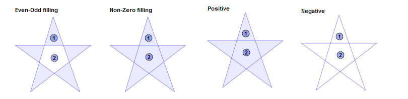
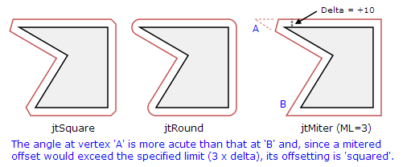
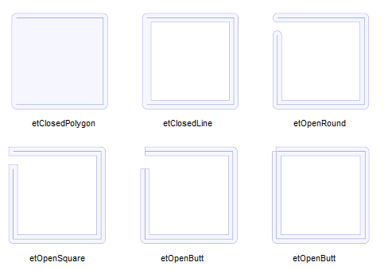

# Pyclipper

The Clipper library performs line & polygon **clipping** - intersection, union, difference & exclusive-or,
and line & polygon **offsetting**. The library is based on [Vatti's clipping algorithm](http://en.wikipedia.org/wiki/Vatti_clipping_algorithm).


## PyclipperBase

**方法：**

**AddPath**(path, poly_type, closed)

- poly_type: `pyclipper.PT_SUBJECT` 或 `pyclipper.PT_CLIP`


**AddPaths**(paths, poly_type, closed)

添加多个路径


**Clear**()

删除任何现有的主题和剪辑多边形，允许对不同多边形集上的裁剪操作重用Clipper对象。


**GetBounds**

此方法返回已添加到“剪贴器”对象的所有多边形的轴对齐包围矩形。


## Pyclipper

剪切对象，继承自**PyclipperBase**

**方法：**

**Execute**（clip_type, subj_fill_type, clip_fill_type）

- clip_type:`pyclipper.CT_INTERSECTION` 其他见下图

  

- subj_fill_type：`pyclipper.PFT_EVENODD`

  填充表示在封闭路径内的区域(即在图形显示中用画笔颜色或图案填充)和位于外部的区域。

  最简单的填充规则是偶数-奇数（`Even-Odd`）填充(有时称为交替填充)。给定一组封闭路径，从路径外部的一个点开始，并沿着一条假想的直线通过这些路径。当第一条路径被跨越时，遇到的区域被填充。当下一条路径被跨越时，遇到的区域不会被填充。同样地，每次一条路径被交叉时，如果它已经停止，填充就会开始，如果它已经开始，就会停止填充。

  除偶奇填充外，其他所有填充规则都依赖于边缘方向和圈数来确定填充。边的方向由顶点在构建路径时声明的顺序决定。边缘方向用来确定每个多边形子区域的圈数。

  Clipper库支持4条填充规则：`Even-Odd`, `Non-Zero`, `Positive` and `Negative`

  

  

- clip_fill_type：**同上**

  

```python
import pyclipper

subj = (
    ((180, 200), (260, 200), (260, 150), (180, 150)),
    ((215, 160), (230, 190), (200, 190))
)
clip = ((190, 210), (240, 210), (240, 130), (190, 130))

pc = pyclipper.Pyclipper()
pc.AddPath(clip, pyclipper.PT_CLIP, True)
pc.AddPaths(subj, pyclipper.PT_SUBJECT, True)

solution = pc.Execute(pyclipper.CT_INTERSECTION, pyclipper.PFT_EVENODD, pyclipper.PFT_EVENODD)
```


## PyclipperOffset

偏移对象，**不是从PyclipperBase继承**

**方法：**

###  **Addpath**

参数：（path，join_type，end_type）

- join_type：`pyclipper.JT_ROUND` 其他见下图

  `JtMiter`：有心连接有一个必要的限制，因为以非常尖锐的角度连接的抵消边会产生过长和窄的“尖峰”。为了包含这些潜在的尖峰，ClippOffset对象的MiterLimit属性指定了顶点将被偏移的最大距离(以增量的倍数表示)。对于任何给定的边联接，当人字偏移超过该最大距离时，将应用“正方形”连接。

  `jtRound`：虽然平坦的路径不可能完美地跟踪一个弧，但它们是由一系列弧线和弦近似的。

  `JtSquare`：在1×Delta处的所有凸边连接上，均采用单一形式的平方运算。

  

  

- end_type：`pyclipper.ET_CLOSEDPOLYGON`

  - **etClosedPolygon:** Ends are joined using the JoinType value and the path filled as a polygon
  - **etClosedLine:** Ends are joined using the JoinType value and the path filled as a polyline
  - **etOpenSquare:** Ends are *squared* off and extended **delta** units
  - **etOpenRound:** Ends are *rounded* off and extended **delta** units
  - **etOpenButt:** Ends are squared off with no extension.
  - **etOpenSingle:** Offsets an open path in a single direction. Plann

  

  


### **Execute**

参数：（delta）

负数缩小多边形，正数扩展多边形


```python
import pyclipper

subj = ((180, 200), (260, 200), (260, 150), (180, 150))

pco = pyclipper.PyclipperOffset()
pco.AddPath(subj, pyclipper.JT_ROUND, pyclipper.ET_CLOSEDPOLYGON)

solution = pco.Execute(-7.0)
```

