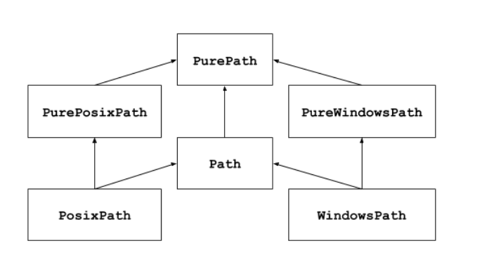

## 1、Virtualenv

安装命令 `pip install virtualenv`

文档 https://virtualenv.pypa.io/en/stable/userguide/


**创建虚拟环境**

命令：virtualenv 环境名称  `virtualenv env_tf2`

可选参数：**-p** 指定python版本。

可选参数：**--system-site-packages** 是否继承系统第三方库


**激活/退出虚拟环境**

激活命令：`source bin/activate`

退出命令：`deactivate`


**删除虚拟环境**

直接删除文件夹


## 2、Pathlib

该模块提供表示文件系统路径的类，其语义适用于不同的操作系统。

路径类被分为提供纯计算操作而没有 I/O 的**纯路径purepath**，以及从纯路径继承而来但提供 I/O 操作的**具体路径**。




**具体路径**


|                                                              |                                                              |
| ------------------------------------------------------------ | ------------------------------------------------------------ |
| **pathlib.Path(*pathsegments)**                              | 一个 `PurePath` 的子类，此类以当前系统的路径风格表示路径（实例化为 `PosixPath` 或 `WindowsPath`） |
| **cwd()**                                                    | 返回一个新的表示**当前目录**的路径对象                       |
| **home()**                                                   | 返回一个表示**当前用户家目录**的新路径对象                   |
| **stat()**                                                   | 返回此路径的信息                                             |
| **chmod(*mode*)**                                            | 改变文件的模式和权限                                         |
| **exists()**                                                 | 是否指向一个已存在的文件或目录                               |
| **expanduser()**                                             | 返回展开了包含 `~` 和 `~user` 的构造                         |
| **glob(pattern)**                                            | 解析相对于此路径的通配符 *pattern*，产生所有匹配的文件       |
| **group()**                                                  | 返回拥有此文件的用户组                                       |
| **is_dir()**                                                 |                                                              |
| **is_file()**                                                |                                                              |
| **iterdir()**                                                | 当路径指向一个目录时，产生该路径下的对象的路径               |
| **mkdir(mode=0o777, parents=False, exist_ok=False)**         | 新建给定路径的目录                                           |
| **open(mode='r', buffering=-1, encoding=None, errors=None, newline=None)** | 打开路径指向的文件，就像内置的 **open()**函数所做的一样      |
| **read_bytes()**                                             |                                                              |
| **read_text(encoding=None, errors=None)**                    |                                                              |
| **rename(target)**                                           |                                                              |
| **replace(target)**                                          | 将文件名目录重命名为给定的 *target*，并返回一个新的指向 *target* 的 Path 实例 |
| **resolve(strict=False)**                                    | 将路径绝对化，解析任何符号链接。返回新的路径对象             |
| **rmdir()**                                                  |                                                              |
| **touch(mode=0o666, exist_ok=True)**                         |                                                              |
| **write_bytes(data)**                                        |                                                              |
| **write_text(data, encoding=None, errors=None)**             |                                                              |
|                                                              |                                                              |


## 3、argparse

```python
import argparse

parser = argparse.ArgumentParser()
parser.add_argument("-ta", "--train_annotation_paths", type=str, 
                    required=True, nargs="+", 
                    help="The path of training data annnotation file.")
parser.add_argument("-va", "--val_annotation_paths", type=str, nargs="+", 
                    help="The path of val data annotation file.")
parser.add_argument("-tf", "--train_parse_funcs", type=str, required=True,
                    nargs="+", help="The parse functions of annotaion files.")
parser.add_argument("-vf", "--val_parse_funcs", type=str, nargs="+", 
                    help="The parse functions of annotaion files.")
parser.add_argument("-t", "--table_path", type=str, required=True, 
                    help="The path of table file.")
parser.add_argument("-w", "--image_width", type=int, default=100, 
                    help="Image width(>=16).")
parser.add_argument("-b", "--batch_size", type=int, default=256, 
                    help="Batch size.")
parser.add_argument("-e", "--epochs", type=int, default=20, 
                    help="Num of epochs to train.")
args = parser.parse_args()
```

`default`：没有设置值情况下的默认参数

`required`: 表示这个参数是否一定需要设置

`type`：参数类型

`choices`：参数值只能从几个选项里面选择 choices=['alexnet', 'vgg']

`help`：指定参数的说明信息

`dest`：设置参数在代码中的变量名

`nargs`： 设置参数在使用可以提供的个数

```
N   参数的绝对个数（例如：3）
'?'   0或1个参数
'*'   0或所有参数
'+'   所有，并且至少一个参数
```


## 4、pytest

https://docs.pytest.org/en/latest/

### start

`pip install pytest`

编写pytest测试样例非常简单，只需要按照下面的规则：

- 测试文件以test_开头（以\_test结尾也可以）
- 测试类以Test开头，并且不能带有 **init** 方法
- 测试函数以test_开头
- 断言使用基本的assert即可

```python
# content of test_sample.py
def func(x):
    return x + 1

def test_answer():
    assert func(3) == 5
```

```python
# content of test_class.py
class TestClass:
    def test_one(self):
        x = "this"
        assert "h" in x

    def test_two(self):
        x = "hello"
        assert hasattr(x, "check")
```


### fixture的scope参数

它用`@pytest.fixture`标识,在你编写测试函数的时候，你可以将此函数名称做为传入参数，pytest将会以依赖注入方式，将该函数的返回值作为测试函数的传入参数。

scope参数有四种，分别是'function','module','class','session'，默认为function。

- function：每个test都运行，默认是function的scope
- class：每个class的所有test只运行一次
- module：每个module的所有test只运行一次
- session：每个session只运行一次


### setup和teardown操作

- setup，在测试函数或类之前执行，完成准备工作，例如数据库链接、测试数据、打开文件等
- teardown，在测试函数或类之后执行，完成收尾工作，例如断开数据库链接、回收内存资源等
- 备注：也可以通过在fixture函数中通过yield实现setup和teardown功能


### 通过pytest.mark对test方法分类执行

通过@pytest.mark控制需要执行哪些feature的test，例如在执行test前增加修饰`@pytest.mark.website`


### @pytest.mark.parametrize

```python
@pytest.mark.parametrize("test_input,expected", [("3+5", 8), ("2+4", 6), ("6*9", 42)])
def test_eval(test_input, expected):
    assert eval(test_input) == expected
    
@pytest.mark.parametrize(
    "test_input,expected",
    [("3+5", 8), ("2+4", 6), pytest.param("6*9", 42, marks=pytest.mark.xfail)],
)
def test_eval(test_input, expected):
    assert eval(test_input) == expected
    
@pytest.mark.parametrize("x", [0, 1])
@pytest.mark.parametrize("y", [2, 3])
def test_foo(x, y):
    pass
```


## 5、yaml

yaml是一个专门用来写配置文件的语言。


### 1. yaml文件规则

- 区分大小写；
- 使用缩进表示层级关系；
- 使用空格键缩进，而非Tab键缩进
- 缩进的空格数目不固定，只需要相同层级的元素左侧对齐；
- 文件中的字符串不需要使用引号标注，但若字符串包含有特殊字符则需用引号标注；
- 注释标识为`#`


### 2. yaml文件数据结构

- 对象：键值对的集合（简称 "映射或字典"）
   键值对用冒号 `:` 结构表示，冒号与值之间需用空格分隔
- 数组：一组按序排列的值（简称 "序列或列表"）
   数组前加有 “`-`” 符号，符号与值之间需用空格分隔
- 纯量(scalars)：单个的、不可再分的值（如：字符串、bool值、整数、浮点数、时间、日期、null等）
   None值可用null可 ~ 表示


### 3. python读取yaml

`pip install pyyaml`

`import yaml`


python通过open方式读取文件数据，再通过`yaml.load`函数将数据转化为列表或字典；

```python
import yaml
import os

def get_yaml_data(yaml_file):
    # 打开yaml文件
    print("***获取yaml文件数据***")
    file = open(yaml_file, 'r', encoding="utf-8")
    file_data = file.read()
    file.close()
    
    print(file_data)
    print("类型：", type(file_data))

    # 将字符串转化为字典或列表
    print("***转化yaml数据为字典或列表***")
    data = yaml.load(file_data)
    print(data)
    print("类型：", type(data))
    return data
current_path = os.path.abspath(".")
yaml_path = os.path.join(current_path, "config.yaml")
get_yaml_data(yaml_path)

"""
***获取yaml文件数据***
# yaml键值对：即python中字典
usr: my
psw: 123455
类型：<class 'str'>
***转化yaml数据为字典或列表***
{'usr': 'my', 'psw': 123455}
类型：<class 'dict'>
"""
```


yaml文件中内容为键值对：

```bash
# yaml键值对嵌套：即python中字典嵌套字典
usr1:
  name: a
  psw: 123
usr2:
  name: b
  psw: 456
```

python解析yaml文件后获取的数据：

```bash
{'usr1': {'name': 'a', 'psw': 123}, 'usr2': {'name': 'b', 'psw': 456}}
```

yaml文件中“键值对”中嵌套“数组”

```bash
# yaml键值对中嵌套数组
usr3:
  - a
  - b
  - c
usr4:
  - b
```

python解析yaml文件后获取的数据：

```bash
{'usr3': ['a', 'b', 'c'], 'usr4': ['b']}
```

yaml文件“数组”中嵌套“键值对”

```cpp
# yaml"数组"中嵌套"键值对"
- usr1: aaa
- psw1: 111
  usr2: bbb
  psw2: 222
```

python解析yaml文件后获取的数据：

```bash
[{'usr1': 'aaa'}, {'psw1': 111, 'usr2': 'bbb', 'psw2': 222}]
```

yaml文件中基本数据类型：

```dart
# 纯量
s_val: name              # 字符串：{'s_val': 'name'}
spec_s_val: "name\n"    # 特殊字符串：{'spec_s_val': 'name\n'
num_val: 31.14          # 数字：{'num_val': 31.14}
bol_val: true           # 布尔值：{'bol_val': True}
nul_val: null           # null值：{'nul_val': None}
nul_val1: ~             # null值：{'nul_val1': None}
time_val: 2018-03-01t11:33:22.55-06:00     # 时间值：{'time_val': datetime.datetime(2018, 3, 1, 17, 33, 22, 550000)}
date_val: 2019-01-10    # 日期值：{'date_val': datetime.date(2019, 1, 10)}
```


### 4. python读取多个yaml文档

```python
# 分段yaml文件中多个文档
---
animal1: dog
age: 2
---
animal2: cat
age: 3
```

python获取yaml数据时需使用`load_all`函数来解析全部的文档，再从中读取对象中的数据

```python
# yaml文件中含有多个文档时，分别获取文档中数据
def get_yaml_load_all(yaml_file):
    # 打开yaml文件
    file = open(yaml_file, 'r', encoding="utf-8")
    file_data = file.read()
    file.close()
    all_data = yaml.load_all(file_data)
    for data in all_data:
        print(data)
current_path = os.path.abspath(".")
yaml_path = os.path.join(current_path, "config.yaml")
get_yaml_load_all(yaml_path)
"""结果
{'animal1': 'dog', 'age': 2}
{'animal2': 'cat', 'age': 3}
"""
```


## 6、trdg

| 参数                                   | 说明                                                         |
| -------------------------------------- | :----------------------------------------------------------- |
| --output_dir                           | The output directory                                         |
| "-i","--input_file"                    | When set, this argument uses a specified text file as source for the text |
| "-l","--language",                     | The language to use, should be fr (French), en (English), es (Spanish), <br />de (German), or cn (Chinese). |
| "-c","--count"                         | The number of images to be created.                          |
| "-rs",<br />"--random_sequences",      | Use random sequences as the source text for the generation. <br />Set '-let','-num','-sym' to use letters/numbers/symbols. If none specified, using all three. |
| "-let",<br />"--include_letters"       | Define if random sequences should contain letters. Only works with -rs |
| "-num",<br />"--include_numbers"       | Define if random sequences should contain numbers. Only works with -rs |
| "-sym",<br />"--include_symbols"       | Define if random sequences should contain symbols. Only works with -rs |
| "-w","--length"                        | Define how many words should be included in each generated sample. <br />If the text source is Wikipedia, this is the MINIMUM length" |
| "-r","--random"                        | Define if the produced string will have variable word count (with --length being the maximum) |
| "-f","--format"                        | Define the height of the produced images if horizontal, else the width |
| "-t","--thread_count"                  | Define the number of thread to use for image generation      |
| "-e","--extension"                     | Define the extension to save the image with                  |
| "-k","--skew_angle"                    | Define skewing angle of the generated text. In positive degrees |
| "-rk","--random_skew"                  | When set, the skew angle will be randomized between the value set with -k and it's opposite |
| "-wk","--use_wikipedia"                | Use Wikipedia as the source text for the generation, using this paremeter ignores -r, -n, -s" |
| "-bl","--blur"                         | Apply gaussian blur to the resulting sample. Should be an integer defining the blur radius |
| "-rbl","--random_blur"                 | When set, the blur radius will be randomized between 0 and -bl. |
| "-b","--background"                    | Define what kind of background to use. 0: Gaussian Noise, 1: Plain white, 2: Quasicrystal, 3: Pictures |
| "-hw","--handwritten"                  | Define if the data will be "handwritten" by an RNN           |
| "-na","--name_format"                  | Define how the produced files will be named. <br />0: [TEXT]_[ID].[EXT], 1: [ID]_[TEXT].[EXT] <br />2: [ID].[EXT] + one file labels.txt containing id-to-label mappings |
| "-om","--output_mask"                  | Define if the generator will return masks for the text       |
| "-d","--distorsion"                    | Define a distorsion applied to the resulting image. <br />0: None (Default), 1: Sine wave, 2: Cosine wave, 3: Random |
| "-do",<br />"--distorsion_orientation" | Define the distorsion's orientation. <br />Only used if -d is specified. 0: Vertical (Up and down), 1: Horizontal (Left and Right), 2: Both |
| "-wd","--width"                        | Define the width of the resulting image. <br />If not set it will be the width of the text + 10. <br />If the width of the generated text is bigger that number will be used |
| "-al","--alignment"                    | Define the alignment of the text in the image. <br />Only used if the width parameter is set. 0: left, 1: center, 2: right |
| "-or","--orientation"                  | Define the orientation of the text. 0: Horizontal, 1: Vertical |
| "-tc","--text_color"                   | Define the text's color, should be either a single hex color or a range in the ?,? format. |
| "-sw","--space_width"                  | Define the width of the spaces between words. 2.0 means twice the normal space width |
| "-cs","--character_spacing"            | Define the width of the spaces between characters. 2 means two pixels |
| "-m","--margins"                       | Define the margins around the text when rendered. In pixels  |
| "-fi","--fit"                          | Apply a tight crop around the rendered text                  |
| "-ft", "--font"                        | Define font to be used                                       |
| "-fd","--font_dir"                     | Define a font directory to be used                           |
| "-ca","--case"                         | Generate upper or lowercase only. arguments: upper or lower. Example: --case upper |
| "-dt", "--dict"                        | Define the dictionary to be used                             |
| "-ws", "--word_split",                 | Split on words instead of on characters (preserves ligatures, no character spacing) |


## 7、Queue

在Python文档中搜索队列（queue）会发现，Python标准库中包含了四种队列，分别是

`queue.Queue` / `asyncio.Queue` / `multiprocessing.Queue` / `collections.deque`。


### collections.deque

deque是双端队列（double-ended queue）的缩写，由于两端都能编辑，既可以用来实现栈（stack）也可以用来实现队列（queue）。

collections.deque是一个可以方便实现队列的数据结构，具有线程安全的特性，并且有很高的性能。


### queue.Queue & asyncio.Queue

`queue.Queue`和`asyncio.Queue`都是支持多生产者、多消费者的队列，基于collections.deque，他们都提供了Queue（FIFO队列）、PriorityQueue（优先级队列）、LifoQueue（LIFO队列），接口方面也相同。

区别在于queue.Queue适用于多线程的场景，asyncio.Queue适用于协程场景下的通信，由于asyncio的加成，queue.Queue下的阻塞接口在asyncio.Queue中则是以返回协程对象的方式执行


### multiprocessing.Queue

multiprocessing提供了三种队列，分别是`Queue`、`SimpleQueue`、`JoinableQueue`。

multiprocessing.Queue既是线程安全也是进程安全的，相当于queue.Queue的多进程克隆版。和threading.Queue很像，multiprocessing.Queue支持put和get操作，底层结构是multiprocessing.Pipe


## 8、comtypes


## 9、lxml

常见的 XML 编程接口有 DOM 和 SAX，这两种接口处理 XML 文件的方式不同，当然使用场合也不同。

Python 有三种方法解析 XML，SAX，DOM，以及 ElementTree:

1.**SAX** (simple API for XML )
Python 标准库包含 SAX 解析器，SAX 用事件驱动模型，通过在解析XML的过程中触发一个个的事件并调用用户定义的回调函数来处理XML文件。

2.**DOM**(Document Object Model)
将 XML 数据在内存中解析成一个树，通过对树的操作来操作XML

3.**ElementTree**(元素树)
ElementTree就像一个轻量级的DOM，具有方便友好的API。代码可用性好，速度快，消耗内存少。


**Element对象**
tag:string      元素代表的数据种类。
text:string     元素的内容。
tail:string      元素的尾形。
attrib:dictionary     元素的属性字典。

**针对属性的操作**
clear()          清空元素的后代、属性、text和tail也设置为None。
get(key, default=None)     获取key对应的属性值，如该属性不存在则返回default值。
items()         根据属性字典返回一个列表，列表元素为(key, value）。
keys()           返回包含所有元素属性键的列表。
set(key, value)     设置新的属性键与值。


**针对后代的操作**
append(subelement)     添加直系子元素。

extend(subelements)    增加一串元素对象作为子元素。

find(match)             寻找第一个匹配子元素，匹配对象可以为tag或path。

findall(match)          寻找所有匹配子元素，匹配对象可以为tag或path。

findtext(match)         寻找第一个匹配子元素，返回其text值。匹配对象可以为tag或path。

insert(index, element)  在指定位置插入子元素。

iter(tag=None)           生成遍历当前元素所有后代或者给定tag的后代的迭代器。

iterfind(match)          根据tag或path查找所有的后代。

itertext()               遍历所有后代并返回text值。

remove(subelement)      删除子元素。


## 10、xpath

**XPath 是一门在 XML 文档中查找信息的语言。XPath 用于在 XML 文档中通过元素和属性进行导航。**

- XPath 使用路径表达式在 XML 文档中进行导航
- XPath 包含一个标准函数库
- XPath 是 XSLT 中的主要元素
- XPath 是一个 W3C 标准

XPath 使用路径表达式来选取 XML 文档中的节点或者节点集。这些路径表达式和我们在常规的电脑文件系统中看到的表达式非常相似。

XPath 含有超过 100 个内建的函数。这些函数用于字符串值、数值、日期和时间比较、节点和 QName 处理、序列处理、逻辑值等等。


### 节点

**在 XPath 中，有七种类型的节点：元素、属性、文本、命名空间、处理指令、注释以及文档节点（或称为根节点）。**

```xml
<?xml version="1.0" encoding="ISO-8859-1"?>

<bookstore>

<book>
  <title lang="en">Harry Potter</title>
  <author>J K. Rowling</author> 
  <year>2005</year>
  <price>29.99</price>
</book>

</bookstore>
```

```
<bookstore> （文档节点）
<author>J K. Rowling</author> （元素节点）
lang="en" （属性节点）
```


**节点关系**：**父**（Parent）、**子**（Children）、**同胞**（Sibling）、**先辈**（Ancestor）、**后代**（Descendant）


### 语法

**XPath 使用路径表达式来选取 XML 文档中的节点或节点集。节点是通过沿着路径 (path) 或者步 (steps) 来选取的。**

| nodename | 选取此节点的所有子节点。                                   |
| -------- | ---------------------------------------------------------- |
| /        | 从根节点选取。                                             |
| //       | 从匹配选择的当前节点选择文档中的节点，而不考虑它们的位置。 |
| .        | 选取当前节点。                                             |
| ..       | 选取当前节点的父节点。                                     |
| @        | 选取属性。                                                 |

| 通配符 | 描述                 |
| :----- | :------------------- |
| *      | 匹配任何元素节点。   |
| @*     | 匹配任何属性节点。   |
| node() | 匹配任何类型的节点。 |

通过在路径表达式中使用“|”运算符，您可以选取**若干个路径**。

| 路径表达式                       | 结果                                                         |
| :------------------------------- | :----------------------------------------------------------- |
| //book/title \| //book/price     | 选取 book 元素的所有 title 和 price 元素。                   |
| //title \| //price               | 选取文档中的所有 title 和 price 元素。                       |
| /bookstore/book/title \| //price | 选取属于 bookstore 元素的 book 元素的所有 title 元素，以及文档中所有的 price 元素。 |

**谓语**用来查找某个特定的节点或者包含某个指定的值的节点。

| 路径表达式                         | 结果                                                         |
| :--------------------------------- | :----------------------------------------------------------- |
| /bookstore/book[1]                 | 选取属于 bookstore 子元素的第一个 book 元素。                |
| /bookstore/book[last()]            | 选取属于 bookstore 子元素的最后一个 book 元素。              |
| /bookstore/book[last()-1]          | 选取属于 bookstore 子元素的倒数第二个 book 元素。            |
| /bookstore/book[position()<3]      | 选取最前面的两个属于 bookstore 元素的子元素的 book 元素。    |
| //title[@lang]                     | 选取所有拥有名为 lang 的属性的 title 元素。                  |
| //title[@lang='eng']               | 选取所有 title 元素，且这些元素拥有值为 eng 的 lang 属性。   |
| /bookstore/book[price>35.00]       | 选取 bookstore 元素的所有 book 元素，且其中的 price 元素的值须大于 35.00。 |
| /bookstore/book[price>35.00]/title | 选取 bookstore 元素中的 book 元素的所有 title 元素，且其中的 price 元素的值须大于 35.00。 |


## 11、print倒计时

> **print**(value,sep=' ',end='\n',file=sys.stdout,flush=False)

- **value** : 要打印的字符串

- **sep** : 则是value之间的间隔

- **end** : 是打印完成之后要打印的东西

- **file** ：打印到哪里

- **flush** ：是否开启缓冲区

```python
import time
for x in range(5, -1, -1):
    mystr = "倒计时" + str(x) + "秒"
    print(mystr, end="")
    print("\b" * (len(mystr)*2), end="", flush=True)
    time.sleep(1)
```


## 12、格式化输出

### %用法

#### 1、整数的输出

%o —— oct 八进制
%d —— dec 十进制
%x —— hex 十六进制

```python
1 >>> print('%o' % 20)
2 24
3 >>> print('%d' % 20)
4 20
5 >>> print('%x' % 20)
6 14
```

#### 2、浮点数输出

%f ——保留小数点后面六位有效数字
　　%.3f，保留3位小数位
%e ——保留小数点后面六位有效数字，指数形式输出
　　%.3e，保留3位小数位，使用科学计数法
%g ——在保证六位有效数字的前提下，使用小数方式，否则使用科学计数法
　　%.3g，保留3位有效数字，使用小数或科学计数法

```python
 1 >>> print('%f' % 1.11)  # 默认保留6位小数
 2 1.110000
 3 >>> print('%.1f' % 1.11)  # 取1位小数
 4 1.1
 5 >>> print('%e' % 1.11)  # 默认6位小数，用科学计数法
 6 1.110000e+00
 7 >>> print('%.3e' % 1.11)  # 取3位小数，用科学计数法
 8 1.110e+00
 9 >>> print('%g' % 1111.1111)  # 默认6位有效数字
10 1111.11
11 >>> print('%.7g' % 1111.1111)  # 取7位有效数字
12 1111.111
13 >>> print('%.2g' % 1111.1111)  # 取2位有效数字，自动转换为科学计数法
14 1.1e+03
```

#### 3、字符串输出

%s
%10s——右对齐，占位符10位
%-10s——左对齐，占位符10位
%.2s——截取2位字符串
%10.2s——10位占位符，截取两位字符串

```python
 1 >>> print('%s' % 'hello world')  # 字符串输出
 2 hello world
 3 >>> print('%20s' % 'hello world')  # 右对齐，取20位，不够则补位
 4          hello world
 5 >>> print('%-20s' % 'hello world')  # 左对齐，取20位，不够则补位
 6 hello world         
 7 >>> print('%.2s' % 'hello world')  # 取2位
 8 he
 9 >>> print('%10.2s' % 'hello world')  # 右对齐，取2位
10         he
11 >>> print('%-10.2s' % 'hello world')  # 左对齐，取2位
12 he    
```


### format的用法

```python
salary = 9999.99
print(f'My salary is {salary:10.3f}')
My salary is   9999.990

s = 3
print(f"{s:05d}")
00003

s = 3
print(f"{s:06.3f}")
03.000
```


## 13、.gitignore

常用的规则：

```python
1）/mtk/             过滤整个文件夹
2）*.zip             过滤所有.zip文件
3）/mtk/do.c         过滤某个具体文件
```

gitignore还可以指定要将哪些文件添加到版本管理中:

```python
1）!*.zip
2）!/mtk/one.txt
```

唯一的区别就是规则开头多了一个感叹号

