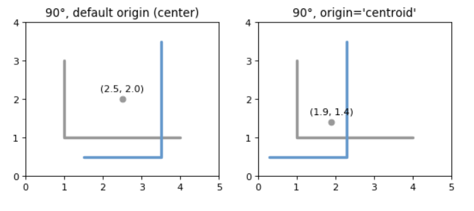

# Shapely

## 介绍

### 空间数据模型

由shapely实现的几何对象的基本类型是**点(points)、曲线(curves)和曲面(surfaces)**。每个点都与平面中的三组（可能是无限的）点相关联。分别是 **interior(内),boundary(边), 和 exterior(外)** ，他们是互斥的，它们的并集与整个平面重合。

- A Point 有一个 interior 刚好一点的集合，A boundary 完全没有点的集合，以及 exterior 所有其他点的集合。一 Point拓扑维数为0。
- A Curve 有一个 interior 由沿其长度的无穷多点组成的集合（假设 Point 拖进太空），a boundary 由两个端点组成的集合，以及 exterior 所有其他点的集合。一 Curve 拓扑维数为1。
- A Surface 有一个 interior 包含无限多个点的集合（假设 Curve 在空间中拖动以覆盖一个区域），a boundary 由一个或多个组成的集合 Curves, 和一个 exterior 所有其他点的集合，包括可能存在于表面的孔内的点。一 Surface 拓扑维数为2。

点类型由 **Point类**实现；曲线类型由**LineString 和 LinearRing 类**实现；曲面由**Polygon 类**实现。shapely实现没有平滑（即“有连续切线”）曲线。所有曲线必须用线性样条曲线来近似。所有的圆面片必须近似于由线性样条线包围的区域。

点集合 **MultiPoint 类**，曲线集合 **MultiLineString 类**和曲面集合 **MultiPolygon 类**。这些集合在计算上并不重要，但对于建模某些类型的特性很有用。例如，Y形线条特征可通过 MultiLineString.


## 几何对象（Geometric Objects）

几何对象是以典型的Python方式创建的，使用类本身作为实例工厂。它们的一些内在属性将在本节中讨论，其他属性将在下面的操作和序列化部分中讨论。

在所有构造函数中，数值转换为类型 `float` . 换言之， `Point(0, 0)` 和 `Point(0.0, 0.0)` 生成几何等效实例。


### 一般属性和方法

|                                    |                                                              |
| ---------------------------------- | ------------------------------------------------------------ |
| `object.area`                      | 返回对象的面积（ `float` ）。                                |
| `object.bounds`                    | 返回一个元祖`(minx, miny, maxx, maxy)` 对象的边界框。        |
| `object.length`                    | 返回对象的长度（ `float` ）                                  |
| `object.geom_type`                 | 返回对象的类型字符串                                         |
| `object.distance(*other*)`         | 返回与另一个对象的最小距离                                   |
| `object.hausdorff_distance(other)` | 返回与另一个几何对象的Hausdorff距离 (`float` ） 。两个几何体之间的hausdorff距离是两个几何体上的一个点从最近的点到另一个几何体上的点的最远距离。 |
| `object.representative_point()`    | 返回一个保证在几何对象中的廉价计算点。                       |


### Point

- *class* `Point`(*coordinates*)  构造函数接受位置坐标值或点元组参数。

**Point 面积为零，长度为零。** 坐标值通过 `coords`, `x`, `y`, 和 `z` 属性获得。

```python
>>> list(point.coords)
[(0.0, 0.0)]
>>> point.x
0.0
>>> point.y
0.0
>>> point.coords[:]
[(0.0, 0.0)]
```


### LineStrings

- *class* `LineString`(*coordinates*) 构造函数接受2个或更多的有序序列 `(x, y[, z])` 点元组。

LineString 具有**零面积**和**非零长度**。

```python
>>> from shapely.geometry import LineString
>>> line = LineString([(0, 0), (1, 1)])
>>> line.area
0.0
>>> line.length
1.4142135623730951

>>> line.bounds
(0.0, 0.0, 1.0, 1.0)

>>> list(line.coords)
[(0.0, 0.0), (1.0, 1.0)]

>>> LineString([Point(0.0, 1.0), (2.0, 3.0), Point(4.0, 5.0)])
<shapely.geometry.linestring.LineString object at 0x...>
```


### LinearRings

- *class* `LinearRing`(*coordinates*) 构造函数接受 `(x, y[, z])` 点元组。+

LinearRing 具有**零面积**和**非零长度**。

序列可以通过在第一个和最后一个索引中传递相同的值来显式关闭。否则，将第一个元组复制到最后一个索引，从而隐式关闭序列。和 LineString一样, 允许按顺序重复点，但可能会招致性能惩罚，应避免。A LinearRing 不可横穿自身，也不可单点接触自身。

图:有效的 LinearRing 在左边，一个无效的自我触摸 LinearRing 在右边


### Polygons

- *class* `Polygon`(*shell* [, *holes=None*])  构造函数接受两个位置参数。第一个是有序的 `(x, y[, z])` 点元组和的处理方式。第二个是一个可选的无序的环状序列序列，用于指定特征的内部边界或“孔”。

  一个有效的多边形**不能相互交叉**，只能在一个点上接触。

  图：左边，一个有效的 Polygon 带有一个内环，在一个点与外环接触，右侧Polygon 那就是 invalid 因为它的内环与外环的接触不止一个点。

  

  Polygon 具有**非零面积**和**非零长度**

  ```python
  >>> from shapely.geometry import Polygon
  >>> polygon = Polygon([(0, 0), (1, 1), (1, 0)])
  >>> polygon.area
  0.5
  >>> polygon.length
  3.4142135623730949
  
  >>> list(polygon.exterior.coords)
  [(0.0, 0.0), (1.0, 1.0), (1.0, 0.0), (0.0, 0.0)]
  >>> list(polygon.interiors)
  []
  ```

  矩形多边形经常出现，可以使用`shapely.geometry.box(minx, miny, maxx, maxy, ccw=True)`根据提供的边界框值生成矩形多边形，默认为逆时针顺序。

  ```python
  >>> from shapely.geometry import box
  >>> b = box(0.0, 0.0, 1.0, 1.0)
  >>> b
  <shapely.geometry.polygon.Polygon object at 0x...>
  >>> list(b.exterior.coords)
  [(1.0, 0.0), (1.0, 1.0), (0.0, 1.0), (0.0, 0.0), (1.0, 0.0)]
  ```


### Collections

几何对象的异构集合可能是某些形状操作的结果。例如，两个LineString可能沿一条线和一个点相交。为了表示这种结果，Shapely提供了像冻结集一样的、不变的几何对象集合。集合可以是同质的(多点等)或者是异类。

```python
>>> a = LineString([(0, 0), (1, 1), (1,2), (2,2)])
>>> b = LineString([(0, 0), (1, 1), (2,1), (2,2)])
>>> x = a.intersection(b)
>>> x
<shapely.geometry.collection.GeometryCollection object at 0x...>
>>> from pprint import pprint
>>> pprint(list(x))
[<shapely.geometry.point.Point object at 0x...>,
 <shapely.geometry.linestring.LineString object at 0x...>]
```


图:(a)一条绿色和一条黄色的线，沿着一条线和一个点相交；b)交点(蓝色)是一个集合，包含一个LineString和一个Point。

几何集合的成员通过`geoms`属性或使用`in或list()`的迭代器访问。

```python
>>> pprint(list(x.geoms))
[<shapely.geometry.point.Point object at 0x...>,
 <shapely.geometry.linestring.LineString object at 0x...>]
>>> pprint(list(x))
[<shapely.geometry.point.Point object at 0x...>,
 <shapely.geometry.linestring.LineString object at 0x...>]
```


### MultiPoint

- *class* `MultiPoint`(*points*) The MultiPoint constructor takes a sequence of `(x, y[, z ])` point tuples.

A MultiPoint 面积为零，长度为零。


### MultiLineString

- *class* `MultiLineString`(*lines*) 构造器接受一个类似线的序列或对象序列。

具有**零面积**和**非零长度**


### MultiPolygon

- *class* `MultiPolygon`(*polygons*) 构造器获取外部环和孔列表元组的序列：[（a1，…，am），[（b1，…，bn），…]，…]。


### 空功能

空”特征是指点集与空集重合的特征；不是 `None` ，但像 `set([])` . 可以通过调用不带参数的各种构造函数来创建空特性。空特性几乎不支持任何操作。

```python
>>> line = LineString()
>>> line.is_empty
True
>>> line.length
0.0
>>> line.bounds
()
>>> line.coords
[]
```


### 坐标序列

描述几何图形的坐标列表表示为 `CoordinateSequence` 对象。这些序列不应直接初始化，但可以从现有几何图形访问 `Geometry.coords` 。

```python
>>> line = LineString([(0, 1), (2, 3), (4, 5)])
>>> line.coords
<shapely.coords.CoordinateSequence object at 0x00000276EED1C7F0>
```


### 线性参考方法

沿着线性特征指定位置可能很有用， `LineStrings` 和 `MultiLineStrings` 具有一维参考系统。形状支持基于长度或距离的线性引用，计算沿几何对象到给定点投影的距离，或沿对象的给定距离处的点。

- `object.interpolate`(*distance*  [, *normalized=False* ])

  沿线性几何对象返回指定距离处的点。

  ```python
  >>> ip = LineString([(0, 0), (0, 1), (1, 1)]).interpolate(1.5)
  >>> ip
  <shapely.geometry.point.Point object at 0x740570>
  >>> ip.wkt
  'POINT (0.5000000000000000 1.0000000000000000)'
  >>> LineString([(0, 0), (0, 1), (1, 1)]).interpolate(0.75, normalized=True).wkt
  'POINT (0.5000000000000000 1.0000000000000000)'
  # 如果 normalized arg是 True ，距离将被解释为几何对象长度的一部分。
  ```


- `object.project`(*other*  [, *normalized=False* ])

  返回沿此几何对象到other 对象最近点的距离 。

  ```python
  >>> LineString([(0, 0), (0, 1), (1, 1)]).project(ip)
  1.5
  >>> LineString([(0, 0), (0, 1), (1, 1)]).project(ip, normalized=True)
  0.75
  # 如果 normalized arg是 True ，返回标准化为对象长度的距离。
  ```


## 谓词和关系

几何对象中的类型对象 提供标准谓词作为属性（用于一元谓词）和方法（用于二元谓词）。无论是一元还是二元，都返回 `True` 或 `False` .


### 一元谓词

标准的一元谓词实现为只读属性。

|                    |                                                              |
| ------------------ | ------------------------------------------------------------ |
| `object.has_z`     | 返回 `True` 如果功能不仅 x 和 y, 而且 z 三维                 |
| `object.is_ccw`    | 返回 `True` 如果坐标为逆时针顺序                             |
| `object.is_empty`  | 返回 `True` 如果功能 interior 和 boundary （用点集术语）与空集一致。 |
| `object.is_ring`   | 返回 `True` 如果闭环。                                       |
| `object.is_simple` | 返回 `True` 如果特性本身没有交叉                             |
| `object.is_valid`  | 返回 `True` 如果某个对象是有效的                             |
|                    |                                                              |


### 二元谓词

标准的二进制谓词作为方法实现。这些谓词评估拓扑关系、集合理论关系。在一些情况下，结果可能不是人们从不同的假设开始所期望的。都以另一个几何对象为参数并返回 `True` 或 `False` .

|                                                |                                                              |
| ---------------------------------------------- | ------------------------------------------------------------ |
| `object.__eq__`(*other*)                       | Returns `True` if the two objects are of the same geometric type, and the coordinates of the two objects match precisely. |
| `object.equals`(*other*)                       | Returns `True` if the set-theoretic boundary, interior, and exterior of the object coincide with those of the other. |
| `object.almost_equals`(*other*[, *decimal=6*]) | Returns `True` if the object is approximately equal to the other at all points to specified decimal place precision. |
| `object.contains`(*other*)                     | Returns `True` if no points of other lie in the exterior of the object and at least one point of the interior of other lies in the interior of object. |
| `object.crosses`(*other*)                      | Returns `True` if the interior of the object intersects the interior of the other but does not contain it, and the dimension of the intersection is less than the dimension of the one or the other。 |
| `object.disjoint`(*other*)                     | 返回 `True` 如果 boundary 和 interior 物体与另一物体完全不相交。 |
| `object.intersects`(*other*)                   | 返回 `True` 如果 boundary 或 interior 物体以任何方式与另一物体相交。 |
| `object.overlaps`(*other*)                     | 返回 `True` 如果对象相交（见上文），但两者都不包含另一个对象。 |
| `object.touches`(*other*)                      | 返回 `True` 如果物体至少有一个共同点，并且其内部不与另一个物体的任何部分相交。 |
| `object.within`(*other*)                       | Returns `True` if the object’s boundary and interior intersect only with the interior of the other (not its boundary or exterior). |
|                                                |                                                              |
|                                                |                                                              |


## 空间分析方法

除了布尔属性和方法之外，shapely还提供返回新几何对象的分析方法。


### 集合论方法

几乎每个二元谓词方法都有一个对应的方法，它返回一个新的几何对象。另外，集合论对象的 `boundary` 属性是只读的。

|                                        |                                                              |
| -------------------------------------- | ------------------------------------------------------------ |
| `object.boundary`                      | 返回表示对象集理论值的低维对象 boundary.多边形的边界是线，线的边界是点的集合。点的边界是空（空）集合。 |
| `object.centroid`                      | 返回对象几何形**质心**（点）的表示形式。                     |
| `object.difference`(*other*)           | 返回不构成其他对象的构成此对象的点。                         |
| `object.intersection`(*other*)         | 返回此对象与其他对象的`交集`。                               |
| `object.symmetric_difference`(*other*) | 返回不位于其他几何对象中的对象中的点的表示，以及其他不位于此几何对象中的点的表示。 |
| `object.union`(*other*)                | 返回此对象和其他对象的点的`并集`。                           |
|                                        |                                                              |

```python
>>> a = Point(1, 1).buffer(1.5)
>>> b = Point(2, 1).buffer(1.5)
>>> a.difference(b)
<shapely.geometry.polygon.Polygon object at 0x...>
```


### 建设性方法

形状几何对象有几种方法可以产生新的对象，而不是从集合理论分析中推导出来的。

|                                                              |                                                              |
| ------------------------------------------------------------ | ------------------------------------------------------------ |
| `object.buffer`(*distance*, *resolution=16*, *cap_style=1*, *join_style=1*, *mitre_limit=5.0*) | 返回该几何对象给定距离内所有点的近似表示。**cap_style**由整数值指定：1(圆形)、2(平面)、3(正方形)。**join_style**样式由整数值指定：1(圆形)、2(Mitre)和3(斜面)。 |
| `object.convex_hull`                                         | 返回包含对象中所有点的**最小凸多边形**的表示，除非对象中的点数小于3个。对于两点，凸包塌陷成一列线；对于1，一个点。 |
| `object.envelope`                                            | 返回包含对象的点或**最小矩形多边形(边与坐标轴平行)**的表示形式。 |
| `object.minimum_rotated_rectangle`                           | 返回包含对象的一般**最小边界矩形**。与**envelope**不同，这个矩形不受平行于坐标轴的约束。如果对象的凸包是退化的(线或点)，则返回此退化体。 |
| `object.parallel_offset`(*distance*, *side*, *resolution=16*, *join_style=1*, *mitre_limit=5.0*) | 返回一个LineString或MultiLineString几何图形，该几何图形与其右侧或左侧的对象相距较远。 |
| `object.simplify`(*tolerance*, *preserve_topology=True*)     | 返回几何对象的简化表示形式。                                 |
|                                                              |                                                              |

```python
>>> line = LineString([(0, 0), (1, 1), (0, 2), (2, 2), (3, 1), (1, 0)])
>>> dilated = line.buffer(0.5)
>>> eroded = dilated.buffer(-0.3)

# 正距离有膨胀效应；负距离有侵蚀作用。可选分辨率参数确定用于在点周围近似四分之一圆的段数。
```


线的膨胀(左)和多边形的侵蚀(右)。新对象以蓝色显示。


**convex_hull**


凸包(蓝色)2点(左)和6点(右)。


## 仿射转换

仿射变换函数的集合位于 `shapely.affinity` 模块，通过直接向仿射变换矩阵提供系数或使用特定的命名变换（rotate），返回变换的几何图形。 scale, 等等）。这些函数可用于所有几何图形类型（除了 GeometryCollection) 三维仿射变换可以保留或支持三维类型。

 

|                                                              |                                                              |
| ------------------------------------------------------------ | ------------------------------------------------------------ |
| `shapely.affinity.affine_transform`(*geom*, *matrix*)        | 使用仿射变换矩阵返回转换的几何图形。系数矩阵以列表或元组的形式提供，分别包含用于2D或3D转换的6项或12项。对于2D仿射变换，6个参数矩阵为：`[a, b, d, e, xoff, yoff]` |
| `shapely.affinity.rotate`(*geom*, *angle*, *origin='center'*, *use_radians=False*) | 返回2D平面上的旋转图形。可以通过设置`USE_RADIANS=True`以度(默认)或弧度来指定旋转角度。正角是逆时针旋转，负角度是顺时针旋转.原点可以是边界框中心(默认)关键字`center`，`centroid`几何图形的质心、点对象或坐标元组`(X0，Y0)`。 |
| `shapely.affinity.scale`(*geom*, *xfact=1.0*, *yfact=1.0*, *zfact=1.0*, *origin='center'*) | 返回按每个维度的因子缩放的缩放几何图形。原点可以是用于2D边界框中心(默认)的关键字`center`，用于几何的2D`centroid`、点对象或坐标元组(X0、Y0、Z0) |
| `shapely.affinity.translate`(*geom*, *xoff=0.0*, *yoff=0.0*, *zoff=0.0*) | 返回按每个维度的偏移量移动的已转换的几何图形。               |
| `shapely.affinity.skew`(*geom*, *xs=0.0*, *ys=0.0*, *origin='center'*, *use_radians=False*) | 返回一个倾斜的几何体，该几何体沿X和Y维度被角度剪切。         |
|                                                              |                                                              |
|                                                              |                                                              |


`affine_transform`
$$
\begin{split}x' &= a x + b y + x_\mathrm{off} \\
y' &= d x + e y + y_\mathrm{off}.\end{split}
$$

$$
\begin{split}\begin{bmatrix}
  x' \\
  y' \\
  1
\end{bmatrix} =
\begin{bmatrix}
  a & b & x_\mathrm{off} \\
  d & e & y_\mathrm{off} \\
  0 & 0 & 1
\end{bmatrix}
\begin{bmatrix}
  x \\
  y \\
  1
\end{bmatrix}\end{split}
$$


`rotate`
$$
\begin{split}\begin{bmatrix}
  \cos{\theta} & -\sin{\theta} & x_\mathrm{off} \\
  \sin{\theta} &  \cos{\theta} & y_\mathrm{off} \\
        0      &        0      & 1
\end{bmatrix}\end{split}
$$

$$
\begin{split}x_\mathrm{off} &= x_0 - x_0 \cos{\theta} + y_0 \sin{\theta} \\
y_\mathrm{off} &= y_0 - x_0 \sin{\theta} - y_0 \cos{\theta}\end{split}
$$




`scale`
$$
\begin{split}\begin{bmatrix}
  1 & \tan{x_s} & x_\mathrm{off} \\
  \tan{y_s} & 1 & y_\mathrm{off} \\
  0 & 0 & 1
\end{bmatrix}\end{split}
$$

$$
\begin{split}x_\mathrm{off} &= -y_0 \tan{x_s} \\
y_\mathrm{off} &= -x_0 \tan{y_s}\end{split}
$$


## 其他转换

形状支持地图投影和几何对象的其他任意转换。

- `shapely.ops.transform`(*func*, *geom*)

应用 func 到的所有坐标 geom 并从转换后的坐标中返回相同类型的新几何图形。


## 其他操作


### 合并线性特征

触摸线的序列可以合并到 MultiLineStrings 或 Polygons 在中使用函数 `shapely.ops` 模块。

|                                        |                                                             |
| -------------------------------------- | ----------------------------------------------------------- |
| `shapely.ops.polygonize`(*lines*)      | 返回从输入构造的多边形上的迭代器 lines.                     |
| `shapely.ops.polygonize_full`(*lines*) | 从线条的来源创建多边形，返回多边形和剩余的几何图形。        |
| `shapely.ops.linemerge`(*lines*)       | 返回表示所有连续行元素的合并的LineString或MultiLineString。 |


### 高效结合

|                                       |                                    |
| ------------------------------------- | ---------------------------------- |
| `shapely.ops.unary_union`(*geoms*)    | 返回给定几何对象的并集的表示形式。 |
| `shapely.ops.cascaded_union`(*geoms*) | 返回给定几何对象的并的表示形式     |


### Delaunay三角测量

`shapely.ops.triangulate`(*geom*, *tolerance=0.0*, *edges=False*) 返回输入几何体顶点的Delaunay三角剖分

```python
>>> from shapely.ops import triangulate
>>> points = MultiPoint([(0, 0), (1, 1), (0, 2), (2, 2), (3, 1), (1, 0)])
>>> triangles = triangulate(points)
>>> pprint([triangle.wkt for triangle in triangles])
['POLYGON ((0 2, 0 0, 1 1, 0 2))',
 'POLYGON ((0 2, 1 1, 2 2, 0 2))',
 'POLYGON ((2 2, 1 1, 3 1, 2 2))',
 'POLYGON ((3 1, 1 1, 1 0, 3 1))',
 'POLYGON ((1 0, 1 1, 0 0, 1 0))']
```


### 最近点

这个 `nearest_points()` 中的函数 shapely.ops 计算一对几何图形中最近的点。

`shapely.ops.nearest_points`(*geom1*, *geom2*) 返回输入几何图形中最近点的元组。返回点的顺序与输入几何图形的顺序相同。

```python
>>> from shapely.ops import nearest_points
>>> triangle = Polygon([(0, 0), (1, 0), (0.5, 1), (0, 0)])
>>> square = Polygon([(0, 2), (1, 2), (1, 3), (0, 3), (0, 2)])
>>> [o.wkt for o in nearest_points(triangle, square)]
['POINT (0.5 1)', 'POINT (0.5 2)']
```


### Snapping

在shapely.ops中，Snap()函数用给定的公差将一个几何图形中的顶点截取到第二个几何中的顶点。

- `shapely.ops.snap`(*geom1*, *geom2*, *tolerance*) 


### 共享路径

这个 `shared_paths()` 中的函数 shapely.ops 查找两个线性几何图形之间的共享路径。

- `shapely.ops.shared_paths`(*geom1*, *geom2*) 查找之间的共享路径 geom1 和 geom2, 两个几何图形的位置 LineStrings.


### 分割

这个 `split()`中的函数 shapely.ops 将一个几何体拆分为另一个几何体。

- `shapely.ops.split`(*geom*, *splitter*)


### 子字符串

这个 `substring()` 中的函数 shapely.ops 返回沿线性几何图形的指定距离之间的线段。

- `shapely.ops.substring`(*geom*, *start_dist*, *end_dist*[, *normalized=False*])


## 互操作

shapely提供了4种与其他软件进行互操作的途径。

**A Well Known Text （WKT）**或 **Well Known Binary （WKB）**代表任何几何物体的 `wkt` 或 `wkb` 属性。表示允许与许多GIS程序交换。

这个 shapely.wkt 和 shapely.wkb 模块提供 dumps() and loads() functions that work almost exactly as their pickle 和 simplejson 模块副本。要将几何对象序列化为二进制或文本字符串，请使用 `dumps()` . 要反序列化字符串并获取适当类型的新几何对象，请使用 `loads()` .

`shapely.wkb.dumps`(*ob*)

`shapely.wkb.loads`(*wkb*)


### numpy和python数组

具有坐标序列（`point`， `LinearRing`, `LineString`) 提供numpy数组接口，因此可以转换或适应numpy数组。

```python
>>> from numpy import array
>>> array(Point(0, 0))
array([ 0.,  0.])
>>> array(LineString([(0, 0), (1, 1)]))
array([[ 0.,  0.],
       [ 1.,  1.]])
```


